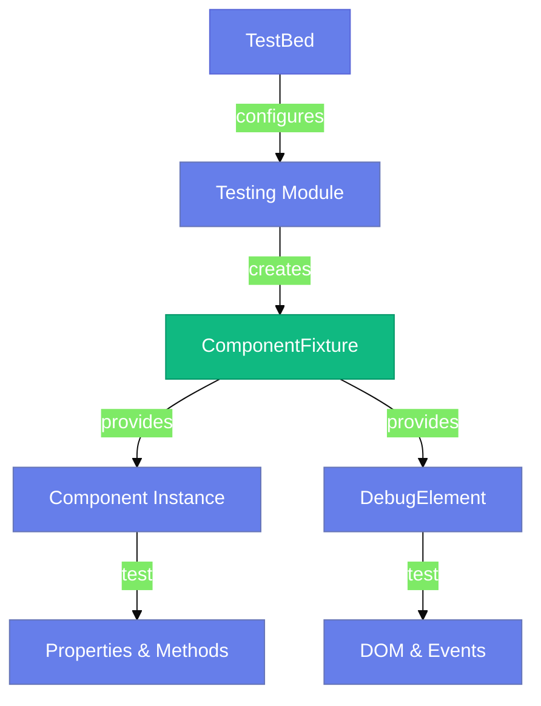
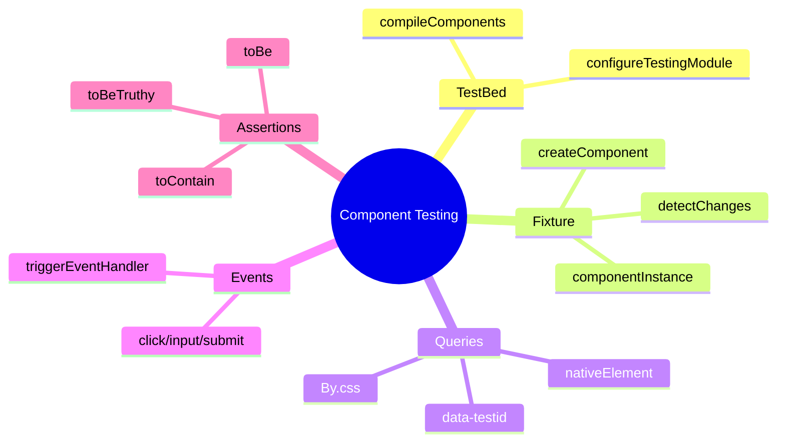

# 🧩 Use Case 1: Component Testing Basics

> **💡 Lightbulb Moment**: Component tests verify that your templates and logic work together correctly. They test what the *user sees*, not implementation details!

---

## 1. 🔍 How It Works

### The Testing Triangle



### Key Players

| Concept | Role |
|---------|------|
| **TestBed** | Angular's test module configurator |
| **ComponentFixture** | Wrapper around component + template |
| **DebugElement** | DOM abstraction for queries |
| **detectChanges()** | Triggers change detection manually |

---

## 2. 🚀 Step-by-Step Implementation

### Step 1: Configure TestBed

```typescript
beforeEach(async () => {
    await TestBed.configureTestingModule({
        imports: [ComponentUnderTest]  // Standalone component
    }).compileComponents();
});
```

### Step 2: Create Fixture & Component

```typescript
fixture = TestBed.createComponent(ComponentUnderTest);
component = fixture.componentInstance;
fixture.detectChanges();  // Initial binding
```

### Step 3: Query the DOM

```typescript
// By CSS (fragile)
const el = fixture.debugElement.query(By.css('.my-class'));

// By data-testid (recommended ✅)
const btn = fixture.debugElement.query(By.css('[data-testid="submit-btn"]'));
```

### Step 4: Simulate Events

```typescript
btn.triggerEventHandler('click', null);
fixture.detectChanges();  // Update view after event
```

---

## 3. 🐛 Common Pitfalls

### ❌ Forgetting detectChanges()

```typescript
// BAD: DOM won't update
component.count = 5;
expect(countEl.nativeElement.textContent).toBe('5'); // FAILS!
```

### ✅ Always Call detectChanges()

```typescript
// GOOD
component.count = 5;
fixture.detectChanges();  // <-- Critical!
expect(countEl.nativeElement.textContent).toBe('5'); // PASSES
```

### ❌ Testing by CSS Class (Fragile)

```typescript
// BAD: Breaks when styling changes
const btn = fixture.debugElement.query(By.css('.primary-button'));
```

### ✅ Using data-testid (Stable)

```typescript
// GOOD: Test-specific attribute
const btn = fixture.debugElement.query(By.css('[data-testid="submit"]'));
```

---

## 4. ⚡ Performance Tips

1. **Minimal Imports**: Only import what you need
   ```typescript
   imports: [ComponentUnderTest]  // ✅ Not SharedModule
   ```

2. **Reuse Fixtures**: Use `beforeEach` wisely
3. **Avoid Deep DOM Queries**: Keep selectors simple

---

## 5. 🌍 Real World Examples

| Scenario | What to Test |
|----------|--------------|
| Form Component | Validation messages appear |
| List Component | Items render correctly |
| Button Component | Click emits event |
| Card Component | Content projection works |

---

## 6. 📝 The Analogy

> **The "Puppet Show" Analogy 🎪**
>
> - **Component** = The puppet
> - **TestBed** = The stage setup
> - **Fixture** = The strings controlling the puppet
> - **detectChanges()** = Making the puppet move
> - **DebugElement** = The audience's view

You're the puppeteer, making the component perform and verifying the audience sees the right show!

---

## 7. ❓ Interview Questions

**Q1: Why do we call `fixture.detectChanges()`?**
> Angular doesn't run automatic change detection in tests. We must trigger it manually after any state change to update the DOM.

**Q2: What's the difference between `nativeElement` and `debugElement`?**
> - `nativeElement`: Raw DOM element (browser-specific)
> - `debugElement`: Angular abstraction with helper methods like `query()` and `triggerEventHandler()`

**Q3: Why use `data-testid` instead of CSS classes?**
> CSS classes can change for styling reasons. `data-testid` is reserved for testing and won't be accidentally modified.

---

## 🧠 Mind Map


