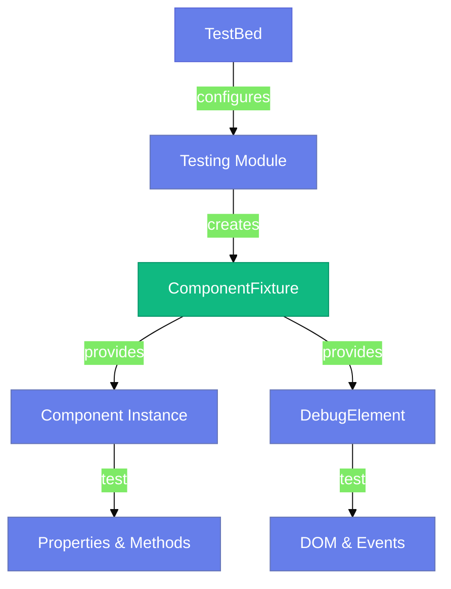
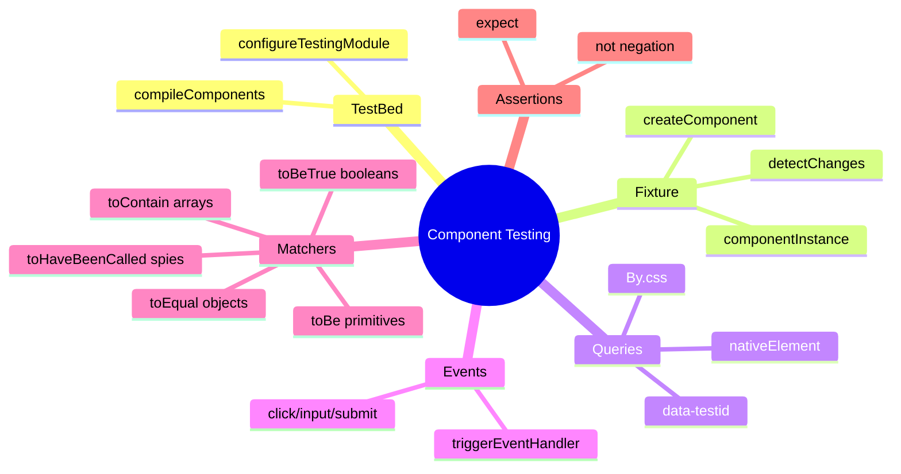

# 🧩 Use Case 1: Component Testing Basics

> **💡 Lightbulb Moment**: Component tests verify that your templates and logic work together correctly. They test what the *user sees*, not implementation details!

---

## 1. 🔍 How It Works

### The Testing Triangle



### Key Players

| Concept | Role |
|---------|------|
| **TestBed** | Angular's test module configurator |
| **ComponentFixture** | Wrapper around component + template |
| **DebugElement** | DOM abstraction for queries |
| **detectChanges()** | Triggers change detection manually |

---

## 2. 🚀 Step-by-Step Implementation

### Step 1: Configure TestBed

```typescript
beforeEach(async () => {
    await TestBed.configureTestingModule({
        imports: [ComponentUnderTest]  // Standalone component
    }).compileComponents();
});
```

### Step 2: Create Fixture & Component

```typescript
fixture = TestBed.createComponent(ComponentUnderTest);
component = fixture.componentInstance;
fixture.detectChanges();  // Initial binding
```

### Step 3: Query the DOM

```typescript
// By CSS (fragile)
const el = fixture.debugElement.query(By.css('.my-class'));

// By data-testid (recommended ✅)
const btn = fixture.debugElement.query(By.css('[data-testid="submit-btn"]'));
```

### Step 4: Simulate Events

```typescript
btn.triggerEventHandler('click', null);
fixture.detectChanges();  // Update view after event
```

---

## 3. 🎯 Understanding Jasmine Matchers (expect & toBe)

### What are Matchers?

**Matchers** are Jasmine methods that perform assertions - they compare actual values to expected values.

```typescript
expect(actualValue).toBe(expectedValue);
//     ↑            ↑    ↑
//   Actual      Matcher Expected
```

### The toBe(0) Explained

When you see: `expect(component.count).toBe(0)`

**Breaking it down:**
1. `expect(component.count)` → Wraps the actual value being tested
2. `.toBe(0)` → The matcher that checks strict equality (===)
3. `0` → The expected value

**How it works:**
```typescript
// Behind the scenes, Jasmine does:
if (component.count === 0) {
    // ✅ Test passes
} else {
    // ❌ Test fails with helpful message
}
```

### toBe vs Other Matchers

| Matcher | Use Case | Example |
|---------|----------|---------|
| **toBe()** | Primitives (strict ===) | `expect(count).toBe(5)` |
| **toEqual()** | Objects/Arrays (deep equality) | `expect(user).toEqual({name: 'John'})` |
| **toBeTruthy()** | Any truthy value | `expect(value).toBeTruthy()` // 1, "text", true |
| **toBeFalsy()** | Any falsy value | `expect(value).toBeFalsy()` // 0, "", false, null |
| **toBeTrue()** | Exactly true | `expect(flag).toBeTrue()` |
| **toBeFalse()** | Exactly false | `expect(flag).toBeFalse()` |

### Common Testing Patterns

#### 1. Testing Component State (Numbers)
```typescript
it('should initialize with count = 0', () => {
    // ✅ CORRECT: toBe for primitives
    expect(component.count).toBe(0);
    
    // ❌ WRONG: Don't use toEqual for primitives
    expect(component.count).toEqual(0);  // Works but unnecessary
});
```

#### 2. Testing DOM Content (Strings)
```typescript
it('should display count in DOM', () => {
    const countEl = fixture.debugElement.query(By.css('[data-testid="count"]'));
    
    // ⚠️ IMPORTANT: DOM textContent is always a STRING!
    expect(countEl.nativeElement.textContent.trim()).toBe('0');  // ✅ String '0'
    
    // ❌ WRONG: This will FAIL - type mismatch!
    expect(countEl.nativeElement.textContent.trim()).toBe(0);  // String vs Number
});
```

#### 3. Testing Boolean Properties
```typescript
it('should disable button when count is 0', () => {
    const btn = fixture.debugElement.query(By.css('[data-testid="decrement-btn"]'));
    
    // ✅ PREFERRED: Explicit boolean check
    expect(btn.nativeElement.disabled).toBeTrue();
    
    // ✅ ALSO WORKS: But less semantic
    expect(btn.nativeElement.disabled).toBe(true);
    
    // ⚠️ TOO LOOSE: Accepts ANY truthy value (1, "yes", etc.)
    expect(btn.nativeElement.disabled).toBeTruthy();
});
```

#### 4. Testing Objects & Arrays
```typescript
it('should return user object', () => {
    const user = component.getUser();
    
    // ✅ CORRECT: toEqual for deep comparison
    expect(user).toEqual({ name: 'John', age: 30 });
    
    // ❌ WRONG: toBe checks reference, not content
    expect(user).toBe({ name: 'John', age: 30 });  // FAILS - different objects
});
```

### Complete Matcher Reference

#### Equality Matchers
```typescript
expect(value).toBe(expected)              // Strict === (primitives)
expect(value).toEqual(expected)           // Deep equality (objects/arrays)
expect(value).not.toBe(unexpected)        // Negation
```

#### Truthiness Matchers
```typescript
expect(value).toBeTrue()                  // Exactly true
expect(value).toBeFalse()                 // Exactly false
expect(value).toBeTruthy()                // Any truthy (1, "yes", true, {})
expect(value).toBeFalsy()                 // Any falsy (0, "", false, null)
expect(value).toBeDefined()               // Not undefined
expect(value).toBeUndefined()             // Is undefined
expect(value).toBeNull()                  // Is null
```

#### Number Matchers
```typescript
expect(value).toBeGreaterThan(5)          // value > 5
expect(value).toBeGreaterThanOrEqual(5)   // value >= 5
expect(value).toBeLessThan(10)            // value < 10
expect(value).toBeLessThanOrEqual(10)     // value <= 10
expect(value).toBeCloseTo(5.3, 0.1)       // Floating point (precision)
expect(value).toBeNaN()                   // Is NaN
```

#### String/Array Matchers
```typescript
expect(array).toContain(item)             // Array includes item
expect(string).toMatch(/regex/)           // Regex match
expect(string).toMatch('substring')       // String contains
```

#### Spy Matchers (EventEmitter testing)
```typescript
const spy = spyOn(component.save, 'emit');
expect(spy).toHaveBeenCalled()            // Called at least once
expect(spy).toHaveBeenCalledWith(arg)     // Called with specific args
expect(spy).toHaveBeenCalledTimes(n)      // Called exactly n times
expect(spy).not.toHaveBeenCalled()        // Never called
```

### Decision Tree: Which Matcher to Use?

```
Testing a value?
│
├─ Primitive (number, string, boolean)?
│  ├─ Number/String → use .toBe()
│  └─ Boolean → use .toBeTrue() or .toBeFalse()
│
├─ Object or Array?
│  └─ use .toEqual()
│
├─ Checking if exists?
│  ├─ Truthy/Falsy → .toBeTruthy() or .toBeFalsy()
│  └─ Defined → .toBeDefined() or .toBeUndefined()
│
├─ Number comparison?
│  └─ .toBeGreaterThan(), .toBeLessThan(), etc.
│
└─ EventEmitter (spy)?
   └─ .toHaveBeenCalled(), .toHaveBeenCalledWith()
```

### Real-World Examples from Our Component

```typescript
// ✅ Example 1: Testing initial state
expect(component.count).toBe(0);
// Why toBe? → Comparing primitive number with strict equality

// ✅ Example 2: Testing after increment
component.increment();
expect(component.count).toBe(1);
// Why toBe? → Still a primitive, checking exact value

// ✅ Example 3: Testing DOM text
const el = fixture.debugElement.query(By.css('[data-testid="count-display"]'));
expect(el.nativeElement.textContent.trim()).toBe('0');
// Why string '0'? → textContent always returns string!

// ✅ Example 4: Testing button disabled state
const btn = fixture.debugElement.query(By.css('[data-testid="decrement-btn"]'));
expect(btn.nativeElement.disabled).toBeTrue();
// Why toBeTrue? → Explicit boolean check, most semantic

// ✅ Example 5: Testing EventEmitter
const spy = spyOn(component.countChange, 'emit');
component.increment();
expect(spy).toHaveBeenCalledWith(1);
// Why spy matcher? → Testing @Output emissions
```

### Memory Tricks 🧠

| Matcher | Memory Trick |
|---------|--------------|
| **toBe** | "To **be** or not to **be**" - Shakespeare (exact match) |
| **toEqual** | "All **equal** in value" - Deep comparison |
| **toBeTrue** | "**Be** exactly **true**" - No impostors! |
| **toContain** | "Does it **contain** this item?" - Arrays & strings |
| **toHaveBeenCalled** | "**Has** the spy **been** watching?" - EventEmitter |

---

## 4. 🐛 Common Pitfalls

### ❌ Forgetting detectChanges()

```typescript
// BAD: DOM won't update
component.count = 5;
expect(countEl.nativeElement.textContent).toBe('5'); // FAILS!
```

### ✅ Always Call detectChanges()

```typescript
// GOOD
component.count = 5;
fixture.detectChanges();  // <-- Critical!
expect(countEl.nativeElement.textContent).toBe('5'); // PASSES
```

### ❌ Testing by CSS Class (Fragile)

```typescript
// BAD: Breaks when styling changes
const btn = fixture.debugElement.query(By.css('.primary-button'));
```

### ✅ Using data-testid (Stable)

```typescript
// GOOD: Test-specific attribute
const btn = fixture.debugElement.query(By.css('[data-testid="submit"]'));
```

### ❌ Wrong Matcher for Type

```typescript
// BAD: Type mismatch - textContent is string!
expect(element.textContent).toBe(0);  // FAILS: '0' !== 0
```

### ✅ Match Types Correctly

```typescript
// GOOD: String comparison
expect(element.textContent.trim()).toBe('0');  // PASSES

// GOOD: Component property is number
expect(component.count).toBe(0);  // PASSES
```

### ❌ Using toBe for Objects

```typescript
// BAD: Compares object references
expect(component.user).toBe({ name: 'John' });  // FAILS - different objects
```

### ✅ Use toEqual for Objects

```typescript
// GOOD: Deep value comparison
expect(component.user).toEqual({ name: 'John' });  // PASSES
```

---

## 5. ⚡ Performance Tips

1. **Minimal Imports**: Only import what you need
   ```typescript
   imports: [ComponentUnderTest]  // ✅ Not SharedModule
   ```

2. **Reuse Fixtures**: Use `beforeEach` wisely
3. **Avoid Deep DOM Queries**: Keep selectors simple

---

## 6. 🌍 Real World Examples

| Scenario | What to Test | Matcher to Use |
|----------|--------------|----------------|
| Form Component | Validation messages appear | `.toBe('Error message')` |
| List Component | Items render correctly | `.toContain(item)` |
| Button Component | Click emits event | `.toHaveBeenCalledWith()` |
| Card Component | Content projection works | `.toBeTruthy()` |
| Counter Component | Number increments | `.toBe(expectedNumber)` |

---

### 📦 Data Flow Summary (Visual Box Diagram)

```
┌─────────────────────────────────────────────────────────────┐
│  COMPONENT TESTING: TestBed + Fixture                       │
│                                                             │
│   SETUP:                                                    │
│   ┌───────────────────────────────────────────────────────┐ │
│   │ beforeEach(async () => {                              │ │
│   │   await TestBed.configureTestingModule({              │ │
│   │     imports: [MyComponent]  // Standalone              │ │
│   │   }).compileComponents();                             │ │
│   │                                                       │ │
│   │   fixture = TestBed.createComponent(MyComponent);     │ │
│   │   component = fixture.componentInstance;              │ │
│   │   fixture.detectChanges();  // Initial binding        │ │
│   │ });                                                   │ │
│   └───────────────────────────────────────────────────────┘ │
│                                                             │
│   TESTING PATTERN:                                          │
│   ┌───────────────────────────────────────────────────────┐ │
│   │ 1. Change component state:                            │ │
│   │    component.count = 5;                               │ │
│   │                                                       │ │
│   │ 2. Trigger change detection:                          │ │
│   │    fixture.detectChanges();  // ⚠️ CRITICAL!          │ │
│   │                                                       │ │
│   │ 3. Query DOM:                                         │ │
│   │    const el = fixture.debugElement.query(             │ │
│   │      By.css('[data-testid="count"]')  // Recommended  │ │
│   │    );                                                 │ │
│   │                                                       │ │
│   │ 4. Assert with matchers:                              │ │
│   │    expect(component.count).toBe(5);        // Number  │ │
│   │    expect(el.textContent.trim()).toBe('5'); // String │ │
│   └───────────────────────────────────────────────────────┘ │
│                                                             │
│   ⚠️ No detectChanges() = DOM doesn't update!              │
│   ⚠️ Wrong matcher = Test fails or gives false positives! │
└─────────────────────────────────────────────────────────────┘
```

> **Key Takeaway**: TestBed configures test module. Fixture controls component. ALWAYS call `detectChanges()` after state changes! Use correct matchers for types!

---

## 7. 🎪 Puppet Show Analogy (Easy to Remember!)

Think of component testing like a **puppet show**:

| Concept | Puppet Show Analogy | Memory Trick |
|---------|--------------------|--------------|
| **Component** | 🧸 **Puppet**: The character being controlled | **"The performer"** |
| **TestBed** | 🎭 **Stage setup**: Build the set, prepare props | **"Configure the stage"** |
| **Fixture** | 🧵 **Puppeteer strings**: Control and manipulate | **"Control handle"** |
| **detectChanges()** | 🤘 **Make puppet move**: Pull strings to animate | **"Update the view"** |
| **DebugElement** | 👀 **Audience's view**: What spectators see on stage | **"The DOM"** |
| **expect().toBe()** | 🎯 **Judge's score**: Did puppet perform correctly? | **"Assertion"** |

### 📖 Story to Remember:

> 🎪 **The Angular Puppet Theater**
>
> You're a puppeteer testing your puppet show:
>
> **Show Setup:**
> ```
> 1. Build the stage (TestBed):
>    TestBed.configureTestingModule({ imports: [Puppet] })
>    
> 2. Get the puppet ready (Fixture):
>    fixture = TestBed.createComponent(PuppetComponent)
>    puppet = fixture.componentInstance
>    
> 3. Pull the strings (detectChanges):
>    puppet.wave = true
>    fixture.detectChanges()  // Puppet waves its hand!
>    
> 4. Judge the performance (assertions):
>    expect(puppet.wave).toBe(true)  // ✅ Puppet is waving
>    expect(stage.query('.hand').textContent).toBe('👋')  // ✅ Audience sees wave
> ```
>
> **No detectChanges() = Puppet stays frozen!** 🥶
> **Wrong matcher = Judge scores incorrectly!** ❌

### 🎯 Quick Reference:
```
🧸 Component        = Puppet (thing being tested)
🎭 TestBed          = Stage setup (configure test)
🧵 Fixture          = Strings (control component)
🤘 detectChanges()  = Pull strings (update view)
👀 DebugElement     = Audience view (query DOM)
🎯 expect().toBe()  = Judge's score (assertion)
```

---

## 8. ❓ Interview Questions

**Q1: Why do we call `fixture.detectChanges()`?**
> Angular doesn't run automatic change detection in tests. We must trigger it manually after any state change to update the DOM.

**Q2: What's the difference between `nativeElement` and `debugElement`?**
> - `nativeElement`: Raw DOM element (browser-specific)
> - `debugElement`: Angular abstraction with helper methods like `query()` and `triggerEventHandler()`

**Q3: Why use `data-testid` instead of CSS classes?**
> CSS classes can change for styling reasons. `data-testid` is reserved for testing and won't be accidentally modified.

**Q4: What's the difference between `toBe()` and `toEqual()`?**
> - `toBe()`: Strict equality (===) for primitives (numbers, strings, booleans)
> - `toEqual()`: Deep equality for objects and arrays (compares content, not reference)

**Q5: When should you use `toBeTrue()` vs `toBeTruthy()`?**
> - `toBeTrue()`: When you need EXACTLY true (strict boolean check)
> - `toBeTruthy()`: When you accept ANY truthy value (1, "text", true, {}, etc.)
> - Best practice: Use `toBeTrue()` for boolean properties to avoid false positives

**Q6: Why does DOM text comparison use strings?**
> `textContent` always returns a string in JavaScript. Even if the component property is a number, the DOM representation is a string. Always compare with `toBe('0')` not `toBe(0)`.

---

## 9. ❓ Additional Interview Questions (22+)

### TestBed Questions

**Q7: When should you use `compileComponents()`?**
> A: When using templateUrl/styleUrls (external files). Not needed for inline templates.

**Q8: What's the difference between TestBed and fixture?**
> A: TestBed configures the testing module; Fixture wraps the component instance + DOM.

**Q9: Can you reuse TestBed configuration across tests?**
> A: Yes, but each test gets a fresh component instance via `createComponent()`.

**Q10: How to configure multiple components?**
> A: Add to imports array: `imports: [ComponentA, ComponentB]`.

---

### detectChanges() Questions

**Q11: When must you call detectChanges()?**
> A: After changing component properties or triggering events - Angular won't auto-detect in tests.

**Q12: What happens if you forget detectChanges()?**
> A: DOM won't update, tests fail - assertions on template see old values.

**Q13: How many times can you call detectChanges()?**
> A: As many as needed - after each state change you want reflected in DOM.

**Q14: Is there automatic change detection in tests?**
> A: No - must manually call `fixture.detectChanges()`.

---

### Query/Locator Questions

**Q15: What's By.css vs nativeElement.querySelector?**
> A: `By.css` returns DebugElement (Angular abstraction); querySelector returns raw DOM element.

**Q16: How to query multiple elements?**
> A: `queryAll()`: `fixture.debugElement.queryAll(By.css('.item'))`.

**Q17: How to find element by directive?**
> A: `By.directive(MyDirective)`.

**Q18: What if query returns null?**
> A: Element not found - add detectChanges() or check selector.

---

### Event Testing Questions

**Q19: How to trigger click event?**
> A: `debugElement.triggerEventHandler('click', null)` or `nativeElement.click()`.

**Q20: How to trigger input change?**
> A: Set value + dispatch event:
> ```typescript
> input.nativeElement.value = 'test';
> input.nativeElement.dispatchEvent(new Event('input'));
> ```

**Q21: How to test form submission?**
> A: Trigger submit on form element, then detect changes.

---

### Matcher Questions

**Q22: When to use toBe vs toEqual?**
> A: 
> - `toBe()`: Primitives (numbers, strings, booleans) - checks ===
> - `toEqual()`: Objects/Arrays - checks deep equality

**Q23: What's wrong with `expect(textContent).toBe(0)`?**
> A: `textContent` is always a string. Should be `expect(textContent).toBe('0')`.

**Q24: How to test if array contains item?**
> A: `expect(array).toContain(item)`.

**Q25: How to negate a matcher?**
> A: Use `.not`: `expect(value).not.toBe(5)`.

---

### Async Testing Questions

**Q26: How to test async operations?**
> A: Use `fakeAsync()` and `tick()` or `waitForAsync()`:
> ```typescript
> it('async test', fakeAsync(() => {
>   component.loadData();
>   tick(1000);
>   expect(component.data).toBeDefined();
> }));
> ```

**Q27: What's the difference between fakeAsync and waitForAsync?**
> A: `fakeAsync` simulates time synchronously with `tick()`; `waitForAsync` waits for real async operations.

---

### Best Practice Questions

**Q28: Should tests share component instances?**
> A: No - create fresh instance per test in `beforeEach()`.

**Q29: How to test @Input properties?**
> A: Set directly on component instance: `component.title = 'Test'`, then `detectChanges()`.

**Q30: How to test @Output events?**
> A: Use spy: `spyOn(component.save, 'emit')` then `expect(spy).toHaveBeenCalledWith(data)`.

**Q31: Should you test private methods?**
> A: No - test public API only (through template/inputs/outputs).

**Q32: How to test conditional rendering (*ngIf)?**
> A: Change condition, detectChanges(), query element - should exist/not exist.

---

## 10. 🧠 Mind Map




---

## 11. 📚 Quick Reference Card

### Essential Testing Flow
```typescript
// 1️⃣ ARRANGE - Set up test
TestBed.configureTestingModule({ imports: [Component] });
fixture = TestBed.createComponent(Component);
component = fixture.componentInstance;

// 2️⃣ ACT - Perform action
component.count = 5;
fixture.detectChanges();  // ⚠️ CRITICAL!

// 3️⃣ ASSERT - Verify result
expect(component.count).toBe(5);          // Component state
expect(element.textContent).toBe('5');     // DOM content
```

### Matcher Cheat Sheet
```typescript
// Primitives
expect(num).toBe(5)                       // Number: strict ===
expect(str).toBe('text')                  // String: strict ===

// Booleans
expect(flag).toBeTrue()                   // Exactly true
expect(flag).toBeFalse()                  // Exactly false

// Objects/Arrays
expect(obj).toEqual({key: 'value'})       // Deep equality
expect(arr).toContain(item)               // Array includes

// DOM
expect(el.textContent.trim()).toBe('text') // Always string!
