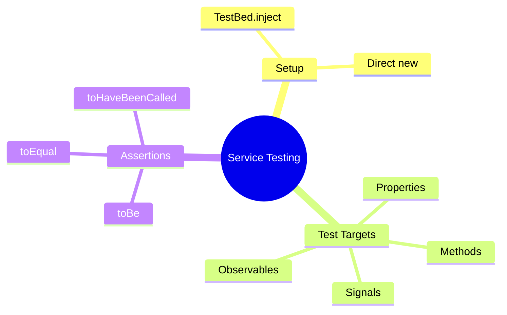

# ⚙️ Use Case 2: Service Testing

> **💡 Lightbulb Moment**: Services are the easiest to test because they're just TypeScript classes. No DOM, no template—just pure logic!

---

## 1. 🔍 How It Works


### Service Testing is Simple

| Step | Action |
|------|--------|
| 1 | Configure TestBed with service |
| 2 | Inject service instance |
| 3 | Call methods |
| 4 | Assert results |

---

## 2. 🚀 Implementation

### Basic Service Test

```typescript
describe('CounterService', () => {
    let service: CounterService;

    beforeEach(() => {
        TestBed.configureTestingModule({
            providers: [CounterService]
        });
        service = TestBed.inject(CounterService);
    });

    it('should increment', () => {
        service.increment();
        expect(service.currentCount).toBe(1);
    });
});
```

### Testing Observables

```typescript
it('should emit updates', (done) => {
    const values: number[] = [];
    service.count$.subscribe(v => values.push(v));
    
    service.increment();
    service.increment();
    
    expect(values).toEqual([0, 1, 2]);
    done();
});
```

### Testing Signals (Angular 17+)

```typescript
it('should update signal', () => {
    service.increment();
    expect(service.countSignal()).toBe(1);
    expect(service.doubleCount()).toBe(2);  // Computed
});
```

---

## 3. 🐛 Common Pitfalls

| ❌ Wrong | ✅ Right |
|----------|----------|
| Testing private methods | Test public API only |
| Shared state between tests | Fresh instance per test |
| Testing framework internals | Test your business logic |

---

## 4. ⚡ Performance Tips

1. **Skip TestBed for simple services**:
   ```typescript
   let service = new CounterService();  // Direct instantiation
   ```

2. **Use `firstValueFrom` for async**:
   ```typescript
   const value = await firstValueFrom(service.count$);
   ```

---

## 5. ❓ Interview Questions

**Q: When should you use TestBed vs direct instantiation?**
> Use TestBed when the service has dependencies (other services injected). Use direct `new Service()` for simple services with no DI.

**Q: How do you test an Observable that emits multiple values?**
> Collect values in an array via `subscribe`, then assert on the array after triggering changes.

---

## ❓ Additional Interview Questions (23+)

### Setup & Configuration Questions

**Q3: When to use TestBed vs new Service()?**
> A: Use TestBed if service has dependencies. Use `new` for simple services with no DI.

**Q4: How to inject dependencies in service tests?**
> A: Provide in TestBed: `providers: [MyService, { provide: HttpClient, useValue: mockHttp }]`.

**Q5: How to test singleton service?**
> A: Same as any service - TestBed creates test instance, doesn't use app singleton.

**Q6: Can you skip TestBed entirely?**
> A: Yes for simple services: `service = new CounterService()`.

---

### Observable Testing Questions

**Q7: How to test Observable emissions?**
> A: Subscribe and collect values:
> ```typescript
> const values: number[] = [];
> service.data$.subscribe(v => values.push(v));
> service.emit(5);
> expect(values).toEqual([5]);
> ```

**Q8: How to test Observable errors?**
> A: Subscribe to error callback:
> ```typescript
> service.data$.subscribe({
>   error: err => expect(err.message).toBe('Error')
> });
> ```

**Q9: How to test Observable completion?**
> A: Use `done()` callback or marble testing.

**Q10: What is firstValueFrom()?**
> A: RxJS helper that converts Observable to Promise - gets first emission:
> ```typescript
> const value = await firstValueFrom(service.data$);
> ```

**Q11: How to test debounced Observables?**
> A: Use `fakeAsync()` and `tick(delay)` to fast-forward time.

---

### Signal Testing Questions

**Q12: How to test signals?**
> A: Call signal like function: `expect(service.count()).toBe(5)`.

**Q13: How to test computed signals?**
> A: Same as regular signals - they auto-update:
> ```typescript
> service.count.set(5);
> expect(service.double()).toBe(10);
> ```

**Q14: Do signals need detectChanges()?**
> A: Not in service tests (no DOM). Yes in component tests.

---

### Method Testing Questions

**Q15: How to test method return values?**
> A: Call method, assert return: `expect(service.add(2, 3)).toBe(5)`.

**Q16: How to test void methods?**
> A: Check side effects (property values, Observable emissions).

**Q17: How to test methods with side effects?**
> A: Assert state changes: `service.increment(); expect(service.count).toBe(1)`.

---

### Spy & Mock Questions

**Q18: How to spy on service methods?**
> A: Use Jasmine spy: `spyOn(service, 'getData').and.returnValue(of(data))`.

**Q19: When to use spy vs mock?**
> A: Spy to watch real service; mock for complete fake implementation.

**Q20: How to verify method was called?**
> A: `expect(spy).toHaveBeenCalled()` or `toHaveBeenCalledWith(args)`.

---

### Best Practice Questions

**Q21: Should you test private methods?**
> A: No - test public API only. Private methods tested through public ones.

**Q22: How to handle service dependencies?**
> A: Provide mocks in TestBed or inject mock in constructor.

**Q23: How to test stateful services?**
> A: Reset state in `beforeEach()` or create fresh instance.

**Q24: Should you test RxJS operators?**
> A: No - test YOUR logic, not framework internals.

**Q25: How to organize service tests?**
> A: Group by method using `describe()` blocks.

---

## 🧠 Mind Map


```
┌─────────────────────────────────────────────────────────────┐
│  SERVICE TESTING: PURE LOGIC, NO DOM                        │
│                                                             │
│   MINIMAL SETUP:                                            │
│   ┌───────────────────────────────────────────────────────┐ │
│   │ // With dependencies: use TestBed                     │ │
│   │ beforeEach(() => {                                    │ │
│   │   TestBed.configureTestingModule({                    │ │
│   │     providers: [MyService, MockHttp]                  │ │
│   │   });                                                 │ │
│   │   service = TestBed.inject(MyService);                │ │
│   │ });                                                   │ │
│   │                                                       │ │
│   │ // Simple service: just new it!                       │ │
│   │ service = new CounterService();  // No TestBed needed │ │
│   └───────────────────────────────────────────────────────┘ │
│                                                             │
│   TESTING OBSERVABLES:                                      │
│   ┌───────────────────────────────────────────────────────┐ │
│   │ it('should emit values', () => {                      │ │
│   │   const values: number[] = [];                        │ │
│   │   service.count$.subscribe(v => values.push(v));      │ │
│   │   service.increment();                                │ │
│   │   expect(values).toEqual([0, 1]);                     │ │
│   │ });                                                   │ │
│   └───────────────────────────────────────────────────────┘ │
│                                                             │
│   TESTING SIGNALS:                                          │
│   ┌───────────────────────────────────────────────────────┐ │
│   │ expect(service.countSignal()).toBe(5);  // Just call! │ │
│   └───────────────────────────────────────────────────────┘ │
└─────────────────────────────────────────────────────────────┘
```

> **Key Takeaway**: Services = pure TypeScript classes = easy to test! Use TestBed only if service has dependencies.

---

## 🧮 Calculator Test Analogy (Easy to Remember!)

Think of service testing like **testing a calculator**:

| Concept | Calculator Analogy | Memory Trick |
|---------|-------------------|--------------| 
| **Service** | 🧮 **Calculator**: Pure logic, no screen | **"Just the brain"** |
| **TestBed.inject** | 🔌 **Get the calculator**: Obtain the device | **"Get instance"** |
| **Call method** | 🔢 **Press buttons**: add(2, 3) | **"Execute function"** |
| **Assert result** | ✅ **Check display**: Should show 5 | **"Verify output"** |
| **No DOM** | 📵 **No screen test**: Just math, no display | **"Pure logic only"** |

### 📖 Story to Remember:

> 🧮 **Testing the Calculator Factory**
>
> You're quality-testing calculators (services):
>
> **Getting the Calculator:**
> ```typescript
> beforeEach(() => {
>   service = TestBed.inject(CalculatorService);  // 🔌 Get one from factory
>   // OR for simple services:
>   service = new CalculatorService();            // 🔧 Build directly
> });
> ```
>
> **Testing it works:**
> ```typescript
> it('should add numbers', () => {
>   // 🔢 Press buttons
>   const result = service.add(2, 3);
>   
>   // ✅ Check display
>   expect(result).toBe(5);
> });
> ```
>
> **Why it's easy:**
> ```
> Component Testing = Test whole phone (screen, buttons, apps)
> Service Testing   = Test just the calculator chip (pure logic)
> 
> No DOM. No templates. Just JavaScript. ✨
> ```

### 🎯 Quick Reference:
```
🧮 Service          = Calculator (pure logic)
🔌 TestBed.inject   = Get calculator from factory
🔧 new Service()    = Build calculator directly
🔢 method()         = Press buttons
✅ expect()         = Check the display
```

---

## 🧠 Mind Map


