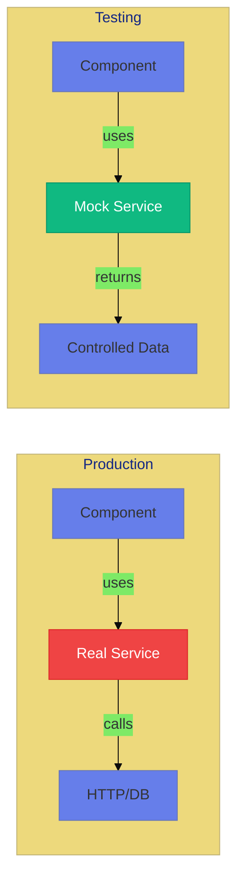
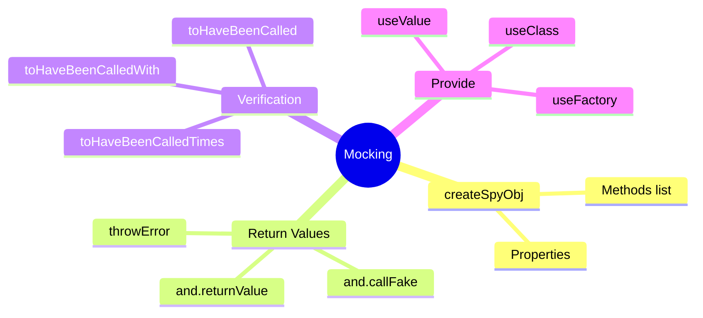

# 🎭 Use Case 3: Mocking Dependencies

> **💡 Lightbulb Moment**: Mocking isolates your test from external dependencies. You control exactly what the dependency returns, testing your component's behavior—not the dependency's!

---

## 1. 🔍 How It Works



### Why Mock?

| Reason | Benefit |
|--------|---------|
| **Isolation** | Test only your code, not dependencies |
| **Speed** | No network delays |
| **Control** | Test edge cases (errors, empty data) |
| **Reliability** | No flaky tests from external services |

---

## 2. 🚀 Implementation

### Step 1: Create Spy Object

```typescript
mockUserService = jasmine.createSpyObj('UserService', ['getUser', 'save']);
```

### Step 2: Configure Return Values

```typescript
// Success
mockUserService.getUser.and.returnValue(of({ id: 1, name: 'Test' }));

// Error
mockUserService.getUser.and.returnValue(throwError(() => new Error('404')));
```

### Step 3: Provide in TestBed

```typescript
providers: [
    { provide: UserService, useValue: mockUserService }
]
```

### Step 4: Verify Calls

```typescript
expect(mockUserService.getUser).toHaveBeenCalledWith(1);
expect(mockUserService.getUser).toHaveBeenCalledTimes(1);
```

---

## 3. 🐛 Common Pitfalls

| ❌ Wrong | ✅ Right |
|----------|----------|
| Forgetting to mock all used methods | Mock all methods component calls |
| Over-mocking (mocking everything) | Mock only external dependencies |
| Not resetting spies between tests | Use `beforeEach` for fresh mocks |

---

## 4. ⚡ Reusable Mock Pattern

```typescript
// mock-providers.ts
export function createUserServiceMock() {
    return jasmine.createSpyObj('UserService', ['getUser', 'save'], {
        user$: of(null)
    });
}

// In spec file
const mockUserService = createUserServiceMock();
```

---

## 5. ❓ Interview Questions

**Q: What's the difference between `useValue` and `useClass` in providers?**
> `useValue` provides a pre-created instance (mock object). `useClass` creates a new instance from a class (useful for stub classes).

**Q: How do you test error handling with mocks?**
> Use `throwError(() => new Error('message'))` as the return value, then verify error state in component.

---

## ❓ Additional Interview Questions (20+)

**Q3: How to create a spy object?**
> A: `jasmine.createSpyObj('ServiceName', ['method1', 'method2'])`.

**Q4: How to mock Observable properties?**
> A: Third parameter: `jasmine.createSpyObj('S', [], { user$: of(null) })`.

**Q5: What's and.returnValue vs and.callFake?**
> A: `returnValue` returns static value; `callFake` executes custom function.

**Q6: How to mock different return values per call?**
> A: Chain: `spy.and.returnValues(value1, value2, value3)`.

**Q7: How to verify method was called with specific args?**
> A: `expect(spy).toHaveBeenCalledWith(arg1, arg2)`.

**Q8: How to verify call count?**
> A: `expect(spy).toHaveBeenCalledTimes(3)`.

**Q9: How to reset spy between tests?**
> A: Recreate in `beforeEach()` or use `spy.calls.reset()`.

**Q10: When to use useValue vs useClass?**
> A: `useValue` for spy objects; `useClass` for stub implementations.

**Q11: How to mock HttpClient?**
> A: `jasmine.createSpyObj('HttpClient', ['get', 'post'])`.

**Q12: How to test Observable error handling?**
> A: `spy.and.returnValue(throwError(() => new Error('test')))`.

**Q13: Should you mock everything?**
> A: No - only external dependencies (HTTP, services). Not framework code.

**Q14: How to mock private methods?**
> A: Don't - test public API only.

**Q15: How to create reusable mocks?**
> A: Export factory functions that return configured spy objects.

**Q16: What's Jasmine vs Sinon?**
> A: Both mocking libraries; Jasmine built-in, Sinon more features.

**Q17: How to mock class with new keyword?**
> A: Provide stub class in TestBed with `useClass`.

**Q18: How to mock static methods?**
> A: Use `spyOn(ClassName, 'methodName')`.

**Q19: Can spies call through to real implementation?**
> A: Yes: `spy.and.callThrough()`.

**Q20: How to check if spy was NOT called?**
> A: `expect(spy).not.toHaveBeenCalled()`.

**Q21: How to get spy call arguments?**
> A: `spy.calls.argsFor(0)` or `spy.calls.mostRecent().args`.

**Q22: Should you verify every method call?**
> A: No - only verify calls critical to test behavior.

---

## 🧠 Mind Map


```
┌─────────────────────────────────────────────────────────────┐
│  MOCKING: CONTROL DEPENDENCIES IN TESTS                     │
│                                                             │
│   CREATE MOCK:                                              │
│   ┌───────────────────────────────────────────────────────┐ │
│   │ mockUserService = jasmine.createSpyObj('UserService', │ │
│   │   ['getUser', 'save']                                 │ │
│   │ );                                                    │ │
│   └───────────────────────────────────────────────────────┘ │
│                                                             │
│   CONFIGURE RETURN VALUES:                                  │
│   ┌───────────────────────────────────────────────────────┐ │
│   │ // Success case                                       │ │
│   │ mockUserService.getUser.and.returnValue(              │ │
│   │   of({ id: 1, name: 'Test' })                         │ │
│   │ );                                                    │ │
│   │                                                       │ │
│   │ // Error case                                         │ │
│   │ mockUserService.getUser.and.returnValue(              │ │
│   │   throwError(() => new Error('Not Found'))            │ │
│   │ );                                                    │ │
│   └───────────────────────────────────────────────────────┘ │
│                                                             │
│   PROVIDE IN TESTBED:                                       │
│   ┌───────────────────────────────────────────────────────┐ │
│   │ providers: [                                          │ │
│   │   { provide: UserService, useValue: mockUserService } │ │
│   │ ]                                                     │ │
│   └───────────────────────────────────────────────────────┘ │
│                                                             │
│   VERIFY: toHaveBeenCalled(), toHaveBeenCalledWith()       │
└─────────────────────────────────────────────────────────────┘
```

> **Key Takeaway**: createSpyObj creates mock. returnValue controls output. Provide with useValue. Verify with toHaveBeenCalled!

---

## 🎬 Stunt Double Analogy (Easy to Remember!)

Think of mocking like **stunt doubles in movies**:

| Concept | Movie Analogy | Memory Trick |
|---------|---------------|--------------| 
| **Real Service** | 🎭 **Lead actor**: Real performance, expensive, unpredictable | **"Production"** |
| **Mock Service** | 🤸 **Stunt double**: Controlled, safe, predictable | **"Test double"** |
| **createSpyObj** | 🎬 **Casting call**: "I need a double!" | **"Create mock"** |
| **returnValue** | 📜 **Script**: "When called, do exactly THIS" | **"Control output"** |
| **toHaveBeenCalled** | 🎥 **Director check**: "Did the stunt happen?" | **"Verify call"** |

### 📖 Story to Remember:

> 🎬 **The Action Movie Set**
>
> Your component is filming a dangerous scene:
>
> **Using Real Actor (Real Service):**
> ```
> Real HTTP calls 💸 (expensive!)
> Network delays ⏳
> Unpredictable results 🎲
> Could fail randomly 💥
> ```
>
> **Using Stunt Double (Mock):**
> ```typescript
> // Cast a stunt double
> mockService = jasmine.createSpyObj('Service', ['getData']);
>
> // Give them the script
> mockService.getData.and.returnValue(of({ id: 1 }));
>
> // Check the performance
> expect(mockService.getData).toHaveBeenCalled();
> ```
>
> **Safe, fast, predictable tests! 🎬**

### 🎯 Quick Reference:
```
🎭 Real service      = Lead actor (production)
🤸 Mock service      = Stunt double (controlled)
🎬 createSpyObj      = Cast the double
📜 returnValue       = The script (what to return)
🎥 toHaveBeenCalled  = "Did they do the stunt?"
```

---

## 🧠 Mind Map


