# 🎭 Use Case 3: Mocking Dependencies

> **💡 Lightbulb Moment**: Mocking isolates your test from external dependencies. You control exactly what the dependency returns, testing your component's behavior—not the dependency's!

## 📊 Complete Testing Flow


---

## 1. 🔍 How It Works


### Why Mock?

| Reason | Benefit |
|--------|---------|
| **Isolation** | Test only your code, not dependencies |
| **Speed** | No network delays |
| **Control** | Test edge cases (errors, empty data) |
| **Reliability** | No flaky tests from external services |

---

## 2. 🚀 Implementation

### Step 1: Create Spy Object

```typescript
mockUserService = jasmine.createSpyObj('UserService', ['getUser', 'save']);
```

### Step 2: Configure Return Values

```typescript
// Success
mockUserService.getUser.and.returnValue(of({ id: 1, name: 'Test' }));

// Error
mockUserService.getUser.and.returnValue(throwError(() => new Error('404')));
```

### Step 3: Provide in TestBed

```typescript
providers: [
    { provide: UserService, useValue: mockUserService }
]
```

### Step 4: Verify Calls

```typescript
expect(mockUserService.getUser).toHaveBeenCalledWith(1);
expect(mockUserService.getUser).toHaveBeenCalledTimes(1);
```

---

## 2.1 🎭 Understanding Mocking - Deep Dive

### What is Mocking?

**Mocking** is creating **FAKE** versions of dependencies (services, APIs, databases) that return controlled, predictable data instead of making real calls to external systems.

> **💡 Think of it as**: Using a **stunt double** 🤸 in a movie instead of the real actor 🎭 for dangerous scenes

### Why Mock? The Problem Without Mocking

| Without Mocking (Real Service) | With Mocking | Result |
|-------------------------------|--------------|--------|
| ❌ Real HTTP calls | ✅ No network calls | 100x faster tests |
| ❌ Network delays (seconds) | ✅ Instant returns | Quick feedback |
| ❌ Unpredictable (API changes, down) | ✅ Controlled output | Reliable tests |
| ❌ Hard to test errors | ✅ Easy to simulate errors | Test edge cases |
| ❌ Depends on external systems | ✅ Isolated to your code | No flaky tests |

### Real-World Comparison

```mermaid
%%{init: {'theme': 'base', 'themeVariables': { 'primaryColor': '#3b82f6'}}}%%
flowchart LR
    subgraph Production["🏭 Production (Real Service)"]
        A[Component] --> B[UserService]
        B --> C[HTTP Client]
        C --> D[API Server]
        D --> E[Database]
    end
    
    subgraph Testing["🧪 Testing (Mock Service)"]
        A2[Component] --> B2[MockUserService]
        B2 --> C2["Returns: {id: 1, name: 'Test'}"]
    end
    
    style B fill:#ef4444,stroke:#dc2626,color:#fff
    style D fill:#ef4444,stroke:#dc2626,color:#fff
    style B2 fill:#10b981,stroke:#059669,color:#fff
    style C2 fill:#10b981,stroke:#059669,color:#fff
```



---

## 2.2 🔧 Understanding jasmine.createSpyObj()

###  What is jasmine.createSpyObj()?

**Jasmine's utility to create mock objects** with spy methods that you can control and verify.

#### Syntax

```typescript
const mock = jasmine.createSpyObj('ServiceName', ['method1', 'method2']);
//                                 ↑              ↑
//                          Display name    Methods to spy on
```

#### What it Creates

```typescript
mockUserService = jasmine.createSpyObj('UserService', ['getUser', 'save']);

// Creates an object with:
mockUserService.getUser()  // ← Spy method (trackable)
mockUserService.save()     // ← Spy method (trackable)

// Each method:
// ✅ Can be called
// ✅ Tracks call count
// ✅ Records arguments
// ✅ Returns undefined by default (you configure it)
```

#### Three Parameters

```typescript
jasmine.createSpyObj(
    'UserService',              // 1️⃣ Display name (for debugging)
    ['getUser', 'save'],        // 2️⃣ Methods (array of strings)
    { currentUser$: of(null) }  // 3️⃣ Properties (optional, for Observables)
);
```

### The Complete Mocking Flow


---

## 2.3 📝 Step-by-Step: Creating & Using Mocks

### Step 1: Create the Mock

```typescript
beforeEach(() => {
    // Create spy object with methods
    mockUserService = jasmine.createSpyObj('UserService', [
        'getUser',    // Method 1
        'getUsers',   // Method 2
        'save'        // Method 3
    ]);
    
    // Now mockUserService has 3 spy methods
});
```

### Step 2: Configure Return Values

```typescript
// Success case - return Observable
mockUserService.getUser.and.returnValue(of({ id: 1, name: 'Test' }));
//              ↑           ↑
//          Spy method  Configure what it returns

// Error case - throw error
mockUserService.save.and.returnValue(throwError(() => new Error('Save failed')));

// Boolean return
mockUserService.isAdmin.and.returnValue(true);
```

#### Configuration Options

| Method | Purpose | Example |
|--------|---------|---------|
| **`.and.returnValue()`** | Return static value | `spy.and.returnValue(of(user))` |
| **`.and.returnValues()`** | Return different values per call | `spy.and.returnValues(val1, val2, val3)` |
| **`.and.callFake()`** | Execute custom function | `spy.and.callFake((id) => of({id}))` |
| **`throwError()`** | Simulate errors | `spy.and.returnValue(throwError(() => new Error()))` |

### Step 3: Provide in TestBed

```typescript
TestBed.configureTestingModule({
    imports: [MyComponent],
    providers: [
        { provide: UserService, useValue: mockUserService }
        //   ↑                    ↑          ↑
        // Real token         Strategy   Mock instance
    ]
});
```

**How it works:**

```
Component constructor: constructor(private userService: UserService)
                                                        ↑
Angular DI: "They need UserService, let me check providers..."
           "Found: { provide: UserService, useValue: mockUserService }"
           "I'll inject mockUserService instead!" 🎭

Component now uses: this.userService → mockUserService ✅
```

### Step 4: Test & Verify

```typescript
it('should load user', () => {
    // ACT: Call component method
    component.loadUser(1);
    
    // ASSERT: Verify spy was called
    expect(mockUserService.getUser).toHaveBeenCalled();
    expect(mockUserService.getUser).toHaveBeenCalledWith(1);
    expect(mockUserService.getUser).toHaveBeenCalledTimes(1);
});
```

---

## 2.4 🔍 Spy Verification Matchers

### Basic Verification

```typescript
// Was it called at all?
expect(spy).toHaveBeenCalled();

// Was it NOT called?
expect(spy).not.toHaveBeenCalled();

// Called with specific arguments?
expect(spy).toHaveBeenCalledWith(1, 'test');

// How many times?
expect(spy).toHaveBeenCalledTimes(3);
```

### Advanced Verification

```typescript
// Called before another spy?
expect(spy1).toHaveBeenCalledBefore(spy2);

// Get call arguments
spy.calls.argsFor(0)           // First call: [arg1, arg2]
spy.calls.argsFor(1)           // Second call
spy.calls.mostRecent().args    // Last call
spy.calls.first().args         // First call (alternative)

// Get call count
spy.calls.count()              // Total calls: 3

// Reset spy
spy.calls.reset();             // Clear call history
```

---

## 2.5 🎯 Common Mocking Patterns

### Pattern 1: Success Scenario (Default)

```typescript
beforeEach(() => {
    // Configure success case as default
    mockUserService.getUser.and.returnValue(of({ id: 1, name: 'Test' }));
});

it('should display user', () => {
    component.loadUser(1);
    expect(component.user()).toEqual({ id: 1, name: 'Test' });
});
```

### Pattern 2: Error Scenario (Override per Test)

```typescript
it('should handle error', () => {
    // Override default for this test only
    mockUserService.getUser.and.returnValue(
        throwError(() => new Error('User not found'))
    );
    
    component.loadUser(999);
    expect(component.error()).toBe('User not found');
});
```

### Pattern 3: Different Returns per Call

```typescript
it('should handle multiple calls', () => {
    mockUserService.getUser.and.returnValues(
        of({ id: 1, name: 'User 1' }),  // First call
        of({ id: 2, name: 'User 2' }),  // Second call
        of({ id: 3, name: 'User 3' })   // Third call
    );
    
    component.loadUser(1);
    expect(component.user().name).toBe('User 1');
    
    component.loadUser(2);
    expect(component.user().name).toBe('User 2');
});
```

### Pattern 4: Conditional Logic

```typescript
mockUserService.getUser.and.callFake((id: number) => {
    if (id === 1) {
        return of({ id: 1, name: 'Admin', role: 'admin' });
    } else if (id > 100) {
        return throwError(() => new Error('Not found'));
    } else {
        return of({ id, name: `User ${id}`, role: 'user' });
    }
});
```

---

## 2.6 🚨 Provider Strategies: useValue vs useClass vs useFactory

| Strategy | Use Case | Example |
|----------|----------|---------|
| **`useValue`** | Provide pre-created instance | `{ provide: UserService, useValue: mockUserService }` |
| **`useClass`** | Create new instance from class | `{ provide: UserService, useClass: MockUserService }` |
| **`useFactory`** | Use factory function | `{ provide: UserService, useFactory: () => createMock() }` |

### When to Use Each

```typescript
// useValue - Most common for spy objects (recommended)
{ provide: UserService, useValue: mockUserService }

// useClass - When you have a stub class
class MockUserService {
    getUser() { return of({ id: 1 }); }
}
{ provide: UserService, useClass: MockUserService }

// useFactory - When you need dynamic creation
{ provide: UserService, useFactory: () => {
    const mock = jasmine.createSpyObj(...);
    mock.getUser.and.returnValue(of(user));
    return mock;
}}
```

---

## 2.7 ⚡ Testing Async with fakeAsync & tick

### What are fakeAsync & tick?

```typescript
import { fakeAsync, tick } from '@angular/core/testing';

it('should load user', fakeAsync(() => {
    //                 ↑
    //         Wraps test in fake async zone
    
    component.loadUser(1);    // Triggers async Observable
    
    tick();  // ← Fast-forward time, process async operations
    
    expect(component.user()).toBeDefined();
}));
```

**How it works:**

```
Normal async:     loadUser() → Observable emits after delay → test waits
fakeAsync + tick: loadUser() → tick() processes immediately → no wait!

tick()      = Process all pending async operations
tick(1000)  = Fast-forward 1 second
```

---

## 2.8 🧠 Memory Tricks

### Stunt Double Analogy 🎬

```
Real Service     = 🎭 Lead Actor (expensive, unpredictable, dangerous)
Mock Service     = 🤸 Stunt Double (controlled, safe, predictable)
createSpyObj     = 🎬 Casting call ("I need a stunt double!")
returnValue      = 📜 Script ("When called, do exactly THIS")
toHaveBeenCalled = 🎥 Director check ("Did the stunt happen?")
provide useValue = 🔄 Swap actors ("Use the double instead!")
```

### Quick Decision Tree

```
Does component depend on external service/API?
│
├─ YES → Mock it!
│  │
│  ├─ Step 1: createSpyObj('Service', ['methods'])
│  ├─ Step 2: spy.and.returnValue(data)
│  ├─ Step 3: provide: Service, useValue: mock
│  └─ Step 4: expect(spy).toHaveBeenCalled()
│
└─ NO → Test component directly (no mocking needed)
```

---

## 3. 🐛 Common Pitfalls

| ❌ Wrong | ✅ Right |
|----------|----------|
| Forgetting to mock all used methods | Mock all methods component calls |
| Over-mocking (mocking everything) | Mock only external dependencies |
| Not resetting spies between tests | Use `beforeEach` for fresh mocks |

---

## 4. ⚡ Reusable Mock Pattern

```typescript
// mock-providers.ts
export function createUserServiceMock() {
    return jasmine.createSpyObj('UserService', ['getUser', 'save'], {
        user$: of(null)
    });
}

// In spec file
const mockUserService = createUserServiceMock();
```

---

## 5. ❓ Interview Questions

**Q: What's the difference between `useValue` and `useClass` in providers?**
> `useValue` provides a pre-created instance (mock object). `useClass` creates a new instance from a class (useful for stub classes).

**Q: How do you test error handling with mocks?**
> Use `throwError(() => new Error('message'))` as the return value, then verify error state in component.

---

## ❓ Additional Interview Questions (20+)

**Q3: How to create a spy object?**
> A: `jasmine.createSpyObj('ServiceName', ['method1', 'method2'])`.

**Q4: How to mock Observable properties?**
> A: Third parameter: `jasmine.createSpyObj('S', [], { user$: of(null) })`.

**Q5: What's and.returnValue vs and.callFake?**
> A: `returnValue` returns static value; `callFake` executes custom function.

**Q6: How to mock different return values per call?**
> A: Chain: `spy.and.returnValues(value1, value2, value3)`.

**Q7: How to verify method was called with specific args?**
> A: `expect(spy).toHaveBeenCalledWith(arg1, arg2)`.

**Q8: How to verify call count?**
> A: `expect(spy).toHaveBeenCalledTimes(3)`.

**Q9: How to reset spy between tests?**
> A: Recreate in `beforeEach()` or use `spy.calls.reset()`.

**Q10: When to use useValue vs useClass?**
> A: `useValue` for spy objects; `useClass` for stub implementations.

**Q11: How to mock HttpClient?**
> A: `jasmine.createSpyObj('HttpClient', ['get', 'post'])`.

**Q12: How to test Observable error handling?**
> A: `spy.and.returnValue(throwError(() => new Error('test')))`.

**Q13: Should you mock everything?**
> A: No - only external dependencies (HTTP, services). Not framework code.

**Q14: How to mock private methods?**
> A: Don't - test public API only.

**Q15: How to create reusable mocks?**
> A: Export factory functions that return configured spy objects.

**Q16: What's Jasmine vs Sinon?**
> A: Both mocking libraries; Jasmine built-in, Sinon more features.

**Q17: How to mock class with new keyword?**
> A: Provide stub class in TestBed with `useClass`.

**Q18: How to mock static methods?**
> A: Use `spyOn(ClassName, 'methodName')`.

**Q19: Can spies call through to real implementation?**
> A: Yes: `spy.and.callThrough()`.

**Q20: How to check if spy was NOT called?**
> A: `expect(spy).not.toHaveBeenCalled()`.

**Q21: How to get spy call arguments?**
> A: `spy.calls.argsFor(0)` or `spy.calls.mostRecent().args`.

**Q22: Should you verify every method call?**
> A: No - only verify calls critical to test behavior.

---

## 🧠 Mind Map


```
┌─────────────────────────────────────────────────────────────┐
│  MOCKING: CONTROL DEPENDENCIES IN TESTS                     │
│                                                             │
│   CREATE MOCK:                                              │
│   ┌───────────────────────────────────────────────────────┐ │
│   │ mockUserService = jasmine.createSpyObj('UserService', │ │
│   │   ['getUser', 'save']                                 │ │
│   │ );                                                    │ │
│   └───────────────────────────────────────────────────────┘ │
│                                                             │
│   CONFIGURE RETURN VALUES:                                  │
│   ┌───────────────────────────────────────────────────────┐ │
│   │ // Success case                                       │ │
│   │ mockUserService.getUser.and.returnValue(              │ │
│   │   of({ id: 1, name: 'Test' })                         │ │
│   │ );                                                    │ │
│   │                                                       │ │
│   │ // Error case                                         │ │
│   │ mockUserService.getUser.and.returnValue(              │ │
│   │   throwError(() => new Error('Not Found'))            │ │
│   │ );                                                    │ │
│   └───────────────────────────────────────────────────────┘ │
│                                                             │
│   PROVIDE IN TESTBED:                                       │
│   ┌───────────────────────────────────────────────────────┐ │
│   │ providers: [                                          │ │
│   │   { provide: UserService, useValue: mockUserService } │ │
│   │ ]                                                     │ │
│   └───────────────────────────────────────────────────────┘ │
│                                                             │
│   VERIFY: toHaveBeenCalled(), toHaveBeenCalledWith()       │
└─────────────────────────────────────────────────────────────┘
```

> **Key Takeaway**: createSpyObj creates mock. returnValue controls output. Provide with useValue. Verify with toHaveBeenCalled!

---

## 🎬 Stunt Double Analogy (Easy to Remember!)

Think of mocking like **stunt doubles in movies**:

| Concept | Movie Analogy | Memory Trick |
|---------|---------------|--------------| 
| **Real Service** | 🎭 **Lead actor**: Real performance, expensive, unpredictable | **"Production"** |
| **Mock Service** | 🤸 **Stunt double**: Controlled, safe, predictable | **"Test double"** |
| **createSpyObj** | 🎬 **Casting call**: "I need a double!" | **"Create mock"** |
| **returnValue** | 📜 **Script**: "When called, do exactly THIS" | **"Control output"** |
| **toHaveBeenCalled** | 🎥 **Director check**: "Did the stunt happen?" | **"Verify call"** |

### 📖 Story to Remember:

> 🎬 **The Action Movie Set**
>
> Your component is filming a dangerous scene:
>
> **Using Real Actor (Real Service):**
> ```
> Real HTTP calls 💸 (expensive!)
> Network delays ⏳
> Unpredictable results 🎲
> Could fail randomly 💥
> ```
>
> **Using Stunt Double (Mock):**
> ```typescript
> // Cast a stunt double
> mockService = jasmine.createSpyObj('Service', ['getData']);
>
> // Give them the script
> mockService.getData.and.returnValue(of({ id: 1 }));
>
> // Check the performance
> expect(mockService.getData).toHaveBeenCalled();
> ```
>
> **Safe, fast, predictable tests! 🎬**

### 🎯 Quick Reference:
```
🎭 Real service      = Lead actor (production)
🤸 Mock service      = Stunt double (controlled)
🎬 createSpyObj      = Cast the double
📜 returnValue       = The script (what to return)
🎥 toHaveBeenCalled  = "Did they do the stunt?"
```

---

## 🧠 Mind Map


