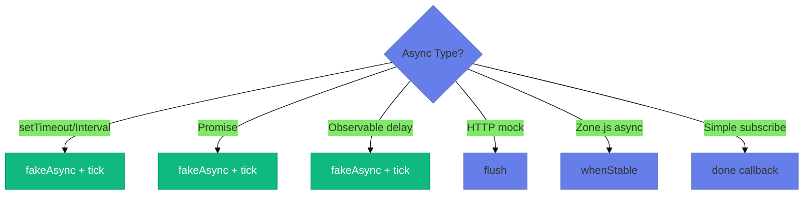
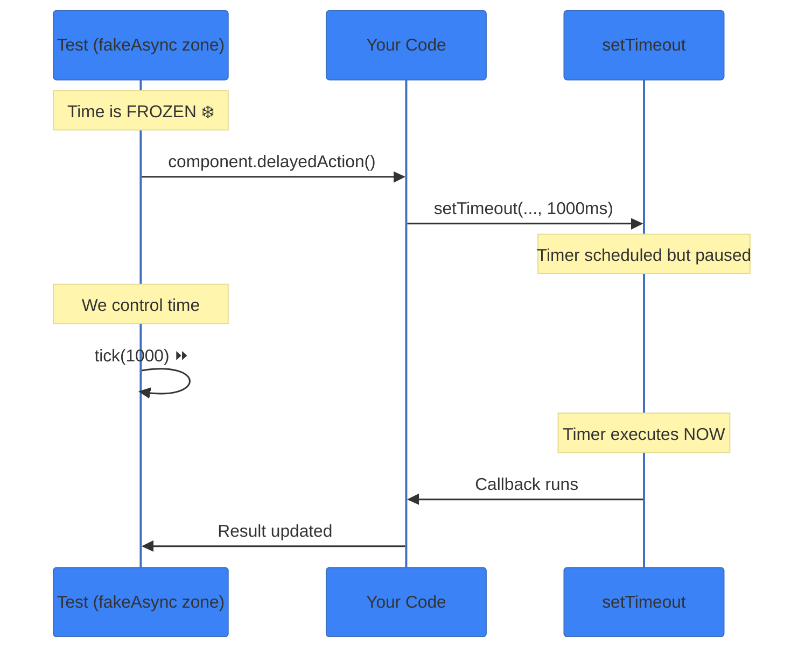
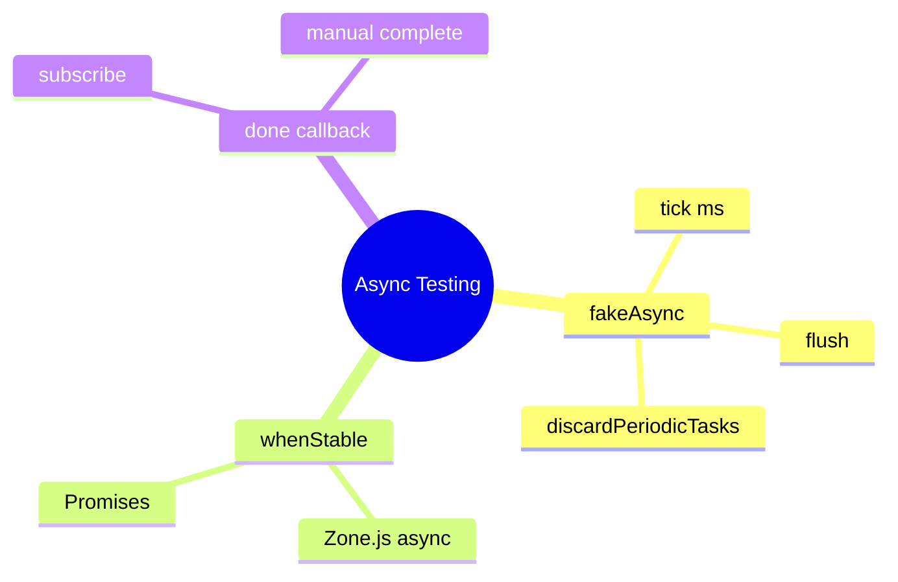

# ⏱️ Use Case 4: Async Testing


*Complete async testing workflow with fakeAsync, tick(), flush(), and debounce testing patterns*

> **💡 Lightbulb Moment**: `fakeAsync` + `tick` gives you a time machine! Fast-forward through delays without actually waiting.

---

## 1. 🔍 Async Testing Arsenal



| Tool | Use When |
|------|----------|
| `fakeAsync` + `tick(ms)` | Precise time control |
| `flush()` | Complete all timers |
| `discardPeriodicTasks()` | Cleanup intervals |
| `async` + `whenStable()` | Zone.js tracked async |
| `done()` callback | Observable subscriptions |

---

## 2. 🚀 Patterns

### fakeAsync + tick

```typescript
it('waits for timeout', fakeAsync(() => {
    component.startTimer();        // Starts 1s timer
    expect(component.done).toBeFalse();
    
    tick(1000);                    // ⏩ Fast-forward 1s
    expect(component.done).toBeTrue();
}));
```

### flush()

```typescript
it('completes all timers', fakeAsync(() => {
    component.startMultipleTimers();  // Several timers
    flush();                          // Complete them all
    expect(component.allDone).toBeTrue();
}));
```

### Debounce Testing

```typescript
it('debounces input', fakeAsync(() => {
    component.search('a');
    tick(100);
    component.search('ab');
    tick(300);  // Wait for debounce (300ms)
    
    expect(service.search).toHaveBeenCalledWith('ab');
    discardPeriodicTasks();  // Cleanup
}));
```

---

## 2.1 ⏰ Understanding fakeAsync - Deep Dive

### What is fakeAsync()?

**fakeAsync()** creates a **fake asynchronous zone** where time doesn't pass automatically. YOU control time with `tick()`.

> **💡 Think of it like**: A video game where you can pause time and fast-forward ⏩

### How It Works



### The Problem It Solves

**Without fakeAsync:**
```typescript
it('test timeout', (done) => {
    component.delayedAction();  // Sets 1 second timeout
    
    // ❌ Can't test immediately - need to wait
    setTimeout(() => {
        expect(component.result).toBe('done');
        done();
    }, 1100);  // Actual wait time!
});
// Test takes 1+ second 😢
```

**With fakeAsync:**
```typescript
it('test timeout', fakeAsync(() => {
    component.delayedAction();  // Sets 1 second timeout
    
    tick(1000);  // ⏩ Fast-forward instantly!
    
    expect(component.result).toBe('done');
}));
// Test takes milliseconds! 🚀
```

---

## 2.2 🎯 tick() vs flush() - When to Use

### tick(milliseconds)

**Purpose:** Fast-forward time by EXACT amount

```typescript
it('test specific timing', fakeAsync(() => {
    component.start();  // setTimeout(..., 500ms)
    
    // Too early
    tick(100);
    expect(component.done).toBeFalse();
    
    // Still too early
    tick(200);  // Total: 300ms
    expect(component.done).toBeFalse();
    
    // Now it completes
    tick(200);  // Total: 500ms
    expect(component.done).toBeTrue();
}));
```

**Use when:**
- ✅ Testing exact timing matters
- ✅ Testing debounce (need to verify it waits)
- ✅ Testing animations with specific durations

---

### flush()

**Purpose:** Complete ALL pending timers at once

```typescript
it('test final result', fakeAsync(() => {
    component.startMultipleTimers();
    // Timer 1: 100ms
    // Timer 2: 500ms
    // Timer 3: 1000ms
    
    flush();  // 🏎️ All complete instantly!
    
    expect(component.allDone).toBeTrue();
}));
```

**Use when:**
- ✅ Don't care about timing, just final result
- ✅ Multiple timers with different delays
- ✅ Just want everything to complete

### Comparison Table

| Feature | tick(ms) | flush() |
|---------|----------|---------|
| **Precision** | ⏱️ Exact timing | ⚡ Complete all |
| **Speed** | Fast-forward N ms | Warp to end |
| **Use for** | Debounce, animations | Final state |
| **Control** | You specify time | Automatic |

---

## 2.3 🔄 Testing Debounce - Step-by-Step

Debounce delays execution until user stops input (e.g., search as you type).

### The Challenge

```typescript
// Component has 300ms debounce
searchInput$.pipe(
    debounceTime(300),
    switchMap(term => this.search(term))
)
```

**Goal:** Verify it only searches ONCE with the final value.

### The Strategy

```mermaid
%%{init: {'theme': 'base', 'themeVariables': { 'primaryColor': '#3b82f6'}}}%%
gantt
    title Debounce Test Timeline
    dateFormat X
    axisFormat %L ms
    
    section User Input
    Type 'a'           :0, 50
    Type 'b'           :100, 50
    Type 'c'           :200, 50
    
    section Debounce Wait
    Waiting...         :250, 300
    
    section Search
    Search triggered   :550, 1
```



### The Test

```typescript
it('should debounce search input', fakeAsync(() => {
    const input = fixture.debugElement.query(By.css('input'));
    
    // STEP 1: Rapid typing (user types fast)
    input.triggerEventHandler('input', { target: { value: 'a' } });
    tick(100);  // ⏩ 100ms later
    input.triggerEventHandler('input', { target: { value: 'ab' } });
    tick(100);  // ⏩ Another 100ms
    input.triggerEventHandler('input', { target: { value: 'abc' } });
    
    // STEP 2: Verify nothing triggered yet (debounce = 300ms)
    expect(component.searchResult).toBe('--');  // ✅ Still default
    
    // STEP 3: Wait for debounce to trigger
    tick(300);  // ⏩ Total: 500ms (300ms since last input)
    fixture.detectChanges();
    
    // STEP 4: Verify only FINAL value processed
    expect(component.searchResult).toBe('Searching for: abc');  // ✅
    expect(searchService.search).toHave BeenCalledTimes(1);  // Only once!
    
    // CLEANUP: Cancel any periodic tasks
    discardPeriodicTasks();
}));
```

**Key Points:**
- Each `tick()` advances time
- Check state BEFORE debounce completes
- Check state AFTER debounce completes
- Verify only last value processed

---

## 2.4 🧹 discardPeriodicTasks() - Cleanup

### Why Needed?

`setInterval` creates periodic timers that run forever:

```typescript
// Component code
this.pollTimer = setInterval(() => {
    this.refresh();
}, 5000);  // Runs every 5 seconds FOREVER
```

**Problem:** fakeAsync test won't finish while timer active.

### The Solution

```typescript
it('should poll data', fakeAsync(() => {
    component.startPolling();  // setInterval(fn, 5000)
    
    // Test first few polls
    tick(5000);  // 1st poll
    expect(component.dataRefreshed).toBeTrue();
    
    tick(5000);  // 2nd poll
    expect(component.pollCount).toBe(2);
    
    // CRITICAL: Stop the interval before test ends
    discardPeriodicTasks();
    
    // Without discardPeriodicTasks():
    // ❌ Error: 1 periodic timer(s) still in the queue
}));
```

**Rule:** Call `discardPeriodicTasks()` whenever using `setInterval` in fakeAsync.

---

## 2.5 ⏳ whenStable() vs fakeAsync - Decision Guide

### whenStable()

**What it does:** Waits for ALL async operations tracked by Zone.js

```typescript
it('test with whenStable', async () => {
    component.loadData();  // Triggers HTTP, setTimeout, Promise
    
    await fixture.whenStable();  // Waits for EVERYTHING
    fixture.detectChanges();
    
    expect(component.data).toBeDefined();
});
```

**Limitations:**
- ❌ RxJS `delay()` runs outside Zone.js (won't wait)
- ❌ No control over timing
- ❌ Slower than fakeAsync

**Use when:**
- ✅ Real async in integration tests
- ✅ Multiple unpredictable async operations

---

### fakeAsync + tick

**What it does:** Simulates time with precise control

```typescript
it('test with fakeAsync', fakeAsync(() => {
    component.loadData();  // Uses Observable.delay(500)
    
    tick(500);  // Fast-forward exactly 500ms
    fixture.detectChanges();
    
    expect(component.data).toBeDefined();
}));
```

**Benefits:**
- ✅ Works with RxJS delay
- ✅ Precise timing control
- ✅ Faster execution
- ✅ Test exact timing behavior

**Use when:**
- ✅ Testing setTimeout/setInterval
- ✅ Testing RxJS operators (debounce, delay)
- ✅ Need precise timing verification

### Decision Tree

```
What are you testing?
│
├─ setTimeout/setInterval
│  └─ Use fakeAsync + tick ⭐
│
├─ Promise
│  ├─ Simple case → fakeAsync + tick()
│  └─ Complex → async + whenStable
│
├─ Observable with delay/debounce
│  └─ Use fakeAsync + tick ⭐
│
├─ Real HTTP in integration test
│  └─ Use async + whenStable
│
└─ Don't know timing
   └─ Use flush() in fakeAsync
```

---

## 2.6 🧠 Memory Tricks

### Time Machine Analogy ⏰

```
fakeAsync                = Enter time machine
tick(1000)              = Jump 1 second into future
flush()                  = Fast-forward to the end
discardPeriodicTasks()  = Stop the time loop
Real async               = Actually wait (slow!)
```

### Debounce = Traffic Light 🚦

```
User typing fast:
'a' → RED (wait)
'b' → RED (wait)  
'c' → RED (wait)
[300ms silence] → GREEN (search!)

Only searches when they STOP typing for 300ms
```

---

## 3. 🐛 Common Pitfalls

| ❌ Problem | ✅ Solution |
|-----------|-------------|
| Timer still running error | Use `discardPeriodicTasks()` |
| tick(0) doesn't work | Use `flush()` for microtasks |
| Observable never completes | Mock with synchronous `of()` |

---

## 4. ⚡ Performance Tip

Use synchronous mocks when possible:

```typescript
// Instead of delay(500)
mockService.getData.and.returnValue(of(data));  // Instant!
```

---

### 📦 Data Flow Summary (Visual Box Diagram)

```
┌─────────────────────────────────────────────────────────────┐
│  ASYNC TESTING: TIME MACHINE 🕰️                             │
│                                                             │
│   fakeAsync + tick:                                         │
│   ┌───────────────────────────────────────────────────────┐ │
│   │ it('debounces', fakeAsync(() => {                     │ │
│   │   component.search('angular');                        │ │
│   │   // Time is frozen here!                             │ │
│   │                                                       │ │
│   │   tick(300);  // ⏩ Fast-forward 300ms instantly       │ │
│   │                                                       │ │
│   │   expect(service.search).toHaveBeenCalled();          │ │
│   │   discardPeriodicTasks();  // Cleanup intervals       │ │
│   │ }));                                                  │ │
│   └───────────────────────────────────────────────────────┘ │
│                                                             │
│   KEY FUNCTIONS:                                            │
│   ┌───────────────────────────────────────────────────────┐ │
│   │ tick(ms)               → Fast-forward N milliseconds  │ │
│   │ flush()                → Complete ALL pending timers  │ │
│   │ discardPeriodicTasks() → Cancel setInterval timers    │ │
│   └───────────────────────────────────────────────────────┘ │
│                                                             │
│   WHEN TO USE:                                              │
│   setTimeout/setInterval → fakeAsync + tick                │
│   HTTP mocks            → flush()                          │
│   Zone.js async         → whenStable()                     │
└─────────────────────────────────────────────────────────────┘
```

> **Key Takeaway**: fakeAsync freezes time. tick() fast-forwards. 1000 tests × 300ms debounce = instant, not 5 minutes!

---

## ⏰ Time Machine Analogy (Easy to Remember!)

Think of fakeAsync + tick like a **time machine**:

| Concept | Time Machine Analogy | Memory Trick |
|---------|---------------------|--------------| 
| **fakeAsync** | ⏰ **Time machine mode**: Control time | **"Freeze time"** |
| **tick(ms)** | ⏩ **Fast-forward**: Jump ahead N milliseconds | **"Skip time"** |
| **flush()** | 🏎️ **Warp to end**: Complete all pending timers | **"Skip all"** |
| **discardPeriodicTasks** | 🗑️ **Cancel alarms**: Clean up intervals | **"Stop repeating"** |
| **Real test** | ⏳ **Real waiting**: Actually wait 5 seconds = 5 seconds | **"Slow!"** |

### 📖 Story to Remember:

> ⏰ **Testing the Debounce Feature**
>
> Your search has a 300ms debounce delay:
>
> **Without time machine (real time):**
> ```
> Test waits 300ms... ⏳
> Test waits another 300ms... ⏳
> 1000 tests × 300ms = 5 MINUTES! 😱
> ```
>
> **With time machine (fakeAsync):**
> ```typescript
> it('debounces search', fakeAsync(() => {
>   component.search('angular');
>   // ⏰ Time frozen!
>   
>   tick(300);  // ⏩ Fast-forward 300ms INSTANTLY
>   
>   expect(service.search).toHaveBeenCalled();
>   discardPeriodicTasks();  // 🗑️ Clean up
> }));
> // Test runs in milliseconds, not seconds!
> ```

### 🎯 Quick Reference:
```
⏰ fakeAsync       = Enter time machine mode
⏩ tick(ms)        = Fast-forward N milliseconds
🏎️ flush()         = Warp to end of all timers
🗑️ discardPeriodic = Cancel all alarms
⏳ Real async      = Slow (actually waits)
```

---

## ❓ Interview Questions (25+)

**Q1: What is fakeAsync?**
> A: Test zone that synchronously simulates asynchronous operations with time control.

**Q2: What does tick() do?**
> A: Fast-forwards virtual time by specified milliseconds.

**Q3: What's the difference between tick() and flush()?**
> A: `tick(ms)` advances specific time; `flush()` completes ALL pending async tasks.

**Q4: When to use fakeAsync vs async?**
> A: `fakeAsync` for timers/delays; `async` (deprecated) for general async.

**Q5: What is discardPeriodicTasks()?**
> A: Cancels pending `setInterval` tasks to prevent "pending timer" errors.

**Q6: Can you use real setTimeout in fakeAsync?**
> A: No - only Zone.js-patched timers work in fakeAsync.

**Q7: How to test debounced Observables?**
> A: Use `fakeAsync()` + `tick(debounceTime)`.

**Q8: How to test Observable.timer?**
> A: Wrap in `fakeAsync()`, use `tick()` to advance time.

**Q9: What happens if you forget discardPeriodicTasks()?**
> A: Test fails with "X timer(s) still in queue" error.

**Q10: Can you nest fakeAsync?**
> A: No - will throw error.

**Q11: How to test animation delays?**
> A: `tick(animationDuration)` in fakeAsync.

**Q12: What is whenStable()?**
> A: Waits for all Zone.js-tracked async operations to complete.

**Q13: How to test Promise in fakeAsync?**
> A: Promises work automatically, use `tick()` or `flush()`.

**Q14: What's done() callback used for?**
> A: Signal async test completion in Observable subscriptions.

**Q15: Can you use HttpClient in fakeAsync?**
> A: Yes, but use HttpTestingController for better control.

**Q16: How to test throttle?**
> A: Similar to debounce - trigger multiple calls, tick throttle time.

**Q17: What's flushMicrotasks()?**
> A: Flushes microtask queue (Promises, queueMicrotask).

**Q18: How to test retry logic with delays?**
> A: Use `fakeAsync()`, trigger error, tick retry delay.

**Q19: Can you use async/await in fakeAsync?**
> A: Yes, but prefer `tick()` for precise control.

**Q20: How to test polling (interval)?**
> A: `fakeAsync()`, tick poll interval multiple times, then `discardPeriodicTasks()`.

**Q21: What if tick() time doesn't match?**
> A: Test may pass but not actually test the delay - verify correct timing.

**Q22: How to test Observable.combineLatest with delays?**
> A: Tick each source's delay, verify combined emission.

**Q23: Can you mix real and fake async?**
> A: No - use one approach per test.

**Q24: How to test component lifecycle with delays?**
> A: Trigger lifecycle, tick delay, verify state.

**Q25: Best practice for async cleanup?**
> A: Always use `discardPeriodicTasks()` + `flush()` to prevent leaks.

---

## 🧠 Mind Map



