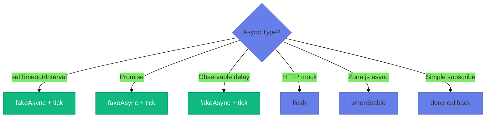
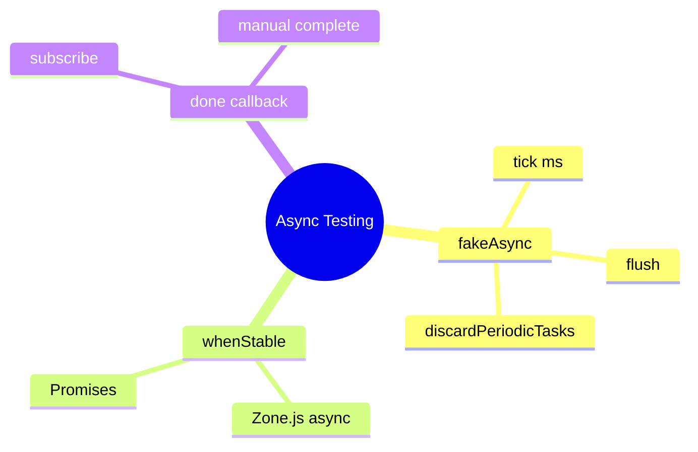

# ⏱️ Use Case 4: Async Testing

> **💡 Lightbulb Moment**: `fakeAsync` + `tick` gives you a time machine! Fast-forward through delays without actually waiting.

---

## 1. 🔍 Async Testing Arsenal



| Tool | Use When |
|------|----------|
| `fakeAsync` + `tick(ms)` | Precise time control |
| `flush()` | Complete all timers |
| `discardPeriodicTasks()` | Cleanup intervals |
| `async` + `whenStable()` | Zone.js tracked async |
| `done()` callback | Observable subscriptions |

---

## 2. 🚀 Patterns

### fakeAsync + tick

```typescript
it('waits for timeout', fakeAsync(() => {
    component.startTimer();        // Starts 1s timer
    expect(component.done).toBeFalse();
    
    tick(1000);                    // ⏩ Fast-forward 1s
    expect(component.done).toBeTrue();
}));
```

### flush()

```typescript
it('completes all timers', fakeAsync(() => {
    component.startMultipleTimers();  // Several timers
    flush();                          // Complete them all
    expect(component.allDone).toBeTrue();
}));
```

### Debounce Testing

```typescript
it('debounces input', fakeAsync(() => {
    component.search('a');
    tick(100);
    component.search('ab');
    tick(300);  // Wait for debounce (300ms)
    
    expect(service.search).toHaveBeenCalledWith('ab');
    discardPeriodicTasks();  // Cleanup
}));
```

---

## 3. 🐛 Common Pitfalls

| ❌ Problem | ✅ Solution |
|-----------|-------------|
| Timer still running error | Use `discardPeriodicTasks()` |
| tick(0) doesn't work | Use `flush()` for microtasks |
| Observable never completes | Mock with synchronous `of()` |

---

## 4. ⚡ Performance Tip

Use synchronous mocks when possible:

```typescript
// Instead of delay(500)
mockService.getData.and.returnValue(of(data));  // Instant!
```

---

## ⏰ Time Machine Analogy (Easy to Remember!)

Think of fakeAsync + tick like a **time machine**:

| Concept | Time Machine Analogy | Memory Trick |
|---------|---------------------|--------------| 
| **fakeAsync** | ⏰ **Time machine mode**: Control time | **"Freeze time"** |
| **tick(ms)** | ⏩ **Fast-forward**: Jump ahead N milliseconds | **"Skip time"** |
| **flush()** | 🏎️ **Warp to end**: Complete all pending timers | **"Skip all"** |
| **discardPeriodicTasks** | 🗑️ **Cancel alarms**: Clean up intervals | **"Stop repeating"** |
| **Real test** | ⏳ **Real waiting**: Actually wait 5 seconds = 5 seconds | **"Slow!"** |

### 📖 Story to Remember:

> ⏰ **Testing the Debounce Feature**
>
> Your search has a 300ms debounce delay:
>
> **Without time machine (real time):**
> ```
> Test waits 300ms... ⏳
> Test waits another 300ms... ⏳
> 1000 tests × 300ms = 5 MINUTES! 😱
> ```
>
> **With time machine (fakeAsync):**
> ```typescript
> it('debounces search', fakeAsync(() => {
>   component.search('angular');
>   // ⏰ Time frozen!
>   
>   tick(300);  // ⏩ Fast-forward 300ms INSTANTLY
>   
>   expect(service.search).toHaveBeenCalled();
>   discardPeriodicTasks();  // 🗑️ Clean up
> }));
> // Test runs in milliseconds, not seconds!
> ```

### 🎯 Quick Reference:
```
⏰ fakeAsync       = Enter time machine mode
⏩ tick(ms)        = Fast-forward N milliseconds
🏎️ flush()         = Warp to end of all timers
🗑️ discardPeriodic = Cancel all alarms
⏳ Real async      = Slow (actually waits)
```

---

## 🧠 Mind Map


