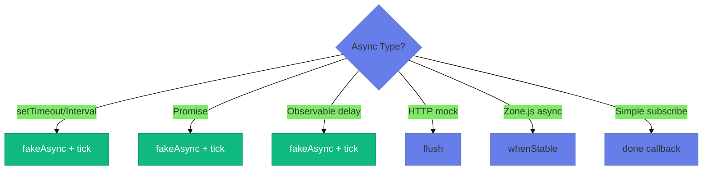
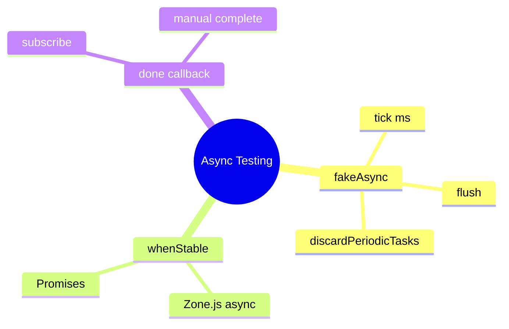

# ⏱️ Use Case 4: Async Testing

> **💡 Lightbulb Moment**: `fakeAsync` + `tick` gives you a time machine! Fast-forward through delays without actually waiting.

---

## 1. 🔍 Async Testing Arsenal



| Tool | Use When |
|------|----------|
| `fakeAsync` + `tick(ms)` | Precise time control |
| `flush()` | Complete all timers |
| `discardPeriodicTasks()` | Cleanup intervals |
| `async` + `whenStable()` | Zone.js tracked async |
| `done()` callback | Observable subscriptions |

---

## 2. 🚀 Patterns

### fakeAsync + tick

```typescript
it('waits for timeout', fakeAsync(() => {
    component.startTimer();        // Starts 1s timer
    expect(component.done).toBeFalse();
    
    tick(1000);                    // ⏩ Fast-forward 1s
    expect(component.done).toBeTrue();
}));
```

### flush()

```typescript
it('completes all timers', fakeAsync(() => {
    component.startMultipleTimers();  // Several timers
    flush();                          // Complete them all
    expect(component.allDone).toBeTrue();
}));
```

### Debounce Testing

```typescript
it('debounces input', fakeAsync(() => {
    component.search('a');
    tick(100);
    component.search('ab');
    tick(300);  // Wait for debounce (300ms)
    
    expect(service.search).toHaveBeenCalledWith('ab');
    discardPeriodicTasks();  // Cleanup
}));
```

---

## 3. 🐛 Common Pitfalls

| ❌ Problem | ✅ Solution |
|-----------|-------------|
| Timer still running error | Use `discardPeriodicTasks()` |
| tick(0) doesn't work | Use `flush()` for microtasks |
| Observable never completes | Mock with synchronous `of()` |

---

## 4. ⚡ Performance Tip

Use synchronous mocks when possible:

```typescript
// Instead of delay(500)
mockService.getData.and.returnValue(of(data));  // Instant!
```

---

### 📦 Data Flow Summary (Visual Box Diagram)

```
┌─────────────────────────────────────────────────────────────┐
│  ASYNC TESTING: TIME MACHINE 🕰️                             │
│                                                             │
│   fakeAsync + tick:                                         │
│   ┌───────────────────────────────────────────────────────┐ │
│   │ it('debounces', fakeAsync(() => {                     │ │
│   │   component.search('angular');                        │ │
│   │   // Time is frozen here!                             │ │
│   │                                                       │ │
│   │   tick(300);  // ⏩ Fast-forward 300ms instantly       │ │
│   │                                                       │ │
│   │   expect(service.search).toHaveBeenCalled();          │ │
│   │   discardPeriodicTasks();  // Cleanup intervals       │ │
│   │ }));                                                  │ │
│   └───────────────────────────────────────────────────────┘ │
│                                                             │
│   KEY FUNCTIONS:                                            │
│   ┌───────────────────────────────────────────────────────┐ │
│   │ tick(ms)               → Fast-forward N milliseconds  │ │
│   │ flush()                → Complete ALL pending timers  │ │
│   │ discardPeriodicTasks() → Cancel setInterval timers    │ │
│   └───────────────────────────────────────────────────────┘ │
│                                                             │
│   WHEN TO USE:                                              │
│   setTimeout/setInterval → fakeAsync + tick                │
│   HTTP mocks            → flush()                          │
│   Zone.js async         → whenStable()                     │
└─────────────────────────────────────────────────────────────┘
```

> **Key Takeaway**: fakeAsync freezes time. tick() fast-forwards. 1000 tests × 300ms debounce = instant, not 5 minutes!

---

## ⏰ Time Machine Analogy (Easy to Remember!)

Think of fakeAsync + tick like a **time machine**:

| Concept | Time Machine Analogy | Memory Trick |
|---------|---------------------|--------------| 
| **fakeAsync** | ⏰ **Time machine mode**: Control time | **"Freeze time"** |
| **tick(ms)** | ⏩ **Fast-forward**: Jump ahead N milliseconds | **"Skip time"** |
| **flush()** | 🏎️ **Warp to end**: Complete all pending timers | **"Skip all"** |
| **discardPeriodicTasks** | 🗑️ **Cancel alarms**: Clean up intervals | **"Stop repeating"** |
| **Real test** | ⏳ **Real waiting**: Actually wait 5 seconds = 5 seconds | **"Slow!"** |

### 📖 Story to Remember:

> ⏰ **Testing the Debounce Feature**
>
> Your search has a 300ms debounce delay:
>
> **Without time machine (real time):**
> ```
> Test waits 300ms... ⏳
> Test waits another 300ms... ⏳
> 1000 tests × 300ms = 5 MINUTES! 😱
> ```
>
> **With time machine (fakeAsync):**
> ```typescript
> it('debounces search', fakeAsync(() => {
>   component.search('angular');
>   // ⏰ Time frozen!
>   
>   tick(300);  // ⏩ Fast-forward 300ms INSTANTLY
>   
>   expect(service.search).toHaveBeenCalled();
>   discardPeriodicTasks();  // 🗑️ Clean up
> }));
> // Test runs in milliseconds, not seconds!
> ```

### 🎯 Quick Reference:
```
⏰ fakeAsync       = Enter time machine mode
⏩ tick(ms)        = Fast-forward N milliseconds
🏎️ flush()         = Warp to end of all timers
🗑️ discardPeriodic = Cancel all alarms
⏳ Real async      = Slow (actually waits)
```

---

## ❓ Interview Questions (25+)

**Q1: What is fakeAsync?**
> A: Test zone that synchronously simulates asynchronous operations with time control.

**Q2: What does tick() do?**
> A: Fast-forwards virtual time by specified milliseconds.

**Q3: What's the difference between tick() and flush()?**
> A: `tick(ms)` advances specific time; `flush()` completes ALL pending async tasks.

**Q4: When to use fakeAsync vs async?**
> A: `fakeAsync` for timers/delays; `async` (deprecated) for general async.

**Q5: What is discardPeriodicTasks()?**
> A: Cancels pending `setInterval` tasks to prevent "pending timer" errors.

**Q6: Can you use real setTimeout in fakeAsync?**
> A: No - only Zone.js-patched timers work in fakeAsync.

**Q7: How to test debounced Observables?**
> A: Use `fakeAsync()` + `tick(debounceTime)`.

**Q8: How to test Observable.timer?**
> A: Wrap in `fakeAsync()`, use `tick()` to advance time.

**Q9: What happens if you forget discardPeriodicTasks()?**
> A: Test fails with "X timer(s) still in queue" error.

**Q10: Can you nest fakeAsync?**
> A: No - will throw error.

**Q11: How to test animation delays?**
> A: `tick(animationDuration)` in fakeAsync.

**Q12: What is whenStable()?**
> A: Waits for all Zone.js-tracked async operations to complete.

**Q13: How to test Promise in fakeAsync?**
> A: Promises work automatically, use `tick()` or `flush()`.

**Q14: What's done() callback used for?**
> A: Signal async test completion in Observable subscriptions.

**Q15: Can you use HttpClient in fakeAsync?**
> A: Yes, but use HttpTestingController for better control.

**Q16: How to test throttle?**
> A: Similar to debounce - trigger multiple calls, tick throttle time.

**Q17: What's flushMicrotasks()?**
> A: Flushes microtask queue (Promises, queueMicrotask).

**Q18: How to test retry logic with delays?**
> A: Use `fakeAsync()`, trigger error, tick retry delay.

**Q19: Can you use async/await in fakeAsync?**
> A: Yes, but prefer `tick()` for precise control.

**Q20: How to test polling (interval)?**
> A: `fakeAsync()`, tick poll interval multiple times, then `discardPeriodicTasks()`.

**Q21: What if tick() time doesn't match?**
> A: Test may pass but not actually test the delay - verify correct timing.

**Q22: How to test Observable.combineLatest with delays?**
> A: Tick each source's delay, verify combined emission.

**Q23: Can you mix real and fake async?**
> A: No - use one approach per test.

**Q24: How to test component lifecycle with delays?**
> A: Trigger lifecycle, tick delay, verify state.

**Q25: Best practice for async cleanup?**
> A: Always use `discardPeriodicTasks()` + `flush()` to prevent leaks.

---

## 🧠 Mind Map



