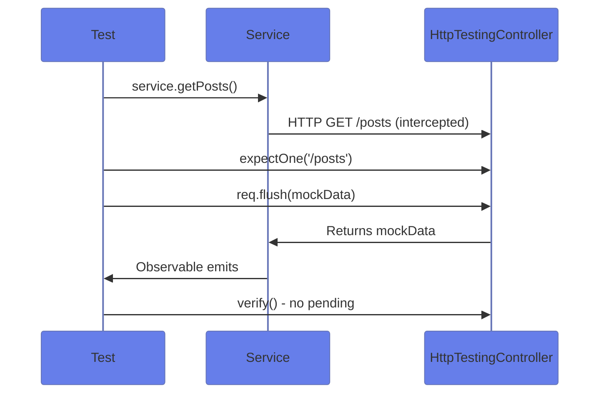
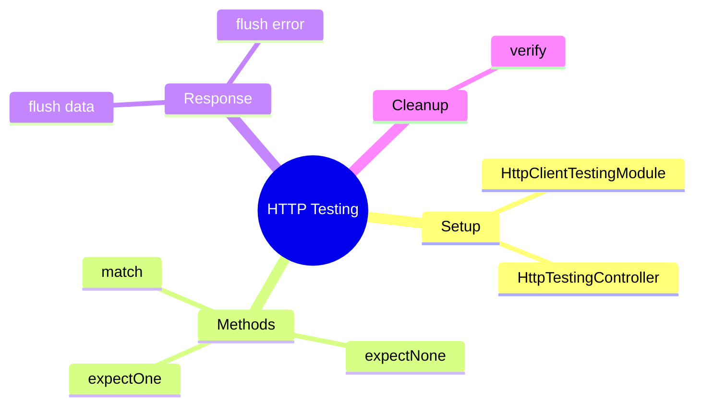

# 🌐 Use Case 5: HTTP Testing

> **💡 Lightbulb Moment**: `HttpTestingController` intercepts all HTTP requests in tests. You control exactly what the "server" returns!

---

## 1. 🔍 How It Works



---

## 2. 🚀 Implementation

### Setup

```typescript
beforeEach(() => {
    TestBed.configureTestingModule({
        imports: [HttpClientTestingModule]
    });
    service = TestBed.inject(ApiService);
    httpMock = TestBed.inject(HttpTestingController);
});

afterEach(() => {
    httpMock.verify();  // Fail if requests pending
});
```

### Test GET Request

```typescript
it('should fetch data', () => {
    service.getData().subscribe(data => {
        expect(data).toEqual(mockData);
    });
    
    const req = httpMock.expectOne('/api/data');
    expect(req.request.method).toBe('GET');
    req.flush(mockData);
});
```

### Test Error Handling

```typescript
it('should handle 404', () => {
    service.getData().subscribe({
        error: (err) => expect(err.message).toContain('404')
    });
    
    httpMock.expectOne('/api/data')
        .flush('Not found', { status: 404, statusText: 'Not Found' });
});
```

---

## 3. 🐛 Common Pitfalls

| ❌ Wrong | ✅ Right |
|----------|----------|
| Forgetting `httpMock.verify()` | Always verify in `afterEach` |
| Not subscribing to Observable | Must subscribe before `expectOne` |
| Wrong URL in expectOne | Match exact URL or use function |

---

### 📦 Data Flow Summary (Visual Box Diagram)

```
┌─────────────────────────────────────────────────────────────┐
│  HTTP TESTING: MOCK YOUR SERVER                             │
│                                                             │
│   SETUP:                                                    │
│   ┌───────────────────────────────────────────────────────┐ │
│   │ TestBed.configureTestingModule({                      │ │
│   │   imports: [HttpClientTestingModule]                  │ │
│   │ });                                                   │ │
│   │ httpMock = TestBed.inject(HttpTestingController);     │ │
│   │                                                       │ │
│   │ afterEach: httpMock.verify();  // ⚠️ CRITICAL!        │ │
│   └───────────────────────────────────────────────────────┘ │
│                                                             │
│   TEST FLOW:                                                │
│   ┌───────────────────────────────────────────────────────┐ │
│   │ // 1. Trigger HTTP request                            │ │
│   │ service.getData().subscribe(data => {                 │ │
│   │   expect(data).toEqual(mockData);                     │ │
│   │ });                                                   │ │
│   │                                                       │ │
│   │ // 2. Intercept and respond                           │ │
│   │ const req = httpMock.expectOne('/api/data');          │ │
│   │ expect(req.request.method).toBe('GET');               │ │
│   │ req.flush(mockData);  // Return mock response         │ │
│   └───────────────────────────────────────────────────────┘ │
│                                                             │
│   TEST ERRORS:                                              │
│   req.flush('Not found', { status: 404, statusText: 'Not Found' });│
└─────────────────────────────────────────────────────────────┘
```

> **Key Takeaway**: HttpTestingController intercepts ALL requests. expectOne + flush = mock response. Always verify() in afterEach!

---

## ❓ Interview Questions (25+)

**Q1: What is HttpTestingController?**
> A: Testing utility that intercepts HTTP requests for controlled testing.

**Q2: How to set up HTTP testing?**
> A: Import `HttpClientTestingModule`, inject `HttpTestingController`.

**Q3: What does expectOne() do?**
> A: Expects exactly one matching request, returns TestRequest to control.

**Q4: What's the difference between expectOne and match?**
> A: `expectOne` expects 1 request; `match` returns array of all matching.

**Q5: What does flush() do in HTTP testing?**
> A: Simulates server response with provided data.

**Q6: Why call verify() in afterEach?**
> A: Ensures no unexpected/pending HTTP requests - catches forgotten mocks.

**Q7: How to test HTTP error responses?**
> A: `req.flush(errorMsg, { status: 404, statusText: 'Not Found' })`.

**Q8: How to match request by URL pattern?**
> A: `expectOne(req => req.url.includes('/api/'))`.

**Q9: What if you forget to subscribe?**
> A: Request never fires - expectOne() fails.

**Q10: How to verify request method?**
> A: `expect(req.request.method).toBe('POST')`.

**Q11: How to verify request headers?**
> A: `expect(req.request.headers.get('Auth')).toBe('token')`.

**Q12: How to verify request body?**
> A: `expect(req.request.body).toEqual({name: 'test'})`.

**Q13: How to test multiple requests?**
> A: Call `expectOne()` for each, or use `match()`.

**Q14: What's expectNone()?**
> A: Asserts NO request was made to URL - useful for caching tests.

**Q15: Can you test interceptors?**
> A: Yes - verify modified requests/responses through HttpTestingController.

**Q16: How to test request with query params?**
> A: Match full URL with params or check `req.request.params`.

**Q17: How to test timeout errors?**
> A: `req.flush(null, { status: 0, statusText: 'Unknown Error' })`.

**Q18: How to test retry logic?**
> A: Flush errors multiple times, then success - verify retry count.

**Q19: What if multiple requests to same URL?**
> A: Use callback in `expectOne()` to distinguish or handle in order.

**Q20: How to test network failure?**
> A: `req.error(new ErrorEvent('Network error'))`.

**Q21: Can you use real HTTP in tests?**
> A: No - HttpClientTestingModule blocks real HTTP.

**Q22: How to test request cancellation?**
> A: Unsubscribe before flush, verify() should pass.

**Q23: How to test concurrent requests?**
> A: Store multiple `expectOne()` results, flush in desired order.

**Q24: Should you mock HttpClient directly?**
> A: No - use HttpTestingController for proper HTTP testing.

**Q25: How to test download progress?**
> A: Use `flush()` with `reportProgress: true`, emit progress events.

---

## 🧠 Mind Map



