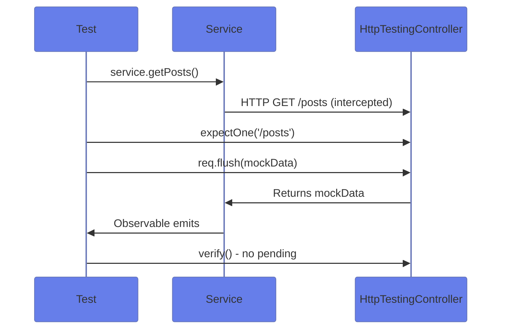
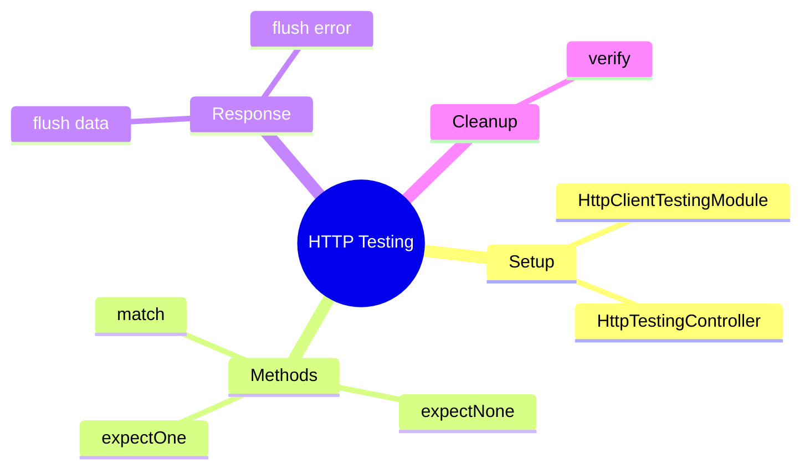

# 🌐 Use Case 5: HTTP Testing

> **💡 Lightbulb Moment**: `HttpTestingController` intercepts all HTTP requests in tests. You control exactly what the "server" returns!

---

## 1. 🔍 How It Works



---

## 2. 🚀 Implementation

### Setup

```typescript
beforeEach(() => {
    TestBed.configureTestingModule({
        imports: [HttpClientTestingModule]
    });
    service = TestBed.inject(ApiService);
    httpMock = TestBed.inject(HttpTestingController);
});

afterEach(() => {
    httpMock.verify();  // Fail if requests pending
});
```

### Test GET Request

```typescript
it('should fetch data', () => {
    service.getData().subscribe(data => {
        expect(data).toEqual(mockData);
    });
    
    const req = httpMock.expectOne('/api/data');
    expect(req.request.method).toBe('GET');
    req.flush(mockData);
});
```

### Test Error Handling

```typescript
it('should handle 404', () => {
    service.getData().subscribe({
        error: (err) => expect(err.message).toContain('404')
    });
    
    httpMock.expectOne('/api/data')
        .flush('Not found', { status: 404, statusText: 'Not Found' });
});
```

---

## 3. 🐛 Common Pitfalls

| ❌ Wrong | ✅ Right |
|----------|----------|
| Forgetting `httpMock.verify()` | Always verify in `afterEach` |
| Not subscribing to Observable | Must subscribe before `expectOne` |
| Wrong URL in expectOne | Match exact URL or use function |

---

### 📦 Data Flow Summary (Visual Box Diagram)

```
┌─────────────────────────────────────────────────────────────┐
│  HTTP TESTING: MOCK YOUR SERVER                             │
│                                                             │
│   SETUP:                                                    │
│   ┌───────────────────────────────────────────────────────┐ │
│   │ TestBed.configureTestingModule({                      │ │
│   │   imports: [HttpClientTestingModule]                  │ │
│   │ });                                                   │ │
│   │ httpMock = TestBed.inject(HttpTestingController);     │ │
│   │                                                       │ │
│   │ afterEach: httpMock.verify();  // ⚠️ CRITICAL!        │ │
│   └───────────────────────────────────────────────────────┘ │
│                                                             │
│   TEST FLOW:                                                │
│   ┌───────────────────────────────────────────────────────┐ │
│   │ // 1. Trigger HTTP request                            │ │
│   │ service.getData().subscribe(data => {                 │ │
│   │   expect(data).toEqual(mockData);                     │ │
│   │ });                                                   │ │
│   │                                                       │ │
│   │ // 2. Intercept and respond                           │ │
│   │ const req = httpMock.expectOne('/api/data');          │ │
│   │ expect(req.request.method).toBe('GET');               │ │
│   │ req.flush(mockData);  // Return mock response         │ │
│   └───────────────────────────────────────────────────────┘ │
│                                                             │
│   TEST ERRORS:                                              │
│   req.flush('Not found', { status: 404, statusText: 'Not Found' });│
└─────────────────────────────────────────────────────────────┘
```

> **Key Takeaway**: HttpTestingController intercepts ALL requests. expectOne + flush = mock response. Always verify() in afterEach!

---

## 🧠 Mind Map


