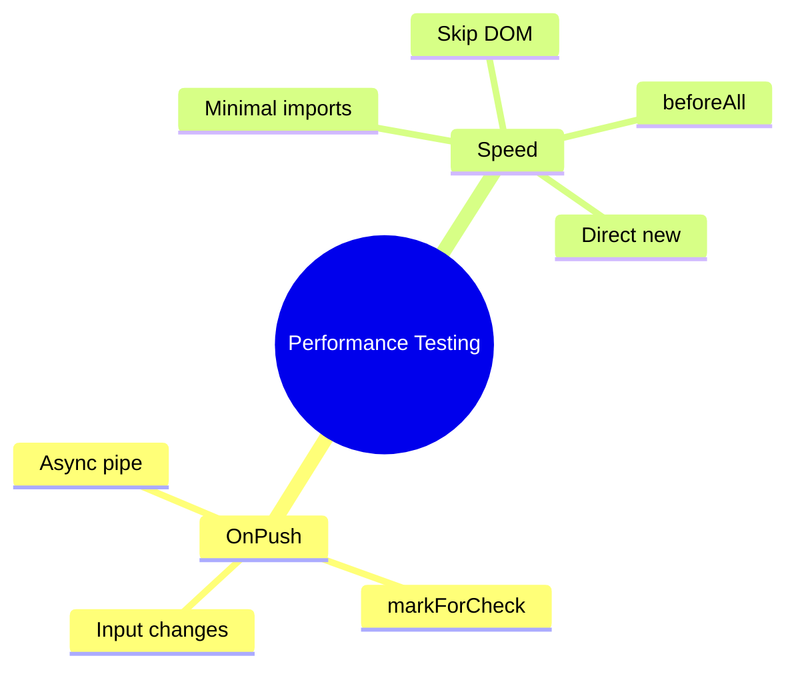

# ⚡ Use Case 6: Performance-Aware Testing

> **💡 Lightbulb Moment**: Fast tests = faster feedback loop. Optimize your test suite like you optimize your app!

---

## 1. 🎯 Key Optimizations

| Technique | Impact |
|-----------|--------|
| Minimal TestBed imports | 🟢 High |
| Logic-only tests (skip DOM) | 🟢 High |
| beforeAll for shared config | 🟡 Medium |
| Direct instantiation | 🟢 High |
| Skip detectChanges when possible | 🟡 Medium |

---

## 2. 🚀 Testing OnPush Components

```mermaid
%%{init: {'theme': 'base', 'themeVariables': { 'primaryColor': '#667eea'}}}%%
flowchart TD
    A[Internal mutation] -->|OnPush| B[DOM NOT updated]
    C[@Input change] -->|OnPush| D[DOM updated ✓]
    E[markForCheck] -->|OnPush| F[DOM updated ✓]
    
    style B fill:#ef4444,color:#fff
    style D fill:#10b981,color:#fff
    style F fill:#10b981,color:#fff
```

### Trigger CD for OnPush:

```typescript
// Method 1: Change input reference
fixture.componentRef.setInput('data', newData);

// Method 2: Manual markForCheck
fixture.componentRef.changeDetectorRef.markForCheck();
fixture.detectChanges();
```

---

## 3. ⚡ Speed Patterns

### Minimal TestBed
```typescript
// ✅ Fast
imports: [ComponentUnderTest]

// ❌ Slow - loads everything
imports: [AppModule]
```

### Logic-Only Tests
```typescript
it('tests logic without DOM', () => {
    component.updateValue(5);
    expect(component.value).toBe(5);
    // No fixture.detectChanges()!
    // No DOM queries!
});
```

### Direct Instantiation
```typescript
const service = new MyService();  // No TestBed!
```

---

## 🧠 Mind Map


