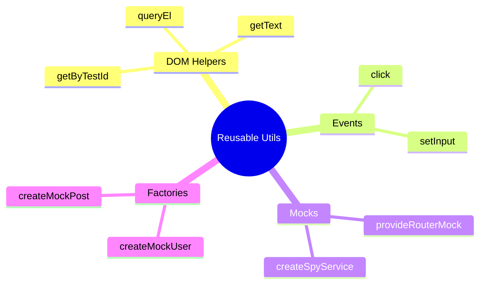

# 🔧 Use Case 7: Reusable Testing Utilities


*DRY testing: DOM helpers, event helpers, mock providers, and data factories reducing code by 75%*

> **💡 Lightbulb Moment**: Write helpers once, use everywhere. DRY applies to tests too!

---

## 1. 🎯 Utility Categories

| Category | Purpose | Example |
|----------|---------|---------|
| **DOM Helpers** | Query elements | `getByTestId(fixture, 'btn')` |
| **Event Helpers** | Simulate actions | `click(fixture, 'button')` |
| **Mock Providers** | Inject mocks | `provideRouterMock()` |
| **Data Factories** | Generate test data | `createMockUser()` |

---

## 2. 🚀 Examples

### DOM Helpers

```typescript
// Before (repetitive)
const el = fixture.debugElement.query(By.css('[data-testid="submit"]'));

// After (DRY)
const el = getByTestId(fixture, 'submit');
```

### Data Factories

```typescript
// Factory with overrides
const user = createMockUser({ role: 'admin' });
const users = createMockUsers(10);
```

### Mock Provider Bundles

```typescript
providers: [
    ...provideRoutingMocks({ params: { id: '123' } })
]
```

---

## 3.1 🔧 Helper Categories Deep Dive

### DOM Helpers

**Purpose:** Simplify element querying and interaction

```typescript
// test-helpers.ts
export function getByTestId(
    fixture: ComponentFixture<any>,
    testId: string
): DebugElement {
    return fixture.debugElement.query(
        By.css(`[data-testid="${testId}"]`)
    );
}

export function getAllByTestId(
    fixture: ComponentFixture<any>,
    testId: string
): DebugElement[] {
    return fixture.debugElement.queryAll(
        By.css(`[data-testid="${testId}"]`)
    );
}

export function getText(element: DebugElement): string {
    return element.nativeElement.textContent.trim();
}

// Usage:
const button = getByTestId(fixture, 'submit-btn');
expect(getText(button)).toBe('Submit');
```

**Benefits:**
- Less code duplication
- Easier to read tests
- Consistent querying strategy

---

### Event Helpers

**Purpose:** Simulate user interactions

```typescript
// test-helpers.ts
export function click(
    fixture: ComponentFixture<any>,
    testId: string
): void {
    const element = getByTestId(fixture, testId);
    element.triggerEventHandler('click', null);
    fixture.detectChanges();
}

export function setInputValue(
    fixture: ComponentFixture<any>,
    testId: string,
    value: string
): void {
    const input = getByTestId(fixture, testId);
    input.nativeElement.value = value;
    input.triggerEventHandler('input', { target: { value } });
    fixture.detectChanges();
}

// Usage:
click(fixture, 'submit-btn');
setInputValue(fixture, 'email-input', 'test@example.com');
```

---

### Mock Providers

**Purpose:** Reusable service mocks

```typescript
// mock-providers.ts
export function provideAuthServiceMock(
    overrides?: Partial<AuthService>
) {
    const mockAuthService = jasmine.createSpyObj('AuthService', [
        'login',
        'logout',
        'isAuthenticated'
    ]);
    
    // Default behavior
    mockAuthService.isAuthenticated.and.returnValue(true);
    
    // Apply overrides
    Object.assign(mockAuthService, overrides);
    
    return {
        provide: AuthService,
        useValue: mockAuthService
    };
}

// Usage:
providers: [
    provideAuthServiceMock({ isAuthenticated: () => false })
]
```

---

### Data Factories

**Purpose:** Generate consistent test data

```typescript
// data-factories.ts
let userId = 1;

export function createMockUser(overrides?: Partial<User>): User {
    return {
        id: userId++,
        name: 'Test User',
        email: 'test@example.com',
        role: 'user',
        ...overrides
    };
}

export function createMockUsers(count: number): User[] {
    return Array.from({ length: count }, () => createMockUser());
}

// Usage:
const admin = createMockUser({ role: 'admin' });
const users = createMockUsers(10);
```

---

## 3.2 📁 Recommended Structure

```
src/
├── app/
│   └── ...
└── testing/
    ├── index.ts              # Re-export all
    ├── helpers/
    │   ├── dom-helpers.ts    # getByTestId, click, etc.
    │   └── event-helpers.ts  # User interaction helpers
    ├── mocks/
    │   ├── auth.mock.ts      # Auth service mocks
    │   ├── router.mock.ts    # Router mocks
    │   └── http.mock.ts      # HTTP mocks
    └── factories/
        ├── user.factory.ts   # User data
        └── post.factory.ts   # Post data
```

**Import pattern:**
```typescript
import {
    getByTestId,
    click,
    createMockUser,
    provideAuthServiceMock
} from '@testing';
```

---

## 3.3 🎯 Real-World Examples

### Example 1: Login Form Test

**Before (repetitive):**
```typescript
it('should login', () => {
    const emailInput = fixture.debugElement.query(
        By.css('[data-testid="email"]')
    );
    emailInput.nativeElement.value = 'test@example.com';
    emailInput.triggerEventHandler('input', ...);
    
    const passwordInput = fixture.debugElement.query(
        By.css('[data-testid="password"]')
    );
    passwordInput.nativeElement.value = 'password123';
    passwordInput.triggerEventHandler('input', ...);
    
    const submitBtn = fixture.debugElement.query(
        By.css('[data-testid="submit"]')
    );
    submitBtn.triggerEventHandler('click', null);
    fixture.detectChanges();
});
```

**After (DRY):**
```typescript
it('should login', () => {
    setInputValue(fixture, 'email', 'test@example.com');
    setInputValue(fixture, 'password', 'password123');
    click(fixture, 'submit');
});
```

**Lines saved:** 17 → 4 (75% reduction!)

---

### Example 2: API Service Test

**Before:**
```typescript
let mockAuthService: jasmine.SpyObj<AuthService>;

beforeEach(() => {
    mockAuthService = jasmine.createSpyObj('AuthService', ['login']);
    mockAuthService.login.and.returnValue(of({ token: 'abc' }));
    
    TestBed.configureTestingModule({
        providers: [
            { provide: AuthService, useValue: mockAuthService }
        ]
    });
});
```

**After:**
```typescript
beforeEach(() => {
    TestBed.configureTestingModule({
        providers: [
            provideAuthServiceMock({
                login: () => of({ token: 'abc' })
            })
        ]
    });
});
```

---

## 3.4 🧠 Best Practices

### DO ✅

1. **Create helpers for repeated patterns**
   ```typescript
   // If you write the same code 3+ times, make a helper
   ```

2. **Use descriptive names**
   ```typescript
   // Good
   getByTestId(fixture, 'submit-btn')
   
   // Bad
   get(fixture, 'submit-btn')  // Too generic
   ```

3. **Make helpers composable**
   ```typescript
   export function fillLoginForm(fixture, email, password) {
       setInputValue(fixture, 'email', email);
       setInputValue(fixture, 'password', password);
   }
   ```

4. **Document your helpers**
   ```typescript
   /**
    * Gets element by data-testid attribute
    * @param fixture Component fixture
    * @param testId The data-testid value
    * @returns DebugElement
    */
   export function getByTestId(...) { }
   ```

---

### DON'T ❌

1. **Don't over-abstract**
   ```typescript
   // Bad: Too clever
   export function doEverything(fixture, config) { }
   
   // Good: Simple, focused
   export function click(fixture, testId) { }
   ```

2. **Don't hide important logic**
   ```typescript
   // Bad: Hides what's being tested
   export function testUserFlow(fixture) {
       // 50 lines of hidden test logic
   }
   ```

3. **Don't create helpers for one-off cases**
   ```typescript
   // If used only once, inline it
   ```

---

## 3.5 🎯 Decision Tree

```
Should I create a helper?
│
├─ Used 3+ times?
│  └─ YES → Create helper
│
├─ Complex/repetitive code?
│  └─ YES → Create helper
│
├─ Improves readability?
│  └─ YES → Create helper
│
└─ Used once/twice?
   └─ NO → Keep inline
```

---

## 3. 📁 Structure

```
testing-utils/
├── index.ts           # Re-exports all
├── test-helpers.ts    # DOM/event helpers
├── mock-providers.ts  # Reusable mocks
└── data-factories.ts  # Test data
```

---

### 📦 Data Flow Summary (Visual Box Diagram)

```
┌─────────────────────────────────────────────────────────────┐
│  REUSABLE TESTING UTILITIES                                 │
│                                                             │
│   STRUCTURE:                                                │
│   ┌───────────────────────────────────────────────────────┐ │
│   │ testing-utils/                                        │ │
│   │ ├── index.ts           // Re-exports all              │ │
│   │ ├── test-helpers.ts    // DOM/event helpers           │ │
│   │ ├── mock-providers.ts  // Reusable mocks              │ │
│   │ └── data-factories.ts  // Test data generators        │ │
│   └───────────────────────────────────────────────────────┘ │
│                                                             │
│   DOM HELPERS:                                              │
│   ┌───────────────────────────────────────────────────────┐ │
│   │ // Before (repetitive)                                │ │
│   │ fixture.debugElement.query(By.css('[data-testid="x"]'))│
│   │                                                       │ │
│   │ // After (DRY)                                        │ │
│   │ getByTestId(fixture, 'x');                            │ │
│   └───────────────────────────────────────────────────────┘ │
│                                                             │
│   DATA FACTORIES:                                           │
│   ┌───────────────────────────────────────────────────────┐ │
│   │ const user = createMockUser({ role: 'admin' });       │ │
│   │ const users = createMockUsers(10);                    │ │
│   └───────────────────────────────────────────────────────┘ │
│                                                             │
│   MOCK PROVIDERS:                                           │
│   providers: [...provideRoutingMocks({ params: { id: '1' } })]│
└─────────────────────────────────────────────────────────────┘
```

> **Key Takeaway**: DRY applies to tests too! Create helpers for DOM queries, mock providers, and data factories. Write once, use everywhere!

---

## 🧠 Mind Map


