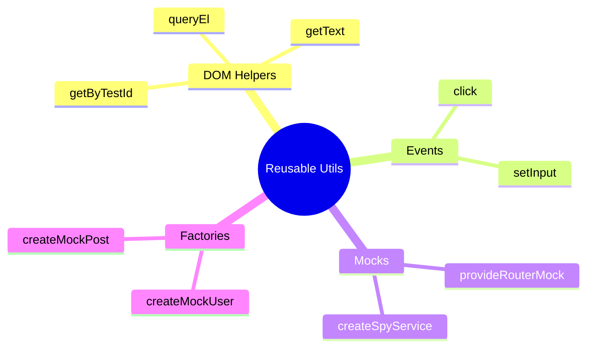

# 🔧 Use Case 7: Reusable Testing Utilities

> **💡 Lightbulb Moment**: Write helpers once, use everywhere. DRY applies to tests too!

---

## 1. 🎯 Utility Categories

| Category | Purpose | Example |
|----------|---------|---------|
| **DOM Helpers** | Query elements | `getByTestId(fixture, 'btn')` |
| **Event Helpers** | Simulate actions | `click(fixture, 'button')` |
| **Mock Providers** | Inject mocks | `provideRouterMock()` |
| **Data Factories** | Generate test data | `createMockUser()` |

---

## 2. 🚀 Examples

### DOM Helpers

```typescript
// Before (repetitive)
const el = fixture.debugElement.query(By.css('[data-testid="submit"]'));

// After (DRY)
const el = getByTestId(fixture, 'submit');
```

### Data Factories

```typescript
// Factory with overrides
const user = createMockUser({ role: 'admin' });
const users = createMockUsers(10);
```

### Mock Provider Bundles

```typescript
providers: [
    ...provideRoutingMocks({ params: { id: '123' } })
]
```

---

## 3. 📁 Structure

```
testing-utils/
├── index.ts           # Re-exports all
├── test-helpers.ts    # DOM/event helpers
├── mock-providers.ts  # Reusable mocks
└── data-factories.ts  # Test data
```

---

### 📦 Data Flow Summary (Visual Box Diagram)

```
┌─────────────────────────────────────────────────────────────┐
│  REUSABLE TESTING UTILITIES                                 │
│                                                             │
│   STRUCTURE:                                                │
│   ┌───────────────────────────────────────────────────────┐ │
│   │ testing-utils/                                        │ │
│   │ ├── index.ts           // Re-exports all              │ │
│   │ ├── test-helpers.ts    // DOM/event helpers           │ │
│   │ ├── mock-providers.ts  // Reusable mocks              │ │
│   │ └── data-factories.ts  // Test data generators        │ │
│   └───────────────────────────────────────────────────────┘ │
│                                                             │
│   DOM HELPERS:                                              │
│   ┌───────────────────────────────────────────────────────┐ │
│   │ // Before (repetitive)                                │ │
│   │ fixture.debugElement.query(By.css('[data-testid="x"]'))│
│   │                                                       │ │
│   │ // After (DRY)                                        │ │
│   │ getByTestId(fixture, 'x');                            │ │
│   └───────────────────────────────────────────────────────┘ │
│                                                             │
│   DATA FACTORIES:                                           │
│   ┌───────────────────────────────────────────────────────┐ │
│   │ const user = createMockUser({ role: 'admin' });       │ │
│   │ const users = createMockUsers(10);                    │ │
│   └───────────────────────────────────────────────────────┘ │
│                                                             │
│   MOCK PROVIDERS:                                           │
│   providers: [...provideRoutingMocks({ params: { id: '1' } })]│
└─────────────────────────────────────────────────────────────┘
```

> **Key Takeaway**: DRY applies to tests too! Create helpers for DOM queries, mock providers, and data factories. Write once, use everywhere!

---

## 🧠 Mind Map


