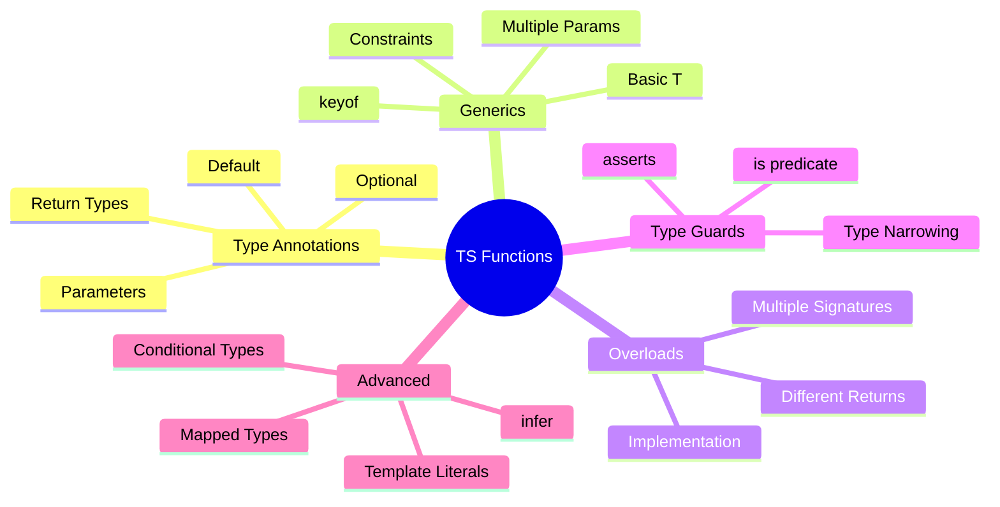

# 🎯 Advanced Function Types in TypeScript

> **💡 Lightbulb Moment**: TypeScript's type system makes functions predictable and self-documenting - catch errors before runtime!


## 📋 Table of Contents
- [1. 📋 Function Type Annotations](#1--function-type-annotations)
  - [1.1 Basic Function Types](#11-basic-function-types)
  - [1.2 Optional and Default Parameters](#12-optional-and-default-parameters)
- [2. 🚀 Generic Functions](#2--generic-functions)
  - [2.1 Basic Generics](#21-basic-generics)
  - [2.2 Multiple Type Parameters](#22-multiple-type-parameters)
  - [2.3 Generic Constraints](#23-generic-constraints)
- [3. 🎭 Function Overloads](#3--function-overloads)
  - [3.1 Basic Overloads](#31-basic-overloads)
  - [3.2 Complex Overloads](#32-complex-overloads)
- [4. 🛡️ Type Guards & Type Predicates](#4--type-guards--type-predicates)
  - [4.1 Type Predicate Functions](#41-type-predicate-functions)
  - [4.2 Assertion Functions](#42-assertion-functions)
- [5. 🔧 Advanced Patterns](#5--advanced-patterns)
  - [5.1 Conditional Return Types](#51-conditional-return-types)
  - [5.2 Generic HOF](#52-generic-hof)
  - [5.3 Curry with Types](#53-curry-with-types)
  - [5.4 Builder Pattern with Fluent API](#54-builder-pattern-with-fluent-api)
- [6. 🌍 Real-World Examples](#6--real-world-examples)
  - [Example 1: Type-Safe Event Emitter](#example-1-type-safe-event-emitter)
  - [Example 2: Type-Safe API Client](#example-2-type-safe-api-client)
- [❓ Interview Questions (25+)](#interview-questions-25)
  - [Basic Type Questions](#basic-type-questions)
  - [Generic Questions](#generic-questions)
  - [Overload Questions](#overload-questions)
  - [Type Guard Questions](#type-guard-questions)
  - [Advanced Pattern Questions](#advanced-pattern-questions)
- [🧠 Mind Map](#mind-map)

---
---

## 1. 📋 Function Type Annotations

### 1.1 Basic Function Types

```typescript
// Function type annotation
function add(a: number, b: number): number {
  return a + b;
}

// Function type alias
type MathOperation = (a: number, b: number) => number;

const subtract: MathOperation = (a, b) => a - b;

// Interface for functions
interface Validator {
  (value: string): boolean;
}

const isEmail: Validator = (value) => value.includes('@');
```

---

### 1.2 Optional and Default Parameters

```typescript
function greet(name: string, greeting?: string): string {
  return `${greeting || 'Hello'}, ${name}!`;
}

// Default parameters
function createUser(name: string, role: string = 'user'): User {
  return { name, role };
}

// Optional with type guard
function process(value?: number): number {
  return value ?? 0; // Nullish coalescing
}
```

---

## 2. 🚀 Generic Functions

### 2.1 Basic Generics

```typescript
// Generic identity function
function identity<T>(value: T): T {
  return value;
}

identity<number>(5);        // Type: number
identity<string>('hello');  // Type: string
identity(true);             // Type inferred: boolean

// Generic with constraints
function getProperty<T, K extends keyof T>(obj: T, key: K): T[K] {
  return obj[key];
}

const person = { name: 'Alice', age: 30 };
getProperty(person, 'name'); // OK: string
getProperty(person, 'invalid'); // Error!
```

---

### 2.2 Multiple Type Parameters

```typescript
function pair<T, U>(first: T, second: U): [T, U] {
  return [first, second];
}

pair<string, number>('age', 30); // [string, number]
pair('hello', true);  // Inferred: [string, boolean]

// Generic with complex constraints
function merge<T extends object, U extends object>(
  obj1: T,
  obj2: U
): T & U {
  return { ...obj1, ...obj2 };
}

const merged = merge({ name: 'Alice' }, { age: 30 });
// Type: { name: string } & { age: number }
```

---

### 2.3 Generic Constraints

```typescript
// Constraint: must have length property
interface HasLength {
  length: number;
}

function logLength<T extends HasLength>(item: T): void {
  console.log(item.length);
}

logLength('hello');      // OK: string has length
logLength([1, 2, 3]);    // OK: array has length
logLength({ length: 5 }); // OK: object has length
logLength(42); // Error: number doesn't have length

// Multiple constraints
function copyFields<T extends { id: number }, U extends { name: string }>(
  source: T,
  target: U
): T & U {
  return { ...source, ...target };
}
```

---

## 3. 🎭 Function Overloads

### 3.1 Basic Overloads

```typescript
// Overload signatures
function format(value: string): string;
function format(value: number): string;
function format(value: boolean): string;

// Implementation signature
function format(value: string | number | boolean): string {
  if (typeof value === 'string') return value.toUpperCase();
  if (typeof value === 'number') return value.toFixed(2);
  return value ? 'YES' : 'NO';
}

format('hello');  // "HELLO"
format(42.5);     // "42.50"
format(true);     // "YES"
```

---

### 3.2 Complex Overloads

```typescript
// Different return types based on parameters
function get(id: number): User;
function get(email: string): User;
function get(criteria: SearchCriteria): User[];

function get(param: number | string | SearchCriteria): User | User[] {
  if (typeof param === 'number') {
    return database.getUserById(param);
  }
  if (typeof param === 'string') {
    return database.getUserByEmail(param);
  }
  return database.searchUsers(param);
}

// Usage
const user1 = get(1);                    // Type: User
const user2 = get('alice@test.com');     // Type: User
const users = get({ role: 'admin' });    // Type: User[]
```

---

## 4. 🛡️ Type Guards & Type Predicates

### 4.1 Type Predicate Functions

```typescript
// Type guard with predicate
function isString(value: unknown): value is string {
  return typeof value === 'string';
}

function processValue(value: string | number) {
  if (isString(value)) {
    console.log(value.toUpperCase()); // Type: string
  } else {
    console.log(value.toFixed(2));     // Type: number
  }
}

// Complex type guards
interface Cat {
  meow(): void;
}

interface Dog {
  bark(): void;
}

function isCat(animal: Cat | Dog): animal is Cat {
  return (animal as Cat).meow !== undefined;
}

function speak(animal: Cat | Dog) {
  if (isCat(animal)) {
    animal.meow(); // Type narrowed to Cat
  } else {
    animal.bark(); // Type narrowed to Dog
  }
}
```

---

### 4.2 Assertion Functions

```typescript
// Assertion function (throws if false)
function assertIsString(value: unknown): asserts value is string {
  if (typeof value !== 'string') {
    throw new Error('Not a string!');
  }
}

function process(value: unknown) {
  assertIsString(value);
  console.log(value.toUpperCase()); // OK: value is string
}

// Assertion with conditional
function assertNonNull<T>(value: T): asserts value is NonNullable<T> {
  if (value === null || value === undefined) {
    throw new Error('Value is null or undefined');
  }
}
```

---

## 5. 🔧 Advanced Patterns

### 5.1 Conditional Return Types

```typescript
type ArrayOrSingle<T, IsArray extends boolean> = 
  IsArray extends true ? T[] : T;

function getValue<T, IsArray extends boolean = false>(
  value: T,
  asArray?: IsArray
): ArrayOrSingle<T, IsArray> {
  return (asArray ? [value] : value) as ArrayOrSingle<T, IsArray>;
}

const single = getValue(5);        // Type: number
const array = getValue(5, true);   // Type: number[]
```

---

### 5.2 Generic HOF

```typescript
// Generic map function
function map<T, U>(
  arr: T[],
  fn: (item: T, index: number) => U
): U[] {
  return arr.map(fn);
}

const numbers = [1, 2, 3];
const strings = map(numbers, n => n.toString()); // string[]

// Generic filter with type guard
function filter<T, U extends T>(
  arr: T[],
  predicate: (item: T) => item is U
): U[] {
  return arr.filter(predicate);
}

const mixed: (string | number)[] = [1, 'a', 2, 'b'];
const strings2 = filter(mixed, (x): x is string => typeof x === 'string');
// Type: string[]
```

---

### 5.3 Curry with Types

```typescript
// Typed curry
function curry<A, B, C>(
  fn: (a: A, b: B) => C
): (a: A) => (b: B) => C {
  return (a: A) => (b: B) => fn(a, b);
}

const add = (a: number, b: number) => a + b;
const curriedAdd = curry(add);

curriedAdd(5)(3); // Type: number

// Advanced curry with any arity
type Curry<T> = T extends (...args: infer Args) => infer Return
  ? Args extends [infer First, ...infer Rest]
    ? (arg: First) => Curry<(...args: Rest) => Return>
    : Return
  : never;
```

---

### 5.4 Builder Pattern with Fluent API

```typescript
class QueryBuilder<T> {
  private query: Partial<T> = {};
  
  where<K extends keyof T>(field: K, value: T[K]): this {
    this.query[field] = value;
    return this;
  }
  
  select<K extends keyof T>(...fields: K[]): Pick<T, K> {
    const result = {} as Pick<T, K>;
    fields.forEach(field => {
      if (this.query[field] !== undefined) {
        result[field] = this.query[field]!;
      }
    });
    return result;
  }
}

interface User {
  id: number;
  name: string;
  email: string;
}

const user = new QueryBuilder<User>()
  .where('id', 1)
  .where('name', 'Alice')
  .select('id', 'name'); // Type: Pick<User, 'id' | 'name'>
```

---

## 6. 🌍 Real-World Examples

### Example 1: Type-Safe Event Emitter

```typescript
type EventMap = {
  'user:login': { userId: number; timestamp: Date };
  'user:logout': { userId: number };
  'data:update': { id: string; data: unknown };
};

class TypedEventEmitter<Events extends Record<string, any>> {
  private listeners = new Map<keyof Events, Function[]>();
  
  on<K extends keyof Events>(
    event: K,
    listener: (data: Events[K]) => void
  ): void {
    if (!this.listeners.has(event)) {
      this.listeners.set(event, []);
    }
    this.listeners.get(event)!.push(listener);
  }
  
  emit<K extends keyof Events>(event: K, data: Events[K]): void {
    const listeners = this.listeners.get(event) || [];
    listeners.forEach(listener => listener(data));
  }
}

const emitter = new TypedEventEmitter<EventMap>();

emitter.on('user:login', (data) => {
  console.log(data.userId, data.timestamp); // Fully typed!
});

emitter.emit('user:login', { 
  userId: 1, 
  timestamp: new Date() 
}); // Type-safe!

emitter.emit('user:login', { userId: 'wrong' }); // Error!
```

---

### Example 2: Type-Safe API Client

```typescript
type Endpoints = {
  '/users': { GET: User[]; POST: User };
  '/users/:id': { GET: User; PUT: User; DELETE: void };
  '/posts': { GET: Post[]; POST: Post };
};

class ApiClient<T extends Record<string, Record<string, any>>> {
  async request<
    Path extends keyof T,
    Method extends keyof T[Path]
  >(
    path: Path,
    method: Method,
    body?: any
  ): Promise<T[Path][Method]> {
    const response = await fetch(path as string, {
      method: method as string,
      body: body ? JSON.stringify(body) : undefined
    });
    return response.json();
  }
}

const api = new ApiClient<Endpoints>();

// Fully type-safe!
const users = await api.request('/users', 'GET');      // User[]
const user = await api.request('/users/:id', 'GET');   // User
await api.request('/users/:id', 'DELETE');             // void
```

---

## ❓ Interview Questions (25+)

### Basic Type Questions

**Q1: How do you type a function parameter?**
> A: `function fn(param: Type): ReturnType { }`.

**Q2: What's the difference between `:` and `=>` in function types?**
> A: `:` separates parameter from type; `=>` separates parameters from return type in type alias.

**Q3: How to make parameters optional?**
> A: Use `?`: `function fn(param?: string)` or provide default value.

**Q4: What is `void` return type?**
> A: Function returns nothing (undefined). Different from returning `undefined`.

**Q5: What's `never` return type?**
> A: Function never returns (throws error or infinite loop).

---

### Generic Questions

**Q6: What are generic functions?**
> A: Functions that work with multiple types using type parameters: `<T>`.

**Q7: How to constrain generic types?**
> A: Use `extends`: `<T extends Type>`.

**Q8: What is `keyof` operator?**
> A: Gets union of object's keys: `keyof { a: 1, b: 2 }` = `'a' | 'b'`.

**Q9: Can generics have default types?**
> A: Yes: `function fn<T = string>()`.

**Q10: What are generic constraints?**
> A: Limiting generic types to those with specific properties: `<T extends { length: number }>`.

---

### Overload Questions

**Q11: What are function overloads?**
> A: Multiple function signatures with different parameter/return types for one implementation.

**Q12: How many overload signatures can you have?**
> A: Unlimited, but only one implementation signature.

**Q13: Which signature is used at runtime?**
> A: Only the implementation signature - overload signatures are compile-time only.

**Q14: Can overloads have different return types?**
> A: Yes - that's a common use case.

**Q15: What's the order of overload signatures?**
> A: Most specific first, general last.

---

### Type Guard Questions

**Q16: What is a type guard?**
> A: Function that narrows types: `value is Type`.

**Q17: What's the difference between type guard and assertion?**
> A: Guard returns boolean and narrows; assertion throws if false using `asserts`.

**Q18: Can type guards return non-boolean?**
> A: No - must return boolean when using `is` predicate.

**Q19: What is `as` keyword?**
> A: Type assertion (cast) - tells compiler to treat value as specific type.

**Q20: When to use type assertions?**
> A: When you know more than TypeScript about the type - use sparingly.

---

### Advanced Pattern Questions

**Q21: What is conditional return type?**
> A: Return type that changes based on generic parameters using conditional types.

**Q22: What is `infer` keyword?**
> A: Extracts types from conditional types: `T extends (arg: infer P) => any`.

**Q23: How to type HOF (Higher-Order Functions)?**
> A: Use generic function types: `fn<T, U>(fn: (x: T) => U)`.

**Q24: What are template literal types?**
> A: String types with patterns: `type EventName = \`on${Capitalize<string>}\``.

**Q25: How to implement type-safe curry?**
> A: Use recursive conditional types to infer parameter types progressively.

---

## 🧠 Mind Map


