# 📦 @ContentChild & @ContentChildren (Content Projection)

> **Goal**: Understand the difference between **View** and **Content**, and learn how to access projected components with `@ContentChild` and `@ContentChildren`.


## 📋 Table of Contents
- [1. 🔍 How It Works (The Concept)](#1--how-it-works-the-concept)
  - [The Mechanism](#the-mechanism)
  - [Default vs. Optimized Behavior](#default-vs-optimized-behavior)
  - [📊 Data Flow Diagram](#data-flow-diagram)
- [2. 🚀 Step-by-Step Implementation Guide](#2--step-by-step-implementation-guide)
  - [Step 1: Create a "Container" Component with `<ng-content>`](#step-1-create-a-container-component-with-ng-content)
  - [Step 2: Create the "Projected" Component (Header)](#step-2-create-the-projected-component-header)
  - [Step 3: The Consumer (Parent) Projects Content](#step-3-the-consumer-parent-projects-content)
  - [📊 Implementation Visualization](#implementation-visualization)
- [🎯 Understanding `<ng-content select="...">` In Detail](#understanding-ng-content-select-in-detail)
  - [What is `select`?](#what-is-select)
  - [📬 The Mail Sorting Analogy](#the-mail-sorting-analogy)
  - [How `<ng-content select="app-card-header">` Works](#how-ng-content-selectapp-card-header-works)
    - [Step 1: Parent (Consumer) Provides Content](#step-1-parent-consumer-provides-content)
    - [Step 2: Card Component Defines Slots](#step-2-card-component-defines-slots)
    - [Step 3: Angular "Sorts" Content Into Slots](#step-3-angular-sorts-content-into-slots)
  - [📊 Selector Options](#selector-options)
  - [🔄 Flow Diagram](#flow-diagram)
  - [⚠️ Critical Rules](#critical-rules)
- [3. 🚀 @ContentChildren - Querying Multiple Items](#3--contentchildren---querying-multiple-items)
  - [Common Patterns](#common-patterns)
    - [Collect Items](#collect-items)
    - [React to Changes](#react-to-changes)
- [4. 🐛 Common Pitfalls & Debugging](#4--common-pitfalls--debugging)
  - [❌ Using `@ViewChild` Instead of `@ContentChild`](#using-viewchild-instead-of-contentchild)
  - [❌ Using `ngAfterViewInit` Instead of `ngAfterContentInit`](#using-ngafterviewinit-instead-of-ngaftercontentinit)
  - [❌ Typo in Tag Name](#typo-in-tag-name)
- [5. ⚡ Performance & Architecture](#5--performance--architecture)
  - [Performance](#performance)
  - [Architecture: Composable Components](#architecture-composable-components)
- [6. 🌍 Real World Use Cases](#6--real-world-use-cases)
- [📮 Mailbag Analogy (Easy to Remember!)](#mailbag-analogy-easy-to-remember)
  - [📖 Story to Remember:](#story-to-remember)
  - [🎯 Quick Reference:](#quick-reference)
- [7. ❓ Interview & Concept Questions](#7--interview--concept-questions)
  - [Q1: What is the difference between `@ViewChild` and `@ContentChild`?](#q1-what-is-the-difference-between-viewchild-and-contentchild)
  - [Q2: What lifecycle hook should I use to access `@ContentChild`?](#q2-what-lifecycle-hook-should-i-use-to-access-contentchild)
  - [Q3: What is `<ng-content select="...">`?](#q3-what-is-ng-content-select)
  - [Q4: Can I have multiple `<ng-content>` without selectors?](#q4-can-i-have-multiple-ng-content-without-selectors)
  - [Q5: What is `@ContentChildren`?](#q5-what-is-contentchildren)
  - [Q6: What does the `descendants` option do?](#q6-what-does-the-descendants-option-do)
- [🧠 Mind Map](#mind-map)

---
---

## 1. 🔍 How It Works (The Concept)

### The Mechanism
**Content Projection** is like a "slot" system. A component can have `<ng-content>` placeholders. The *consumer* of that component can "project" (inject) their own content into those slots.
*   `@ViewChild`: Queries elements **written in your own template**.
*   `@ContentChild`: Queries **ONE projected element** from outside.
*   `@ContentChildren`: Queries **ALL projected elements** (returns QueryList).

### Default vs. Optimized Behavior
*   **Default (No Access)**: You use `<ng-content>` to display projected content, but you can't programmatically interact with it.
*   **Optimized (ContentChild/Children)**: You can now access the projected components, call their methods, read their properties.

### 📊 Data Flow Diagram


---

## 2. 🚀 Step-by-Step Implementation Guide

### Step 1: Create a "Container" Component with `<ng-content>`
This component receives content from outside.

```typescript
// card.component.ts
@Component({
  selector: 'app-card',
  template: `
    <div class="card">
      <!-- Slot for header content -->
      <ng-content select="app-card-header"></ng-content>
      <!-- Default slot for all other content -->
      <ng-content></ng-content>
    </div>
  `
})
export class CardComponent implements AfterContentInit {
  // 🛡️ CRITICAL: Use @ContentChild, not @ViewChild
  @ContentChild(CardHeaderComponent) header?: CardHeaderComponent;

  // 🛡️ CRITICAL: Use AfterContentInit, not AfterViewInit
  ngAfterContentInit() {
    console.log('Header title:', this.header?.title);
  }
}
```

### Step 2: Create the "Projected" Component (Header)

```typescript
// card-header.component.ts
@Component({
  selector: 'app-card-header',
  template: `<header>{{ title }}</header>`
})
export class CardHeaderComponent {
  @Input() title: string = '';
}
```

### Step 3: The Consumer (Parent) Projects Content

```html
<!-- parent.component.html -->
<app-card>
  <app-card-header title="User Profile"></app-card-header>
  <p>This is the card body content.</p>
</app-card>
```

### 📊 Implementation Visualization


---

## 🎯 Understanding `<ng-content select="...">` In Detail

### What is `select`?

The `select` attribute on `<ng-content>` creates **named slots** - specific "bins" that only accept content matching a CSS selector. This is called **Multi-Slot Content Projection**.

### 📬 The Mail Sorting Analogy

```
Without select:  📬 One big mailbox - all mail dumps in together
With select:     📮 Labeled bins - "Headers here", "Footers there", "Body elsewhere"
```

---

### How `<ng-content select="app-card-header">` Works

#### Step 1: Parent (Consumer) Provides Content

```html
<!-- parent.component.html -->
<app-card>
  <!-- ✅ This MATCHES selector "app-card-header" -->
  <app-card-header>Welcome to My App!</app-card-header>
  
  <!-- ✅ This MATCHES selector "app-card-footer" -->
  <app-card-footer>© 2024 Company</app-card-footer>
  
  <!-- ✅ This goes to DEFAULT slot (no selector) -->
  <p>This is body content that doesn't match any selector.</p>
</app-card>
```

#### Step 2: Card Component Defines Slots

```typescript
@Component({
  selector: 'app-card',
  template: `
    <div class="card">
      <div class="card-header">
        <!-- 🎯 SLOT 1: Only "app-card-header" elements go here! -->
        <ng-content select="app-card-header"></ng-content>
      </div>
      
      <div class="card-body">
        <!-- 🎯 SLOT 2: Default - catches everything that didn't match -->
        <ng-content></ng-content>
      </div>
      
      <div class="card-footer">
        <!-- 🎯 SLOT 3: Only "app-card-footer" elements go here! -->
        <ng-content select="app-card-footer"></ng-content>
      </div>
    </div>
  `
})
export class CardComponent {}
```

#### Step 3: Angular "Sorts" Content Into Slots

**Final Rendered HTML:**
```html
<div class="card">
  <div class="card-header">
    <!-- ← "Welcome to My App!" landed here -->
    <app-card-header>Welcome to My App!</app-card-header>
  </div>
  
  <div class="card-body">
    <!-- ← Body content landed here (default slot) -->
    <p>This is body content that doesn't match any selector.</p>
  </div>
  
  <div class="card-footer">
    <!-- ← "© 2024 Company" landed here -->
    <app-card-footer>© 2024 Company</app-card-footer>
  </div>
</div>
```

---

### 📊 Selector Options

| Selector Syntax | What It Matches | Example |
|----------------|-----------------|---------|
| `select="app-card-header"` | Element tag name | `<app-card-header>` |
| `select="[header]"` | Attribute selector | `<div header>` or `<h1 header>` |
| `select=".card-header"` | Class selector | `<div class="card-header">` |
| `select="h1, h2, h3"` | Multiple selectors | `<h1>`, `<h2>`, OR `<h3>` |
| `select="[slot='header']"` | Attribute value | `<div slot="header">` |
| `select=":not(app-footer)"` | Negation | Everything EXCEPT `<app-footer>` |

---

### 🔄 Flow Diagram

```mermaid
flowchart TD
    subgraph Parent["📄 Parent Template"]
        H["<app-card-header>Welcome!</app-card-header>"]
        B["<p>Body content</p>"]
        F["<app-card-footer>Footer</app-card-footer>"]
    end
    
    subgraph Card["📦 Card Component Template"]
        Slot1["ng-content select='app-card-header'"]
        Slot2["ng-content (default)"]
        Slot3["ng-content select='app-card-footer'"]
    end
    
    subgraph Rendered["✅ Final Rendered HTML"]
        R1["div.header → Welcome!"]
        R2["div.body → Body content"]
        R3["div.footer → Footer"]
    end
    
    H -->|"matches 'app-card-header'"| Slot1
    B -->|"no match → default"| Slot2
    F -->|"matches 'app-card-footer'"| Slot3
    
    Slot1 --> R1
    Slot2 --> R2
    Slot3 --> R3
    
    style Parent fill:#e3f2fd,stroke:#1976d2
    style Card fill:#fff3e0,stroke:#f57c00
    style Rendered fill:#e8f5e9,stroke:#388e3c
```



---

### ⚠️ Critical Rules

| Rule | Explanation |
|------|-------------|
| **Content is "consumed"** | Once matched, content won't appear in other slots |
| **Order matters** | Angular checks slots top-to-bottom |
| **Default slot = last resort** | `<ng-content>` without select catches leftovers |
| **No match = invisible!** | If no slot matches, content disappears |
| **Only ONE default slot** | Multiple `<ng-content>` without select = only first gets content |

---

## 3. 🚀 @ContentChildren - Querying Multiple Items

When you need ALL projected content matching a selector:

```typescript
// Parent usage:
<app-menu>
    <app-menu-item>Home</app-menu-item>
    <app-menu-item>About</app-menu-item>
    <app-menu-item>Contact</app-menu-item>
</app-menu>

// Menu component:
@Component({
    template: `<ng-content></ng-content>`
})
export class MenuComponent implements AfterContentInit {
    @ContentChildren(MenuItemComponent) items!: QueryList<MenuItemComponent>;
    
    ngAfterContentInit() {
        console.log('Menu items:', this.items.length);  // 3
    }
}
```

### Common Patterns

#### Collect Items
```typescript
@ContentChildren(TabComponent) tabs!: QueryList<TabComponent>;

ngAfterContentInit() {
    this.tabs.first?.activate();
}
```

#### React to Changes
```typescript
ngAfterContentInit() {
    this.items.changes.subscribe(() => {
        this.recalculateLayout();
    });
}
```

---

## 4. 🐛 Common Pitfalls & Debugging

### ❌ Using `@ViewChild` Instead of `@ContentChild`
**Bad Code (in CardComponent):**
```typescript
@ViewChild(CardHeaderComponent) header?: CardHeaderComponent; // ❌ Will be undefined!
```
**Why it fails:** `@ViewChild` only queries content defined *in your own template*. The header is projected FROM the parent, so you need `@ContentChild`.

### ❌ Using `ngAfterViewInit` Instead of `ngAfterContentInit`
**Bad Code:**
```typescript
ngAfterViewInit() {
  console.log(this.header?.title); // ❌ Might be undefined or stale!
}
```
**Fix:** Use `ngAfterContentInit`. Content is initialized *before* the view.

### ❌ Typo in Tag Name
```html
<!-- ❌ BAD: Typo! "headr" instead of "header" -->
<app-card>
  <app-card-headr>This DISAPPEARS!</app-card-headr>
</app-card>
```
Content vanishes because `app-card-headr` doesn't match `select="app-card-header"`!

---

## 5. ⚡ Performance & Architecture

### Performance
*   `@ContentChild` has the same low overhead as `@ViewChild`. It's just a query.
*   Be mindful of excessive re-projections in complex scenarios (e.g., `*ngFor` of projected content).

### Architecture: Composable Components
This is the core of **Composition over Inheritance**. You create small, reusable "container" components (`<app-card>`, `<app-modal>`, `<app-panel>`) and let consumers decide what goes inside.

---

## 6. 🌍 Real World Use Cases

1.  **Card/Panel Components**: A `<material-card>` that accepts a `<mat-card-header>` and `<mat-card-content>`.
2.  **Tabs**: A `<tabs>` container that accepts multiple `<tab>` children and reads their `label` properties.
3.  **Dialogs/Modals**: A `<modal>` that accepts a `<modal-header>`, `<modal-body>`, and `<modal-footer>`.

---

## 📮 Mailbag Analogy (Easy to Remember!)

Think of @ContentChild/@ContentChildren like **mail delivery**:

| Concept | Mail Analogy | Memory Trick |
|---------|-------------|--------------| 
| **@ViewChild** | 🏠 **Inside your house**: Things YOU put there | **"Own template"** |
| **@ContentChild** | 📬 **Mail slot**: ONE letter delivered to you | **"First match"** |
| **@ContentChildren** | 📮 **Full mailbag**: ALL letters delivered | **"All matches"** |
| **ng-content** | 🚪 **Mail slot opening**: Where stuff comes through | **"Slot container"** |
| **QueryList** | 📋 **Letter inventory**: List with count, first, last | **"Collection"** |
| **.changes** | 🔔 **New mail alert**: Notified when letters added | **"Subscribe"** |
| **descendants** | 📦 **Nested packages**: Check inside envelopes too | **"Deep query"** |

### 📖 Story to Remember:

> 📮 **The Post Office**
>
> Your component is a house with a mail slot:
>
> **Parent delivers mail:**
> ```html
> <app-menu>
>   <app-menu-item>Home</app-menu-item>     <!-- ✉️ Letter 1 -->
>   <app-menu-item>About</app-menu-item>    <!-- ✉️ Letter 2 -->
>   <app-menu-item>Contact</app-menu-item>  <!-- ✉️ Letter 3 -->
> </app-menu>
> ```
>
> **Collect the whole mailbag:**
> ```typescript
> @ContentChildren(MenuItemComponent) items!: QueryList<MenuItemComponent>;
> // 📮 Mailbag with 3 letters!
> 
> ngAfterContentInit() {
>   console.log('Letters:', this.items.length);  // 3
>   this.items.first?.highlight();  // 📋 First letter
>   
>   this.items.changes.subscribe(() => {  // 🔔 New mail!
>     console.log('New letters arrived!');
>   });
> }
> ```

### 🎯 Quick Reference:
```
🏠 @ViewChild       = Inside your house (own template)
📬 @ContentChild    = One letter through mail slot
📮 @ContentChildren = Whole mailbag (all matches)
📋 QueryList        = Inventory (first, last, length)
🔔 .changes         = New mail notification
📦 descendants      = Check nested packages
```

---

## 7. ❓ Interview & Concept Questions

### Q1: What is the difference between `@ViewChild` and `@ContentChild`?
**A:** `@ViewChild` queries elements in your component's own template. `@ContentChild` queries elements that are **projected into** your component via `<ng-content>`.

### Q2: What lifecycle hook should I use to access `@ContentChild`?
**A:** `ngAfterContentInit`. This is called *before* `ngAfterViewInit` because content is initialized first.

### Q3: What is `<ng-content select="...">`?
**A:** It's a way to create **named slots**. `select="app-header"` will only project elements matching that selector into that specific slot.

### Q4: Can I have multiple `<ng-content>` without selectors?
**A:** Only the *first* one will receive the default content. Subsequent `<ng-content>` tags without selectors will be empty.

### Q5: What is `@ContentChildren`?
**A:** The plural version of `@ContentChild`. It returns a `QueryList` of all projected children matching the query, similar to `@ViewChildren`.

### Q6: What does the `descendants` option do?
**A:** By default, ContentChildren only queries direct children. With `descendants: true`, it queries nested content too:
```typescript
@ContentChildren(ItemComponent, { descendants: true })
```

---

## 🧠 Mind Map


