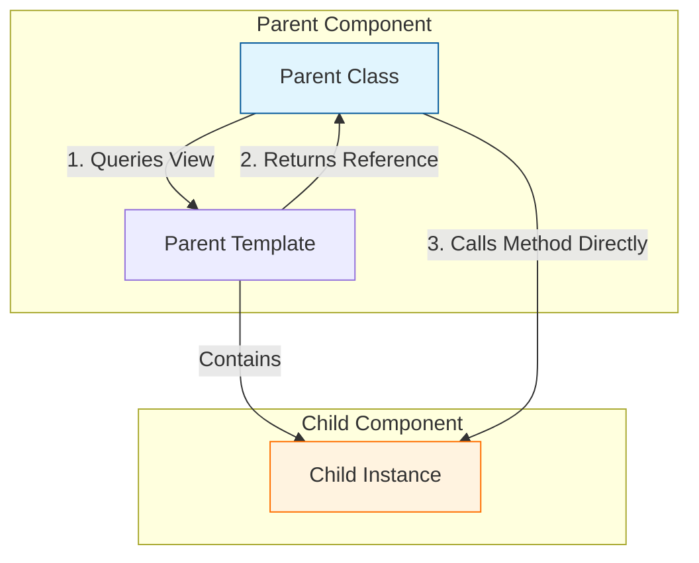
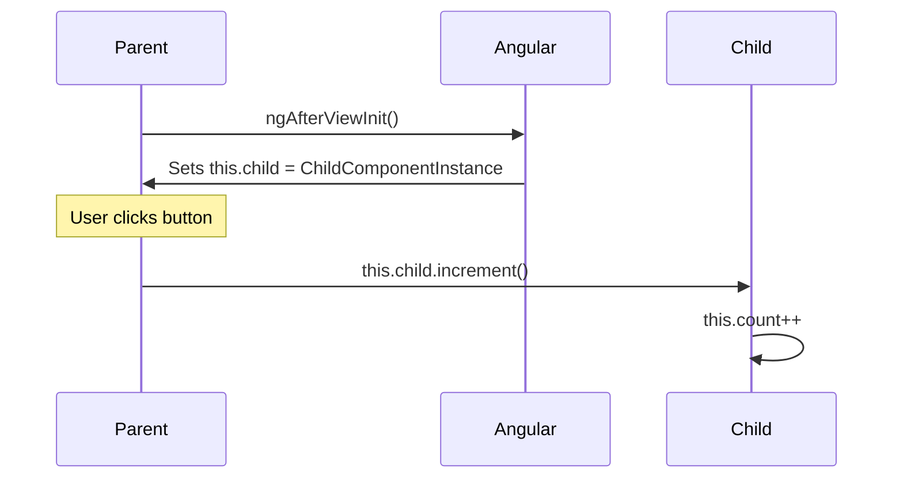

# 👁️ Basic `@ViewChild` (Direct Component Access)

> **Goal**: Learn how to bypass the standard data flow and grab a direct reference to a child component to call its methods or read its state.

---

## 1. 🔍 How It Works (The Concept)

### The Mechanism
Usually, Angular components talk via **Inputs** (Data Down) and **Outputs** (Events Up). This is "Declarative".
However, sometimes the Parent needs to **command** the Child to do something *right now* (e.g., "Play Video", "Reset Form", "Focus Input").
`@ViewChild` allows the Parent to reach into its template, find a specific component, and get a reference to its **Class Instance**.

### Default vs. Optimized Behavior
*   **Default (Data Flow)**: Parent changes `[reset]="true"`. Child detects change, resets, emits `(resetDone)`. Parent sets `[reset]="false"`. (Cumbersome for simple actions).
*   **Optimized (ViewChild)**: Parent calls `this.child.reset()`. Done.

### 📊 Data Flow Diagram



---

## 2. 🚀 Step-by-Step Implementation Guide

### Step 1: The Child Component (Provider)
The Child exposes `public` methods or properties.

```typescript
// child.component.ts
@Component({ selector: 'app-child', template: '...' })
export class ChildComponent {
  count = 0;

  // 🛡️ CRITICAL: This method must be public (default in TS)
  increment() {
    this.count++;
  }
}
```

### Step 2: The Parent Component (Consumer)
The Parent uses `@ViewChild` to get the reference.

```typescript
// parent.component.ts
import { Component, ViewChild, AfterViewInit } from '@angular/core';
import { ChildComponent } from './child.component';

@Component({
  template: `
    <app-child></app-child>
    <button (click)="manualIncrement()">Increment Child</button>
  `
})
export class ParentComponent implements AfterViewInit {
  // 1. Query the view for the component type
  // 🛡️ CRITICAL: Use ! because it's not set in constructor
  @ViewChild(ChildComponent) child!: ChildComponent;

  ngAfterViewInit() {
    // 2. Available ONLY after view initializes
    console.log(this.child.count); 
  }

  manualIncrement() {
    // 3. Call method directly
    this.child.increment();
  }
}
```

### 📊 Implementation Visualization



---

## 3. 🐛 Common Pitfalls & Debugging

### ❌ Accessing Too Early (`undefined` error)
**Bad Code:**
```typescript
ngOnInit() {
  this.child.increment(); // ❌ Error: Cannot read property 'increment' of undefined
}
```
**Why it fails:** In `ngOnInit`, the template hasn't been rendered yet. Angular hasn't found the child.
**Fix:** Move logic to `ngAfterViewInit` or ensure it's called from a user action (click).

### ❌ Using with `*ngIf`
**Bad Code:**
```html
<app-child *ngIf="isVisible"></app-child>
```
```typescript
@ViewChild(ChildComponent) child!: ChildComponent;
```
**Why it fails:** If `isVisible` is false, the component doesn't exist in the DOM. `this.child` will be undefined.
**Fix:** Check for existence: `this.child?.increment()` or use a setter to react when it appears.

---

## 4. ⚡ Performance & Architecture

### Performance
*   **Zero Overhead**: Accessing a property via `@ViewChild` is just a direct JavaScript object reference. It's extremely fast.
*   **No Change Detection**: Calling a method on the child does **NOT** automatically trigger Change Detection in the Parent. If the child updates its own view, it works. If the child updates something that affects the Parent, you might get `ExpressionChangedAfterItHasBeenCheckedError`.

### Architecture: Tight Coupling
*   **Warning**: This creates **Tight Coupling**. The Parent now knows exactly *how* the Child is implemented (method names).
*   **Rule of Thumb**: Use `@Input/@Output` for data flow. Use `@ViewChild` for **Control Flow** (starting/stopping/focusing).

---

## 5. 🌍 Real World Use Cases

1.  **Media Players**: `<video-player>`. Parent calls `.play()`, `.pause()`, `.seek(10)`.
2.  **Modals/Dialogs**: `<app-modal>`. Parent calls `.open()`, `.close()`.
3.  **Third-Party Libs**: Wrapping Google Maps or Chart.js. You need direct access to the underlying API to call `.resize()` or `.setCenter()`.

---

## 6. 📝 The Analogy: "The Remote Control" 🎮

*   **Inputs/Outputs**: Like mailing a letter. You send data, wait for a reply. It's decoupled but slow.
*   **ViewChild**: Like a **Remote Control**.
    *   You point it at the TV (Child).
    *   You press "Mute" (Call Method).
    *   The TV reacts *immediately*.
    *   You don't need to mail a letter to the TV asking it to mute.

---

## 7. ❓ Interview & Concept Questions

### Q1: When is `@ViewChild` resolved?
**A:** In the `ngAfterViewInit` lifecycle hook. Before that, it is undefined.

### Q2: What does `{ static: true }` do?
**A:** It tries to resolve the ViewChild in `ngOnInit` (earlier). This ONLY works if the component is **always** present (not inside `*ngIf` or `*ngFor`).

### Q3: Can I access a standard HTML element with `@ViewChild`?
**A:** Yes. Give it a template reference variable `<div #myDiv>`. Then query it: `@ViewChild('myDiv') div: ElementRef;`.

### Q4: What is the difference between `@ViewChild` and `@ContentChild`?
**A:**
*   `@ViewChild`: Queries elements inside your **own template** (what you wrote).
*   `@ContentChild`: Queries elements **projected** into your component (what the user wrote inside `<ng-content>`).

### Q5: Why might I get `ExpressionChangedAfterItHasBeenCheckedError`?
**A:** If you use `@ViewChild` to read a value in `ngAfterViewInit` and immediately update a property bound to your own template. Angular has already finished checking the Parent view, and you invalidated it. Wrap the update in `setTimeout` or `Promise.resolve()`.
