# 🎯 Basic @ViewChild

> **💡 Lightbulb Moment**: @ViewChild queries elements or components in your component's OWN template!


## 📋 Table of Contents
- [🔗 How @ViewChild Works: Deep Dive](#how-viewchild-works-deep-dive)
  - [The Complete Query Flow](#the-complete-query-flow)
  - [Lifecycle Timing: When Is @ViewChild Available?](#lifecycle-timing-when-is-viewchild-available)
  - [Step-by-Step: Query Resolution](#step-by-step-query-resolution)
  - [Code Mapping: Your Implementation](#code-mapping-your-implementation)
  - [Visual: ViewChild vs ContentChild](#visual-viewchild-vs-contentchild)
  - [🔑 Query Options Reference](#query-options-reference)
- [1. 🔍 What is @ViewChild?](#1--what-is-viewchild)
- [2. 🚀 Query Options](#2--query-options)
  - [Template Reference](#template-reference)
  - [Component/Directive Type](#componentdirective-type)
  - [Read Different Type](#read-different-type)
- [3. ❓ Interview Questions](#3--interview-questions)
  - [Basic Questions](#basic-questions)
    - [Q1: When is @ViewChild available?](#q1-when-is-viewchild-available)
    - [Q2: What's the difference between ViewChild and ViewChildren?](#q2-whats-the-difference-between-viewchild-and-viewchildren)
    - [Q3: What does static: true mean?](#q3-what-does-static-true-mean)
  - [Scenario-Based Questions](#scenario-based-questions)
    - [Scenario: Focus Input on Load](#scenario-focus-input-on-load)
- [🎮 Remote Control Analogy (Easy to Remember!)](#remote-control-analogy-easy-to-remember)
  - [📖 Story to Remember:](#story-to-remember)
  - [🎯 Quick Reference:](#quick-reference)
- [🧠 Mind Map](#mind-map)
- [🎯 What Problem Does This Solve?](#what-problem-does-this-solve)
  - [The Problem: No Way to Access DOM or Child Components](#the-problem-no-way-to-access-dom-or-child-components)
  - [How ViewChild Solves This](#how-viewchild-solves-this)
- [📚 Key Concepts Explained](#key-concepts-explained)
  - [1. Template Reference Variables](#1-template-reference-variables)
  - [2. Query by Component/Directive Type](#2-query-by-componentdirective-type)
  - [3. `read` Option](#3-read-option)
  - [4. `static` Option](#4-static-option)
- [🌍 Real-World Use Cases](#real-world-use-cases)
  - [1. Auto-Focus Form Input](#1-auto-focus-form-input)
  - [2. Scroll to Element](#2-scroll-to-element)
  - [3. Access Child Component Methods](#3-access-child-component-methods)
  - [4. Read Form Control State](#4-read-form-control-state)
  - [5. Dynamic Component Insertion](#5-dynamic-component-insertion)
- [❓ Complete Interview Questions (25+)](#complete-interview-questions-25)
  - [Basic Conceptual Questions](#basic-conceptual-questions)
  - [Timing Questions](#timing-questions)
  - [Options Questions](#options-questions)
  - [Scenario Questions](#scenario-questions)
  - [Advanced Questions](#advanced-questions)
  - [Best Practice Questions](#best-practice-questions)

---
---

## 🔗 How @ViewChild Works: Deep Dive

> [!IMPORTANT]
> `@ViewChild` queries elements from your component's **own template**. The result is available in `ngAfterViewInit` - NOT before!

### The Complete Query Flow

```mermaid
%%{init: {'theme': 'base', 'themeVariables': { 'primaryColor': '#8b5cf6', 'primaryTextColor': '#fff'}}}%%
flowchart TB
    subgraph Template["📝 Component Template"]
        T1["&lt;input #myInput /&gt;"]
        T2["&lt;app-child&gt;&lt;/app-child&gt;"]
    end
    
    subgraph Decorator["🎯 @ViewChild Decorator"]
        D1["@ViewChild 'myInput'"]
        D2["@ViewChild ChildComponent"]
    end
    
    subgraph Result["✅ Query Result"]
        R1["inputElement: ElementRef"]
        R2["childComponent: ChildComponent"]
    end
    
    T1 --> D1
    D1 --> R1
    T2 --> D2
    D2 --> R2
    
    style Template fill:#e0f2fe
    style Decorator fill:#fef3c7
    style Result fill:#dcfce7
```



### Lifecycle Timing: When Is @ViewChild Available?

```mermaid
sequenceDiagram
    participant C as Constructor
    participant I as ngOnInit
    participant V as ngAfterViewInit
    participant Q as @ViewChild
    
    C->>Q: undefined ❌
    Note over C: View not created yet
    
    I->>Q: undefined ❌
    Note over I: View still rendering
    
    V->>Q: ElementRef ✅
    Note over V: View is ready!
    
    Note over Q: Safe to use now!
```



### Step-by-Step: Query Resolution

| Step | What Happens | Code |
|------|--------------|------|
| **1** | Template has element with #ref | `<input #myInput />` |
| **2** | Decorator queries the view | `@ViewChild('myInput')` |
| **3** | Angular renders the view | Template → DOM |
| **4** | Query resolves | `inputElement = ElementRef` |
| **5** | Lifecycle hook fires | `ngAfterViewInit()` |
| **6** | Safe to access | `this.inputElement.nativeElement.focus()` |

### Code Mapping: Your Implementation

```typescript
@Component({
    template: `
        <input #myInput />            <!-- 👈 Template reference -->
        <app-child></app-child>       <!-- 👈 Child component -->
    `
})
export class ParentComponent implements AfterViewInit {
    // Query by template reference
    @ViewChild('myInput') inputElement!: ElementRef<HTMLInputElement>;
    
    // Query by component type
    @ViewChild(ChildComponent) childComponent!: ChildComponent;
    
    // ❌ NOT AVAILABLE HERE
    constructor() {
        // this.inputElement → undefined!
    }
    
    // ❌ NOT AVAILABLE HERE
    ngOnInit() {
        // this.inputElement → undefined!
    }
    
    // ✅ AVAILABLE HERE
    ngAfterViewInit() {
        this.inputElement.nativeElement.focus();  // Works!
        this.childComponent.doSomething();        // Works!
    }
}
```

### Visual: ViewChild vs ContentChild

```
┌───────────────────────────────────────────────────────────┐
│ PARENT COMPONENT                                          │
│                                                           │
│   Template (ViewChild queries HERE):                      │
│   ┌─────────────────────────────────────────────────────┐ │
│   │ <input #myInput />    ← @ViewChild('myInput') ✅    │ │
│   │ <app-child>                                         │ │
│   │   <p>Projected content</p>  ← @ContentChild ❌      │ │
│   │ </app-child>                                        │ │
│   └─────────────────────────────────────────────────────┘ │
│                                                           │
│   @ViewChild = Queries OWN template                       │
│   @ContentChild = Queries PROJECTED content (inside child)│
└───────────────────────────────────────────────────────────┘
```

### 🔑 Query Options Reference

| Option | Purpose | Example |
|--------|---------|---------|
| **Template ref** | Query by #name | `@ViewChild('myInput')` |
| **Component type** | Query by class | `@ViewChild(ChildComponent)` |
| **static: true** | Available in ngOnInit | `{ static: true }` |
| **read: Type** | Return different type | `{ read: ElementRef }` |

> [!TIP]
> **Memory Trick**: Think of `@ViewChild` as a **remote control** 🎮 - you can only use it AFTER the TV (view) is turned on (ngAfterViewInit)!

---

## 1. 🔍 What is @ViewChild?

Queries a single element, directive, or component from the view (template).

```typescript
@Component({
    template: `
        <input #myInput />
        <app-child></app-child>
    `
})
export class ParentComponent implements AfterViewInit {
    @ViewChild('myInput') inputElement!: ElementRef<HTMLInputElement>;
    @ViewChild(ChildComponent) childComponent!: ChildComponent;
    
    ngAfterViewInit() {
        this.inputElement.nativeElement.focus();
        this.childComponent.doSomething();
    }
}
```

---

## 2. 🚀 Query Options

### Template Reference
```typescript
@ViewChild('container') container!: ElementRef;
```

### Component/Directive Type
```typescript
@ViewChild(ChildComponent) child!: ChildComponent;
@ViewChild(MyDirective) directive!: MyDirective;
```

### Read Different Type
```typescript
@ViewChild('myInput', { read: ElementRef }) input!: ElementRef;
@ViewChild('myInput', { read: NgModel }) model!: NgModel;
```

---

## 3. ❓ Interview Questions

### Basic Questions

#### Q1: When is @ViewChild available?
**Answer:** In `ngAfterViewInit` and after. Not available in constructor or ngOnInit.

#### Q2: What's the difference between ViewChild and ViewChildren?
**Answer:**
- **ViewChild**: Returns first match (single)
- **ViewChildren**: Returns QueryList of all matches

#### Q3: What does static: true mean?
**Answer:** Query is resolved before change detection (in ngOnInit). Use when element is always present (not in *ngIf):
```typescript
@ViewChild('input', { static: true }) input!: ElementRef;
```

---

### Scenario-Based Questions

#### Scenario: Focus Input on Load
**Question:** Auto-focus an input when component loads.

**Answer:**
```typescript
@ViewChild('emailInput') emailInput!: ElementRef<HTMLInputElement>;

ngAfterViewInit() {
    this.emailInput.nativeElement.focus();
}
```

---

## 🎮 Remote Control Analogy (Easy to Remember!)

Think of @ViewChild like a **TV remote control**:

| Concept | Remote Analogy | Memory Trick |
|---------|---------------|--------------| 
| **@ViewChild** | 🎮 **Remote control**: Get direct control of something in your view | **"Point and control"** |
| **Template ref (#name)** | 📺 **TV label**: "This is the TV I want to control" | **"Name it"** |
| **Component query** | 🔌 **Smart device**: Control the DVD player directly | **"Get the device"** |
| **ngAfterViewInit** | ⏰ **TV is ready**: Remote only works AFTER TV turns on | **"Wait for ready"** |
| **static: true** | 🔋 **Instant on**: Works immediately (always visible) | **"No waiting"** |

### 📖 Story to Remember:

> 🎮 **The Living Room Setup**
>
> You're setting up your entertainment system:
>
> **Getting Your Remote (ViewChild):**
> ```typescript
> // In template: label your devices
> <input #volumeSlider />        <!-- Label: "volumeSlider" -->
> <app-tv></app-tv>              <!-- A TV component -->
>
> // In component: get your remotes
> @ViewChild('volumeSlider') slider!: ElementRef;  // Remote for slider
> @ViewChild(TvComponent) tv!: TvComponent;        // Remote for TV
> ```
>
> **When Can You Use It?:**
> ```
> constructor()    → Remote not paired yet! ❌
> ngOnInit()       → Remote still syncing... ❌
> ngAfterViewInit() → Remote ready! Press buttons! ✅
> 
> this.tv.turnOn();           // Use the remote
> this.slider.nativeElement.focus();
> ```
>
> **You can only use the remote AFTER the TV is on!**

### 🎯 Quick Reference:
```
🎮 @ViewChild      = Get a remote (query the view)
📺 #templateRef    = Label your device (template reference)
🔌 ComponentType   = Smart device remote (direct access)
⏰ AfterViewInit   = When remote is ready
📐 { read: Type }  = "Give me THIS type of remote"
```

---

## 🧠 Mind Map


---

## 🎯 What Problem Does This Solve?

### The Problem: No Way to Access DOM or Child Components

**Without ViewChild (BAD):**
```typescript
@Component({
    template: `<input class="email-input" />`
})
export class FormComponent {
    focusEmailInput() {
        // ❌ BAD: Direct DOM query - not Angular way!
        const input = document.querySelector('.email-input');
        input?.focus();
        
        // Problems:
        // 1. Queries entire document
        // 2. May get wrong element from another component
        // 3. Not type-safe
        // 4. Doesn't work with SSR
    }
}
```

**Problems:**
1. **Global queries**: `document.querySelector` searches everywhere
2. **No encapsulation**: Can access wrong elements
3. **No type safety**: Returns generic Element
4. **SSR breaking**: No `document` on server

### How ViewChild Solves This

**With ViewChild (GOOD):**
```typescript
@Component({
    template: `<input #emailInput />`
})
export class FormComponent implements AfterViewInit {
    @ViewChild('emailInput') emailInput!: ElementRef<HTMLInputElement>;
    
    ngAfterViewInit() {
        this.emailInput.nativeElement.focus();  // ✅ Type-safe, scoped!
    }
    
    focusEmail() {
        this.emailInput.nativeElement.focus();
    }
}
```

| Problem | ViewChild Solution |
|---------|-------------------|
| Global queries | **Scoped**: Only queries within component's template |
| No encapsulation | **Isolated**: Only accesses own elements |
| No type safety | **Typed**: `ElementRef<HTMLInputElement>` |
| SSR breaking | **Safe**: Works with Angular's abstraction |

---

## 📚 Key Concepts Explained

### 1. Template Reference Variables

```html
<!-- Create reference with # -->
<input #emailInput />
<div #container></div>
<app-modal #modal></app-modal>
```

```typescript
// Access with @ViewChild
@ViewChild('emailInput') input!: ElementRef;
@ViewChild('container') container!: ElementRef;
@ViewChild('modal') modal!: ModalComponent;
```

---

### 2. Query by Component/Directive Type

```typescript
// Query by component type
@ViewChild(ChildComponent) child!: ChildComponent;

// Query by directive type
@ViewChild(TooltipDirective) tooltip!: TooltipDirective;

// Access component methods directly
ngAfterViewInit() {
    this.child.refresh();
    this.tooltip.show();
}
```

---

### 3. `read` Option

```typescript
// Default: returns the component instance
@ViewChild(MyComponent) comp!: MyComponent;

// Read as ElementRef instead
@ViewChild(MyComponent, { read: ElementRef }) 
compElement!: ElementRef;

// Read as ViewContainerRef for dynamic components
@ViewChild('container', { read: ViewContainerRef }) 
vcr!: ViewContainerRef;
```

---

### 4. `static` Option

```typescript
// static: false (default) - resolved after change detection
@ViewChild('input') input!: ElementRef;
// Available in: ngAfterViewInit

// static: true - resolved before change detection
@ViewChild('input', { static: true }) input!: ElementRef;
// Available in: ngOnInit (only if NOT inside *ngIf)
```

**When to use static: true:**
- Element is always visible (no *ngIf, *ngFor)
- You need it in ngOnInit

---

## 🌍 Real-World Use Cases

### 1. Auto-Focus Form Input
```typescript
@ViewChild('searchInput') searchInput!: ElementRef<HTMLInputElement>;

ngAfterViewInit() {
    this.searchInput.nativeElement.focus();
}
```

### 2. Scroll to Element
```typescript
@ViewChild('bottomSection') bottom!: ElementRef;

scrollToBottom() {
    this.bottom.nativeElement.scrollIntoView({ behavior: 'smooth' });
}
```

### 3. Access Child Component Methods
```typescript
@ViewChild(DataGridComponent) grid!: DataGridComponent;

refreshData() {
    this.grid.loadData();
    this.grid.resetFilters();
}
```

### 4. Read Form Control State
```typescript
@ViewChild('emailInput', { read: NgModel }) emailModel!: NgModel;

checkValidity() {
    console.log(this.emailModel.valid);
    console.log(this.emailModel.errors);
}
```

### 5. Dynamic Component Insertion
```typescript
@ViewChild('container', { read: ViewContainerRef }) 
container!: ViewContainerRef;

loadComponent() {
    this.container.clear();
    this.container.createComponent(DynamicComponent);
}
```

---

## ❓ Complete Interview Questions (25+)

### Basic Conceptual Questions

**Q4: What is @ViewChild?**
> A: A decorator that queries the view (template) for the first matching element, directive, or component.

**Q5: When is @ViewChild available?**
> A: In `ngAfterViewInit` lifecycle hook and after. Not in constructor or ngOnInit (unless using static: true).

**Q6: What types can @ViewChild query?**
> A: Template references (#ref), component types, directive types.

**Q7: What does ElementRef provide?**
> A: A wrapper around a native element, with `nativeElement` property for DOM access.

---

### Timing Questions

**Q8: Why isn't @ViewChild available in ngOnInit?**
> A: The view hasn't been initialized yet. Angular hasn't rendered the template.

**Q9: When would you use static: true?**
> A: When the element is always present (not in *ngIf) and you need it in ngOnInit.

**Q10: What happens if you access @ViewChild before AfterViewInit?**
> A: The value is undefined, causing runtime errors.

---

### Options Questions

**Q11: What does the `read` option do?**
> A: Specifies which type to return. Useful when an element has multiple queryable types (component, ElementRef, ViewContainerRef).

**Q12: How do you get ViewContainerRef from an element?**
> A:
> ```typescript
> @ViewChild('container', { read: ViewContainerRef }) vcr!: ViewContainerRef;
> ```

**Q13: What's the default value of static?**
> A: `false` - resolved after change detection (available in ngAfterViewInit).

---

### Scenario Questions

**Q14: How do you focus an input programmatically?**
> A:
> ```typescript
> @ViewChild('input') input!: ElementRef<HTMLInputElement>;
> 
> ngAfterViewInit() {
>     this.input.nativeElement.focus();
> }
> ```

**Q15: How do you call a method on a child component?**
> A:
> ```typescript
> @ViewChild(ChildComponent) child!: ChildComponent;
> 
> refreshChild() {
>     this.child.refresh();
> }
> ```

**Q16: Element is inside *ngIf - how do you handle it?**
> A: Use a setter to handle when it becomes available:
> ```typescript
> private _element: ElementRef;
> 
> @ViewChild('element') set element(el: ElementRef) {
>     if (el) {
>         this._element = el;
>         // Now safe to use
>     }
> }
> ```

**Q17: How do you scroll to an element?**
> A:
> ```typescript
> @ViewChild('section') section!: ElementRef;
> 
> scrollToSection() {
>     this.section.nativeElement.scrollIntoView({ behavior: 'smooth' });
> }
> ```

---

### Advanced Questions

**Q18: What's the difference between ViewChild and ContentChild?**
> A:
> - ViewChild: Queries component's OWN template
> - ContentChild: Queries content PROJECTED into component

**Q19: Can ViewChild return undefined?**
> A: Yes, if the element is inside *ngIf and condition is false.

**Q20: How do you query multiple elements?**
> A: Use @ViewChildren:
> ```typescript
> @ViewChildren('item') items!: QueryList<ElementRef>;
> ```

**Q21: What is QueryList?**
> A: An observable list that can notify when its contents change (e.g., when *ngFor items change).

**Q22: How do you access directive applied to an element?**
> A:
> ```typescript
> @ViewChild(TooltipDirective) tooltip!: TooltipDirective;
> // or
> @ViewChild('element', { read: TooltipDirective }) tooltip!: TooltipDirective;
> ```

---

### Best Practice Questions

**Q23: Should you access nativeElement frequently?**
> A: Minimize direct DOM access. Use Angular bindings when possible for SSR compatibility.

**Q24: How do you avoid undefined errors?**
> A: Always access ViewChild in ngAfterViewInit or later. Use optional chaining.

**Q25: When to use ViewChild vs service communication?**
> A: ViewChild for parent→child direct access. Services for sibling or distant component communication.

