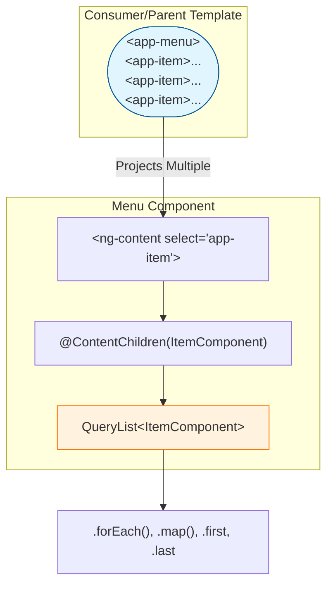
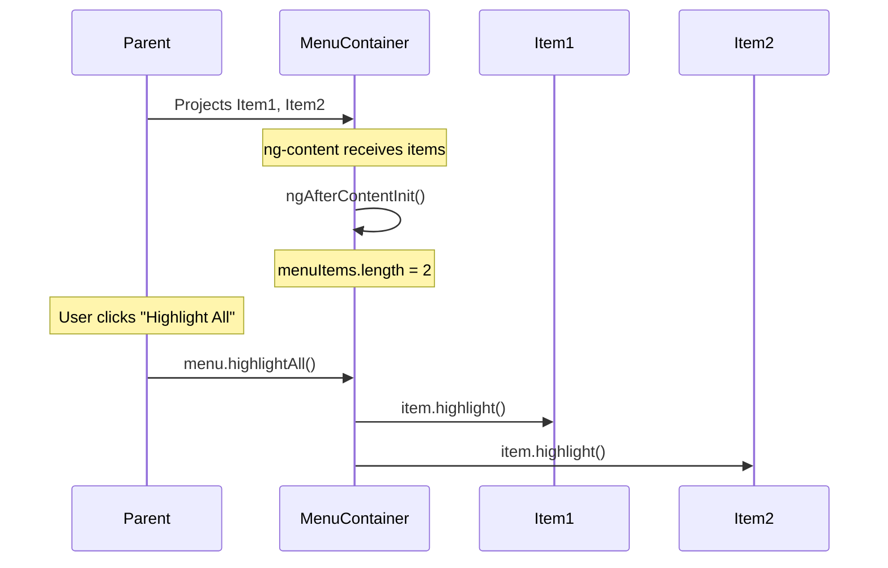

# 📑 `@ContentChildren` (Multiple Projected Components)

> **Goal**: Learn how to query **multiple** components that have been projected into your component via `ng-content`.

---

## 1. 🔍 How It Works (The Concept)

### The Mechanism
This is the combination of (`@ViewChildren`) and (`@ContentChild`).
*   `@ContentChild`: Gets **one** projected component.
*   `@ContentChildren`: Gets **all** projected components of a type, as a `QueryList`.

### Default vs. Optimized Behavior
*   **Default (No Access)**: Content is projected, but you can't iterate over or manage the children.
*   **Optimized (ContentChildren)**: You have a live `QueryList` of all projected children, just like `@ViewChildren`.

### 📊 Data Flow Diagram



---

## 2. 🚀 Step-by-Step Implementation Guide

### Step 1: The Child Component (Projected Item)

```typescript
// menu-item.component.ts
@Component({
  selector: 'app-menu-item',
  template: `<span>{{ icon }} {{ label }}</span>`
})
export class MenuItemComponent {
  @Input() label = '';
  @Input() icon = '📌';

  highlight() { /* ... */ }
  unhighlight() { /* ... */ }
}
```

### Step 2: The Container Component (Receives Projection)

```typescript
// menu-container.component.ts
@Component({
  selector: 'app-menu-container',
  template: `
    <div class="menu">
      <h3>{{ title }} ({{ menuItems?.length }} items)</h3>
      <ng-content select="app-menu-item"></ng-content>
    </div>
  `
})
export class MenuContainerComponent implements AfterContentInit {
  // 🛡️ CRITICAL: @ContentChildren (plural) for multiple projected children
  @ContentChildren(MenuItemComponent) menuItems!: QueryList<MenuItemComponent>;

  ngAfterContentInit() {
    console.log('Items:', this.menuItems.length);
  }

  highlightAll() {
    this.menuItems.forEach(item => item.highlight());
  }
}
```

### Step 3: The Consumer (Projects Multiple Items)

```html
<!-- parent.component.html -->
<app-menu-container>
  <app-menu-item label="Home" icon="🏠"></app-menu-item>
  <app-menu-item label="Profile" icon="👤"></app-menu-item>
  <app-menu-item label="Settings" icon="⚙️"></app-menu-item>
</app-menu-container>
```

### 📊 Implementation Visualization



---

## 3. 🐛 Common Pitfalls & Debugging

### ❌ Using `@ViewChildren` for Projected Content
**Bad Code:**
```typescript
@ViewChildren(MenuItemComponent) items!: QueryList<MenuItemComponent>; // ❌ Empty!
```
**Why it fails:** The items are projected FROM the parent, not defined IN your template. Use `@ContentChildren`.

### ❌ Forgetting `AfterContentInit`
**Bad Code:**
```typescript
ngAfterViewInit() {
  console.log(this.menuItems.length); // Might be stale or incorrect
}
```
**Fix:** Use `ngAfterContentInit` for content queries.

---

## 4. ⚡ Performance & Architecture

### Performance
*   Same as `@ViewChildren`. The `QueryList` updates reactively when projected content changes.
*   Subscribe to `.changes` if you need to react dynamically.

### Architecture: Composable UI
*   **Menus, Tab Bars, Accordions**: Perfect use case.
*   The container enforces behavior (e.g., "only one accordion open at a time") by iterating over all children.

---

## 5. 🌍 Real World Use Cases

1.  **Navigation Menus**: A `<nav-menu>` that receives multiple `<nav-item>` and highlights the active one.
2.  **Accordion/Collapse Panels**: An `<accordion>` that manages multiple `<accordion-item>` components, ensuring only one is open.
3.  **Stepper/Wizard**: A `<stepper>` that receives `<step>` children and tracks which step is active.

---

## 6. 📝 The Analogy: "The Restaurant Menu" 🍽️

Imagine a restaurant menu.
*   **The Printed Menu Board** (`MenuContainerComponent`): Has a slot for "Appetizers" and another for "Main Courses".
*   **The Chef (Parent)**: Writes individual dish cards (`MenuItemComponent`) and places them onto the board.
*   **The Board (using `@ContentChildren`)**: Can look at all the appetizer cards and say, "We have 5 appetizers, and let me highlight the special of the day."

---

## 7. ❓ Interview & Concept Questions

### Q1: What is the difference between `@ContentChild` and `@ContentChildren`?
**A:** `@ContentChild` returns a single projected component. `@ContentChildren` returns a `QueryList` of all matching projected components.

### Q2: When does `menuItems.changes` emit?
**A:** When the set of projected children changes (e.g., an `*ngFor` adds or removes an `<app-menu-item>`).

### Q3: Can I use `@ContentChildren` with template references?
**A:** Yes. `@ContentChildren('myRef') items: QueryList<ElementRef>`.

### Q4: What lifecycle hook is correct for `@ContentChildren`?
**A:** `ngAfterContentInit`. Content is initialized before the view.

### Q5: How do I iterate over a `QueryList`?
**A:** Use `.forEach(item => ...)`, `.map()`, `.filter()`, or convert to array with `.toArray()`.
