# 🔧 read Option

> **💡 Lightbulb Moment**: The read option lets you get a DIFFERENT type from what you're querying!


## 📋 Table of Contents
- [1. 🔍 What is the read Option?](#1--what-is-the-read-option)
- [2. 🚀 Common Read Types](#2--common-read-types)
- [3. ❓ Interview Questions](#3--interview-questions)
  - [Basic Questions](#basic-questions)
    - [Q1: When do you need read option?](#q1-when-do-you-need-read-option)
  - [Scenario-Based Questions](#scenario-based-questions)
    - [Scenario: Dynamic Component Host](#scenario-dynamic-component-host)
- [🎯 Understanding `@ViewChild('container', { read: ViewContainerRef })` In Detail](#understanding-viewchildcontainer--read-viewcontainerref--in-detail)
  - [📖 The Syntax Breakdown](#the-syntax-breakdown)
  - [🤔 Why Do We Need `{ read: ViewContainerRef }`?](#why-do-we-need--read-viewcontainerref)
  - [📊 Visual: Same Element, Different "Read" Results](#visual-same-element-different-read-results)
  - [🎬 Real Example: Step-by-Step](#real-example-step-by-step)
  - [🔑 Key Insight: Why `ng-container`?](#key-insight-why-ng-container)
  - [📋 Common Use Cases for `{ read: ViewContainerRef }`](#common-use-cases-for--read-viewcontainerref)
  - [⚠️ Common Mistakes](#common-mistakes)
  - [🎪 The Hotel Room Analogy](#the-hotel-room-analogy)
- [4. 🔍 Deep Dive: ElementRef, TemplateRef & ViewContainerRef](#4--deep-dive-elementref-templateref--viewcontainerref)
  - [📦 ElementRef - Native Element Wrapper](#elementref---native-element-wrapper)
  - [📋 TemplateRef - Blueprint for Content](#templateref---blueprint-for-content)
  - [🏗️ ViewContainerRef - Construction Site](#viewcontainerref---construction-site)
  - [📊 How They Work Together](#how-they-work-together)
  - [🎯 Real-World Example: Dynamic Component Loader](#real-world-example-dynamic-component-loader)
  - [📝 Quick Comparison Table](#quick-comparison-table)
  - [🎪 The Factory Analogy (All Three Together!)](#the-factory-analogy-all-three-together)
- [🧠 Mind Map](#mind-map)

---
---

## 1. 🔍 What is the read Option?

Specifies what to read from the queried element.

```typescript
<!-- Template -->
<input #email [(ngModel)]="emailValue">

// Query - different ways to read the same element
@ViewChild('email') inputRef!: ElementRef;
@ViewChild('email', { read: NgModel }) ngModel!: NgModel;
@ViewChild('email', { read: ViewContainerRef }) vcr!: ViewContainerRef;
```

---

## 2. 🚀 Common Read Types

| read Type | Returns |
|-----------|---------|
| `ElementRef` | Native element wrapper |
| `TemplateRef` | Template reference |
| `ViewContainerRef` | Container for dynamic views |
| `NgModel` | Form control |
| Component type | Component instance |

---

## 3. ❓ Interview Questions

### Basic Questions

#### Q1: When do you need read option?
**Answer:** When the default resolved type isn't what you need:
```typescript
// Default returns NgModel directive
@ViewChild('input') input!: NgModel;

// But you want the element
@ViewChild('input', { read: ElementRef }) inputElement!: ElementRef;
```

---

### Scenario-Based Questions

#### Scenario: Dynamic Component Host
**Question:** Get ViewContainerRef from an element for dynamic components.

**Answer:**
```typescript
<ng-container #host></ng-container>

@ViewChild('host', { read: ViewContainerRef }) hostVcr!: ViewContainerRef;

loadComponent() {
    this.hostVcr.createComponent(DynamicComponent);
}
```

---

## 🎯 Understanding `@ViewChild('container', { read: ViewContainerRef })` In Detail

This is one of the most powerful patterns in Angular. Let's break it down piece by piece:

---

### 📖 The Syntax Breakdown

```typescript
@ViewChild('container', { read: ViewContainerRef }) container!: ViewContainerRef;
//   ↓           ↓              ↓                       ↓
//   1           2              3                       4
```

| Part | Meaning |
|------|---------|
| **1. `@ViewChild`** | Decorator to query an element from the template |
| **2. `'container'`** | The template reference variable (`#container`) to find |
| **3. `{ read: ViewContainerRef }`** | "Don't give me the element, give me its ViewContainerRef!" |
| **4. `container!: ViewContainerRef`** | TypeScript property to hold the result |

---

### 🤔 Why Do We Need `{ read: ViewContainerRef }`?

**The Problem:** When you query an element, Angular returns different things by default:

| Element Type | Default Return |
|-------------|----------------|
| `<app-child>` | The component instance |
| `<div #myDiv>` | `ElementRef` |
| `<ng-template #myTpl>` | `TemplateRef` |
| `<input [(ngModel)]>` | `NgModel` directive |

**But sometimes you want something DIFFERENT!**

```typescript
// Template
<div #container></div>

// ❌ WITHOUT read option: Gets ElementRef (just the element)
@ViewChild('container') container!: ElementRef;
// container.nativeElement = <div></div> (Can't create views here!)

// ✅ WITH read option: Gets ViewContainerRef (a container!)
@ViewChild('container', { read: ViewContainerRef }) container!: ViewContainerRef;
// container.createEmbeddedView() ← Now we can insert views!
```

---

### 📊 Visual: Same Element, Different "Read" Results

```mermaid
flowchart TD
    subgraph Template["Template: <div #box></div>"]
        Element["#box"]
    end
    
    subgraph Queries["Different @ViewChild Queries"]
        Q1["@ViewChild('box')"]
        Q2["@ViewChild('box', {read: ElementRef})"]
        Q3["@ViewChild('box', {read: ViewContainerRef})"]
    end
    
    subgraph Results["What You Get"]
        R1["ElementRef → Access native element"]
        R2["ElementRef → Same as above"]
        R3["ViewContainerRef → Insert views HERE!"]
    end
    
    Element --> Q1
    Element --> Q2
    Element --> Q3
    
    Q1 --> R1
    Q2 --> R2
    Q3 --> R3
    
    style R3 fill:#4caf50,stroke:#2e7d32,color:#fff
```



---

### 🎬 Real Example: Step-by-Step

```typescript
@Component({
  template: `
    <h1>Dynamic List</h1>
    
    <!-- 🎯 This is where we'll insert dynamic content -->
    <ng-container #listContainer></ng-container>
    
    <!-- 🎯 This is the BLUEPRINT for each item -->
    <ng-template #itemTemplate let-name="name" let-index="index">
      <div class="item">
        {{ index + 1 }}. {{ name }}
        <button (click)="remove(index)">Remove</button>
      </div>
    </ng-template>
    
    <button (click)="addItem()">Add Person</button>
  `
})
export class DynamicListComponent implements AfterViewInit {
  
  // 🎯 Get the container WHERE we'll insert views
  @ViewChild('listContainer', { read: ViewContainerRef }) 
  listContainer!: ViewContainerRef;
  
  // 🎯 Get the blueprint (template) for each item
  @ViewChild('itemTemplate') 
  itemTemplate!: TemplateRef<any>;
  
  names = ['Alice', 'Bob', 'Charlie'];
  
  ngAfterViewInit() {
    // Initially render all names
    this.names.forEach((name, index) => {
      this.listContainer.createEmbeddedView(this.itemTemplate, {
        name: name,
        index: index
      });
    });
  }
  
  addItem() {
    const newName = prompt('Enter name:');
    if (newName) {
      const index = this.listContainer.length;
      this.listContainer.createEmbeddedView(this.itemTemplate, {
        name: newName,
        index: index
      });
    }
  }
  
  remove(index: number) {
    this.listContainer.remove(index);
  }
}
```

---

### 🔑 Key Insight: Why `ng-container`?

```html
<!-- Option 1: Using <div> as host -->
<div #container></div>
<!-- Result: <div>...dynamic content...</div> -->
<!-- ❌ Extra wrapper element in DOM! -->

<!-- Option 2: Using <ng-container> as host -->
<ng-container #container></ng-container>
<!-- Result: ...dynamic content... -->
<!-- ✅ No extra wrapper! ng-container doesn't render anything -->
```

`<ng-container>` is **invisible** in the DOM - it's just an anchor point!

---

### 📋 Common Use Cases for `{ read: ViewContainerRef }`

| Use Case | Why You Need It |
|----------|-----------------|
| **Dynamic component loading** | Insert components at runtime |
| **Custom *ngFor** | Programmatically render list items |
| **Modal/Dialog hosts** | Inject content into overlay container |
| **Tabs/Accordion** | Render content on demand |
| **Lazy content** | Defer rendering until needed |

---

### ⚠️ Common Mistakes

```typescript
// ❌ WRONG: Forgot { read: ViewContainerRef }
@ViewChild('container') container!: ViewContainerRef;
// Result: container is undefined or wrong type!

// ❌ WRONG: Trying to use before it's available
constructor() {
  this.container.createEmbeddedView(...); // ERROR: container is undefined
}

// ✅ CORRECT: Use in ngAfterViewInit or later
ngAfterViewInit() {
  this.container.createEmbeddedView(...); // Works!
}
```

---

### 🎪 The Hotel Room Analogy

> 🏨 **Understanding read: ViewContainerRef**
>
> Think of a template element like a **hotel room door**:
>
> | Without `read` | With `read: ViewContainerRef` |
> |----------------|------------------------------|
> | 🚪 You get the **door** (ElementRef) | 🏨 You get access to the **whole room** |
> | Can only look at the door | Can put furniture (views) INSIDE |
> | Static, limited | Dynamic, powerful |
>
> ```
> @ViewChild('door')                        → 🚪 Just the door
> @ViewChild('door', {read: ViewContainerRef}) → 🏨 The whole room!
> ```

---

## 4. 🔍 Deep Dive: ElementRef, TemplateRef & ViewContainerRef

These three classes are fundamental to Angular's rendering system. Let's understand each in detail:

---

### 📦 ElementRef - Native Element Wrapper

**What it is:** A wrapper around a native DOM element. Gives you direct access to the underlying HTML element.

**When to use:** When you need to interact with the actual DOM (focus, scroll, get dimensions, etc.)

```typescript
@Component({
  template: `<input #myInput type="text">`
})
export class MyComponent implements AfterViewInit {
  @ViewChild('myInput') inputRef!: ElementRef<HTMLInputElement>;
  
  ngAfterViewInit() {
    // 🎯 Access the native HTML element directly
    this.inputRef.nativeElement.focus();               // Set focus
    this.inputRef.nativeElement.value = 'Hello';       // Set value
    console.log(this.inputRef.nativeElement.offsetWidth); // Get width
  }
}
```

**⚠️ Security Warning:**
```typescript
// ❌ DANGEROUS - XSS vulnerability!
this.elementRef.nativeElement.innerHTML = userInput;

// ✅ SAFE - Use Angular's sanitizer or [innerHTML] binding
```

**🏠 Analogy:** ElementRef is like having the **actual key to a house** - you can open any door, move any furniture. Powerful but risky!

---

### 📋 TemplateRef - Blueprint for Content

**What it is:** A reference to an `<ng-template>`. It's a **blueprint** that can be stamped out multiple times.

**When to use:** For content that you want to render conditionally or multiple times (dynamic lists, modals, tooltips).

```typescript
@Component({
  template: `
    <!-- 🎯 This is a BLUEPRINT - not rendered by default -->
    <ng-template #myTemplate let-name="name" let-age="age">
      <div class="card">
        <h2>{{ name }}</h2>
        <p>Age: {{ age }}</p>
      </div>
    </ng-template>
    
    <!-- Container where we'll stamp the template -->
    <div #container></div>
  `
})
export class MyComponent implements AfterViewInit {
  @ViewChild('myTemplate') template!: TemplateRef<any>;
  @ViewChild('container', { read: ViewContainerRef }) container!: ViewContainerRef;
  
  ngAfterViewInit() {
    // 🎯 Stamp the blueprint with context data
    this.container.createEmbeddedView(this.template, {
      name: 'John',
      age: 30
    });
  }
}
```

**Key Points:**
- `<ng-template>` content is **NOT rendered by default**
- It's just a **blueprint** waiting to be used
- You can pass **context variables** using `let-variableName="contextKey"`
- `*ngIf` and `*ngFor` are syntactic sugar for `<ng-template>`!

**🏠 Analogy:** TemplateRef is like a **cookie cutter** 🍪 - it's the shape/pattern. You can use it to cut out many cookies (views) from dough (the DOM).

---

### 🏗️ ViewContainerRef - Construction Site

**What it is:** A container that can hold multiple views. It's the **anchor point** where you can dynamically create, insert, or remove views.

**When to use:** For dynamic component loading, programmatic *ngIf/*ngFor behavior, portals.

```typescript
@Component({
  template: `
    <button (click)="addItem()">Add Item</button>
    <button (click)="clear()">Clear All</button>
    
    <!-- 🎯 Anchor point for dynamic views -->
    <ng-container #host></ng-container>
    
    <ng-template #itemTemplate let-index="index">
      <div class="item">Item #{{ index }}</div>
    </ng-template>
  `
})
export class MyComponent {
  @ViewChild('host', { read: ViewContainerRef }) host!: ViewContainerRef;
  @ViewChild('itemTemplate') itemTemplate!: TemplateRef<any>;
  
  private counter = 0;
  
  addItem() {
    // 🎯 Stamp template into the container
    this.host.createEmbeddedView(this.itemTemplate, { 
      index: ++this.counter 
    });
  }
  
  clear() {
    // 🎯 Remove all views from container
    this.host.clear();
  }
}
```

**Key Methods:**
| Method | Description |
|--------|-------------|
| `createEmbeddedView(template, context)` | Stamp a TemplateRef |
| `createComponent(componentType)` | Create a component dynamically |
| `insert(viewRef, index)` | Insert a view at position |
| `remove(index)` | Remove view at index |
| `clear()` | Remove all views |
| `length` | Number of views in container |

**🏠 Analogy:** ViewContainerRef is like a **parking lot** 🅿️ - it's a designated area where you can park (insert) cars (views), remove them, rearrange them.

---

### 📊 How They Work Together

```mermaid
flowchart LR
    subgraph Template["📋 TemplateRef"]
        T["Blueprint/Cookie Cutter"]
    end
    
    subgraph VCR["🏗️ ViewContainerRef"]
        V["Construction Site/Parking Lot"]
    end
    
    subgraph DOM["🌐 DOM"]
        E["ElementRef - Native Elements"]
    end
    
    T -->|"createEmbeddedView()"| VCR
    VCR -->|"Renders views to"| DOM
    E -->|"nativeElement"| DOM
    
    style Template fill:#e3f2fd,stroke:#1976d2
    style VCR fill:#fff3e0,stroke:#f57c00
    style DOM fill:#e8f5e9,stroke:#388e3c
```



---

### 🎯 Real-World Example: Dynamic Component Loader

```typescript
@Component({
  template: `
    <div class="toolbar">
      <button (click)="load('chart')">Load Chart</button>
      <button (click)="load('table')">Load Table</button>
    </div>
    
    <!-- Dynamic component host -->
    <ng-container #dynamicHost></ng-container>
  `
})
export class DashboardComponent {
  @ViewChild('dynamicHost', { read: ViewContainerRef }) 
  dynamicHost!: ViewContainerRef;
  
  async load(type: string) {
    // 🎯 Clear previous component
    this.dynamicHost.clear();
    
    // 🎯 Dynamically import and create component
    if (type === 'chart') {
      const { ChartComponent } = await import('./chart.component');
      this.dynamicHost.createComponent(ChartComponent);
    } else {
      const { TableComponent } = await import('./table.component');
      this.dynamicHost.createComponent(TableComponent);
    }
  }
}
```

---

### 📝 Quick Comparison Table

| Concept | Purpose | Analogy | Main Use |
|---------|---------|---------|----------|
| **ElementRef** | Access native DOM element | 🔑 **House key** | Focus, scroll, get dimensions |
| **TemplateRef** | Blueprint for views | 🍪 **Cookie cutter** | Reusable content templates |
| **ViewContainerRef** | Container for dynamic views | 🅿️ **Parking lot** | Insert/remove views dynamically |

---

### 🎪 The Factory Analogy (All Three Together!)

> 🏭 **The View Factory**
>
> Imagine a factory that makes custom products:
>
> | Role | In Angular |
> |------|-----------|
> | 📋 **Product blueprints** | TemplateRef (the design/pattern) |
> | 🏗️ **Assembly line** | ViewContainerRef (where products are built) |
> | 📦 **Finished products** | Views/Components in the DOM |
> | 🔧 **Direct access to parts** | ElementRef (touch the raw materials) |
>
> **The Process:**
> ```
> 1. Blueprint (TemplateRef) defines WHAT to build
> 2. Assembly line (ViewContainerRef) decides WHERE and WHEN to build
> 3. Finished product appears in DOM
> 4. ElementRef lets you directly manipulate the finished product
> ```

---

## 🧠 Mind Map


