# ⏱️ Lifecycle Timing for Queries

> **Goal**: Understand **when** `@ViewChild` and `@ContentChild` become available and how to avoid common `undefined` errors.


---

## 1. 🔍 How It Works (The Concept)

### The Mechanism
Angular has a specific lifecycle for initializing components. View and Content queries are NOT available immediately. They become available at specific points in the lifecycle.

### Lifecycle Order (Relevant Hooks)
1.  **`constructor`**: Component class is instantiated. Queries are `undefined`.
2.  **`ngOnInit`**: Inputs are set. Queries are still `undefined`.
3.  **`ngAfterContentInit`**: **Content queries (`@ContentChild`) are now available!**
4.  **`ngAfterViewInit`**: **View queries (`@ViewChild`) are now available!**

### 📊 Lifecycle Timing Diagram

```mermaid
graph TD
    subgraph "Lifecycle"
        A["constructor"] --> B["ngOnInit"]
        B --> C["ngAfterContentInit"]
        C --> D["ngAfterViewInit"]
    end

    subgraph "Query Availability"
        AQ["@ViewChild: ❌\n@ContentChild: ❌"]
        BQ["@ViewChild: ❌\n@ContentChild: ❌"]
        CQ["@ViewChild: ❌\n@ContentChild: ✅"]
        DQ["@ViewChild: ✅\n@ContentChild: ✅"]
    end

    A --- AQ
    B --- BQ
    C --- CQ
    D --- DQ

    style CQ fill:#fff3e0,stroke:#ff6f00
    style DQ fill:#c8e6c9,stroke:#2e7d32
```



---

## 2. 🚀 Step-by-Step Implementation Guide

### Step 1: Identify Which Query You Need
*   `@ViewChild`: Elements in YOUR template.
*   `@ContentChild`: Elements PROJECTED from outside.

### Step 2: Use the Correct Lifecycle Hook

```typescript
@Component({ ... })
export class MyComponent implements AfterContentInit, AfterViewInit {
  @ViewChild('myElement') viewEl?: ElementRef;
  @ContentChild('projected') contentEl?: ElementRef;

  constructor() {
    // ❌ NEVER access queries here!
    console.log(this.viewEl); // undefined
  }

  ngOnInit() {
    // ❌ Still undefined here!
    console.log(this.viewEl); // undefined
  }

  // 🛡️ CRITICAL: Content available here
  ngAfterContentInit() {
    console.log('ContentChild:', this.contentEl); // ✅
    console.log('ViewChild:', this.viewEl);       // ❌ still undefined
  }

  // 🛡️ CRITICAL: View available here
  ngAfterViewInit() {
    console.log('ContentChild:', this.contentEl); // ✅
    console.log('ViewChild:', this.viewEl);       // ✅
  }
}
```

### Step 3: Safe Access with Optional Chaining
Always use `?.` or check for `undefined` if the query might be null.

```typescript
doSomething() {
  this.viewEl?.nativeElement.focus();
}
```

### 📊 Implementation Visualization

```mermaid
sequenceDiagram
    participant Angular
    participant Component

    Angular->>Component: new Component()
    Note over Component: @ViewChild = undefined
    
    Angular->>Component: ngOnInit()
    Note over Component: @ViewChild = undefined
    
    Angular->>Component: ngAfterContentInit()
    Note over Component: @ContentChild = ✅
    
    Angular->>Component: ngAfterViewInit()
    Note over Component: @ViewChild = ✅
```



---

## 3. 🐛 Common Pitfalls & Debugging

### ❌ Accessing in `ngOnInit`
**Bad Code:**
```typescript
ngOnInit() {
  this.myChild.doSomething(); // ❌ TypeError: Cannot read property of undefined
}
```
**Fix:** Move the logic to `ngAfterViewInit`.

### ❌ No Safety Check
**Bad Code:**
```typescript
ngAfterViewInit() {
  this.myChild.doSomething(); // ❌ Might crash if child doesn't exist
}
```
**Fix:** Use optional chaining:
```typescript
ngAfterViewInit() {
  this.myChild?.doSomething(); // ✅
}
```

---

## 4. ⚡ Performance & Architecture

### Performance
*   There's no performance difference between accessing in `ngAfterContentInit` vs. `ngAfterViewInit`.
*   The key is correctness: access at the right time to avoid runtime errors.

### Architecture: The `{ static: true }` Option
*   If your element is **always present** (not inside `*ngIf`), you can use `{ static: true }` to make it available in `ngOnInit`.
*   Use this only when necessary; the default (`{ static: false }`) is safer.

```typescript
@ViewChild('alwaysPresent', { static: true }) el!: ElementRef;
```

---

## 5. 🌍 Real World Use Cases

1.  **Auto-Focus on Init**: A login form that focuses the username field after the view loads.
2.  **Third-Party Library Init**: Initializing a chart library after the canvas element is available in `ngAfterViewInit`.
3.  **Dynamic Content Handling**: Waiting for projected content in a modal before calculating its size.

---

## 6. 📝 The Analogy: "The Construction Site" 🏗️

Imagine building a house.
*   **`constructor`**: The architect draws the blueprint. The rooms don't exist yet.
*   **`ngOnInit`**: The foundation is poured. Still no rooms.
*   **`ngAfterContentInit`**: The furniture you shipped from your old house (projected content) arrives and is placed inside.
*   **`ngAfterViewInit`**: The house is FULLY built. All rooms (view elements) are ready. You can now walk in and turn on the lights.

---

## 7. ❓ Interview & Concept Questions

### Q1: When is `@ViewChild` available?
**A:** In `ngAfterViewInit` and any lifecycle hook or method called *after* it.

### Q2: When is `@ContentChild` available?
**A:** In `ngAfterContentInit` and any lifecycle hook or method called *after* it.

### Q3: What does `{ static: true }` do?
**A:** It resolves the query eagerly, making it available in `ngOnInit`. This ONLY works if the element is NOT conditionally rendered (not inside `*ngIf`, `*ngFor`, etc.).

### Q4: Why do I get `undefined` in `ngOnInit`?
**A:** Because the view hasn't been initialized yet. Query resolution happens *after* `ngOnInit`.

### Q5: What is `ExpressionChangedAfterItHasBeenCheckedError`?
**A:** If you modify a bound property in `ngAfterViewInit`, Angular might throw this error because Change Detection has already run for this view. Wrap your logic in `setTimeout` or use `ChangeDetectorRef.detectChanges()` to trigger a new check.
