# 📋 @ViewChildren

> **💡 Lightbulb Moment**: @ViewChildren returns a QueryList of ALL matching elements - and updates when the list changes!


## 📋 Table of Contents
- [🔗 How @ViewChildren Works: Deep Dive](#how-viewchildren-works-deep-dive)
  - [The Complete Flow](#the-complete-flow)
  - [QueryList Updates Dynamically](#querylist-updates-dynamically)
  - [Step-by-Step Breakdown](#step-by-step-breakdown)
  - [Code Mapping](#code-mapping)
  - [🔑 QueryList Methods Reference](#querylist-methods-reference)
- [1. 🔍 What is @ViewChildren?](#1--what-is-viewchildren)
- [2. 🚀 QueryList Features](#2--querylist-features)
- [3. ❓ Interview Questions](#3--interview-questions)
  - [Basic Questions](#basic-questions)
    - [Q1: When does QueryList update?](#q1-when-does-querylist-update)
    - [Q2: How to iterate ViewChildren?](#q2-how-to-iterate-viewchildren)
  - [Scenario-Based Questions](#scenario-based-questions)
    - [Scenario: Highlight All Items](#scenario-highlight-all-items)
- [📋 Class Roster Analogy (Easy to Remember!)](#class-roster-analogy-easy-to-remember)
  - [📖 Story to Remember:](#story-to-remember)
  - [🎯 Quick Reference:](#quick-reference)
- [🧠 Mind Map](#mind-map)

---
---

## 🔗 How @ViewChildren Works: Deep Dive

> [!IMPORTANT]
> `@ViewChildren` returns a **QueryList** - a live, observable collection that automatically updates when elements are added or removed!

### The Complete Flow

```mermaid
%%{init: {'theme': 'base', 'themeVariables': { 'primaryColor': '#8b5cf6', 'primaryTextColor': '#fff'}}}%%
flowchart TB
    subgraph Template["📝 Component Template"]
        T1["@for item of items"]
        T2["&lt;app-item&gt; x 3"]
    end
    
    subgraph Query["🎯 @ViewChildren"]
        Q1["Query all ItemComponent"]
    end
    
    subgraph Result["📋 QueryList"]
        R1["[Item1, Item2, Item3]"]
        R2["first / last"]
        R3["length: 3"]
        R4["changes Observable"]
    end
    
    Template --> Query
    Query --> Result
    
    style Template fill:#e0f2fe
    style Query fill:#fef3c7
    style Result fill:#dcfce7
```



### QueryList Updates Dynamically


### Step-by-Step Breakdown

| Step | What Happens | Code |
|------|--------------|------|
| **1** | Template has multiple elements | `@for (item of items)` |
| **2** | Decorator queries all matches | `@ViewChildren(ItemComponent)` |
| **3** | Returns QueryList | `items: QueryList<ItemComponent>` |
| **4** | Access in AfterViewInit | `this.items.length` |
| **5** | Subscribe to changes | `this.items.changes.subscribe()` |

### Code Mapping

```typescript
@Component({
    template: `
        @for (item of items; track item.id) {
            <app-item [data]="item"></app-item>  👈 Multiple instances
        }
    `
})
export class ListComponent implements AfterViewInit {
    @ViewChildren(ItemComponent) itemComponents!: QueryList<ItemComponent>;
    
    ngAfterViewInit() {
        // Access all items
        console.log('Count:', this.itemComponents.length);
        console.log('First:', this.itemComponents.first);
        
        // Iterate
        this.itemComponents.forEach(item => item.highlight());
        
        // Listen for changes (add/remove)
        this.itemComponents.changes.subscribe(() => {
            console.log('List changed! New count:', this.itemComponents.length);
        });
    }
}
```

### 🔑 QueryList Methods Reference

| Method/Property | Returns | Purpose |
|-----------------|---------|---------|
| `first` | T | First element |
| `last` | T | Last element |
| `length` | number | Count of elements |
| `toArray()` | T[] | Convert to array |
| `forEach(fn)` | void | Iterate all |
| `changes` | Observable | Notify on add/remove |

> [!TIP]
> **Memory Trick**: Think of `QueryList` as a **smart roster** 📋 - it automatically updates when students (elements) come and go!

---

## 1. 🔍 What is @ViewChildren?

Queries all matching elements, directives, or components.

```typescript
@Component({
    template: `
        @for (item of items; track item.id) {
            <app-item [data]="item"></app-item>
        }
    `
})
export class ListComponent implements AfterViewInit {
    @ViewChildren(ItemComponent) itemComponents!: QueryList<ItemComponent>;
    
    ngAfterViewInit() {
        console.log('Items:', this.itemComponents.length);
        
        // Subscribe to changes
        this.itemComponents.changes.subscribe(() => {
            console.log('List updated:', this.itemComponents.length);
        });
    }
}
```

---

## 2. 🚀 QueryList Features

```typescript
// Properties and methods
this.itemComponents.first;       // First item
this.itemComponents.last;        // Last item
this.itemComponents.length;      // Count
this.itemComponents.toArray();   // Convert to array
this.itemComponents.forEach(...); // Iterate
this.itemComponents.changes;     // Observable of changes
```

---

## 3. ❓ Interview Questions

### Basic Questions

#### Q1: When does QueryList update?
**Answer:** When items are added/removed from the DOM (like in *ngFor changes).

#### Q2: How to iterate ViewChildren?
**Answer:**
```typescript
this.itemComponents.forEach(item => item.highlight());
// OR
for (const item of this.itemComponents) { ... }
```

---

### Scenario-Based Questions

#### Scenario: Highlight All Items
**Question:** Add "highlight" method that highlights all items.

**Answer:**
```typescript
@ViewChildren(ItemComponent) items!: QueryList<ItemComponent>;

highlightAll() {
    this.items.forEach(item => item.setHighlight(true));
}
```

---

## 📋 Class Roster Analogy (Easy to Remember!)

Think of @ViewChildren like a **class roster**:

| Concept | Roster Analogy | Memory Trick |
|---------|---------------|--------------| 
| **@ViewChildren** | 📋 **Class roster**: List of all students | **"Get everyone"** |
| **QueryList** | 📝 **Live list**: Updates when students join/leave | **"Dynamic list"** |
| **first / last** | 👦👧 **First/last student**: Quick access | **"Ends of list"** |
| **forEach** | 📢 **Roll call**: "Alice? Bob? Charlie?" | **"Iterate all"** |
| **changes** | 🔔 **Attendance update**: "New student joined!" | **"Listen for changes"** |

### 📖 Story to Remember:

> 📋 **The Smart Classroom**
>
> You're a teacher with a magic roster:
>
> **Getting your roster:**
> ```typescript
> @ViewChildren(StudentComponent) students!: QueryList<StudentComponent>;
> ```
>
> **Using the roster:**
> ```typescript
> ngAfterViewInit() {
>   // 📢 Roll call
>   this.students.forEach(student => student.sayHere());
>   
>   // 👧 Check first student
>   const first = this.students.first;
>   
>   // 🔔 Listen for new students
>   this.students.changes.subscribe(() => {
>     console.log('Class size changed:', this.students.length);
>   });
> }
> ```
>
> **The roster updates itself when students come and go!**

### 🎯 Quick Reference:
```
📋 @ViewChildren   = Get ALL matching elements
📝 QueryList       = Live, updating list
👦 first/last      = Quick access to ends
📢 forEach         = Iterate everyone
🔔 changes         = Notification when list changes
```

---

## 🧠 Mind Map


