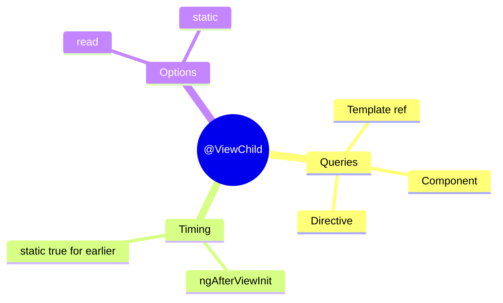

# 🎯 Use Case 1: Basic @ViewChild

> **💡 Lightbulb Moment**: @ViewChild queries elements or components in your component's OWN template!

---

## 1. 🔍 What is @ViewChild?

Queries a single element, directive, or component from the view (template).

```typescript
@Component({
    template: `
        <input #myInput />
        <app-child></app-child>
    `
})
export class ParentComponent implements AfterViewInit {
    @ViewChild('myInput') inputElement!: ElementRef<HTMLInputElement>;
    @ViewChild(ChildComponent) childComponent!: ChildComponent;
    
    ngAfterViewInit() {
        this.inputElement.nativeElement.focus();
        this.childComponent.doSomething();
    }
}
```

---

## 2. 🚀 Query Options

### Template Reference
```typescript
@ViewChild('container') container!: ElementRef;
```

### Component/Directive Type
```typescript
@ViewChild(ChildComponent) child!: ChildComponent;
@ViewChild(MyDirective) directive!: MyDirective;
```

### Read Different Type
```typescript
@ViewChild('myInput', { read: ElementRef }) input!: ElementRef;
@ViewChild('myInput', { read: NgModel }) model!: NgModel;
```

---

## 3. ❓ Interview Questions

### Basic Questions

#### Q1: When is @ViewChild available?
**Answer:** In `ngAfterViewInit` and after. Not available in constructor or ngOnInit.

#### Q2: What's the difference between ViewChild and ViewChildren?
**Answer:**
- **ViewChild**: Returns first match (single)
- **ViewChildren**: Returns QueryList of all matches

#### Q3: What does static: true mean?
**Answer:** Query is resolved before change detection (in ngOnInit). Use when element is always present (not in *ngIf):
```typescript
@ViewChild('input', { static: true }) input!: ElementRef;
```

---

### Scenario-Based Questions

#### Scenario: Focus Input on Load
**Question:** Auto-focus an input when component loads.

**Answer:**
```typescript
@ViewChild('emailInput') emailInput!: ElementRef<HTMLInputElement>;

ngAfterViewInit() {
    this.emailInput.nativeElement.focus();
}
```

---

## 🧠 Mind Map


