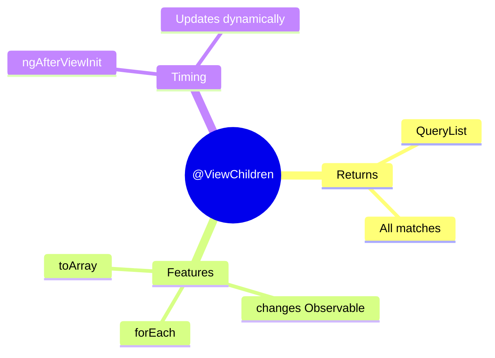

# 📋 Use Case 2: @ViewChildren

> **💡 Lightbulb Moment**: @ViewChildren returns a QueryList of ALL matching elements - and updates when the list changes!

---

## 1. 🔍 What is @ViewChildren?

Queries all matching elements, directives, or components.

```typescript
@Component({
    template: `
        @for (item of items; track item.id) {
            <app-item [data]="item"></app-item>
        }
    `
})
export class ListComponent implements AfterViewInit {
    @ViewChildren(ItemComponent) itemComponents!: QueryList<ItemComponent>;
    
    ngAfterViewInit() {
        console.log('Items:', this.itemComponents.length);
        
        // Subscribe to changes
        this.itemComponents.changes.subscribe(() => {
            console.log('List updated:', this.itemComponents.length);
        });
    }
}
```

---

## 2. 🚀 QueryList Features

```typescript
// Properties and methods
this.itemComponents.first;       // First item
this.itemComponents.last;        // Last item
this.itemComponents.length;      // Count
this.itemComponents.toArray();   // Convert to array
this.itemComponents.forEach(...); // Iterate
this.itemComponents.changes;     // Observable of changes
```

---

## 3. ❓ Interview Questions

### Basic Questions

#### Q1: When does QueryList update?
**Answer:** When items are added/removed from the DOM (like in *ngFor changes).

#### Q2: How to iterate ViewChildren?
**Answer:**
```typescript
this.itemComponents.forEach(item => item.highlight());
// OR
for (const item of this.itemComponents) { ... }
```

---

### Scenario-Based Questions

#### Scenario: Highlight All Items
**Question:** Add "highlight" method that highlights all items.

**Answer:**
```typescript
@ViewChildren(ItemComponent) items!: QueryList<ItemComponent>;

highlightAll() {
    this.items.forEach(item => item.setHighlight(true));
}
```

---

## 📋 Class Roster Analogy (Easy to Remember!)

Think of @ViewChildren like a **class roster**:

| Concept | Roster Analogy | Memory Trick |
|---------|---------------|--------------| 
| **@ViewChildren** | 📋 **Class roster**: List of all students | **"Get everyone"** |
| **QueryList** | 📝 **Live list**: Updates when students join/leave | **"Dynamic list"** |
| **first / last** | 👦👧 **First/last student**: Quick access | **"Ends of list"** |
| **forEach** | 📢 **Roll call**: "Alice? Bob? Charlie?" | **"Iterate all"** |
| **changes** | 🔔 **Attendance update**: "New student joined!" | **"Listen for changes"** |

### 📖 Story to Remember:

> 📋 **The Smart Classroom**
>
> You're a teacher with a magic roster:
>
> **Getting your roster:**
> ```typescript
> @ViewChildren(StudentComponent) students!: QueryList<StudentComponent>;
> ```
>
> **Using the roster:**
> ```typescript
> ngAfterViewInit() {
>   // 📢 Roll call
>   this.students.forEach(student => student.sayHere());
>   
>   // 👧 Check first student
>   const first = this.students.first;
>   
>   // 🔔 Listen for new students
>   this.students.changes.subscribe(() => {
>     console.log('Class size changed:', this.students.length);
>   });
> }
> ```
>
> **The roster updates itself when students come and go!**

### 🎯 Quick Reference:
```
📋 @ViewChildren   = Get ALL matching elements
📝 QueryList       = Live, updating list
👦 first/last      = Quick access to ends
📢 forEach         = Iterate everyone
🔔 changes         = Notification when list changes
```

---

## 🧠 Mind Map


