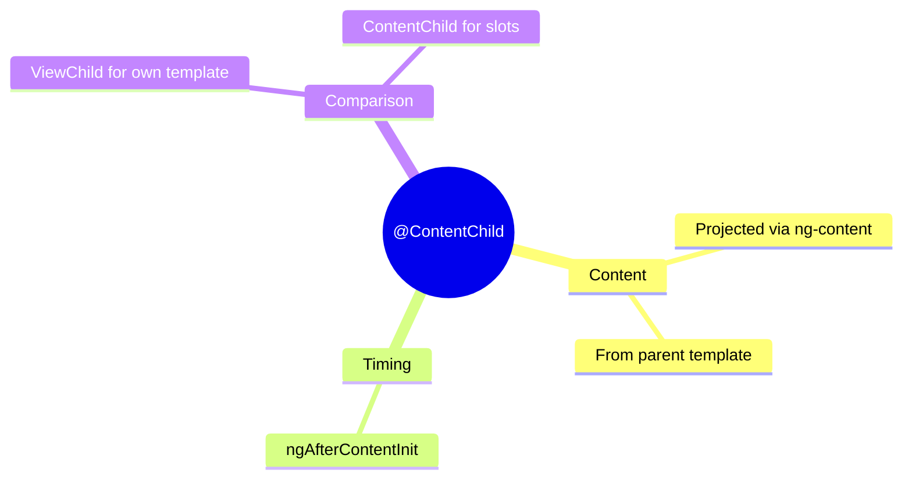

# 📦 Use Case 3: @ContentChild

> **💡 Lightbulb Moment**: @ContentChild queries PROJECTED content (stuff passed via <ng-content>)!

---

## 1. 🔍 What is @ContentChild?

Queries content that was projected into the component via ng-content.

```typescript
// Usage:
<app-card>
    <h2 header>Card Title</h2>
    <p>Card content</p>
</app-card>

// Card component:
@Component({
    template: `
        <div class="card">
            <ng-content select="[header]"></ng-content>
            <ng-content></ng-content>
        </div>
    `
})
export class CardComponent implements AfterContentInit {
    @ContentChild('header') headerEl!: ElementRef;
    
    ngAfterContentInit() {
        console.log('Header:', this.headerEl);
    }
}
```

---

## 2. 🚀 ViewChild vs ContentChild

| Aspect | @ViewChild | @ContentChild |
|--------|-----------|---------------|
| Queries | Own template | Projected content |
| Hook | ngAfterViewInit | ngAfterContentInit |
| Source | Component's view | Parent's template |

---

## 3. ❓ Interview Questions

### Basic Questions

#### Q1: When use ContentChild vs ViewChild?
**Answer:**
- **ViewChild**: For elements in YOUR template
- **ContentChild**: For elements PASSED BY parent

#### Q2: When is ContentChild available?
**Answer:** In `ngAfterContentInit` and after, NOT in ngOnInit.

---

### Scenario-Based Questions

#### Scenario: Tab Container
**Question:** Query the active tab from projected content.

**Answer:**
```typescript
// Usage
<app-tabs>
    <app-tab label="Tab 1" [active]="true">Content 1</app-tab>
    <app-tab label="Tab 2">Content 2</app-tab>
</app-tabs>

// Tabs component
@ContentChildren(TabComponent) tabs!: QueryList<TabComponent>;

ngAfterContentInit() {
    const activeTab = this.tabs.find(t => t.active);
}
```

---

## 🧠 Mind Map


