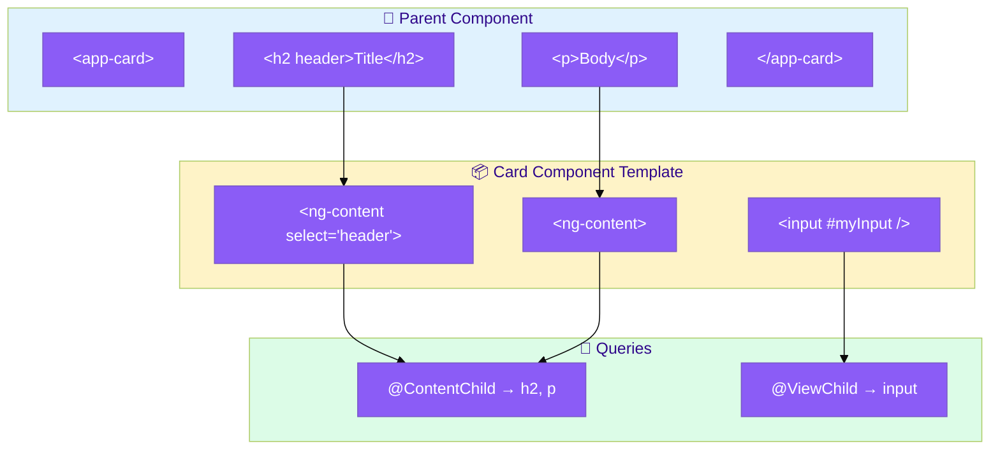
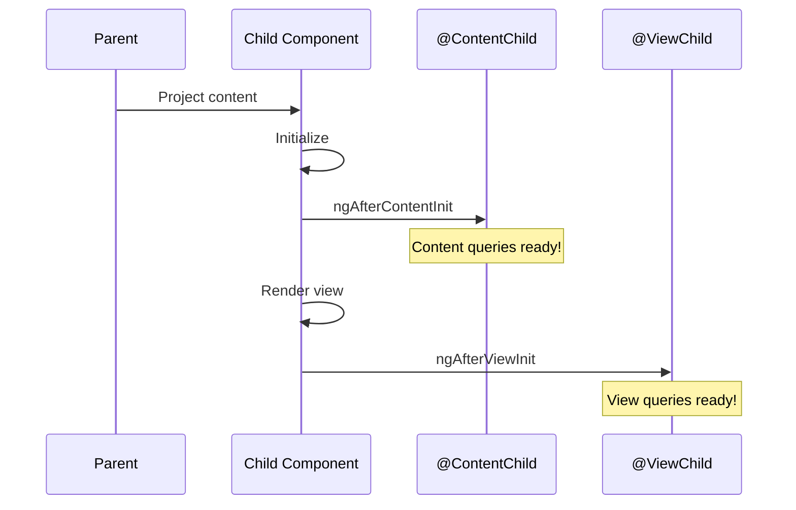
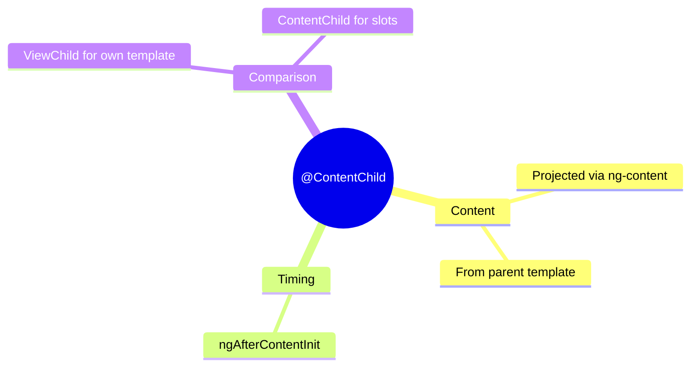

# 📦 Use Case 3: @ContentChild

> **💡 Lightbulb Moment**: @ContentChild queries PROJECTED content (stuff passed via <ng-content>)!

---

## 🔗 How @ContentChild Works: Deep Dive

> [!IMPORTANT]
> `@ContentChild` queries content that was **projected** into your component via `<ng-content>`. This is content from the **parent's template**, NOT your own!

### ViewChild vs ContentChild: Visual Comparison



### Lifecycle Timing: ContentChild vs ViewChild



### Step-by-Step: Query Resolution

| Query | Source | Available In | Use Case |
|-------|--------|--------------|----------|
| **@ViewChild** | Own template | `ngAfterViewInit` | Query your own elements |
| **@ContentChild** | Parent's projection | `ngAfterContentInit` | Query projected content |

### Code Mapping: Your Implementation

```html
<!-- PARENT: Projects content INTO child -->
<app-card>
    <h2 header>Card Title</h2>  👈 This is PROJECTED
    <p>Card content</p>         👈 This too
</app-card>
```

```typescript
// CHILD: Queries projected content
@Component({
    selector: 'app-card',
    template: `
        <div class="card">
            <ng-content select="[header]"></ng-content>  👈 Slot for header
            <ng-content></ng-content>                    👈 Slot for body
            <input #ownInput />                          👈 Own template element
        </div>
    `
})
export class CardComponent implements AfterContentInit, AfterViewInit {
    // Query PROJECTED content
    @ContentChild('header') headerEl!: ElementRef;
    
    // Query OWN template
    @ViewChild('ownInput') inputEl!: ElementRef;
    
    ngAfterContentInit() {
        console.log('Projected header:', this.headerEl);  // ✅ Available
    }
    
    ngAfterViewInit() {
        console.log('Own input:', this.inputEl);  // ✅ Available
    }
}
```

### Visual: What Goes Where

```
┌───────────────────────────────────────────────────────────┐
│ PARENT COMPONENT TEMPLATE                                 │
│                                                           │
│   <app-card>                                              │
│       <h2 header>Title</h2>  ──────────┐                 │
│       <p>Body text</p>       ──────────┤ @ContentChild   │
│   </app-card>                           │ queries THESE  │
│                                         ▼                 │
│ ┌───────────────────────────────────────────────────────┐ │
│ │ CHILD COMPONENT (app-card)                            │ │
│ │                                                       │ │
│ │   <ng-content select="[header]">  ← Receives h2       │ │
│ │   <ng-content>                    ← Receives p        │ │
│ │   <input #localInput />           ← @ViewChild HERE   │ │
│ │                                                       │ │
│ └───────────────────────────────────────────────────────┘ │
└───────────────────────────────────────────────────────────┘
```

> [!TIP]
> **Memory Trick**: `@ContentChild` = **mailbox** 📬 (content from outside), `@ViewChild` = **furniture** 🪑 (stuff inside your house)!

---

## 1. 🔍 What is @ContentChild?

Queries content that was projected into the component via ng-content.

```typescript
// Usage:
<app-card>
    <h2 header>Card Title</h2>
    <p>Card content</p>
</app-card>

// Card component:
@Component({
    template: `
        <div class="card">
            <ng-content select="[header]"></ng-content>
            <ng-content></ng-content>
        </div>
    `
})
export class CardComponent implements AfterContentInit {
    @ContentChild('header') headerEl!: ElementRef;
    
    ngAfterContentInit() {
        console.log('Header:', this.headerEl);
    }
}
```

---

## 2. 🚀 ViewChild vs ContentChild

| Aspect | @ViewChild | @ContentChild |
|--------|-----------|---------------|
| Queries | Own template | Projected content |
| Hook | ngAfterViewInit | ngAfterContentInit |
| Source | Component's view | Parent's template |

---

## 3. ❓ Interview Questions

### Basic Questions

#### Q1: When use ContentChild vs ViewChild?
**Answer:**
- **ViewChild**: For elements in YOUR template
- **ContentChild**: For elements PASSED BY parent

#### Q2: When is ContentChild available?
**Answer:** In `ngAfterContentInit` and after, NOT in ngOnInit.

---

### Scenario-Based Questions

#### Scenario: Tab Container
**Question:** Query the active tab from projected content.

**Answer:**
```typescript
// Usage
<app-tabs>
    <app-tab label="Tab 1" [active]="true">Content 1</app-tab>
    <app-tab label="Tab 2">Content 2</app-tab>
</app-tabs>

// Tabs component
@ContentChildren(TabComponent) tabs!: QueryList<TabComponent>;

ngAfterContentInit() {
    const activeTab = this.tabs.find(t => t.active);
}
```

---

## 📬 Mail Slot Analogy (Easy to Remember!)

Think of @ContentChild like a **mail slot** in your door:

| Concept | Mail Slot Analogy | Memory Trick |
|---------|------------------|--------------| 
| **@ViewChild** | 🏠 **Inside your house**: Things YOU put there | **"Own template"** |
| **@ContentChild** | 📬 **Mail slot**: Things OTHERS put through | **"Projected content"** |
| **ng-content** | 🚪 **The door opening**: Where stuff comes through | **"Slot container"** |
| **ngAfterContentInit** | 📮 **Mail arrived**: Now you can read it | **"Content ready"** |
| **Parent** | 📫 **Mailman**: Delivers content to your slot | **"Provides content"** |

### 📖 Story to Remember:

> 📬 **The House with a Mail Slot**
>
> Your component is a house:
>
> **Parent delivers mail:**
> ```html
> <app-card>
>   <h2 header>This is the mail! 📬</h2>
> </app-card>
> ```
>
> **Card receives through slot:**
> ```typescript
> @Component({
>   template: `<ng-content select="[header]"></ng-content>`
>                  // 🚪 Mail slot!
> })
> export class CardComponent implements AfterContentInit {
>   @ContentChild('header') headerEl!: ElementRef;  // 📬 What came through
>   
>   ngAfterContentInit() {  // 📮 Mail arrived!
>     console.log('Mail:', this.headerEl);
>   }
> }
> ```

### 🎯 Quick Reference:
```
🏠 @ViewChild      = Inside your house (own template)
📬 @ContentChild   = Through mail slot (projected)
🚪 ng-content      = The slot/door opening
📮 AfterContentInit = Mail has arrived
📫 Parent          = Mailman (delivers)
```

---

## 🧠 Mind Map


