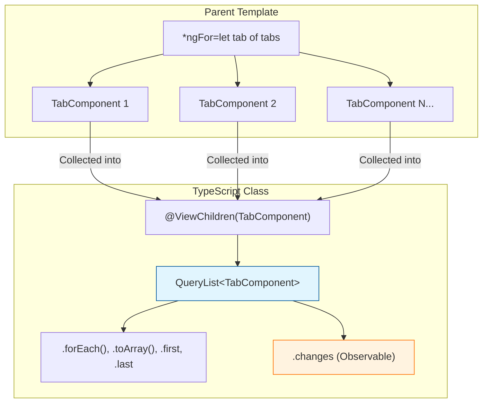
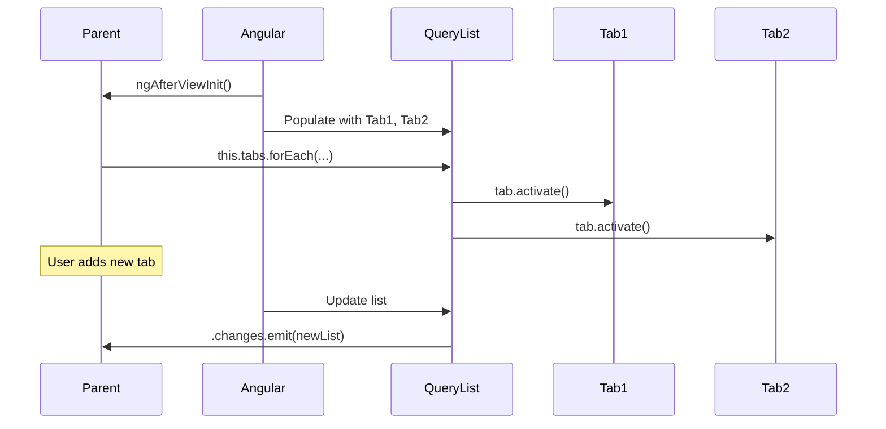

# 📚 Use Case 3: `@ViewChildren` and `QueryList`

> **Goal**: Learn how to query **multiple** child components or elements at once and iterate/react to changes.

---

## 1. 🔍 How It Works (The Concept)

### The Mechanism
`@ViewChild` gives you **one** child. `@ViewChildren` gives you **all** children matching the query.
The result is a `QueryList<T>`, a special Angular collection that:
*   Holds all matching child references.
*   Updates automatically when children are added/removed (e.g., via `*ngFor`).
*   Provides a `.changes` Observable to react to these updates.

### Default vs. Optimized Behavior
*   **Default (Manual Tracking)**: You maintain your own array `childRefs: ChildComponent[] = []` and try to keep it in sync. Error-prone.
*   **Optimized (ViewChildren)**: Angular automatically tracks all children for you and provides a reactive `QueryList`.

### 📊 Data Flow Diagram



---

## 2. 🚀 Step-by-Step Implementation Guide

### Step 1: Create Multiple Child Components
Use `*ngFor` to render many children.

```html
<!-- parent.component.html -->
<app-tab *ngFor="let tab of tabData" [label]="tab.label"></app-tab>
```

### Step 2: Query with `@ViewChildren`
Use `@ViewChildren` (plural!) to get all matching children.

```typescript
// parent.component.ts
import { Component, ViewChildren, QueryList, AfterViewInit } from '@angular/core';
import { TabComponent } from './tab.component';

@Component({ ... })
export class ParentComponent implements AfterViewInit {
  // 🛡️ CRITICAL: Use ViewChildren (plural), not ViewChild
  @ViewChildren(TabComponent) tabs!: QueryList<TabComponent>;

  tabData = [{ label: 'Home' }, { label: 'Profile' }, { label: 'Settings' }];

  ngAfterViewInit() {
    console.log('Total tabs:', this.tabs.length);
    console.log('First tab:', this.tabs.first);
    console.log('Last tab:', this.tabs.last);
  }

  activateAll() {
    // 🛡️ CRITICAL: Iterate using forEach
    this.tabs.forEach(tab => tab.activate());
  }

  getTabArray(): TabComponent[] {
    return this.tabs.toArray();
  }
}
```

### Step 3: React to Dynamic Changes
Subscribe to `.changes` if children can be added/removed at runtime.

```typescript
ngAfterViewInit() {
  this.tabs.changes.subscribe((queryList: QueryList<TabComponent>) => {
    console.log('Tabs changed! New count:', queryList.length);
  });
}
```

### 📊 Implementation Visualization



---

## 3. 🐛 Common Pitfalls & Debugging

### ❌ Using `@ViewChild` instead of `@ViewChildren`
**Bad Code:**
```typescript
@ViewChild(TabComponent) tab!: TabComponent; // Only gets the FIRST one
```
**Fix:** Use `@ViewChildren`:
```typescript
@ViewChildren(TabComponent) tabs!: QueryList<TabComponent>; // ✅ Gets ALL
```

### ❌ Treating `QueryList` as a Native Array
**Bad Code:**
```typescript
const third = this.tabs[2]; // ❌ QueryList doesn't support bracket access
```
**Fix:** Convert to array or use methods:
```typescript
const third = this.tabs.toArray()[2]; // ✅
// Or use get()
const third = this.tabs.get(2);
```

---

## 4. ⚡ Performance & Architecture

### Performance: `QueryList` Overhead
*   `QueryList` is efficient. Angular only updates it when children actually change.
*   Avoid calling `.toArray()` repeatedly in templates, cache it if needed.

### Architecture: Managing Collections
*   Great for **Tab Bars**, **Accordion Panels**, **Checkbox Groups**.
*   Parent can enforce "single selection" by iterating all children and deactivating others.

---

## 5. 🌍 Real World Use Cases

1.  **Tab Bar**: Iterate all tabs, deactivate all, then activate the clicked one.
2.  **Form Field Validation**: Query all `<app-input>` components in a form and call `.validate()` on each.
3.  **Gallery/Carousel**: Get all slide components and control their visibility or animation state.

---

## 6. 📝 The Analogy: "The Class Roster" 📋

Imagine you're a teacher with a classroom of students.
*   **`@ViewChild`**: You call on ONE specific student by name.
*   **`@ViewChildren`**: You have a **Class Roster** (QueryList). It lists ALL students.
*   **`.forEach()`**: You walk through the roster and ask each student to stand up.
*   **`.changes`**: If a new student joins mid-semester, the school office (Angular) updates your roster automatically.

---

## 7. ❓ Interview & Concept Questions

### Q1: What is `QueryList`?
**A:** A live, read-only Angular collection that holds all matching children. It auto-updates when children are dynamically added or removed.

### Q2: When does `QueryList.changes` emit?
**A:** It emits after Angular detects that the set of matched children has changed (e.g., an `*ngFor` adds or removes an item).

### Q3: How do I get the third element from a `QueryList`?
**A:** Use `.toArray()[2]` or `.get(2)`.

### Q4: Can I use `@ViewChildren` with a template reference string?
**A:** Yes. `@ViewChildren('myRef') items!: QueryList<ElementRef>`.

### Q5: Is `QueryList` an Observable?
**A:** `QueryList` itself is not an Observable, but its `.changes` property IS an Observable that emits the entire `QueryList` whenever it updates.
