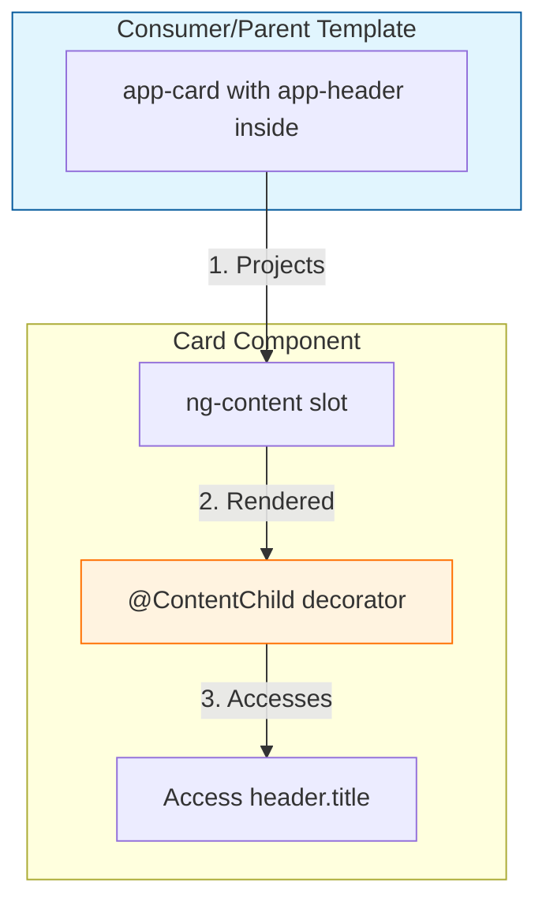
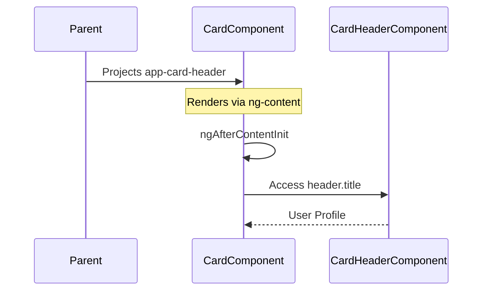

# 📦 Use Case 4: Basic `@ContentChild` (Content Projection)

> **Goal**: Understand the difference between **View** and **Content**, and learn how to access projected components with `@ContentChild`.

---

## 1. 🔍 How It Works (The Concept)

### The Mechanism
**Content Projection** is like a "slot" system. A component can have `<ng-content>` placeholders. The *consumer* of that component can "project" (inject) their own content into those slots.
*   `@ViewChild`: Queries elements **written in your own template**.
*   `@ContentChild`: Queries elements **projected INTO your component from outside**.

### Default vs. Optimized Behavior
*   **Default (No Access)**: You use `<ng-content>` to display projected content, but you can't programmatically interact with it.
*   **Optimized (ContentChild)**: You can now access the projected component, call its methods, read its properties.

### 📊 Data Flow Diagram



---

## 2. 🚀 Step-by-Step Implementation Guide

### Step 1: Create a "Container" Component with `<ng-content>`
This component receives content from outside.

```typescript
// card.component.ts
@Component({
  selector: 'app-card',
  template: `
    <div class="card">
      <!-- Slot for header content -->
      <ng-content select="app-card-header"></ng-content>
      <!-- Default slot for all other content -->
      <ng-content></ng-content>
    </div>
  `
})
export class CardComponent implements AfterContentInit {
  // 🛡️ CRITICAL: Use @ContentChild, not @ViewChild
  @ContentChild(CardHeaderComponent) header?: CardHeaderComponent;

  // 🛡️ CRITICAL: Use AfterContentInit, not AfterViewInit
  ngAfterContentInit() {
    console.log('Header title:', this.header?.title);
  }
}
```

### Step 2: Create the "Projected" Component (Header)

```typescript
// card-header.component.ts
@Component({
  selector: 'app-card-header',
  template: `<header>{{ title }}</header>`
})
export class CardHeaderComponent {
  @Input() title: string = '';
}
```

### Step 3: The Consumer (Parent) Projects Content

```html
<!-- parent.component.html -->
<app-card>
  <app-card-header title="User Profile"></app-card-header>
  <p>This is the card body content.</p>
</app-card>
```

### 📊 Implementation Visualization



---

## 3. 🐛 Common Pitfalls & Debugging

### ❌ Using `@ViewChild` Instead of `@ContentChild`
**Bad Code (in CardComponent):**
```typescript
@ViewChild(CardHeaderComponent) header?: CardHeaderComponent; // ❌ Will be undefined!
```
**Why it fails:** `@ViewChild` only queries content defined *in your own template*. The header is projected FROM the parent, so you need `@ContentChild`.

### ❌ Using `ngAfterViewInit` Instead of `ngAfterContentInit`
**Bad Code:**
```typescript
ngAfterViewInit() {
  console.log(this.header?.title); // ❌ Might be undefined or stale!
}
```
**Fix:** Use `ngAfterContentInit`. Content is initialized *before* the view.

---

## 4. ⚡ Performance & Architecture

### Performance
*   `@ContentChild` has the same low overhead as `@ViewChild`. It's just a query.
*   Be mindful of excessive re-projections in complex scenarios (e.g., `*ngFor` of projected content).

### Architecture: Composable Components
This is the core of **Composition over Inheritance**. You create small, reusable "container" components (`<app-card>`, `<app-modal>`, `<app-panel>`) and let consumers decide what goes inside.

---

## 5. 🌍 Real World Use Cases

1.  **Card/Panel Components**: A `<material-card>` that accepts a `<mat-card-header>` and `<mat-card-content>`.
2.  **Tabs**: A `<tabs>` container that accepts multiple `<tab>` children and reads their `label` properties.
3.  **Dialogs/Modals**: A `<modal>` that accepts a `<modal-header>`, `<modal-body>`, and `<modal-footer>`.

---

## 6. 📝 The Analogy: "The Gift Box" 🎁

Imagine a **Gift Box** (`app-card`).
*   The box manufacturer (you) creates the box with slots: "Put card here", "Put gift here".
*   The gift giver (Parent Component) puts a **card** and a **gift** (the projected content) into the box.
*   The box (using `@ContentChild`) can peek inside: "Ah, the card says 'Happy Birthday'!".

---

## 7. ❓ Interview & Concept Questions

### Q1: What is the difference between `@ViewChild` and `@ContentChild`?
**A:** `@ViewChild` queries elements in your component's own template. `@ContentChild` queries elements that are **projected into** your component via `<ng-content>`.

### Q2: What lifecycle hook should I use to access `@ContentChild`?
**A:** `ngAfterContentInit`. This is called *before* `ngAfterViewInit` because content is initialized first.

### Q3: What is `<ng-content select="...">`?
**A:** It's a way to create **named slots**. `select="app-header"` will only project elements matching that selector into that specific slot.

### Q4: Can I have multiple `<ng-content>` without selectors?
**A:** Only the *first* one will receive the default content. Subsequent `<ng-content>` tags without selectors will be empty.

### Q5: What is `@ContentChildren`?
**A:** The plural version of `@ContentChild`. It returns a `QueryList` of all projected children matching the query, similar to `@ViewChildren`.
