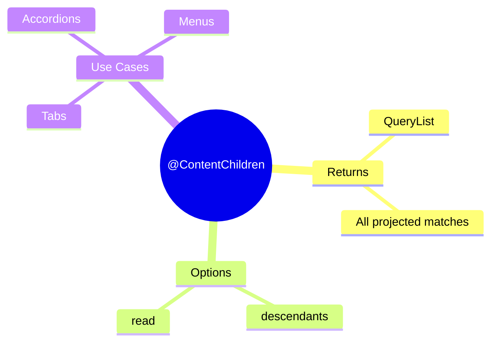

# 📋 Use Case 4: @ContentChildren

> **💡 Lightbulb Moment**: @ContentChildren queries ALL projected content matching a selector - with a reactive QueryList!

---

## 1. 🔍 What is @ContentChildren?

Queries all matching projected content from ng-content.

```typescript
// Parent usage:
<app-menu>
    <app-menu-item>Home</app-menu-item>
    <app-menu-item>About</app-menu-item>
    <app-menu-item>Contact</app-menu-item>
</app-menu>

// Menu component:
@Component({
    template: `<ng-content></ng-content>`
})
export class MenuComponent implements AfterContentInit {
    @ContentChildren(MenuItemComponent) items!: QueryList<MenuItemComponent>;
    
    ngAfterContentInit() {
        console.log('Menu items:', this.items.length);  // 3
    }
}
```

---

## 2. 🚀 Common Patterns

### Collect Items
```typescript
@ContentChildren(TabComponent) tabs!: QueryList<TabComponent>;

ngAfterContentInit() {
    this.tabs.first?.activate();
}
```

### React to Changes
```typescript
ngAfterContentInit() {
    this.items.changes.subscribe(() => {
        this.recalculateLayout();
    });
}
```

---

## 3. ❓ Interview Questions

### Basic Questions

#### Q1: descendants option - what does it do?
**Answer:** By default, ContentChildren only queries direct children. With `descendants: true`, it queries nested content too:
```typescript
@ContentChildren(ItemComponent, { descendants: true })
```

---

### Scenario-Based Questions

#### Scenario: Accordion
**Question:** Build accordion that finds all panels.

**Answer:**
```typescript
@ContentChildren(AccordionPanelComponent) panels!: QueryList<AccordionPanelComponent>;

expandFirst() {
    this.panels.first?.expand();
}

collapseAll() {
    this.panels.forEach(p => p.collapse());
}
```

---

## 📮 Mailbag Analogy (Easy to Remember!)

Think of @ContentChildren like a **mailbag full of letters**:

| Concept | Mailbag Analogy | Memory Trick |
|---------|----------------|--------------| 
| **@ContentChild** | ✉️ **One letter**: Single projected item | **"First match"** |
| **@ContentChildren** | 📮 **Full mailbag**: All letters delivered | **"All matches"** |
| **QueryList** | 📋 **Letter inventory**: List with count, first, last | **"Collection"** |
| **.changes** | 🔔 **New mail alert**: Notified when letters added | **"Subscribe to changes"** |
| **descendants** | 📦 **Nested packages**: Check inside envelopes too | **"Deep query"** |

### 📖 Story to Remember:

> 📮 **The Post Office**
>
> Collecting all menu items:
>
> **Many letters delivered:**
> ```html
> <app-menu>
>   <app-menu-item>Home</app-menu-item>     <!-- ✉️ Letter 1 -->
>   <app-menu-item>About</app-menu-item>    <!-- ✉️ Letter 2 -->
>   <app-menu-item>Contact</app-menu-item>  <!-- ✉️ Letter 3 -->
> </app-menu>
> ```
>
> **Collect the whole mailbag:**
> ```typescript
> @ContentChildren(MenuItemComponent) items!: QueryList<MenuItemComponent>;
> // 📮 Mailbag with 3 letters!
> 
> ngAfterContentInit() {
>   console.log('Letters:', this.items.length);  // 3
>   this.items.first?.highlight();  // 📋 First letter
>   
>   this.items.changes.subscribe(() => {  // 🔔 New mail!
>     console.log('New letters arrived!');
>   });
> }
> ```

### 🎯 Quick Reference:
```
✉️ @ContentChild    = One letter (single)
📮 @ContentChildren = Mailbag (all matches)
📋 QueryList        = Inventory (first, last, length)
🔔 .changes         = New mail notification
📦 descendants      = Check nested packages
```

---

## 🧠 Mind Map


