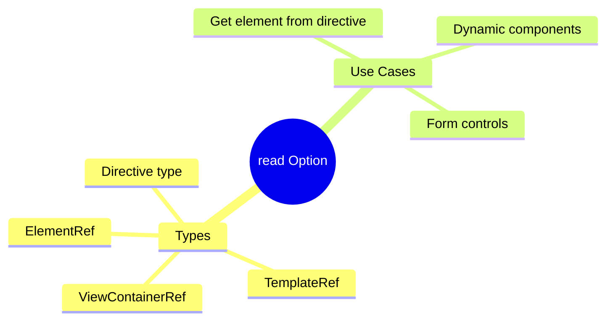

# 🔧 Use Case 5: read Option

> **💡 Lightbulb Moment**: The read option lets you get a DIFFERENT type from what you're querying!

---

## 1. 🔍 What is the read Option?

Specifies what to read from the queried element.

```typescript
<!-- Template -->
<input #email [(ngModel)]="emailValue">

// Query - different ways to read the same element
@ViewChild('email') inputRef!: ElementRef;
@ViewChild('email', { read: NgModel }) ngModel!: NgModel;
@ViewChild('email', { read: ViewContainerRef }) vcr!: ViewContainerRef;
```

---

## 2. 🚀 Common Read Types

| read Type | Returns |
|-----------|---------|
| `ElementRef` | Native element wrapper |
| `TemplateRef` | Template reference |
| `ViewContainerRef` | Container for dynamic views |
| `NgModel` | Form control |
| Component type | Component instance |

---

## 3. ❓ Interview Questions

### Basic Questions

#### Q1: When do you need read option?
**Answer:** When the default resolved type isn't what you need:
```typescript
// Default returns NgModel directive
@ViewChild('input') input!: NgModel;

// But you want the element
@ViewChild('input', { read: ElementRef }) inputElement!: ElementRef;
```

---

### Scenario-Based Questions

#### Scenario: Dynamic Component Host
**Question:** Get ViewContainerRef from an element for dynamic components.

**Answer:**
```typescript
<ng-container #host></ng-container>

@ViewChild('host', { read: ViewContainerRef }) hostVcr!: ViewContainerRef;

loadComponent() {
    this.hostVcr.createComponent(DynamicComponent);
}
```

---

## 🧠 Mind Map


