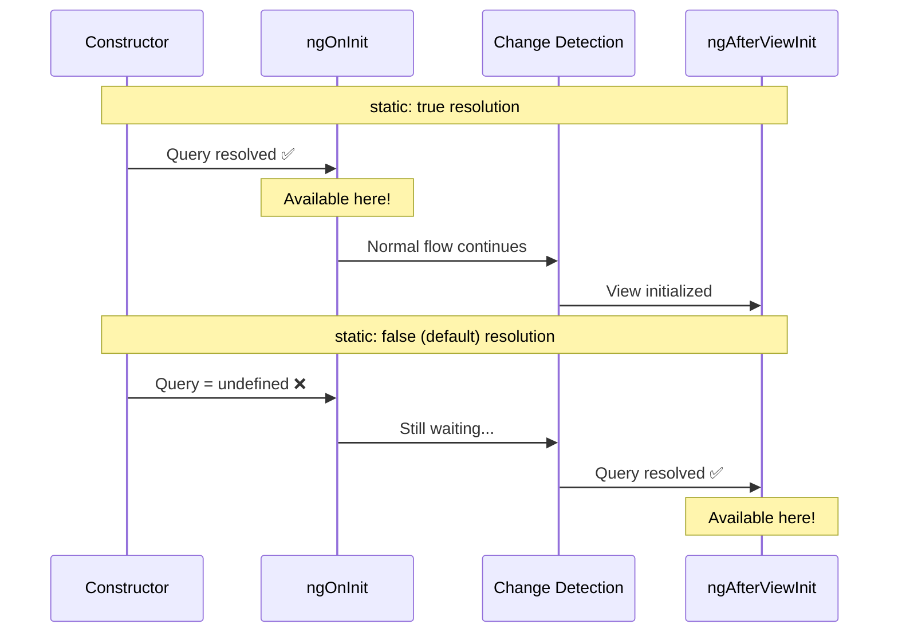
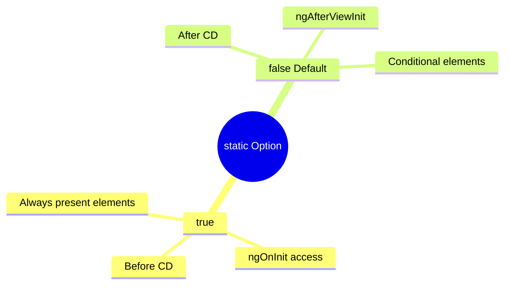

# ⏰ Use Case 6: static Option

> **💡 Lightbulb Moment**: static: true resolves the query BEFORE change detection - useful when element is always present!

---

## 🔗 How the static Option Works: Deep Dive

> [!IMPORTANT]
> The `static` option controls **WHEN** the query is resolved. `static: true` = early (ngOnInit), `static: false` (default) = late (ngAfterViewInit).

### Query Resolution Timing



### When to Use Each

| Condition | Use `static:` |
|-----------|---------------|
| Element is **always present** | `true` |
| Need query in **ngOnInit** | `true` |
| Element is **inside *ngIf** | `false` (default) |
| Element is **inside *ngFor** | `false` (default) |
| Can wait for **ngAfterViewInit** | `false` (default) |

### Visual: Element Availability Timeline

```
Component Lifecycle:

constructor → ngOnChanges → ngOnInit → ngDoCheck → ngAfterContentInit → ngAfterViewInit
                              ↑                                              ↑
                              │                                              │
                      static: true ✅                               static: false ✅
                      (resolved here)                               (resolved here)
```

> [!TIP]
> **Memory Trick**: `static: true` = **early bird** 🐦 (gets the worm in ngOnInit), `static: false` = **fashionably late** 🕐 (arrives at ngAfterViewInit)!

---

## 1. 🔍 What is the static Option?

Controls WHEN the query is resolved.

```typescript
// Static - resolved in ngOnInit (before CD)
@ViewChild('input', { static: true }) inputEarly!: ElementRef;

// Dynamic (default) - resolved in ngAfterViewInit
@ViewChild('input', { static: false }) inputLater!: ElementRef;
```

---

## 2. 🚀 When to Use

| static: true | static: false (default) |
|--------------|-------------------------|
| Element always exists | Element may be conditional |
| Need in ngOnInit | Can wait for ngAfterViewInit |
| No *ngIf on element | Has *ngIf or other structural |

---

## 3. ❓ Interview Questions

### Basic Questions

#### Q1: Why would you use static: true?
**Answer:** When you need the element in `ngOnInit` and the element is always present (not in *ngIf).

#### Q2: What happens with static: true on *ngIf element?
**Answer:** The query will be undefined if *ngIf is false, because static resolution happens before *ngIf evaluates.

---

### Scenario-Based Questions

#### Scenario: Initialize Chart in OnInit
**Question:** You need canvas reference in ngOnInit (canvas always exists).

**Answer:**
```typescript
<canvas #chart></canvas>

@ViewChild('chart', { static: true }) canvas!: ElementRef;

ngOnInit() {
    // Works! Canvas is resolved early
    this.initChart(this.canvas.nativeElement);
}
```

---

## 🧠 Mind Map


