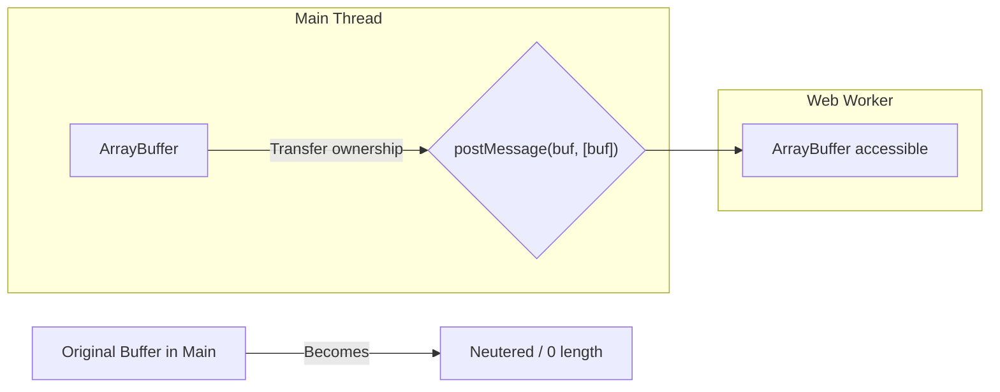
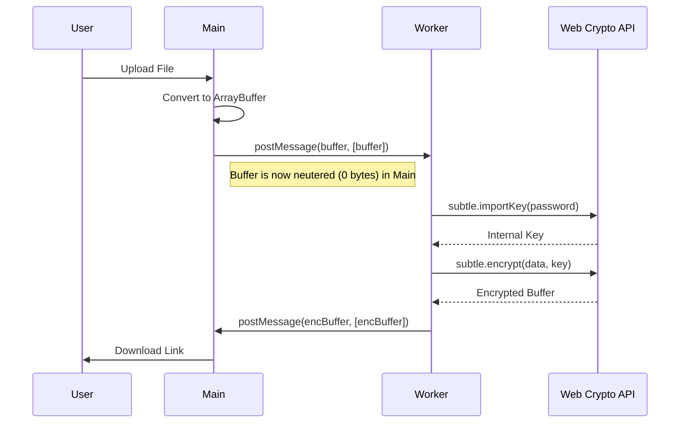

# 🔐 File Encryption & Web Crypto API


## 📋 Table of Contents
- [📑 Index](#index)
- [🎯 What Problem Does This Solve?](#what-problem-does-this-solve)
  - [The Problem](#the-problem)
  - [The Solution](#the-solution)
- [🔍 How It Works](#how-it-works)
  - [Transferable Objects Explained](#transferable-objects-explained)
  - [Encryption Flow](#encryption-flow)
- [🚀 Implementation](#implementation)
  - [1. The Worker (Encryption Logic)](#1-the-worker-encryption-logic)
  - [2. The Component (Data Transfer)](#2-the-component-data-transfer)
- [🗄️ The Secure Courier Analogy](#the-secure-courier-analogy)
- [🧠 Mind Map](#mind-map)
- [📚 Key Classes & Types](#key-classes--types)
  - [1. `ArrayBuffer`](#1-arraybuffer)
  - [2. `SubtleCrypto`](#2-subtlecrypto)
  - [3. `Transferable`](#3-transferable)
- [🌍 Real-World Use Cases](#real-world-use-cases)
  - [1. **Secure Document Platforms**](#1-secure-document-platforms)
  - [2. **Browser-Based Password Managers**](#2-browser-based-password-managers)
  - [3. **Video Content Protection**](#3-video-content-protection)
  - [4. **Tor-like Browsing/VPNs**](#4-tor-like-browsingvpns)
  - [5. **Blockchain Wallets**](#5-blockchain-wallets)
- [❓ Interview Questions](#interview-questions)
  - [Basic (1-8)](#basic-1-8)
  - [Intermediate (9-16)](#intermediate-9-16)
  - [Advanced (17-25)](#advanced-17-25)

---
## 📑 Index
1. [🎯 What Problem Does This Solve?](#-what-problem-does-this-solve)
2. [🔍 How It Works](#-how-it-works)
3. [🚀 Implementation](#-implementation)
4. [🗄️ The Secure Courier Analogy](#-the-secure-courier-analogy)
5. [🧠 Mind Map](#-mind-map)
6. [📚 Key Classes & Types](#-key-classes--apis)
7. [🌍 Real-World Use Cases](#-real-world-use-cases)
8. [❓ Interview Questions](#-interview-questions)

---

## 🎯 What Problem Does This Solve?

### The Problem
Cryptographic operations (hashing, encryption/decryption) are extremely CPU-intensive. Processing a 100MB file on the main thread would:

| Issue | Impact |
|-------|--------|
| **Data Copying Overhead** | Copying large files between threads consumes memory and time |
| **Main Thread Latency** | Applying AES-GCM or SHA-512 to large blocks of data freezes the UI |
| **PWA Performance** | Heavy JS crypto libraries are slower than native browser APIs |
| **Security Risk** | Storing sensitive data in main thread memory for long periods |

### The Solution
Web Workers combined with **Transferable Objects** and the **Web Crypto API**:
- ✅ **Zero-Copy Transfer**: Move `ArrayBuffer` without memory overhead.
- ✅ **Background Crypto**: Native-speed encryption in background threads.
- ✅ **Secure Keys**: Handle cryptographic keys securely in a separate context.

---

## 🔍 How It Works

### Transferable Objects Explained
Unlike standard `postMessage` which **copies** data (O(n) time), Transferable objects **transfer** ownership (O(1) time).



### Encryption Flow


---

## 🚀 Implementation

### 1. The Worker (Encryption Logic)
```typescript
// file-encryption.worker.ts
addEventListener('message', async ({ data }) => {
  const { buffer, password } = data;
  
  // 1. Derive Key
  const key = await crypto.subtle.importKey(
    "raw", new TextEncoder().encode(password), "PBKDF2", false, ["deriveKey"]
  );
  
  // 2. Encrypt
  const encrypted = await crypto.subtle.encrypt(
    { name: "AES-GCM", iv: crypto.getRandomValues(new Uint8Array(12)) },
    key,
    buffer
  );

  // 3. Return (transfer back)
  postMessage({ encrypted }, [encrypted]);
});
```

### 2. The Component (Data Transfer)
```typescript
async encryptFile(file: File) {
  const buffer = await file.arrayBuffer();
  
  // Send to worker and list 'buffer' as transferable
  this.worker.postMessage({ buffer, password: 'secret' }, [buffer]);
  
  console.log(buffer.byteLength); // Prints 0! (Neutered)
}
```

---

## 🗄️ The Secure Courier Analogy

Think of **Transferable Objects** like a **Physical Safety Deposit Box**:

- **Copying (Standard postMessage)**: You take all the gold out of your box, make a perfect copy of every piece, and send the copy to a friend. You now have two boxes of gold, doubling the weight and space.
- **Transferring (Transferable Objects)**: You simply hand over the **physical key** and the **box** to the courier. You no longer have the box (Main thread loses access). Your friend now has the only box. No new gold was created, and no extra weight was carried.
- **Web Crypto API**: The **Black Box** inside the vault that performs the scrambling. You don't see the internal gears; you just put data in and get scrambled data out.

---

## 🧠 Mind Map

```
                    Secure File Processing
                             │
            ┌────────────────┴────────────────┐
            │                                 │
     DATA TRANSFER                     WEBCRYPTO API
            │                                 │
     ┌──────┴──────┐                  ┌──────┴──────┐
     │ Transferable│                  │ SubtleCrypto│
     │ Zero Copy   │                  │ Hashing     │
     │ ArrayBuffer │                  │ AES-GCM     │
     └─────────────┘                  └─────────────┘
```

---

## 📚 Key Classes & Types

### 1. `ArrayBuffer`
- A generic, fixed-length raw binary data buffer.

### 2. `SubtleCrypto`
-Accessed via `crypto.subtle`.
- Methods: `encrypt()`, `decrypt()`, `sign()`, `verify()`, `digest()`, `importKey()`.

### 3. `Transferable`
- Interface for objects that can be transferred between threads.
- Examples: `ArrayBuffer`, `MessagePort`, `ImageBitmap`, `OffscreenCanvas`.

---

## 🌍 Real-World Use Cases

### 1. **Secure Document Platforms**
Browsers in legal/medical platforms encrypt files locally before they ever reach the server (Client-Side Encryption).

### 2. **Browser-Based Password Managers**
Hashing Master Passwords and encrypting vault data using salt and multi-round hashing without blocking the UI.

### 3. **Video Content Protection**
Decrypting DRM-protected video chunks in a worker thread for seamless playback.

### 4. **Tor-like Browsing/VPNs**
Performing frequent packet encryption/decryption in background threads for secure tunnels.

### 5. **Blockchain Wallets**
Signing transactions and generating keys for Ethereum/Bitcoin in a separate worker context for security and performance.

---

## ❓ Interview Questions

### Basic (1-8)
1. **What is the Web Crypto API?**
2. **What are Transferable Objects?**
3. **What does it mean for an ArrayBuffer to be "neutered"?**
4. **Why is AES-GCM preferred over older algorithms?**
5. **How do you send a Transferable object to a Worker?**
6. **Can you access the Web Crypto API inside a Worker?**
7. **What is an "Initialization Vector" (IV)?**
8. **What is the difference between Symmetric and Asymmetric encryption?**

### Intermediate (9-16)
9. **How do you convert a string to an ArrayBuffer? (`TextEncoder`)**
10. **What is the performance benefit of `transfer` vs `clone`?**
11. **Explain PBKDF2 and its role in deriving keys from passwords.**
12. **Can you transfer an Object that *contains* an ArrayBuffer?**
13. **How do you handle the IV for decryption? (Prepending to data)**
14. **What is the difference between `SubtleCrypto.digest()` and `encrypt()`?**
15. **What happens if you try to use a neutered buffer in the main thread?**
16. **Is the Web Crypto API synchronous or asynchronous?**

### Advanced (17-25)
17. **How do you implement "Streaming Encryption" for files larger than memory?**
18. **Explain the benefits of AES-GCM (Authenticated Encryption).**
19. **Can you transfer a `Blob`? (No, but you can transfer its ArrayBuffer)**
20. **How do you generate a cryptographically secure random number? (`getRandomValues`)**
21. **What is the security advantage of using non-extractable keys?**
22. **Compare Web Crypto API performance to WASM implementations (like Libsodium).**
23. **How would you implement RSA key pair generation in a worker?**
24. **Can you transfer an `ImageBitmap`? What is the use case?**
25. **How would you unit test cryptographic logic in a worker?**
