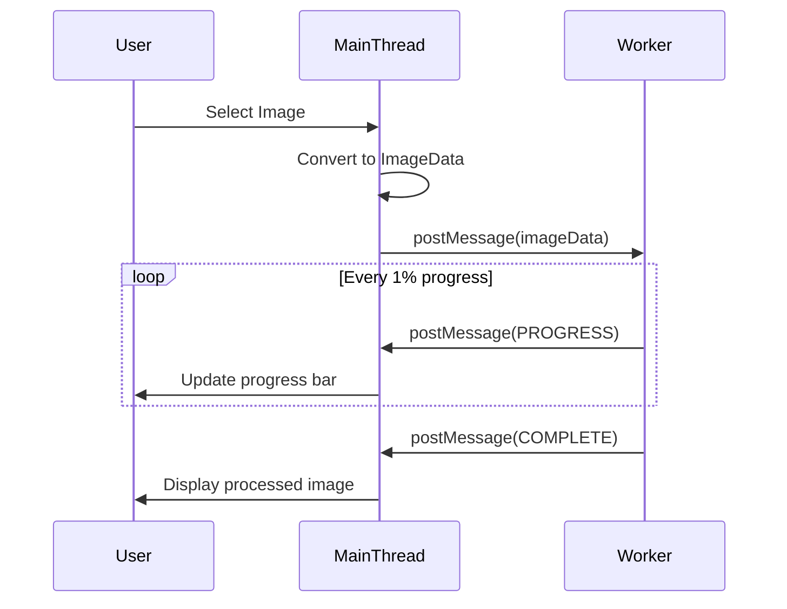
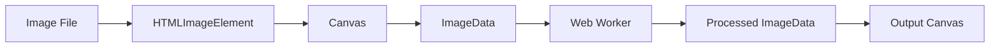

# 🖼️ Image Processing with Web Workers


## 📋 Table of Contents
- [📑 Index](#index)
- [🎯 What Problem Does This Solve?](#what-problem-does-this-solve)
  - [The Problem](#the-problem)
  - [The Solution](#the-solution)
  - [Comparison: With vs Without Workers](#comparison-with-vs-without-workers)
- [🔍 How It Works](#how-it-works)
  - [Architecture Flow](#architecture-flow)
  - [Data Flow](#data-flow)
  - [Key Concepts](#key-concepts)
- [🚀 Implementation](#implementation)
  - [Step 1: Create the Worker File](#step-1-create-the-worker-file)
  - [Step 2: Initialize Worker in Component](#step-2-initialize-worker-in-component)
  - [Step 3: Send Image Data](#step-3-send-image-data)
  - [Filter Implementations](#filter-implementations)
- [🎨 Photo Lab Analogy](#photo-lab-analogy)
- [🧠 Mind Map](#mind-map)
- [📚 Key Classes & APIs](#key-classes--apis)
  - [ImageData](#imagedata)
  - [Worker API](#worker-api)
  - [Canvas API for Images](#canvas-api-for-images)
- [🌍 Real-World Use Cases](#real-world-use-cases)
  - [1. **Photo Editing Apps**](#1-photo-editing-apps)
  - [2. **Social Media Image Upload**](#2-social-media-image-upload)
  - [3. **E-commerce Product Images**](#3-e-commerce-product-images)
  - [4. **Medical Imaging**](#4-medical-imaging)
  - [5. **Game Asset Processing**](#5-game-asset-processing)
- [❓ Interview Questions](#interview-questions)
  - [Basic (1-8)](#basic-1-8)
  - [Intermediate (9-16)](#intermediate-9-16)
  - [Advanced (17-25)](#advanced-17-25)

---
## 📑 Index
1. [🎯 What Problem Does This Solve?](#-what-problem-does-this-solve)
2. [🔍 How It Works](#-how-it-works)
3. [🚀 Implementation](#-implementation)
4. [🎨 Photo Lab Analogy](#-photo-lab-analogy)
5. [🧠 Mind Map](#-mind-map)
6. [📚 Key Classes & APIs](#-key-classes--apis)
7. [🌍 Real-World Use Cases](#-real-world-use-cases)
8. [❓ Interview Questions](#-interview-questions)

---

## 🎯 What Problem Does This Solve?

### The Problem
When processing images (applying filters, resizing, format conversion), the operations require iterating through every pixel. For a 1920x1080 image, that's **2+ million pixels** to process. Running this on the main thread:

| Issue | Impact |
|-------|--------|
| **UI Freezes** | Page becomes unresponsive for seconds |
| **Browser Warning** | "Page unresponsive" dialogs appear |
| **Poor UX** | Users can't interact while processing |
| **Lost Interactions** | Clicks and keystrokes are ignored |
| **Animation Stutter** | CSS animations and transitions freeze |

### The Solution
Web Workers process images in a **background thread**, keeping the main thread free for:
- ✅ User interactions (clicks, scrolling)
- ✅ Animations and transitions
- ✅ Real-time progress updates
- ✅ Responsive UI throughout processing

### Comparison: With vs Without Workers

| Aspect | Main Thread | Web Worker |
|--------|-------------|------------|
| UI During Processing | ❌ Frozen | ✅ Responsive |
| Progress Updates | ❌ None visible | ✅ Real-time |
| User Can Cancel | ❌ No | ✅ Yes |
| Memory Efficiency | ⚠️ Shared | ⚠️ Copied (or transferred) |

---

## 🔍 How It Works

### Architecture Flow



### Data Flow



### Key Concepts

1. **ImageData**: Raw pixel array (RGBA values)
2. **Canvas API**: Extract/render pixel data
3. **postMessage**: Send data between threads
4. **Structured Clone**: How data is copied to worker

---

## 🚀 Implementation

### Step 1: Create the Worker File

```typescript
// image-processing.worker.ts
/// <reference lib="webworker" />

addEventListener('message', ({ data }) => {
  if (data.type === 'PROCESS_IMAGE') {
    const result = processImage(data.imageData, data.filter);
    postMessage({ type: 'COMPLETE', result });
  }
});

function processImage(imageData: ImageData, filter: any): ImageData {
  const pixels = new Uint8ClampedArray(imageData.data);
  
  for (let i = 0; i < pixels.length; i += 4) {
    // Apply filter to each pixel (RGBA)
    applyFilter(pixels, i, filter);
    
    // Report progress every 1%
    if (i % (pixels.length / 100) === 0) {
      postMessage({ type: 'PROGRESS', progress: (i / pixels.length) * 100 });
    }
  }
  
  return new ImageData(pixels, imageData.width, imageData.height);
}
```

### Step 2: Initialize Worker in Component

```typescript
// Angular component
private worker: Worker;

ngOnInit(): void {
  // Angular CLI-friendly worker creation
  this.worker = new Worker(
    new URL('./image-processing.worker', import.meta.url)
  );

  this.worker.onmessage = (event) => {
    if (event.data.type === 'PROGRESS') {
      this.progress = event.data.progress;
    } else if (event.data.type === 'COMPLETE') {
      this.displayResult(event.data.result);
    }
  };
}
```

### Step 3: Send Image Data

```typescript
processImage(): void {
  // Get ImageData from canvas
  const canvas = document.createElement('canvas');
  const ctx = canvas.getContext('2d')!;
  ctx.drawImage(this.image, 0, 0);
  const imageData = ctx.getImageData(0, 0, canvas.width, canvas.height);

  // Send to worker
  this.worker.postMessage({
    type: 'PROCESS_IMAGE',
    imageData: imageData,
    filter: { type: 'grayscale' }
  });
}
```

### Filter Implementations

| Filter | Algorithm | Code |
|--------|-----------|------|
| Grayscale | Average RGB | `avg = (R + G + B) / 3` |
| Sepia | Weighted formula | `R*0.393 + G*0.769 + B*0.189` |
| Brightness | Multiply | `R * factor, G * factor, B * factor` |
| Contrast | Distance from 128 | `128 + (R - 128) * factor` |
| Invert | Complement | `255 - R, 255 - G, 255 - B` |

---

## 🎨 Photo Lab Analogy

Think of image processing like a **photo development lab**:

| Concept | Photo Lab | Web Workers |
|---------|-----------|-------------|
| **Main Thread** | Front desk (customer service) | UI interactions |
| **Web Worker** | Darkroom (processing) | Image processing |
| **postMessage** | Order slip passed to darkroom | Data sent to worker |
| **Progress Updates** | "Your order is 50% done" | Progress percentage |
| **onmessage** | Picking up finished photos | Receiving result |

> **Key Insight**: Just like a photo lab doesn't make customers wait in the darkroom, your UI shouldn't wait for image processing!

---

## 🧠 Mind Map

```
                    Image Processing Worker
                            │
        ┌───────────────────┼───────────────────┐
        │                   │                   │
    📥 INPUT            ⚙️ PROCESS          📤 OUTPUT
        │                   │                   │
   ┌────┴────┐        ┌─────┴─────┐       ┌────┴────┐
   │ImageData│        │ Filters:  │       │ImageData│
   │(RGBA)   │        │ grayscale │       │(modified)│
   │         │        │ blur      │       │         │
   └─────────┘        │ sepia     │       └─────────┘
                      │ brightness│
                      └───────────┘
                            │
                     Progress Updates
                            │
                      ┌─────┴─────┐
                      │ 25% → 50% │
                      │ → 75% →   │
                      │ 100%      │
                      └───────────┘
```

---

## 📚 Key Classes & APIs

### ImageData
```typescript
interface ImageData {
  data: Uint8ClampedArray;  // RGBA values (4 bytes per pixel)
  width: number;
  height: number;
}
```

### Worker API
```typescript
// Create worker
const worker = new Worker(new URL('./worker.ts', import.meta.url));

// Send message
worker.postMessage(data);
worker.postMessage(data, [transferable]); // With transferable

// Receive message
worker.onmessage = (event: MessageEvent) => { };
worker.onerror = (error: ErrorEvent) => { };

// Cleanup
worker.terminate();
```

### Canvas API for Images
```typescript
// Get ImageData
const ctx = canvas.getContext('2d');
const imageData = ctx.getImageData(x, y, width, height);

// Put ImageData
ctx.putImageData(imageData, x, y);
```

---

## 🌍 Real-World Use Cases

### 1. **Photo Editing Apps**
Web-based photo editors (like Photopea, Pixlr) use workers to apply filters without freezing the UI.

### 2. **Social Media Image Upload**
Resize and compress images before upload while showing progress and allowing cancel.

### 3. **E-commerce Product Images**
Batch process product photos with watermarks, resizing, and optimization.

### 4. **Medical Imaging**
Process high-resolution scans (X-rays, MRIs) with real-time progress feedback.

### 5. **Game Asset Processing**
Apply effects to game textures dynamically without impacting game performance.

---

## ❓ Interview Questions

### Basic (1-8)
1. **Why can't Web Workers access the DOM?**
2. **What is ImageData and how is it structured?**
3. **How do you create a Web Worker in Angular?**
4. **What's the difference between `postMessage` and direct function calls?**
5. **Why do we use `new URL('./worker.ts', import.meta.url)`?**
6. **How do you handle errors in Web Workers?**
7. **What happens to the worker when you navigate away from the page?**
8. **How do you terminate a Web Worker?**

### Intermediate (9-16)
9. **Explain the Structured Clone Algorithm used by postMessage.**
10. **What are Transferable Objects and when should you use them for images?**
11. **How would you implement cancellation for a long-running image process?**
12. **What's the overhead of creating a Web Worker vs reusing one?**
13. **How do you report progress from a worker without blocking?**
14. **Compare using a worker vs using requestAnimationFrame for image processing.**
15. **How would you handle out-of-memory errors when processing large images?**
16. **What's the difference between Dedicated and Shared Workers for image processing?**

### Advanced (17-25)
17. **How would you implement OffscreenCanvas for worker-based rendering?**
18. **Explain how to use WebGL in a Web Worker for GPU-accelerated image processing.**
19. **How would you implement a streaming image processor with chunked results?**
20. **What's the performance impact of copying large ImageData vs transferring?**
21. **How would you implement worker pooling for batch image processing?**
22. **Explain the security implications of loading workers from different origins.**
23. **How would you implement WASM-based image processing in a worker?**
24. **Compare Web Workers vs WebGPU for image processing performance.**
25. **How would you unit test image processing worker logic?**

---

> **Pro Tip**: Always terminate workers when component is destroyed to prevent memory leaks!
> ```typescript
> ngOnDestroy(): void {
>   this.worker?.terminate();
> }
> ```
