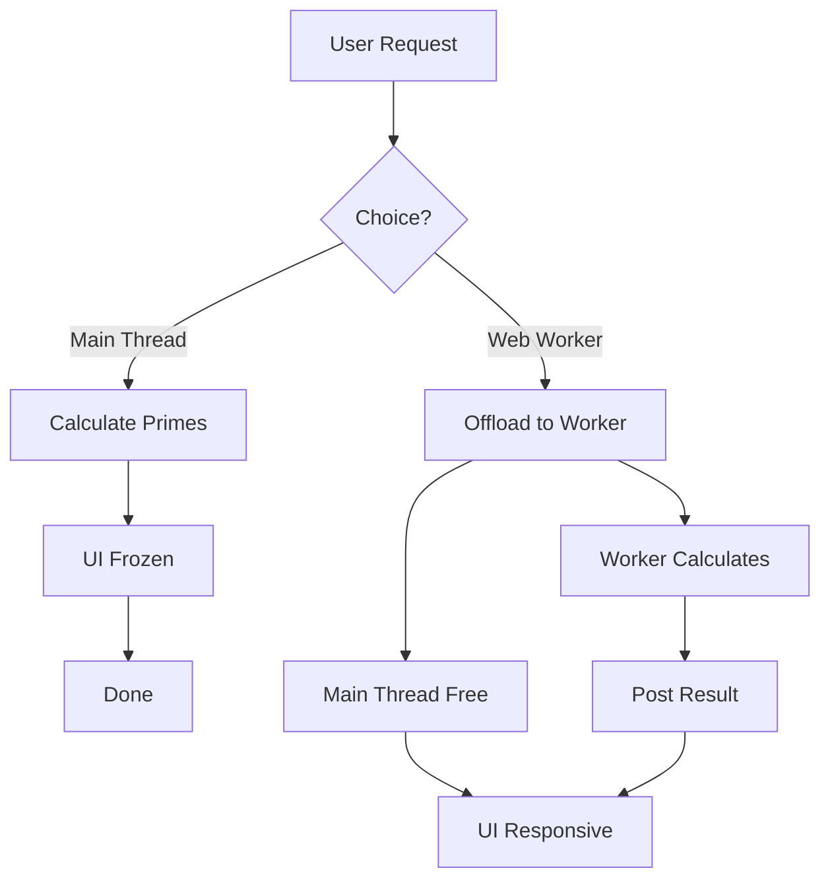

# 🔢 Prime Calculation - Main Thread vs Web Worker


## 📋 Table of Contents
- [📑 Index](#index)
- [🎯 What Problem Does This Solve?](#what-problem-does-this-solve)
  - [The Problem](#the-problem)
  - [The Solution](#the-solution)
- [🔍 How It Works](#how-it-works)
  - [The Event Loop Visualization](#the-event-loop-visualization)
  - [With Web Workers](#with-web-workers)
  - [Performance Benchmark](#performance-benchmark)
- [🚀 Implementation](#implementation)
  - [1. Main Thread Implementation (Blocks UI)](#1-main-thread-implementation-blocks-ui)
  - [2. Web Worker Implementation (Smooth UI)](#2-web-worker-implementation-smooth-ui)
- [🗄️ The Restaurant Kitchen Analogy](#the-restaurant-kitchen-analogy)
- [🧠 Mind Map](#mind-map)
- [📚 Key Classes & APIs](#key-classes--apis)
  - [1. The `Worker` Class](#1-the-worker-class)
  - [2. The `self` Scope](#2-the-self-scope)
  - [3. Transferable Objects](#3-transferable-objects)
- [🌍 Real-World Use Cases](#real-world-use-cases)
  - [1. **Scientific Simulations**](#1-scientific-simulations)
  - [2. **Financial Forecasting**](#2-financial-forecasting)
  - [3. **AI / Machine Learning**](#3-ai--machine-learning)
  - [4. **Crypto Mining / Hashing**](#4-crypto-mining--hashing)
  - [5. **Compression Algorithms**](#5-compression-algorithms)
- [❓ Interview Questions](#interview-questions)
  - [Basic (1-8)](#basic-1-8)
  - [Intermediate (9-16)](#intermediate-9-16)
  - [Advanced (17-25)](#advanced-17-25)

---
## 📑 Index
1. [🎯 What Problem Does This Solve?](#-what-problem-does-this-solve)
2. [🔍 How It Works](#-how-it-works)
3. [🚀 Implementation](#-implementation)
4. [🗄️ The Restaurant Kitchen Analogy](#-the-restaurant-kitchen-analogy)
5. [🧠 Mind Map](#-mind-map)
6. [📚 Key Classes & Types](#-key-classes--apis)
7. [🌍 Real-World Use Cases](#-real-world-use-cases)
8. [❓ Interview Questions](#-interview-questions)

---

## 🎯 What Problem Does This Solve?

### The Problem
JavaScript is single-threaded. CPU-intensive calculations like finding prime numbers or large matrix multiplications block the **Main Thread (UI Thread)**:

| Issue | Impact |
|-------|--------|
| **UI Freeze** | Animations stop, buttons don't click |
| **User Frustration** | The app feels "dead" or crashed |
| **Event Loop Blocking** | Microtasks and macrotasks wait until the calculation finish |
| **Input Lag** | Mouse moves and typing are processed only *after* the calculation |

### The Solution
Web Workers offload heavy calculations to a **separate background thread**.



---

## 🔍 How It Works

### The Event Loop Visualization
In a standard environment, the **Main Thread** handles everything. If a task takes 5 seconds, the UI is dead for 5 seconds.

```
Main Thread Timeline:
[-- Task: Hover --][-- Task: Prime Calculation (Blocks everything for 5s) --][-- Task: Click --]
                                  ^ UI IS FROZEN HERE ^
```

### With Web Workers
```
Main Thread: [ UI ][ UI ][ UI ][ Animation ][ UI ]
                 \                      /
Worker Thread:    [ Prime Calculation ]
```

### Performance Benchmark
| Limit | Main Thread (Sync) | Web Worker (Async) | UI Status |
|-------|-------------------|-------------------|-----------|
| 100k  | ~500ms            | ~500ms            | ⚠️ Stutter |
| 500k  | ~2.5s             | ~2.5s             | ❌ Frozen |
| 1M    | ~5s               | ~5s               | 💀 Dead   |

---

## 🚀 Implementation

### 1. Main Thread Implementation (Blocks UI)
```typescript
// Component code
calculatePrimesSync(limit: number) {
  const primes = [];
  for(let i = 2; i <= limit; i++) {
    if(this.isPrime(i)) primes.push(i);
  }
  return primes; // UI is frozen until return
}
```

### 2. Web Worker Implementation (Smooth UI)
```typescript
// prime.worker.ts
addEventListener('message', ({ data }) => {
  const result = findPrimes(data.limit);
  postMessage(result);
});

// Component code
runInWorker() {
  const worker = new Worker(new URL('./prime.worker', import.meta.url));
  worker.postMessage({ limit: 1000000 });
  worker.onmessage = ({ data }) => {
    this.primes = data;
  };
}
```

---

## 🗄️ The Restaurant Kitchen Analogy

Think of your application as a **Small Restaurant**:

- **Main Thread**: The **Waiter**. They take orders, serve food, and handle the cash register (UI).
- **CPU Task (Prime Calculation)**: A complex order, like **Baking 100 loaves of bread** from scratch.
- **The Problem**: If the Waiter goes into the kitchen to bake the bread themselves, there is **no one to serve the customers**. The front door is open, but customers are ignored.
- **The Web Worker Solution**: The Waiter hires a **Dedicated Baker** (Web Worker) in a separate room. The Waiter hands the order to the Baker and continues serving customers. When the bread is ready, the Baker rings a bell (onmessage) to let the Waiter know.

---

## 🧠 Mind Map

```
                    Prime Calculation
                           │
           ┌───────────────┴───────────────┐
           │                               │
     MAIN THREAD                     WEB WORKER
           │                               │
    ┌──────┴──────┐                 ┌──────┴──────┐
    │ Synchronous │                 │ Asynchronous│
    │ Blocks UI   │                 │ Parallel    │
    │ Input Lag   │                 │ Responsive  │
    └─────────────┘                 └─────────────┘
```

---

## 📚 Key Classes & APIs

### 1. The `Worker` Class
- `constructor(url, options)`: Creates the worker.
- `postMessage(data)`: Sends data to the thread.
- `onmessage`: Listens for responses.
- `terminate()`: Stops the worker immediately.

### 2. The `self` Scope
- Inside the worker, `self` (or just omitting it) refers to the worker's Global Scope. It is NOT the `window` object.

### 3. Transferable Objects
- High-performance way to move large data (like `ArrayBuffer`) without copying.

---

## 🌍 Real-World Use Cases

### 1. **Scientific Simulations**
Running physics or chemical simulations in the browser without freezing the dashboard.

### 2. **Financial Forecasting**
Calculating compound interest or stock projections over 30 years with millions of data points.

### 3. **AI / Machine Learning**
Running small neural network inferences (like TensorFlow.js or ONNX) in the background.

### 4. **Crypto Mining / Hashing**
Calculating proof-of-work or complex hashes in background threads.

### 5. **Compression Algorithms**
Zipping or unzipping large files (Gzip/Brotli) locally in the browser.

---

## ❓ Interview Questions

### Basic (1-8)
1. **Explain the single-threaded nature of JavaScript.**
2. **What happens to the UI when a heavy loop runs on the main thread?**
3. **How does a Web Worker help with performance?**
4. **Can a Web Worker access the `document` or `window`? Why?**
5. **How do you pass data into a Web Worker?**
6. **How do you receive data from a Web Worker?**
7. **What is the difference between a Worker and an async/Promise?**
8. **When should you NOT use a Web Worker?**

### Intermediate (9-16)
9. **How do you debug code running inside a Web Worker?**
10. **What is the `postMessage` overhead?**
11. **Explain the Structured Clone Algorithm.**
12. **Can workers make Network Requests (Fetch/XHR)?**
13. **How many Web Workers can you spawn?**
14. **What is the difference between a Dedicated Worker and a Service Worker?**
15. **How do you handle errors within a Worker?**
16. **Explain the lifecycle of a Web Worker.**

### Advanced (17-25)
17. **What are Transferable Objects (`ArrayBuffer`, `MessagePort`)?**
18. **Explain the "Worker Thread Pooling" pattern.**
19. **How would you implement a timeout for a Worker task?**
20. **Can you use Third-Party libraries inside a Worker? (`importScripts`)**
21. **Explain the memory implications of having too many Workers.**
22. **How does the `self` scope differ from the `window` scope?**
23. **Can Workers communicate with other Workers?**
24. **How do Web Workers interact with the `SharedArrayBuffer`?**
25. **How would you test a component that relies on Web Workers?**
