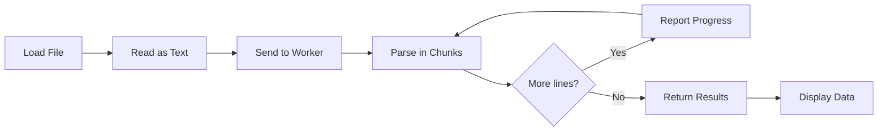
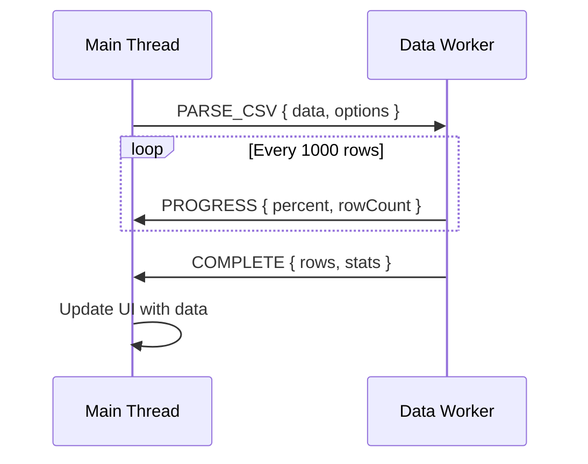

# 📊 Use Case 2: Data Processing with Web Workers

## 📑 Index
1. [🎯 What Problem Does This Solve?](#-what-problem-does-this-solve)
2. [🔍 How It Works](#-how-it-works)
3. [🚀 Implementation](#-implementation)
4. [📦 Warehouse Sorting Analogy](#-warehouse-sorting-analogy)
5. [🧠 Mind Map](#-mind-map)
6. [📚 Key Classes & APIs](#-key-classes--apis)
7. [🌍 Real-World Use Cases](#-real-world-use-cases)
8. [❓ Interview Questions](#-interview-questions)

---

## 🎯 What Problem Does This Solve?

### The Problem
Parsing large CSV or JSON files (thousands of rows) on the main thread causes:

| Issue | Impact |
|-------|--------|
| **UI Freeze** | Page becomes unresponsive during parsing |
| **No Progress Feedback** | Users don't know how long to wait |
| **Memory Pressure** | Large strings block garbage collection |
| **Timeout Errors** | Browsers may kill long-running scripts |
| **No Cancel Option** | Users stuck waiting for completion |

### The Solution
Web Workers parse data in chunks, providing:
- ✅ **Progress Updates** - Real-time percentage completion
- ✅ **Responsive UI** - Users can still interact
- ✅ **Streaming Results** - Data available before full completion
- ✅ **Cancellable** - Users can abort long operations

### Performance Comparison

| Data Size | Main Thread | Web Worker | UI Impact |
|-----------|-------------|------------|-----------|
| 1,000 rows | 50ms | 50ms | Both OK |
| 10,000 rows | 500ms | 500ms | Main: Stutters, Worker: Smooth |
| 100,000 rows | 5s | 5s | Main: Frozen, Worker: Responsive |
| 1,000,000 rows | 50s+ | 50s | Main: Page crash, Worker: Works |

---

## 🔍 How It Works

### Architecture Flow



### Message Flow



### Chunked Processing Concept

```
File: 100,000 rows
├─ Chunk 1 (1-1000)    → Progress: 1%
├─ Chunk 2 (1001-2000) → Progress: 2%
├─ Chunk 3 (2001-3000) → Progress: 3%
...
└─ Chunk 100 (99001-100000) → Progress: 100%
```

---

## 🚀 Implementation

### Step 1: Worker File

```typescript
// data-processing.worker.ts
/// <reference lib="webworker" />

addEventListener('message', ({ data }) => {
  switch (data.type) {
    case 'PARSE_CSV':
      parseCSV(data.content, data.options);
      break;
    case 'PARSE_JSON':
      parseJSON(data.content);
      break;
    case 'ANALYZE':
      analyzeData(data.rows);
      break;
  }
});

function parseCSV(content: string, options: ParseOptions): void {
  const lines = content.trim().split('\n');
  const headers = lines[0].split(options.delimiter);
  const rows: any[] = [];
  
  for (let i = 1; i < lines.length; i++) {
    const values = lines[i].split(options.delimiter);
    const row: Record<string, string> = {};
    
    headers.forEach((header, idx) => {
      row[header.trim()] = values[idx]?.trim() || '';
    });
    
    rows.push(row);
    
    // Report progress every 1000 rows
    if (i % 1000 === 0) {
      postMessage({
        type: 'PROGRESS',
        progress: Math.floor((i / lines.length) * 100),
        rowCount: i
      });
    }
  }
  
  postMessage({
    type: 'COMPLETE',
    result: { rows, headers, stats: { totalRows: rows.length } }
  });
}
```

### Step 2: Component Integration

```typescript
@Component({ ... })
export class DataProcessingComponent implements OnInit, OnDestroy {
  private worker: Worker;
  progress = 0;
  data: any[] = [];
  
  ngOnInit(): void {
    this.worker = new Worker(
      new URL('./data-processing.worker', import.meta.url)
    );
    
    this.worker.onmessage = ({ data }) => {
      if (data.type === 'PROGRESS') {
        this.progress = data.progress;
      } else if (data.type === 'COMPLETE') {
        this.data = data.result.rows;
        this.isProcessing = false;
      }
    };
  }
  
  async processFile(file: File): Promise<void> {
    this.isProcessing = true;
    const content = await file.text();
    
    this.worker.postMessage({
      type: 'PARSE_CSV',
      content,
      options: { delimiter: ',' }
    });
  }
  
  ngOnDestroy(): void {
    this.worker?.terminate();
  }
}
```

### Step 3: Statistical Analysis

```typescript
function analyzeData(rows: any[]): void {
  const numericStats: Record<string, Stats> = {};
  const categoryCounts: Record<string, Record<string, number>> = {};
  
  const keys = Object.keys(rows[0]);
  
  keys.forEach(key => {
    const values = rows.map(r => r[key]);
    const numericValues = values.filter(v => !isNaN(Number(v))).map(Number);
    
    if (numericValues.length === values.length) {
      // Numeric column
      numericStats[key] = {
        min: Math.min(...numericValues),
        max: Math.max(...numericValues),
        avg: numericValues.reduce((a, b) => a + b, 0) / numericValues.length,
        sum: numericValues.reduce((a, b) => a + b, 0)
      };
    } else {
      // Categorical column
      categoryCounts[key] = {};
      values.forEach(v => {
        categoryCounts[key][v] = (categoryCounts[key][v] || 0) + 1;
      });
    }
  });
  
  postMessage({ type: 'ANALYSIS_COMPLETE', numericStats, categoryCounts });
}
```

---

## 📦 Warehouse Sorting Analogy

Think of data processing like a **warehouse sorting facility**:

| Concept | Warehouse | Web Workers |
|---------|-----------|-------------|
| **Main Thread** | Reception desk | UI handling |
| **Web Worker** | Sorting floor | Data parsing |
| **CSV File** | Truck full of packages | Raw data |
| **Rows** | Individual packages | Data records |
| **Progress** | "Sorted 500 of 1000 packages" | Percentage complete |
| **Chunked Processing** | Sort 100 at a time | Parse rows in batches |

> **Key Insight**: Just like a warehouse doesn't stop receiving calls while sorting, your UI shouldn't freeze while parsing!

---

## 🧠 Mind Map

```
                    Data Processing Worker
                            │
        ┌───────────────────┼───────────────────┐
        │                   │                   │
   📥 INPUT            ⚙️ OPERATIONS         📤 OUTPUT
        │                   │                   │
   ┌────┴────┐        ┌─────┴─────┐       ┌────┴────┐
   │ CSV     │        │ PARSE     │       │ Rows[]  │
   │ JSON    │        │ VALIDATE  │       │ Stats   │
   │ Text    │        │ TRANSFORM │       │ Errors  │
   └─────────┘        │ ANALYZE   │       └─────────┘
                      └───────────┘
                            │
                     Progress Events
                            │
                      ┌─────┴─────┐
                      │ Parsed: 50%│
                      │ Found: 5000│
                      │ Errors: 3  │
                      └───────────┘
```

---

## 📚 Key Classes & APIs

### File API
```typescript
// Read file as text
const content = await file.text();

// Read file as ArrayBuffer
const buffer = await file.arrayBuffer();

// Read with FileReader (callback-based)
const reader = new FileReader();
reader.onload = (e) => console.log(e.target.result);
reader.readAsText(file);
```

### Worker Message Types
```typescript
interface ParseMessage {
  type: 'PARSE_CSV' | 'PARSE_JSON';
  content: string;
  options?: {
    delimiter?: string;
    hasHeader?: boolean;
  };
}

interface ProgressMessage {
  type: 'PROGRESS';
  progress: number;  // 0-100
  rowCount: number;
}

interface CompleteMessage {
  type: 'COMPLETE';
  result: {
    rows: any[];
    headers: string[];
    stats: Statistics;
  };
}
```

### Statistics Types
```typescript
interface Statistics {
  totalRows: number;
  numericStats: Record<string, NumericStats>;
  categoryCounts: Record<string, Record<string, number>>;
}

interface NumericStats {
  min: number;
  max: number;
  avg: number;
  sum: number;
}
```

---

## 🌍 Real-World Use Cases

### 1. **Excel/CSV Import in CRM**
Import thousands of customer records without freezing the UI.

### 2. **Log File Analysis**
Parse server logs with real-time progress and statistics.

### 3. **Financial Data Processing**
Analyze transaction data with running totals and aggregations.

### 4. **Survey Results**
Process survey responses with category breakdowns.

### 5. **E-commerce Product Import**
Bulk import product catalogs with validation feedback.

---

## ❓ Interview Questions

### Basic (1-8)
1. **Why parse CSV in a Web Worker instead of main thread?**
2. **How do you read a file's contents in JavaScript?**
3. **What's the difference between `file.text()` and `FileReader`?**
4. **How do you report progress from a worker?**
5. **What happens if you send a 500MB file to a worker?**
6. **How do you handle parsing errors in a worker?**
7. **What's the memory impact of parsing large files?**
8. **How do you cancel a running parse operation?**

### Intermediate (9-16)
9. **Explain chunked processing and why it matters for progress reporting.**
10. **How would you stream results back before parsing completes?**
11. **Compare JSON.parse performance vs streamed JSON parsing.**
12. **How would you validate data types during parsing?**
13. **What's the overhead of postMessage for large datasets?**
14. **How would you implement CSV parsing with custom delimiters?**
15. **Explain backpressure when streaming large datasets.**
16. **How would you handle different character encodings?**

### Advanced (17-25)
17. **How would you implement parallel CSV parsing across multiple workers?**
18. **Explain using SharedArrayBuffer for zero-copy data sharing.**
19. **How would you implement WASM-based CSV parsing for better performance?**
20. **Compare Web Workers vs Streams API for large file processing.**
21. **How would you implement resumable parsing for interrupted uploads?**
22. **Explain memory management when parsing files larger than available RAM.**
23. **How would you implement incremental result rendering during parsing?**
24. **Compare Comlink library vs raw postMessage for worker communication.**
25. **How would you unit test CSV parsing worker logic?**

---

> **Pro Tip**: For very large files, consider using the Streams API with workers for memory-efficient processing!
> ```typescript
> const stream = file.stream();
> const reader = stream.getReader();
> // Process chunks as they arrive
> ```
