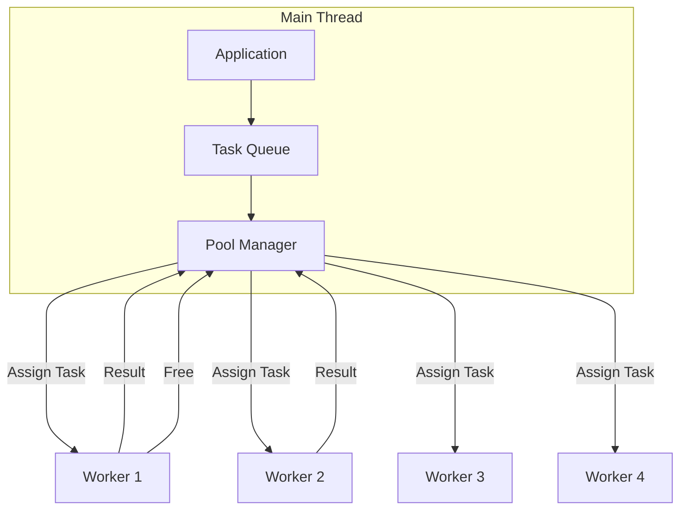

# 🏊 Use Case 5: Worker Pool Pattern

## 📑 Index
1. [🎯 What Problem Does This Solve?](#-what-problem-does-this-solve)
2. [🔍 How It Works](#-how-it-works)
3. [🚀 Implementation](#-implementation)
4. [🗄️ The Taxi Dispatcher Analogy](#-the-taxi-dispatcher-analogy)
5. [🧠 Mind Map](#-mind-map)
6. [📚 Key Classes & Types](#-key-classes--apis)
7. [🌍 Real-World Use Cases](#-real-world-use-cases)
8. [❓ Interview Questions](#-interview-questions)

---

## 🎯 What Problem Does This Solve?

### The Problem
While a single Web Worker runs in the background, it still has limitations:
- **Sequential Processing**: One worker can only handle **one task at a time**.
- **CPU Underutilization**: Modern devices have multiple cores (4, 8, or even 16). A single worker only uses **one core**.
- **Blocking Tasks**: If you send 100 images to one worker, image #100 must wait for #1 through #99 to finish.

### The Solution: Worker Pool
A **Worker Pool** manages a collection of workers to execute tasks in parallel:
- ✅ **True Parallelism**: Utilize all available CPU cores simultaneously.
- ✅ **Task Queueing**: Automatically queue tasks and assign them as workers become free.
- ✅ **Load Balancing**: Distribute heavy work evenly across the hardware.

---

## 🔍 How It Works

### The Architecture
The Pool Manager acts as a "Middleman" between the Application and the Workers.



### Flow Logic
1. Request comes in.
2. If a worker is **Available**, assign immediately.
3. If all workers are **Busy**, add to **Queue**.
4. When a worker finishes, it reports back and asks for the next task from the Queue.

---

## 🚀 Implementation

### 1. Simple Worker Pool Manager
```typescript
class WorkerPool {
  private workers: Worker[] = [];
  private availableCount = 0;
  private queue: any[] = [];

  constructor(size: number) {
    this.availableCount = size;
    for (let i = 0; i < size; i++) {
        const worker = new Worker(new URL('./task.worker', import.meta.url));
        worker.onmessage = (e) => this.onWorkerReturn(worker, e.data);
        this.workers.push(worker);
    }
  }

  runTask(data: any) {
    if (this.availableCount > 0) {
        const worker = this.workers.find(w => !this.isWorkerBusy(w));
        this.assign(worker, data);
    } else {
        this.queue.push(data);
    }
  }

  private onWorkerReturn(worker: Worker, result: any) {
    this.availableCount++;
    if (this.queue.length > 0) {
        this.assign(worker, this.queue.shift());
    }
  }
}
```

---

## 🗄️ The Taxi Dispatcher Analogy

Think of the Worker Pool like a **Taxi Dispatcher**:

- **Workers**: The **Taxis**. Each can carry one passenger (task) at a time.
- **Main Thread**: The **Dispatcher** answering the phones and keeping track of who is busy.
- **Task Queue**: The **Line of Customers** waiting at the airport.
- **navigator.hardwareConcurrency**: The **Number of Taxis** the company owns (based on the city's size/CPU cores).
- **The Process**: When a customer calls, the dispatcher sends the nearest free taxi. If all taxis are busy, the customer waits in line. As soon as a taxi drops someone off, it notifies the dispatcher ("I'm free!") and immediately picks up the next person in line.

---

## 🧠 Mind Map

```
                    Worker Pool Pattern
                            │
            ┌───────────────┴───────────────┐
            │                               │
     QUEUE MANAGEMENT                RESOURCE CONTROL
            │                               │
     ┌──────┴──────┐                 ┌──────┴──────┐
     │ Task FIFO   │                 │ CPU Core    │
     │ Priority Q  │                 │ Count       │
     │ Resolvers   │                 │ Termination │
     └─────────────┘                 └─────────────┘
```

---

## 📚 Key Classes & Types

### 1. `navigator.hardwareConcurrency`
- Returns the number of logical processors available to the browser. Ideal for pool sizing.

### 2. Task Interface
```typescript
interface Task {
  id: string;
  type: string;
  payload: any;
}
```

### 3. Pool State
```typescript
interface PoolState {
  total: number;
  busy: number;
  idle: number;
  queued: number;
}
```

---

## 🌍 Real-World Use Cases

### 1. **Bulk Image Optimization**
Uploading 50 photos at once and resizing them all using 8 workers simultaneously.

### 2. **3D Scene Rendering**
Raytracing different tiles of a 3D image across all available CPU cores (common in browser-based CAD/Design tools).

### 3. **Large Database Indexing**
Processing local IndexedDB records to build a search index in chunks.

### 4. **Parallel Unit Testing**
Running multiple test suites in the browser (like Karma/Jasmine) using workers to speed up feedback loops.

### 5. **Real-time Audio Processing**
Applying different effects to multiple audio tracks in a web-based Digital Audio Workstation (DAW).

---

## ❓ Interview Questions

### Basic (1-8)
1. **What is a Worker Pool?**
2. **Why would you use multiple workers instead of just one?**
3. **How do you determine how many workers to create?**
4. **What is `navigator.hardwareConcurrency`?**
5. **How does a Task Queue work in a pool?**
6. **How does the main thread know when a worker is free?**
7. **What happens if you create 100 workers on a 2-core machine?**
8. **How do you pass a task to a specific worker?**

### Intermediate (9-16)
9. **Explain "Context Switching" overhead in Web Workers.**
10. **How would you implement Task Prioritization (High vs Low)?**
11. **What is the difference between Parallelism and Concurrency?**
12. **How do you handle a Worker that crashes in the middle of a task?**
13. **Explain how to use Promises to wrap Worker Pool tasks.**
14. **How would you implement a "Timeout" for a specific task in the pool?**
15. **Compare a Worker Pool to a "Single Permanent Worker" strategy.**
16. **How do you gracefully shutdown a Worker Pool?**

### Advanced (17-25)
17. **How does "Load Balancing" work in a Worker Pool?**
18. **Can Workers in a pool communicate with each other?**
19. **Explain the benefits of "Lazy Initialized" workers in a pool.**
20. **How would you implement a Worker Pool that supports different *types* of workers?**
21. **Explain the memory implications of having 8+ workers idling.**
22. **How does the Worker Pool pattern relate to the Actor Model?**
23. **How would you handle "Backpressure" if the queue grows too large?**
24. **Compare using a library (like `workerpool` or `threads.js`) vs building your own.**
25. **How would you monitor and visualize worker health and CPU usage?**
