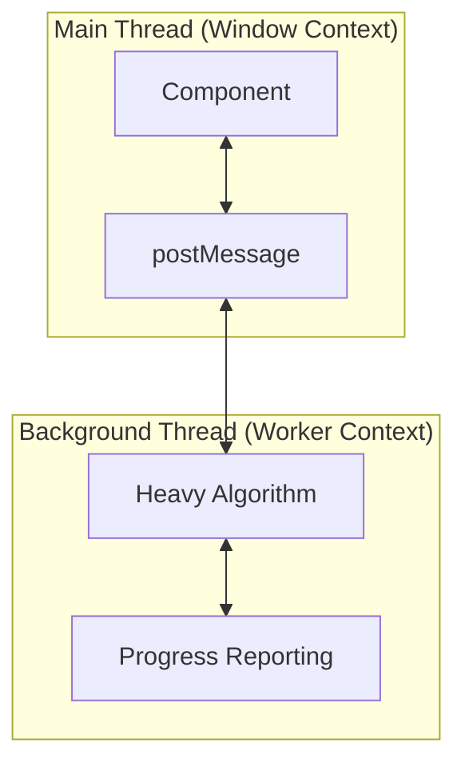

# 👷 Master Web Workers in Angular

## 📑 Index
1. [🎯 What Problem Does This Solve?](#-what-problem-does-this-solve)
2. [🔍 How It Works](#-how-it-works)
3. [🚀 Implementation](#-implementation)
4. [🗄️ The Office Assistant Analogy](#-the-office-assistant-analogy)
5. [🧠 Mind Map](#-mind-map)
6. [📚 Key Classes & APIs](#-key-classes--apis)
7. [🌍 Real-World Use Cases](#-real-world-use-cases)
8. [❓ Interview Questions](#-interview-questions)

---

## 🎯 What Problem Does This Solve?

### The Problem
JavaScript is fundamentally single-threaded. This means if you have a massive task (like processing 10 million rows of data), the entire browser tab "hangs":
- **Frozen UI**: Clicks, scrolls, and animations stop working.
- **Jank**: Stuttering in visual transitions.
- **Unresponsive Script Warning**: The browser eventually asks the user to "Kill" the page.

### The Solution: Web Workers
Web Workers allow you to run scripts in **background threads**. This enables **True Parallelism**:

| Feature | Main Thread | Web Worker |
|---------|-------------|------------|
| UI Access | ✅ Can touch DOM | ❌ No DOM access |
| Network | ✅ Fetch/XHR | ✅ Fetch/XHR |
| Local Storage | ✅ Accessible | ❌ Not accessible |
| IndexDB | ✅ Accessible | ✅ Accessible |
| Threading | Single-threaded | Background-threaded |

### Key Improvements
- ✅ **Offload Heavy Work**: Move filters, encryption, and parsing off the UI thread.
- ✅ **Smooth Experience**: Keep the FPS at 60 even during heavy load.
- ✅ **Full Hardware Usage**: Modern phones have 8 cores; Web Workers let you use them.

---

## 🔍 How It Works

### Technical Architecture
Web Workers run in an entirely different global context (`DedicatedWorkerGlobalScope`).



### Communication Protocol
They communicate via **Message Passing**. Data sent through `postMessage` is "cloned" using the **Structured Clone Algorithm**, meaning the worker gets its own copy (no shared memory issues).

---

## 🚀 Implementation

### 1. Generating a Worker
Angular CLI simplifies this:
```bash
ng generate web-worker app
```

### 2. Basic Setup
```typescript
// app.component.ts
if (typeof Worker !== 'undefined') {
  const worker = new Worker(new URL('./app.worker', import.meta.url));
  worker.onmessage = ({ data }) => {
    console.log('Got result:', data);
  };
  worker.postMessage('hello');
}
```

```typescript
// app.worker.ts
addEventListener('message', ({ data }) => {
  const response = `worker response to ${data}`;
  postMessage(response);
});
```

---

## 🗄️ The Office Assistant Analogy

Think of your code like an **Office Manager**:

- **Main Thread**: The **Receptionist**. They answer phones, greet guests, and handle the front desk. They MUST stay at the desk at all times to keep customers happy.
- **Problem**: If the Receptionist has to **Archive 10,000 Files**, they have to leave the desk, and the phones go unanswered (Frozen UI).
- **Web Worker**: An **Assistant in the Back Room**. The Receptionist hands a box of files (Data) to the Assistant. The Assistant works in the back (Background Thread) while the Receptionist stays at the front desk (Responsive UI). When the Assistant finishes, they walk out and give the organized folder back to the Receptionist (Message Passing).

---

## 🧠 Mind Map

```
                    Web Workers Core
                           │
           ┌───────────────┴───────────────┐
           │                               │
      COMMUNICATION                   LIMITATIONS
           │                               │
    ┌──────┴──────┐                 ┌──────┴──────┐
    │ postMessage │                 │ No DOM      │
    │ onmessage   │                 │ No Window   │
    │ Structured  │                 │ No Local    │
    │ Clone       │                 │ Storage     │
    └─────────────┘                 └─────────────┘
```

---

## 📚 Key Classes & APIs

### 1. `Worker`
The primary interface to create and control background threads.

### 2. `DedicatedWorkerGlobalScope`
The global scope inside the worker (accessible via `self`).

### 3. `Structured Clone Algorithm`
The mechanism for copying data between threads without sharing memory.

### 4. `Transferable Objects`
Types like `ArrayBuffer` that can be transferred with zero-copy overhead.

---

## 🌍 Real-World Use Cases

### 1. **Client-Side Image Manipulation**
Applying complex Photoshop-like filters in tools like Canva or Squoosh.

### 2. **Large CSV/JSON Parsing**
Parsing massive datasets for dashboards without making the browser spin.

### 3. **Cryptographic Operations**
Generating Bitcoin/Ethereum keys or hashing passwords locally in a secure way.

### 4. **Physics Engines in Games**
Running collision detection and 3D math in the background while the UI renders at 60fps.

### 5. **Rich Text Formatting**
Processing extremely long documents for spelling, grammar, and syntax highlighting (like Google Docs or Notion).

---

## ❓ Interview Questions

### Basic (1-8)
1. **What is a Web Worker?**
2. **How does it differ from a standard Script?**
3. **Can a Web Worker access the DOM? Why?**
4. **How do you pass data to a worker?**
5. **What is `self` in a Web Worker?**
6. **How do you kill a worker thread?**
7. **Can workers make API calls using Fetch?**
8. **What happens to global variables shared between Main and Worker?**

### Intermediate (9-16)
9. **Explain the Structured Clone Algorithm.**
10. **What are Transferable Objects?**
11. **How does Angular CLI help with Web Worker bundling?**
12. **What is the difference between Dedicated and Shared Workers?**
13. **How do you debug a background thread in Chrome?**
14. **What is `navigator.hardwareConcurrency`?**
15. **Explain `importScripts()` inside a worker.**
16. **How do workers handle Errors?**

### Advanced (17-25)
17. **What is the "Atomics" object and how does it work with SharedArrayBuffer?**
18. **Explain the Worker Pool pattern.**
19. **How would you implement Task Prioritization in a Worker?**
20. **Can a worker create another worker (Sub-workers)?**
21. **What is the performance overhead of starting a worker?**
22. **Explain `OffscreenCanvas` and its benefits in workers.**
23. **How does the CSP (Content Security Policy) affect Workers?**
24. **Compare Web Workers vs Service Workers vs Worklets.**
25. **How would you unit test worker logic in an Angular app?**
