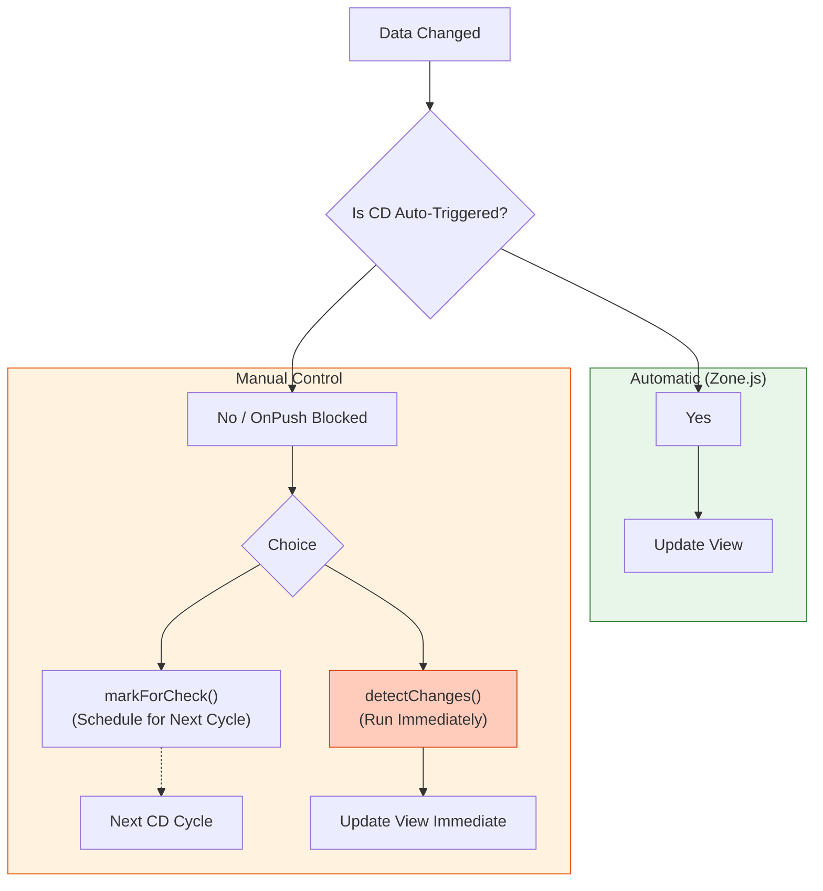
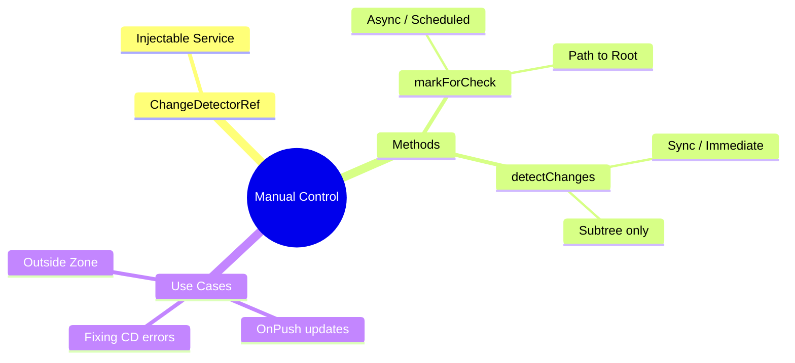

# 🔧 Manual Control (detectChanges)

> **Goal**: Learn to manually drive the Change Detection engine when automatic mechanisms (Zone.js) cannot reach you or when you've turned them off.

---

## 1. 🔍 How It Works (The Concept)

### The Mechanism
Sometimes data changes in a way Angular doesn't know about (e.g., inside `runOutsideAngular`, or from a third-party non-Angular library).
You need to grab the steering wheel and say "Update the View NOW."

*   **`markForCheck()`**: "Hey Angular, next time you do a round, don't forget to check me (and my parents)." (Scheduled).
*   **`detectChanges()`**: "DROP EVERYTHING. Check me (and my children) RIGHT NOW." (Synchronous / Immediate).

### Control Flow Diagram



---

## 2. 🚀 Step-by-Step Implementation Guide

### Step 1: Inject ChangeDetectorRef
This is your remote control for the CD engine.

```typescript
import { Component, ChangeDetectorRef } from '@angular/core';

@Component({ ... })
export class ManualComponent {
  // 🛡️ CRITICAL: Inject CDR
  constructor(private cdr: ChangeDetectorRef) {}
}
```

### Step 2: Calling the Update
Scenario: We are using `OnPush` but updating data via a `setInterval` (which `OnPush` might ignore if not bound via AsyncPipe).

```typescript
ngOnInit() {
  setInterval(() => {
    this.counter++; // Data changes
    
    // 🛡️ CRITICAL: UI won't update automatically here because we are OnPush
    // and this timer event didn't originate from template.
    
    this.cdr.detectChanges(); // Force screen update!
    // OR
    // this.cdr.markForCheck();
  }, 1000);
}
```

---

## 3. 🐛 Common Pitfalls & Debugging

### ❌ Pitfall 1: `ExpressionChangedAfterItHasBeenCheckedError`
**Scenario**: You update a parent's data *after* the parent was already checked effectively (e.g., inside a child's AfterViewInit).
**Fix**: Use `detectChanges()` to force an extra check cycle for that component so the view syncs with the new data immediately.

### ❌ Pitfall 2: Overusing `detectChanges()`
**Scenario**: Calling `detectChanges()` in a loop or high-frequency event.
**Result**: Performance degradation. You are bypassing the scheduler.
**Fix**: Use `markForCheck()` (coalesced updates) whenever possible instead of `detectChanges()` (synchronous).

---

## 4. ⚡ Performance & Architecture

### Performance
*   **markForCheck**: Efficient. It "dirties" the path to root. Angular still runs only ONCE per tick.
*   **detectChanges**: Expensive if misued. It triggers a local checking subtree immediately.

### Architecture
*   **Integration**: Essential for integrating with **WebSockets**, **Workers**, or **Third-party-libs** that run outside Angular's Zone.

---

## 5. 🌍 Real World Use Cases

1.  **WebSocket Feeds**: Data arrives repeatedly from a socket (often outside zone to save perf). You buffer it, then call `detectChanges()` once per second to render the batch.
2.  **Modals/Popups**: Sometimes manually attaching a component view requires a manual CD trigger to render initial content.
3.  **Complex Validations**: A directive that validates a form based on external state might need to mark the form control as checked.

---

## 6. 📝 The Analogy: "The Bus Stop" 🚌

*   **Zone.js (Scheduled Bus)**: The bus comes every 10 minutes (CD Cycle) and picks everyone up.
*   **markForCheck (Raise Hand)**: You stand at the bus stop and wave. You wait for the NEXT bus. You don't get picked up instantly, but you make sure the bus doesn't skip your stop.
*   **detectChanges (Taxi)**: You call a Taxi. It comes *right now*, picks *only you* up, and goes. It's faster for you, but expensive if everyone takes a taxi instead of the bus.

---

## 7. ❓ Interview & Concept Questions

1.  **Q: Difference between `markForCheck` and `detectChanges`?**
    *   **A:** `markForCheck` ensures the component is checked during the *next* global cycle. `detectChanges` runs the check *immediately* and synchronously for this component and its children.

2.  **Q: When do you get `ExpressionChangedAfterItHasBeenCheckedError`?**
    *   **A:** When a value in the model changes *after* Angular has already rendered the view for that cycle, leaving the model and view out of sync.

3.  **Q: Does `detectChanges` run on the whole app?**
    *   **A:** No, only on the component instance (and its children) where it was called.

---

## 🧠 Mind Map


