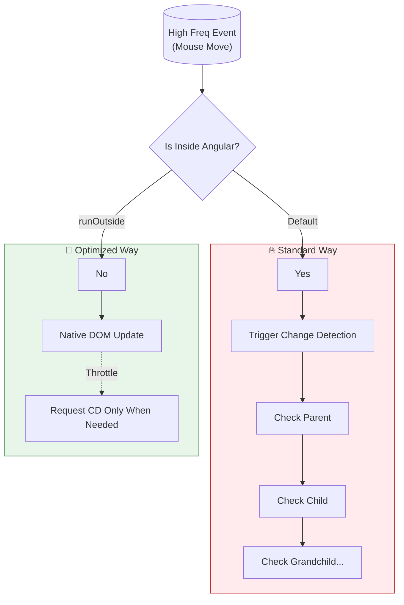
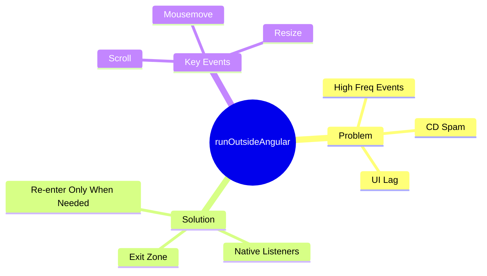

# 🚀 Use runOutsideAngular (Performance)

> **Goal**: Optimize high-frequency events to prevent "Jank" (UI lag) by deliberately bypassing Angular's Change Detection system.

---

## 1. 🔍 How It Works (The Concept)

### The Mechanism
Events like `mousemove`, `scroll`, and `drag` fire hundreds of times per second.
If you bind to them standardly (`(mousemove)="handler()"`), Angular triggers a full Change Detection cycle for the **whole tree**, **every single time**. This kills performance.

`runOutsideAngular` allows you to set up the event listener such that it executes completely silently, without Angular waking up.

### Performance Comparison

| Type | Frequency | CD Impacts (per sec) | CPU Load |
| :--- | :--- | :--- | :--- |
| **Standard** | 100 events/sec | 100 checks | 🔥 High |
| **Optimized** | 100 events/sec | 0 checks | 🧊 Low |

### 📉 Performance Flow Chart



---

## 2. 🚀 Step-by-Step Implementation Guide

### Step 1: Using `runOutsideAngular`
We must attach the event listener manually to control the zone context.

```typescript
// run-outside.component.ts
export class OptimizeComponent implements AfterViewInit {
  @ViewChild('box') box: ElementRef;

  constructor(private ngZone: NgZone) {}

  ngAfterViewInit() {
    // 🛡️ CRITICAL: Step OUT of the zone before attaching listener
    this.ngZone.runOutsideAngular(() => {
      
      this.box.nativeElement.addEventListener('mousemove', (e) => {
        // This code runs massively often, but Angular ignores it!
        // We can do lightweight DOM updates here directly if needed
        this.updateCoordinatesNative(e.x, e.y); // Ex: transform CSS
      });

    });
  }
}
```

### Step 2: Re-entering the Zone (Throttle)
Eventually, you probably *do* want to update the Angular UI (e.g., save the final position).

```typescript
this.ngZone.runOutsideAngular(() => {
  this.el.addEventListener('mousemove', (e) => {
    // ... heavy logic ...

    // Re-enter ONLY when needed (e.g., stop moving, or every 100ms)
    if (this.shouldUpdate()) {
      this.ngZone.run(() => {
        this.coordinates = { x: e.x, y: e.y }; // Update Angular Model
      });
    }
  });
});
```

---

## 3. 🐛 Common Pitfalls & Debugging

### ❌ Pitfall 1: Binding in Template
**Bad Code:**
```html
<div (mousemove)="handleMove($event)"></div> 
<!-- ❌ Implicitly runs inside Zone! -->
```
**Fix:** Do not use `(event)` syntax for high-frequency events if optimizing. Use `ElementRef` and `addEventListener` inside `runOutsideAngular`.

### ❌ Pitfall 2: Forgetting to Clean Up
When adding listeners manually with `addEventListener`, Angular does **NOT** clean them up for you.
**Fix**:
```typescript
ngOnDestroy() {
  // 🛡️ CRITICAL: Always remove manually added listeners to prevent memory leaks
  this.element.removeEventListener(...);
}
```

---

## 4. ⚡ Performance & Architecture

### Performance
*   **60fps Goal**: To achieve 60fps animations, each frame has ~16ms. If Angular Change Detection takes 10ms, you only have 6ms left for your logic. 
*   **Optimization**: removing the 10ms overhead means you have the full 16ms for logic.

### Architecture
*   **Dumb Components**: Usually, "dumb" presentation components don't decide when to run outside. Smart/Container components or specific Directives (like `DraggableDirective`) should handle this complexity.

---

## 5. 🌍 Real World Use Cases

1.  **Infinite Scroll**: Listening to the `scroll` event to load more items. You don't want to check the DOM on every pixel scrolled, only when the bottom is reached.
2.  **Drag and Drop**: Moving an item around the screen. Coordinates change continuously. Only the final "drop" event needs to update the application state.
3.  **Data Visualization (Charts)**: Hovering over a line chart to show a tooltip. The tooltip position calculation can be heavy.

---

## 6. 📝 The Analogy: "The Noisy neighbor" 🙉

*   **Standard Way**: Your neighbor (The Event) knocks on your door (Angular) every time they move a chair. You have to get up, open the door, check what happened, and sit down. 100 times a minute. You get nothing done.
*   **runOutsideAngular**: You tell the neighbor "Only knock if the house is on fire." They can move furniture all day long (Events fire), but you stay focused on your work (No CD) until it actually matters.

---

## 7. ❓ Interview & Concept Questions

1.  **Q: Name 3 events where `runOutsideAngular` is most useful.**
    *   **A:** `mousemove`, `scroll`, `resize` (or `drag`).

2.  **Q: If I update a class property inside `runOutsideAngular`, will the view update?**
    *   **A:** No. Not until the next Change Detection cycle is triggered by something else.

3.  **Q: Does Angular automatically clean up listeners added inside `runOutsideAngular`?**
    *   **A:** No, you must use `removeEventListener` in `ngOnDestroy`.

---

## 🧠 Mind Map


