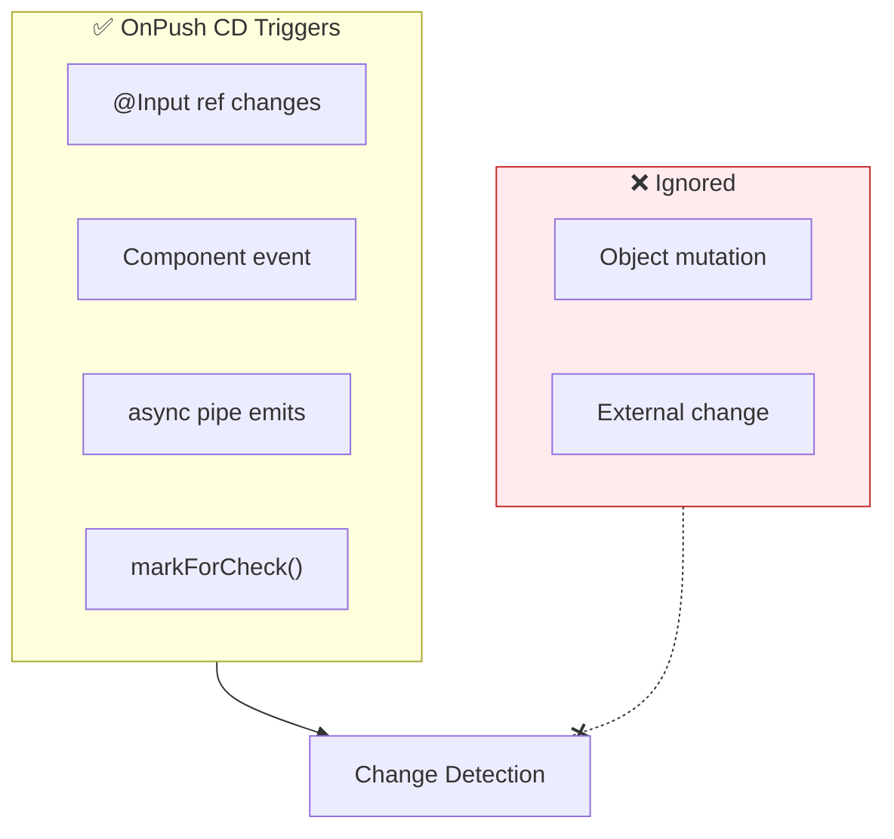
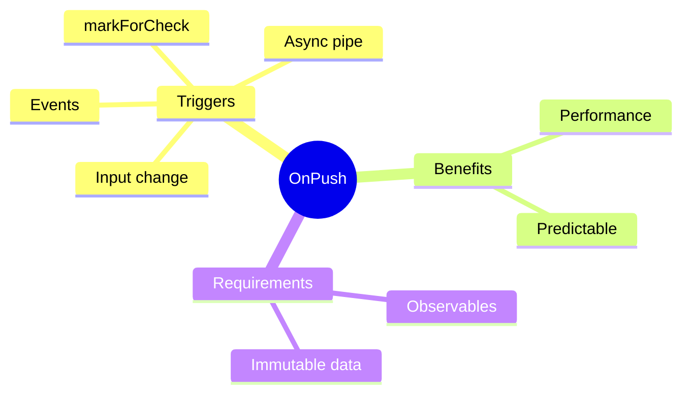

# 🔄 OnPush Change Detection

> **💡 Lightbulb Moment**: OnPush tells Angular to only check component when inputs change or observables emit!


## 📋 Table of Contents
- [1. 🔍 Default vs OnPush](#1--default-vs-onpush)
- [2. 🚀 Implementation](#2--implementation)
  - [OnPush Triggers CD When:](#onpush-triggers-cd-when)
  - [📊 Data Flow Diagram](#data-flow-diagram)
  - [📦 Data Flow Summary (Visual Box Diagram)](#data-flow-summary-visual-box-diagram)
- [🎯 What Problem Does This Solve?](#what-problem-does-this-solve)
  - [The Problem: Change Detection is Expensive](#the-problem-change-detection-is-expensive)
  - [How OnPush Solves This](#how-onpush-solves-this)
- [📚 Key Classes & Types Explained](#key-classes--types-explained)
  - [1. `ChangeDetectionStrategy.OnPush`](#1-changedetectionstrategyonpush)
  - [2. `AsyncPipe` (`| async`)](#2-asyncpipe--async)
- [🌍 Real-World Use Cases](#real-world-use-cases)
  - [1. Dumb/Presentation Components](#1-dumbpresentation-components)
  - [2. Lists / Tables](#2-lists--tables)
  - [3. Real-time Boards (Trello-like)](#3-real-time-boards-trello-like)
  - [4. Third-Party UI Kits](#4-third-party-ui-kits)
- [❓ Complete Interview Questions (20+)](#complete-interview-questions-20)
  - [Basic Questions](#basic-questions)
  - [Scenario-Based Questions](#scenario-based-questions)
  - [Advanced Questions](#advanced-questions)
- [🧠 Mind Map](#mind-map)

---
---

## 1. 🔍 Default vs OnPush

| Default | OnPush |
|---------|--------|
| Checks on every CD cycle | Checks only when needed |
| Slower | Faster |
| Safe | Requires immutable data |

---

## 2. 🚀 Implementation

```typescript
@Component({
    selector: 'app-user-card',
    changeDetection: ChangeDetectionStrategy.OnPush,
    template: `...`
})
export class UserCardComponent {
    @Input() user!: User;
}
```

### OnPush Triggers CD When:
1. @Input reference changes
2. Event from component/child
3. Async pipe emits
4. Manual `markForCheck()`

### 📊 Data Flow Diagram



### 📦 Data Flow Summary (Visual Box Diagram)

```
┌─────────────────────────────────────────────────────────────┐
│  PARENT COMPONENT                                           │
│                                                             │
│   user = { name: 'John' };                                  │
│   <app-user-card [user]="user"></app-user-card>             │
│                                                             │
│   ❌ MUTATION (Won't trigger OnPush)                        │
│   ┌───────────────────────────────────────────────────────┐ │
│   │ this.user.name = 'Jane';  // Same object reference!   │ │
│   │ // Child WON'T see the change                         │ │
│   └───────────────────────────────────────────────────────┘ │
│                                                             │
│   ✅ NEW REFERENCE (Triggers OnPush)                        │
│   ┌───────────────────────────────────────────────────────┐ │
│   │ this.user = { ...this.user, name: 'Jane' };  // NEW!  │ │
│   │ // Child WILL see the change                          │ │
│   └───────────────────────────────────────────────────────┘ │
└─────────────────────────────────────────────────────────────┘
                        │
                        ▼
┌─────────────────────────────────────────────────────────────┐
│  CHILD COMPONENT (OnPush)                                   │
│                                                             │
│   @Component({                                              │
│     changeDetection: ChangeDetectionStrategy.OnPush         │
│   })                                                        │
│                                                             │
│   CD TRIGGERS:                                              │
│   ┌───────────────────────────────────────────────────────┐ │
│   │ ① @Input reference changes    → ✅ Check              │ │
│   │ ② (click)="..." event        → ✅ Check              │ │
│   │ ③ {{ data$ | async }}        → ✅ Check              │ │
│   │ ④ this.cdr.markForCheck()    → ✅ Check              │ │
│   │                                                       │ │
│   │ ⚫ Any other CD cycle        → ❌ SKIP!               │ │
│   └───────────────────────────────────────────────────────┘ │
│                                                             │
│   BEST PRACTICE: Always use immutable patterns!             │
└─────────────────────────────────────────────────────────────┘
```

**OnPush Detection Summary:**
| Scenario | Default | OnPush |
|----------|---------|--------|
| Any CD cycle | ✅ Checked | ❌ Skipped |
| @Input ref change | ✅ Checked | ✅ Checked |
| Component event | ✅ Checked | ✅ Checked |
| async pipe emit | ✅ Checked | ✅ Checked |

> **Key Takeaway**: OnPush = performance optimization. But it requires IMMUTABLE data patterns - always create new references, never mutate!

---

---

## 🎯 What Problem Does This Solve?

### The Problem: Change Detection is Expensive
**Without OnPush (Default):**
Angular checks *every* binding in *every* component whenever *anything* happens (click, timeout, xhr).
```typescript
// Even if this component didn't change at all...
// Angular checks it 100 times just in case.
```

**Problems:**
1.  **Slow Performance**: In large apps (1000+ components), checking everything takes > 16ms, causing frame drops.
2.  **Unpredictable Updates**: Functions in templates (`{{ runHeavyCalc() }}`) re-run constantly.

### How OnPush Solves This
**With OnPush:**
```typescript
changeDetection: ChangeDetectionStrategy.OnPush
// Angular: "I'll skip this subtree unless Input changes or you tell me to check."
```

| Problem | OnPush Solution |
|---------|-----------------|
| Global Checks | **Subtree Pruning**: Angular skips entire branches of the component tree during CD. |
| Template Recalc | **Stability**: Bindings are only re-evaluated when dependencies genuinely change. |

---

## 📚 Key Classes & Types Explained

### 1. `ChangeDetectionStrategy.OnPush`
*   **Behavior**: Tells Angular's CD mechanism to treat this component as "Immutable".
*   **Contract**: "I promise I will not update my UI unless my `@Input()` reference changes, or an event fires inside me."

### 2. `AsyncPipe` (`| async`)
*   **Role**: Essential companion to OnPush.
*   **Magic**: When the observable emits, `AsyncPipe` internally calls `markForCheck()`, telling Angular "Hey, I have new data, please check this OnPush component next cycle."

---

## 🌍 Real-World Use Cases

### 1. Dumb/Presentation Components
A `UserCardComponent` that just displays `@Input() user`. It never changes unless the parent passes a new user. Perfect candidate.

### 2. Lists / Tables
A `DataGridComponent` with 500 rows. If one row updates, you don't want to check the other 499. OnPush with proper immutability handles this.

### 3. Real-time Boards (Trello-like)
Moving a card in "Column A" shouldn't cause "Column B" to re-render. OnPush isolates the updates.

### 4. Third-Party UI Kits
Most high-quality UI libraries (Material, PrimeNG) use OnPush internally to ensure they don't slow down your app.

---

## ❓ Complete Interview Questions (20+)

### Basic Questions

**Q1: What triggers OnPush?**
> A: Input Reference Change, Event inside component, Async Pipe, `markForCheck()`.

**Q2: Does changing an object property trigger OnPush?**
> A: No! `user.name = 'Bob'` keeps the same object `user`. OnPush sees no change. You must do `user = {...user, name: 'Bob'}`.

**Q3: What causes "View not updating" in OnPush?**
> A: Usually mutation of objects/arrays instead of replacement.

**Q4: Does clicking a button in an OnPush component trigger CD?**
> A: Yes! Angular knows that because an event handler fired inside the component, state *might* have changed, so it marks it for check.

**Q5: Difference between `Default` and `OnPush`?**
> A: Default checks always. OnPush checks only on signals (Input/Event/Manual).

---

### Scenario-Based Questions

**Q6: Scenario: Data arrives via WebSocket service.**
> A: If component uses OnPush, you must manually call `cdr.markForCheck()` after updating local state, or use an `Observable` + `async` pipe.

**Q7: Scenario: Parent is Default, Child is OnPush.**
> A: Parent checks often. When it reaches Child, it skips Child 99% of the time unless Inputs changed.

**Q8: Scenario: Parent is OnPush, Child is Default.**
> A: If Parent is skipped, Child is ALSO skipped (subtree pruning), even if Child is Default. The skipping happens at the branch root.

**Q9: Scenario: `setTimeout` update in OnPush.**
> A: Requires `markForCheck()`. `setTimeout` triggers global CD, but OnPush components ignore global CD unless marked.

**Q10: Scenario: Testing OnPush components.**
> A: You might need to manually trigger change detection in tests (`fixture.detectChanges()`) more often after setting inputs.

---

### Advanced Questions

**Q11: How does `Input` binding check work?**
> A: Strict equality `===`.

**Q12: Does `HostListener` trigger OnPush?**
> A: Yes, it's considered an event inside the component.

**Q13: Can I turn off CD completely?**
> A: `changeDetection: ChangeDetectionStrategy.OnPush` is NOT off. Iterating manual `detach()` is "off".

**Q14: Impact of Signal Inputs?**
> A: Signals integrate perfectly. When a Signal Input changes, it notifies the component to check, similar to RxJS async pipe logic (but usually more granular).

**Q15: Does `markForCheck` trigger CD immediately?**
> A: No. It sets a flag. The check happens at the end of the current microtask/turn.

**Q16: `markForCheck` vs `detectChanges`?**
> A: `markForCheck` moves up the tree (marks ancestors). `detectChanges` moves down the tree (checks children).

**Q17: Is OnPush default in new Angluar?**
> A: No, but highly recommended.

**Q18: What is "Dirty" state?**
> A: Internal flag `LViewFlags.Dirty`. `markForCheck` sets this.

**Q19: Can I use OnPush with mutable data?**
> A: Technically yes, if you manually `markForCheck` every time you mutate. But it defeats the purpose and is error-prone.

**Q20: How to debug OnPush issues?**
> A: Use Angular DevTools "Profiler" to see how many change detection cycles ran for a component. If it's 0 when you expected 1, you missed a trigger.

## 🧠 Mind Map


