# ⚡ Change Detection Strategies

> **Goal**: Switch from the "Check Everything" default strategy to the "Check Only What Changed" **OnPush** strategy for massive performance gains.

---

## 1. 🔍 How It Works (The Concept)

### The Mechanism
Angular's Change Detection (CD) starts at the root and walks down the component tree.
*   **Default**: "Is this component dirty?" -> "I don't know, better check entirely." (Checks every component, every time).
*   **OnPush**: "Is this component dirty?" -> "Did my Inputs change? No? Then I'm good, skip me."

### Tree Traversal Diagram

```mermaid
graph TD
    Root[Root App (Click Event)]
    
    subgraph DefaultTree [Strategy: Default]
        A1[Component A]
        B1[Component B]
        C1[Component C]
        D1[Component D]
        
        Root -.->|Check| A1
        A1 -.->|Check| B1
        A1 -.->|Check| C1
        C1 -.->|Check| D1
        
        style A1 fill:#ffebee,stroke:#c62828
        style B1 fill:#ffebee,stroke:#c62828
        style C1 fill:#ffebee,stroke:#c62828
        style D1 fill:#ffebee,stroke:#c62828
    end
    
    subgraph OnPushTree [Strategy: OnPush]
        A2[Component A]
        B2[Component B]
        C2[Component C]
        D2[Component D]
        
        Root -->|Check| A2
        A2 -->|Inputs Same: SKIP| B2
        A2 -->|Inputs Same: SKIP| C2
        
        style A2 fill:#e8f5e9,stroke:#2e7d32
        style C2 fill:#e0e0e0,stroke:#9e9e9e,stroke-dasharray: 5 5
        style B2 fill:#e0e0e0,stroke:#9e9e9e,stroke-dasharray: 5 5
        style D2 fill:#e0e0e0,stroke:#9e9e9e,stroke-dasharray: 5 5
    end
```

---

## 2. 🚀 Step-by-Step Implementation Guide

### Step 1: Set Strategy to OnPush
This is done in the Component decorator.

```typescript
// child.component.ts
import { Component, ChangeDetectionStrategy, Input } from '@angular/core';

@Component({
  selector: 'app-child',
  standalone: true,
  template: `...`,
  // 🛡️ CRITICAL: Switch to OnPush
  changeDetection: ChangeDetectionStrategy.OnPush
})
export class ChildComponent {
  @Input() data: { name: string };
}
```

### Step 2: Ensure Immutability (The Consumer)
The Parent must pass **New References** to trigger updates.

```typescript
// parent.component.ts
export class ParentComponent {
  data = { name: 'Initial' };

  updateBad() {
    this.data.name = 'Updated'; // ❌ Mutation! OnPush ignores this.
  }

  updateGood() {
    this.data = { name: 'Updated' }; // ✅ New Reference! OnPush detects this.
  }
}
```

---

## 3. 🐛 Common Pitfalls & Debugging

### ❌ Pitfall 1: Mutation with OnPush
**Scenario**: You push to an array passed to an OnPush component.
**Result**: The list doesn't update.
**Fix**: `this.list = [...this.list, newItem]`.

### ❌ Pitfall 2: Async Data without Async Pipe
**Scenario**: You subscribe manually in `ngOnInit` and update a property.
**Result**: OnPush component doesn't update because Inputs didn't change and no Event happened inside *this* component.
**Fix**: Use `| async` pipe (which handles marking for check) OR call `cdr.markForCheck()`.

---

## 4. ⚡ Performance & Architecture

### Performance
*   **Big O**: Default is **O(N)** where N is number of components. OnPush approaches **O(log N)** or even **O(1)** (checking only path to root) for many updates.
*   **Skipping**: Entire subtrees of the application are skipped during check cycles.

### Architecture
*   **Smart/Dumb Components**:
    *   **Dumb (Presentation)**: Should ALWAYS be **OnPush**. They only depend on Inputs.
    *   **Smart (Container)**: Can be Default or OnPush (if using Observables correctly).

---

## 5. 🌍 Real World Use Cases

1.  **Large Lists/Grids**: A table with 100 rows. If one row updates, you don't want to re-check the other 99 rows. OnPush prevents this.
2.  **Sidebar/Navigation**: The sidebar usually stays static while the main content changes. OnPush keeps the sidebar dormant.
3.  **Real-Time Dashboards**: If one widget updates frequently, it shouldn't cause the rest of the dashboard (which might be heavy charts) to re-render.

---

## 6. 📝 The Analogy: "The Mailman" ✉️

*   **Default Strategy**: The Mailman knocks on **every single door** in the neighborhood asking "Do you have mail to send?" just to be sure. It takes forever.
*   **OnPush**: The Mailman only stops if the **flag is up** (Input changed) or if you **call him** (Event). If the flag is down, he drives right past your house without slowing down.

---

## 7. ❓ Interview & Concept Questions

1.  **Q: What triggers an OnPush component to update?**
    *   **A:** 1. Input Reference Change. 2. Event Handler inside the component. 3. Async Pipe emission. 4. Manually calling `markForCheck`.

2.  **Q: Why does OnPush require immutability?**
    *   **A:** Because OnPush uses `===` (strict equality) to check Inputs. If you mutate an object, `old === new` is true, so Angular thinks nothing changed.

3.  **Q: Does OnPush prevent all Change Detection?**
    *   **A:** No, it just optimizes the check. It still checks when signals occur.

---

## 🧠 Mind Map

```mermaid
mindmap
  root((Change Detection))
    Default
      Checks Everyone
      Safe but Slow
      Handles Mutation
    OnPush 🚀
      Checks Inputs
      Checks Events
      Skipping Subtrees
      Requires Immutability
    Triggers
      Input Ref Change
      Async Pipe
      DOM Event
      markForCheck
```


