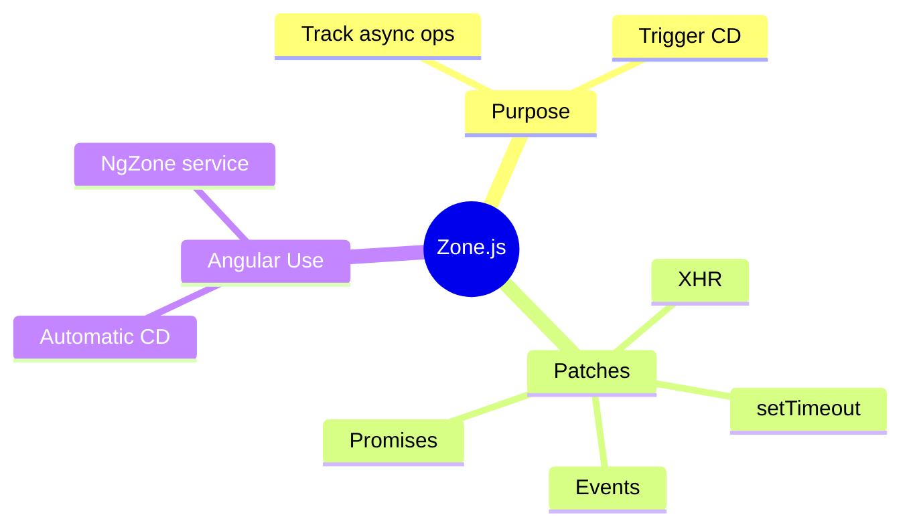

# ⚡ Use Case 1: Zone.js Basics

> **💡 Lightbulb Moment**: Zone.js patches async APIs so Angular knows when to check for changes!


---

## 1. 🔍 What is Zone.js?

A library that intercepts async operations to notify Angular when they complete.

**Patched APIs:**
- setTimeout, setInterval
- Promises
- Event listeners
- XMLHttpRequest, fetch

---

## 2. 🚀 How It Works

```
User clicks button
    ↓
Zone.js intercepts event
    ↓
Event handler runs
    ↓
Zone.js notifies Angular
    ↓
Angular runs change detection
    ↓
View updates
```

---

## 3. ❓ Interview Questions

### Basic Questions

#### Q1: Why does Angular use Zone.js?
**Answer:** To automatically know when to run change detection. Without it, you'd need to manually trigger CD after every async operation.

#### Q2: What async operations does Zone.js patch?
**Answer:**
- setTimeout/setInterval
- Promises
- DOM events
- XHR/fetch
- WebSocket

---

### Scenario-Based Questions

#### Scenario: Why doesn't my view update?
**Question:** You update data in a third-party library callback, but view doesn't update.

**Answer:** The callback might be outside Angular's zone:
```typescript
constructor(private ngZone: NgZone) {}

thirdPartyLib.onComplete(() => {
    this.ngZone.run(() => {
        this.data = newData;  // Now triggers CD
    });
});
```

---

### 📦 Data Flow Summary (Visual Box Diagram)

```
┌─────────────────────────────────────────────────────────────┐
│  ZONE.JS: AUTOMATIC CHANGE DETECTION TRIGGER                │
│                                                             │
│   WHAT IT PATCHES:                                          │
│   ┌───────────────────────────────────────────────────────┐ │
│   │ setTimeout, setInterval                               │ │
│   │ Promises                                              │ │
│   │ DOM events (click, input, etc.)                       │ │
│   │ XMLHttpRequest, fetch                                 │ │
│   │ WebSocket                                             │ │
│   └───────────────────────────────────────────────────────┘ │
│                                                             │
│   HOW IT WORKS:                                             │
│   ┌───────────────────────────────────────────────────────┐ │
│   │ User clicks button                                    │ │
│   │        ↓                                              │ │
│   │ Zone.js intercepts event                              │ │
│   │        ↓                                              │ │
│   │ Your event handler runs                               │ │
│   │        ↓                                              │ │
│   │ Zone.js notifies Angular: "Hey, something happened!"  │ │
│   │        ↓                                              │ │
│   │ Angular runs change detection                         │ │
│   │        ↓                                              │ │
│   │ View updates automatically                            │ │
│   └───────────────────────────────────────────────────────┘ │
│                                                             │
│   RUNNING OUTSIDE ZONE (for performance):                   │
│   ┌───────────────────────────────────────────────────────┐ │
│   │ ngZone.runOutsideAngular(() => { ... });              │ │
│   │ // Won't trigger change detection                     │ │
│   │                                                       │ │
│   │ ngZone.run(() => { ... });  // Back inside zone       │ │
│   └───────────────────────────────────────────────────────┘ │
└─────────────────────────────────────────────────────────────┘
```

> **Key Takeaway**: Zone.js patches async APIs to auto-trigger CD. Use NgZone.runOutsideAngular for performance-critical code!

---

## 🧠 Mind Map


