# 🎯 Use Case 1: Zone Execution (Inside vs Outside)

> **Goal**: Visualize and understand the "Invisible Magic" of Angular—**The Zone**. Understand *where* your code is running and how it affects the UI.

---

## 1. 🔍 How It Works (The Concept)

### The Mechanism
Angular patches standard browser APIs (like `setTimeout`, `addEventListener`, `Promise`) using a library called **Zone.js**.
Every time one of these async tasks completes, the Zone notifies Angular: "Hey, something happened! Update the UI!"

We call this "Running **Inside** the Angular Zone".
However, you can explicitly choose to run code **Outside** the Zone to prevent these notifications.

### Default vs. Optimized Behavior

| Feature | Inside Zone (Default) | Outside Zone (Optimized) |
| :--- | :--- | :--- |
| **Notification** | Triggers Change Detection automatically. | Silent. Angular knows nothing about it. |
| **UI Updates** | Instant, automatic updates. | UI stays stale until manually updated. |
| **Use Case** | 99% of application logic. | High-freq events (scroll, mousemove, canvas). |

### 🎭 Context Diagram

```mermaid
flowchart TD
    subgraph Browser["🌍 Browser Environment"]
        
        subgraph NgZone["🅰️ Angular Zone"]
            Task1[("User Click")]
            Task2[("HTTP Request")]
            Task3[("setTimeout")]
            
            Notify["📢 Notify Angular"]
        end
        
        subgraph Outside["⛔ Outside Zone"]
            Heavy[("Heavy Animation
            Loop")]
            Tracking[("Mouse Tracking")]
            
            Silence["Context: Silent"]
        end
        
        Task1 --> Notify
        Task2 --> Notify
        Task3 --> Notify
        
        Notify --> CD["🔄 Change Detection"]
    end
    
    style NgZone fill:#e8f5e9,stroke:#2e7d32
    style Outside fill:#ffebee,stroke:#c62828
    style CD fill:#fff3e0,stroke:#e65100,shape:diamond
```



---

## 2. 🚀 Step-by-Step Implementation Guide

### Step 1: Inject NgZone
You need the `NgZone` service to interact with the zone execution context.

```typescript
// component.ts
import { Component, NgZone } from '@angular/core';

export class ZoneExecutionComponent {
  // 🛡️ CRITICAL: Inject NgZone to control execution context
  constructor(private ngZone: NgZone) {}

  checkZone() {
    // Helper to see where we are
    console.log(NgZone.isInAngularZone()); 
  }
}
```

### Step 2: Running Inside (Default) vs Outside
Demonstrate how `runOutsideAngular` acts as an escape hatch.

```typescript
// Inside (Standard)
runInside() {
  setTimeout(() => {
    this.text = 'Updated!'; // ✅ UI updates automatically
  }, 1000);
}

// Outside (Manual Escape)
runOutside() {
  this.ngZone.runOutsideAngular(() => {
    setTimeout(() => {
      this.text = 'Updated?'; // ❌ UI will NOT update
      console.log('Data changed, but Angular is sleeping 😴');
      
      // OPTIONAL: Re-enter manually if needed
      this.ngZone.run(() => { 
          // We are back inside!
      });
    }, 1000);
  });
}
```

---

## 3. 🐛 Common Pitfalls & Debugging

### ❌ Pitfall 1: Third-Party Libraries
**Scenario**: You install a charting library (e.g., D3.js or a jQuery plugin). The chart updates, but your Angular UI around it freezes or doesn't react.
**Reason**: The library might be creating its own async tasks/timers that are mistakenly running **Outside** the zone (or conversely, running inside and triggering too many updates).
**Fix**: Wrap the library initialization in `ngZone.run()` if you need it to trigger updates, or `runOutsideAngular()` if it's causing lag.

### ❌ Pitfall 2: Confusing "Data" with "View"
**Concept**: "My variable changed! I logged it! Why is the HTML empty?"
**Answer**: In Angular, **Data Change != View Update**. Data changes in memory instantly. The View Update only happens when the Zone triggers Change Detection. If you are outside the zone, the bridge is broken.

---

## 4. ⚡ Performance & Architecture

### Performance
*   **The Cost**: Every time you `checkZone()`, it cost basically nothing.
*   **The Savings**: Running a 60fps animation loop *inside* Angular forces it to check the *entire* application tree 60 times a second. Running it *outside* costs zero Angular cycles.

### Architecture
*   **Best Practice**: Keep all business logic **Inside**. Use **Outside** only for "Platform" tasks (events, heavy computations, canvas drawing) that don't need immediate UI reflection.

---

## 5. 🌍 Real World Use Cases

1.  **Map Libraries (Leaflet/Google Maps)**: Dragging a map fires hundreds of events per second. Running this inside Angular would destroy checking performance.
2.  **Activity Timers**: A backend logout timer that ticks every second usually doesn't need to update the UI every second until the last 10 seconds.
3.  **Canvas Drawing**: A paint application where mouse movements draw pixels. You only want to sync the state to the DB occasionally, not every pixel.

---

## 6. 📝 The Analogy: "The Security Guard" 👮‍♂️

*   **NgZone (The Building)**: A secure facility.
*   **The Guard (Zone.js)**: Watches every door.
*   **Running Inside**: You enter through the main door. The Guard notifies the Manager (Angular) "Someone entered!". The Manager checks if anything needs to be done.
*   **Running Outside**: You sneak out the back window. You can do whatever you want in the backyard (run code), but the Manager inside has no idea you are doing it, so nothing inside the building changes.

---

## 7. ❓ Interview & Concept Questions

1.  **Q: What is Zone.js?**
    *   **A:** A library that patches browser async APIs to create an execution context, allowing Angular to know when to run Change Detection.

2.  **Q: How do you verify if code is running inside the Angular zone?**
    *   **A:** `NgZone.isInAngularZone()`.

3.  **Q: Why would UI not update even if a variable changes value?**
    *   **A:** Changes might have happened outside the Angular Zone, so Change Detection was not triggered.

4.  **Q: How do you bring execution back into the Angular Zone?**
    *   **A:** By calling `this.ngZone.run(() => { ... })`.

---

## 🧠 Mind Map

```mermaid
mindmap
  root((NgZone))
    Inside Zone ✅
      Default
      Auto UI Updates
      Intercepts Async APIs
    Outside Zone ⛔
      runOutsideAngular
      No UI Updates
      High Performance
    Methods
      run_
      runOutsideAngular_
      isInAngularZone_
```


