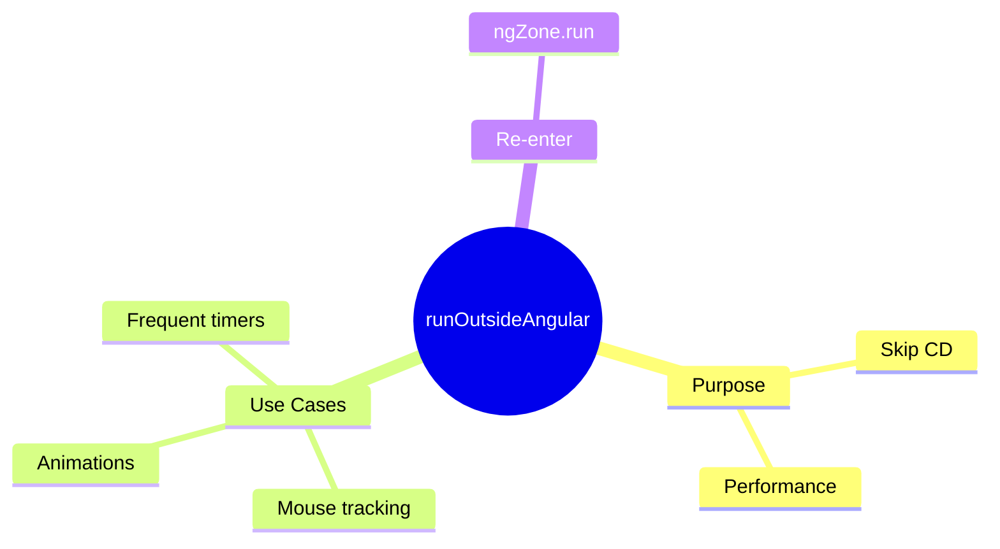

# 🏃 Use Case 2: runOutsideAngular

> **💡 Lightbulb Moment**: Run performance-heavy code OUTSIDE Zone to avoid unnecessary change detection!

---

## 1. 🔍 What is runOutsideAngular?

Executes code outside Angular's zone - no automatic change detection.

```typescript
constructor(private ngZone: NgZone) {}

ngOnInit() {
    this.ngZone.runOutsideAngular(() => {
        // This won't trigger CD
        setInterval(() => {
            this.updateCounter++;  // No view update
        }, 100);
    });
}
```

---

## 2. 🚀 Common Use Cases

### High-frequency events
```typescript
this.ngZone.runOutsideAngular(() => {
    fromEvent(element, 'mousemove')
        .pipe(throttleTime(100))
        .subscribe(event => {
            // Process without CD
        });
});
```

### Animation loops
```typescript
this.ngZone.runOutsideAngular(() => {
    requestAnimationFrame(() => this.animate());
});
```

---

## 3. ❓ Interview Questions

### Basic Questions

#### Q1: When use runOutsideAngular?
**Answer:**
- High-frequency events (mousemove, scroll)
- Animation loops
- Timers that don't affect view
- Performance optimization

#### Q2: How to update view from outside zone?
**Answer:** Use `ngZone.run()`:
```typescript
this.ngZone.run(() => {
    this.viewData = newData;  // Triggers CD
});
```

---

## 🧠 Mind Map


