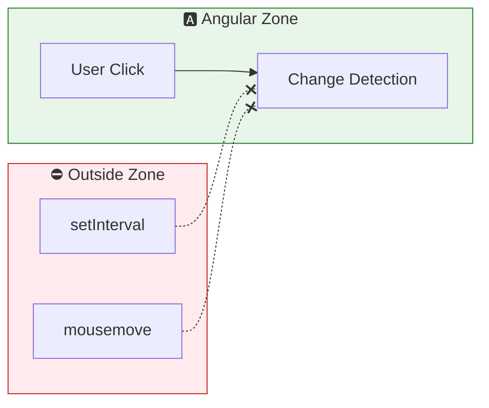
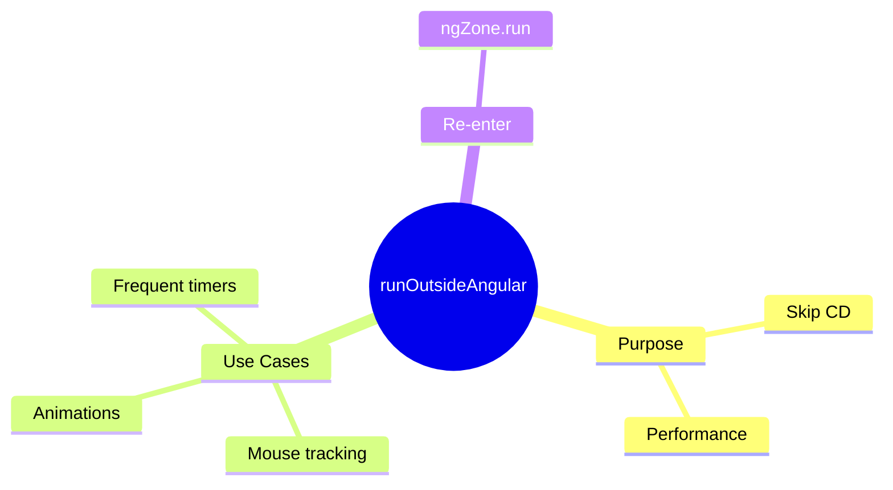

# 🏃 Use Case 2: runOutsideAngular

> **💡 Lightbulb Moment**: Run performance-heavy code OUTSIDE Zone to avoid unnecessary change detection!

---

## 1. 🔍 What is runOutsideAngular?

Executes code outside Angular's zone - no automatic change detection.

```typescript
constructor(private ngZone: NgZone) {}

ngOnInit() {
    this.ngZone.runOutsideAngular(() => {
        // This won't trigger CD
        setInterval(() => {
            this.updateCounter++;  // No view update
        }, 100);
    });
}
```

---

## 2. 🚀 Common Use Cases

### High-frequency events
```typescript
this.ngZone.runOutsideAngular(() => {
    fromEvent(element, 'mousemove')
        .pipe(throttleTime(100))
        .subscribe(event => {
            // Process without CD
        });
});
```

### Animation loops
```typescript
this.ngZone.runOutsideAngular(() => {
    requestAnimationFrame(() => this.animate());
});
```

### 📊 Data Flow Diagram



### 📦 Data Flow Summary (Visual Box Diagram)

```
┌─────────────────────────────────────────────────────────────┐
│  COMPONENT                                                  │
│                                                             │
│   constructor(private ngZone: NgZone) {}                    │
│                                                             │
│   ┌───────────────────────────────────────────────────────┐ │
│   │  🅰️ INSIDE ANGULAR ZONE (Default)                     │ │
│   │  ━━━━━━━━━━━━━━━━━━━━━━━━━━━━━━━━━━━━━━━━━━━━━━━━━━━━ │ │
│   │                                                       │ │
│   │  this.counter++;  // ← Triggers Change Detection      │ │
│   │  setTimeout(...)  // ← Triggers CD when callback runs │ │
│   │  http.get(...)    // ← Triggers CD when response      │ │
│   │                                                       │ │
│   │  Every async event → Angular checks entire app tree!  │ │
│   └───────────────────────────────────────────────────────┘ │
│          │                                                  │
│          │  this.ngZone.runOutsideAngular(() => { ... })    │
│          │                                                  │
│          ▼                                                  │
│   ┌───────────────────────────────────────────────────────┐ │
│   │  ⛔ OUTSIDE ANGULAR ZONE (Escaped)                    │ │
│   │  ━━━━━━━━━━━━━━━━━━━━━━━━━━━━━━━━━━━━━━━━━━━━━━━━━━━━ │ │
│   │                                                       │ │
│   │  setInterval(...)      // ❌ NO Change Detection!     │ │
│   │  fromEvent('mousemove') // ❌ NO Change Detection!    │ │
│   │  requestAnimationFrame() // ❌ NO Change Detection!   │ │
│   │                                                       │ │
│   │  Angular is "asleep" - view won't update!             │ │
│   └───────────────────────────────────────────────────────┘ │
│          │                                                  │
│          │  this.ngZone.run(() => { ... })                  │
│          │                                                  │
│          ▼                                                  │
│   ┌───────────────────────────────────────────────────────┐ │
│   │  🅰️ BACK INSIDE ZONE (Re-entered)                     │ │
│   │                                                       │ │
│   │  this.viewData = newData;  // ✅ Triggers CD now!     │ │
│   └───────────────────────────────────────────────────────┘ │
└─────────────────────────────────────────────────────────────┘
```

**runOutsideAngular Pattern:**
1. **High-frequency events** (mousemove, scroll) → run outside
2. **Animation loops** → run outside
3. **When view needs update** → use `ngZone.run()` to re-enter

> **Key Takeaway**: `runOutsideAngular` = "escape hatch" for performance. Angular won't know about code running outside until you explicitly re-enter with `run()`!

---

## 3. ❓ Interview Questions

### Basic Questions

#### Q1: When use runOutsideAngular?
**Answer:**
- High-frequency events (mousemove, scroll)
- Animation loops
- Timers that don't affect view
- Performance optimization

#### Q2: How to update view from outside zone?
**Answer:** Use `ngZone.run()`:
```typescript
this.ngZone.run(() => {
    this.viewData = newData;  // Triggers CD
});
```

---

## 🧠 Mind Map


