# 🏃 Use Case 2: runOutsideAngular

> **💡 Lightbulb Moment**: Run performance-heavy code OUTSIDE Zone to avoid unnecessary change detection!


---

## 1. 🔍 What is runOutsideAngular?

Executes code outside Angular's zone - no automatic change detection.

```typescript
constructor(private ngZone: NgZone) {}

ngOnInit() {
    this.ngZone.runOutsideAngular(() => {
        // This won't trigger CD
        setInterval(() => {
            this.updateCounter++;  // No view update
        }, 100);
    });
}
```

---

## 2. 🚀 Common Use Cases

### High-frequency events
```typescript
this.ngZone.runOutsideAngular(() => {
    fromEvent(element, 'mousemove')
        .pipe(throttleTime(100))
        .subscribe(event => {
            // Process without CD
        });
});
```

### Animation loops
```typescript
this.ngZone.runOutsideAngular(() => {
    requestAnimationFrame(() => this.animate());
});
```

### 📊 Data Flow Diagram

```mermaid
flowchart LR
    subgraph Inside["🅰️ Angular Zone"]
        Event["User Click"]
        CD["Change Detection"]
    end
    
    subgraph Outside["⛔ Outside Zone"]
        Timer["setInterval"]
        Mouse["mousemove"]
    end
    
    Event --> CD
    Timer -.-x CD
    Mouse -.-x CD
    
    style Inside fill:#e8f5e9,stroke:#2e7d32
    style Outside fill:#ffebee,stroke:#c62828
```



### 📦 Data Flow Summary (Visual Box Diagram)

```
┌─────────────────────────────────────────────────────────────┐
│  COMPONENT                                                  │
│                                                             │
│   constructor(private ngZone: NgZone) {}                    │
│                                                             │
│   ┌───────────────────────────────────────────────────────┐ │
│   │  🅰️ INSIDE ANGULAR ZONE (Default)                     │ │
│   │  ━━━━━━━━━━━━━━━━━━━━━━━━━━━━━━━━━━━━━━━━━━━━━━━━━━━━ │ │
│   │                                                       │ │
│   │  this.counter++;  // ← Triggers Change Detection      │ │
│   │  setTimeout(...)  // ← Triggers CD when callback runs │ │
│   │  http.get(...)    // ← Triggers CD when response      │ │
│   │                                                       │ │
│   │  Every async event → Angular checks entire app tree!  │ │
│   └───────────────────────────────────────────────────────┘ │
│          │                                                  │
│          │  this.ngZone.runOutsideAngular(() => { ... })    │
│          │                                                  │
│          ▼                                                  │
│   ┌───────────────────────────────────────────────────────┐ │
│   │  ⛔ OUTSIDE ANGULAR ZONE (Escaped)                    │ │
│   │  ━━━━━━━━━━━━━━━━━━━━━━━━━━━━━━━━━━━━━━━━━━━━━━━━━━━━ │ │
│   │                                                       │ │
│   │  setInterval(...)      // ❌ NO Change Detection!     │ │
│   │  fromEvent('mousemove') // ❌ NO Change Detection!    │ │
│   │  requestAnimationFrame() // ❌ NO Change Detection!   │ │
│   │                                                       │ │
│   │  Angular is "asleep" - view won't update!             │ │
│   └───────────────────────────────────────────────────────┘ │
│          │                                                  │
│          │  this.ngZone.run(() => { ... })                  │
│          │                                                  │
│          ▼                                                  │
│   ┌───────────────────────────────────────────────────────┐ │
│   │  🅰️ BACK INSIDE ZONE (Re-entered)                     │ │
│   │                                                       │ │
│   │  this.viewData = newData;  // ✅ Triggers CD now!     │ │
│   └───────────────────────────────────────────────────────┘ │
└─────────────────────────────────────────────────────────────┘
```

**runOutsideAngular Pattern:**
1. **High-frequency events** (mousemove, scroll) → run outside
2. **Animation loops** → run outside
3. **When view needs update** → use `ngZone.run()` to re-enter

> **Key Takeaway**: `runOutsideAngular` = "escape hatch" for performance. Angular won't know about code running outside until you explicitly re-enter with `run()`!

---

---

## 🎯 What Problem Does This Solve?

### The Problem: Change Detection Spam
**Without runOutsideAngular:**
Every macro task triggers a globally synced check of the component tree.
```typescript
element.addEventListener('mousemove', (e) => {
    // ⚠️ Runs Angular Change Detection 500 times/second!
    console.log(e.clientX); 
});
```

**Problems:**
1.  **Jank/Lag**: Heavy computations or frequent triggers (scroll, mousemove) block the UI thread while Angular works.
2.  **Battery Drain**: Constant CPU usage on mobile devices.
3.  **Unnecessary Checks**: Updating a canvas or logging data doesn't change the DOM, so checking component bindings is wasteful.

### How runOutsideAngular Solves This
**With runOutsideAngular:**
```typescript
this.ngZone.runOutsideAngular(() => {
    // 🙈 Angular ignores this!
    element.addEventListener('mousemove', heavyLogic); 
});
```

| Problem | Solution |
|---------|----------|
| UI Lag | **Isolation**: Heavy code runs in the root zone, leaving Angular's zone idle. |
| Event Spam | **Opt-out**: Events patched in the outer zone don't trigger `onMicrotaskEmpty`. |
| Re-entry | **Targeted Updates**: You only pay the cost of CD when you specifically call `run()`. |

---

## 📚 Key Classes & Types Explained

### 1. `runOutsideAngular(fn)`
*   **Purpose**: Switches execution to the parent zone (usually the root `<root>` zone).
*   **Behavior**: Async tasks scheduled here (`setTimeout`, `Promise`, event listeners) inherit the outer zone and **do not** notify Angular when they finish.

### 2. `run(fn)`
*   **Purpose**: Switches execution back *into* the Angular zone.
*   **Behavior**: Ensures that after `fn` completes, Angular's change detection runs. Used to update the UI after a task started outside completes.

---

## 🌍 Real-World Use Cases

### 1. High-Frequency DOM Events
Tracking mouse position for a "Magnifying Glass" effect or custom Drag-and-Drop.
```typescript
this.ngZone.runOutsideAngular(() => {
    fromEvent(document, 'mousemove').subscribe(pos => {
        // Update DOM directly for performance, bypass Angular
        this.cursor.style.transform = `translate(${pos.x}px, ${pos.y}px)`;
    });
});
```

### 2. Canvas / WebGL Rendering
Game loops or strict 60fps animations where you manager the view rendering manually (e.g., drawing on `<canvas>`).
```typescript
// Game Loop
this.ngZone.runOutsideAngular(() => {
    const loop = () => {
        this.drawGame();
        requestAnimationFrame(loop);
    };
    loop();
});
```

### 3. Analytics / Logging "Beacons"
Sending scroll depth or heat map data to a server. You don't need the UI to update just because a 200 OK came back from Google Analytics.

### 4. WebSocket Data Stream
Twitter/Stock feed: Buffer incoming 100 tweets/sec array in memory (Outside), and only update the UI once per second (Inside).

---

## ❓ Complete Interview Questions (20+)

### Basic Questions

**Q1: What does `runOutsideAngular` actually do?**
> A: It executes the callback function in the parent zone (Root Zone), bypassing Angular's patching hooks that trigger change detection.

**Q2: Does code inside `runOutsideAngular` run asynchronously?**
> A: No, the callback itself runs synchronously. However, any async tasks *scheduled* inside it will run in the outer zone.

**Q3: How do I update the UI from outside?**
> A: You must re-enter the zone using `this.ngZone.run(() => { this.data = val; })`.

**Q4: If I use `ChangeDetectorRef.detectChanges()` outside Angular, will it work?**
> A: Yes, that manually runs a check for that component/tree, even if you are outside the zone. BUT `ngZone.run()` is preferred for consistency.

**Q5: Does `runOutsideAngular` unpatch the browser APIs?**
> A: No. The APIs are still patched everywhere. It just changes *which zone* is active when they run. The root zone just doesn't emit "Angular events".

---

### Scenario-Based Questions

**Q6: Scenario: Third-party chart library causes lag on hover.**
> A: Initialize the library and bind its hover events inside `runOutsideAngular`.

**Q7: Scenario: `setInterval` for a hidden timer.**
> A: Run it outside. If the timer is just for internal logic (logout timer) and doesn't update UI seconds, keep it outside. Enter only to show the "Warning" modal.

**Q8: Scenario: Drag and Drop is stuttering.**
> A: The `drag` event fires extremely rapidly. Handle the coordinate math outside.

**Q9: Scenario: Leaflet/Google Maps integration.**
> A: Map interactions (zoom, pan) trigger thousands of internal events. initialize the map outside Angular.

**Q10: Scenario: File Upload Progress.**
> A: XHR progress events fire frequently. Run upload outside, use `run()` only to update the progress bar % every 100ms or so (throttled).

---

### Advanced Questions

**Q11: Can I use `runOutsideAngular` with Signals?**
> A: Signals update specifically where used. However, Zone.js still triggers global checks. Using Signals *and* running outside zone is a powerful combo for "Zoneless-like" performance.

**Q12: What happens to `Observables` inside `runOutsideAngular`?**
> A: If you `.subscribe()` inside, the subscription logic runs outside. Events emitted will be processed outside.

**Q13: Does `HttpClient` respect zones?**
> A: Yes. If you call `http.get()` outside, the request is sent outside, and the result returns outside. You won't see UI updates unless you re-enter.

**Q14: Nesting? `run(() => runOutside(() => run()))`?**
> A: Works fine. Zones are hierarchical stack.

**Q15: Does `runOutsideAngular` improve initial load time?**
> A: No, usually it's for runtime interaction performance.

**Q16: Is this needed in Zone-less Angular?**
> A: No, because there is no Zone to escape from!

**Q17: Common mistake with `runOutsideAngular`?**
> A: Forgetting to re-enter `run()` when you *do* want to show something, leading to "View not updating" bugs.

**Q18: Performance cost of switching zones?**
> A: Very cheap, but not zero. Don't switch for `1 + 1`. Switch for `addEventListener`.

**Q19: Can I use decorators for this?**
> A: There are community libraries providing `@OutsideZone` decorators, but native is functions.

**Q20: How does `Zone.root` relate to this?**
> A: `runOutsideAngular` essentially puts you in `Zone.root` (or the parent of 'angular' zone).

## 🧠 Mind Map


