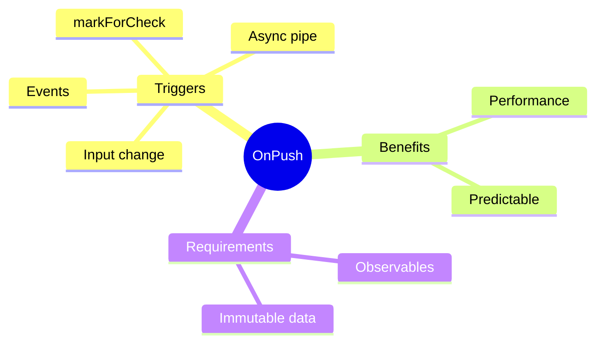

# 🔄 Use Case 3: OnPush Change Detection

> **💡 Lightbulb Moment**: OnPush tells Angular to only check component when inputs change or observables emit!

---

## 1. 🔍 Default vs OnPush

| Default | OnPush |
|---------|--------|
| Checks on every CD cycle | Checks only when needed |
| Slower | Faster |
| Safe | Requires immutable data |

---

## 2. 🚀 Implementation

```typescript
@Component({
    selector: 'app-user-card',
    changeDetection: ChangeDetectionStrategy.OnPush,
    template: `...`
})
export class UserCardComponent {
    @Input() user!: User;
}
```

### OnPush Triggers CD When:
1. @Input reference changes
2. Event from component/child
3. Async pipe emits
4. Manual `markForCheck()`

---

## 3. ❓ Interview Questions

### Basic Questions

#### Q1: Why doesn't my OnPush component update?
**Answer:** Common causes:
- Mutating object instead of new reference
- Not using async pipe
- External state change without markForCheck()

```typescript
// ❌ Won't trigger CD
this.user.name = 'New';

// ✅ Will trigger CD
this.user = { ...this.user, name: 'New' };
```

#### Q2: async pipe with OnPush - why is it good?
**Answer:** Async pipe automatically calls `markForCheck()` when observable emits, making OnPush safe to use.

---

## 🧠 Mind Map


