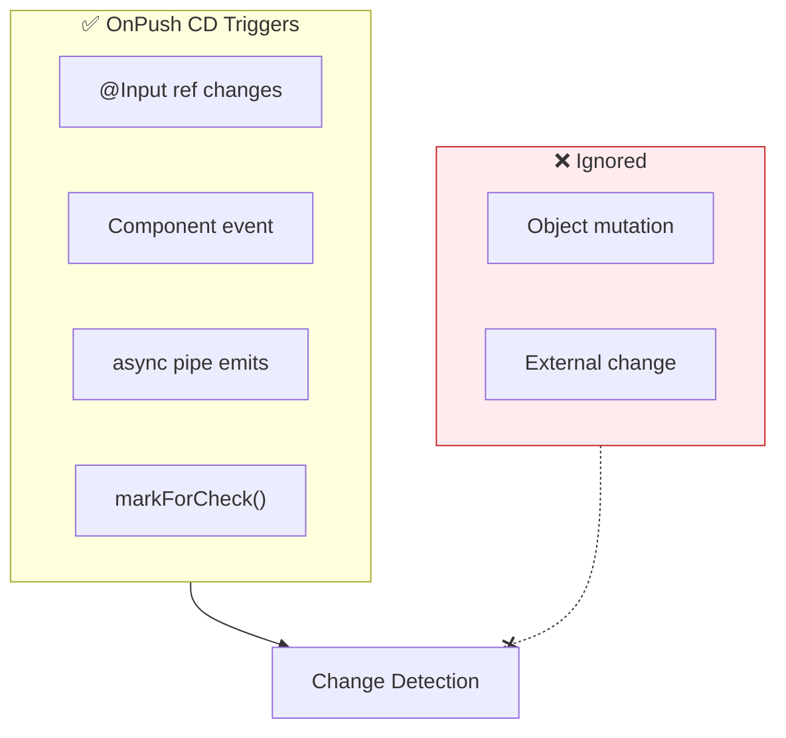
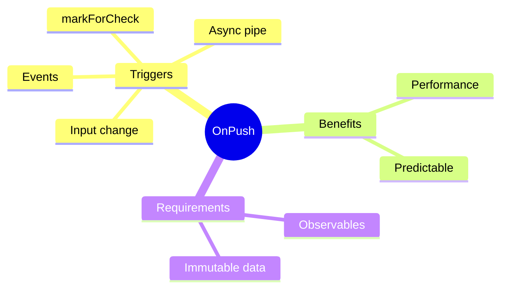

# 🔄 Use Case 3: OnPush Change Detection

> **💡 Lightbulb Moment**: OnPush tells Angular to only check component when inputs change or observables emit!

---

## 1. 🔍 Default vs OnPush

| Default | OnPush |
|---------|--------|
| Checks on every CD cycle | Checks only when needed |
| Slower | Faster |
| Safe | Requires immutable data |

---

## 2. 🚀 Implementation

```typescript
@Component({
    selector: 'app-user-card',
    changeDetection: ChangeDetectionStrategy.OnPush,
    template: `...`
})
export class UserCardComponent {
    @Input() user!: User;
}
```

### OnPush Triggers CD When:
1. @Input reference changes
2. Event from component/child
3. Async pipe emits
4. Manual `markForCheck()`

### 📊 Data Flow Diagram



### 📦 Data Flow Summary (Visual Box Diagram)

```
┌─────────────────────────────────────────────────────────────┐
│  PARENT COMPONENT                                           │
│                                                             │
│   user = { name: 'John' };                                  │
│   <app-user-card [user]="user"></app-user-card>             │
│                                                             │
│   ❌ MUTATION (Won't trigger OnPush)                        │
│   ┌───────────────────────────────────────────────────────┐ │
│   │ this.user.name = 'Jane';  // Same object reference!   │ │
│   │ // Child WON'T see the change                         │ │
│   └───────────────────────────────────────────────────────┘ │
│                                                             │
│   ✅ NEW REFERENCE (Triggers OnPush)                        │
│   ┌───────────────────────────────────────────────────────┐ │
│   │ this.user = { ...this.user, name: 'Jane' };  // NEW!  │ │
│   │ // Child WILL see the change                          │ │
│   └───────────────────────────────────────────────────────┘ │
└─────────────────────────────────────────────────────────────┘
                        │
                        ▼
┌─────────────────────────────────────────────────────────────┐
│  CHILD COMPONENT (OnPush)                                   │
│                                                             │
│   @Component({                                              │
│     changeDetection: ChangeDetectionStrategy.OnPush         │
│   })                                                        │
│                                                             │
│   CD TRIGGERS:                                              │
│   ┌───────────────────────────────────────────────────────┐ │
│   │ ① @Input reference changes    → ✅ Check              │ │
│   │ ② (click)="..." event        → ✅ Check              │ │
│   │ ③ {{ data$ | async }}        → ✅ Check              │ │
│   │ ④ this.cdr.markForCheck()    → ✅ Check              │ │
│   │                                                       │ │
│   │ ⚫ Any other CD cycle        → ❌ SKIP!               │ │
│   └───────────────────────────────────────────────────────┘ │
│                                                             │
│   BEST PRACTICE: Always use immutable patterns!             │
└─────────────────────────────────────────────────────────────┘
```

**OnPush Detection Summary:**
| Scenario | Default | OnPush |
|----------|---------|--------|
| Any CD cycle | ✅ Checked | ❌ Skipped |
| @Input ref change | ✅ Checked | ✅ Checked |
| Component event | ✅ Checked | ✅ Checked |
| async pipe emit | ✅ Checked | ✅ Checked |

> **Key Takeaway**: OnPush = performance optimization. But it requires IMMUTABLE data patterns - always create new references, never mutate!

---

## 3. ❓ Interview Questions

### Basic Questions

#### Q1: Why doesn't my OnPush component update?
**Answer:** Common causes:
- Mutating object instead of new reference
- Not using async pipe
- External state change without markForCheck()

```typescript
// ❌ Won't trigger CD
this.user.name = 'New';

// ✅ Will trigger CD
this.user = { ...this.user, name: 'New' };
```

#### Q2: async pipe with OnPush - why is it good?
**Answer:** Async pipe automatically calls `markForCheck()` when observable emits, making OnPush safe to use.

---

## 🧠 Mind Map


