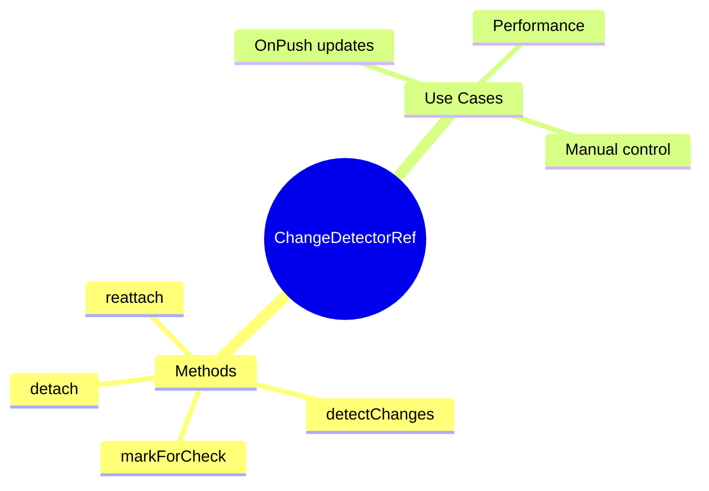

# 🎛️ Use Case 4: Manual Change Detection

> **💡 Lightbulb Moment**: Use ChangeDetectorRef to manually control when Angular checks your component!

---

## 1. 🔍 ChangeDetectorRef Methods

```typescript
constructor(private cdr: ChangeDetectorRef) {}

// Mark for check in next cycle
this.cdr.markForCheck();

// Check this component now
this.cdr.detectChanges();

// Detach from CD tree
this.cdr.detach();

// Reattach to CD tree
this.cdr.reattach();
```

---

## 2. 🚀 Common Patterns

### After async operation (OnPush)
```typescript
loadData() {
    this.service.getData().subscribe(data => {
        this.data = data;
        this.cdr.markForCheck();  // Signal CD needed
    });
}
```

### Force immediate update
```typescript
updateView() {
    this.value = newValue;
    this.cdr.detectChanges();  // Update now!
}
```

---

## 3. ❓ Interview Questions

### Basic Questions

#### Q1: markForCheck vs detectChanges?
**Answer:**
| markForCheck | detectChanges |
|--------------|---------------|
| Schedules check | Runs check now |
| Async-safe | May cause issues in lifecycle |
| Preferred | Use carefully |

#### Q2: When use detach()?
**Answer:** For performance - completely stop CD for a component:
```typescript
ngOnInit() {
    this.cdr.detach();  // No automatic updates
}

onRefresh() {
    this.cdr.detectChanges();  // Manual update only
}
```

---

## 🧠 Mind Map


