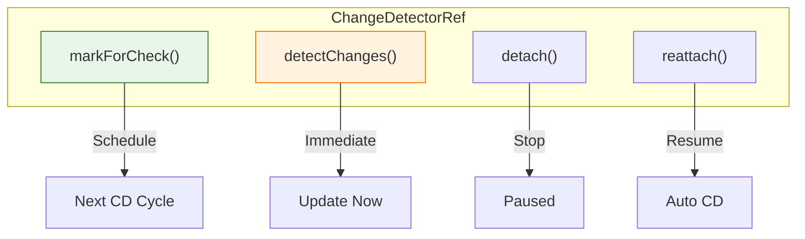
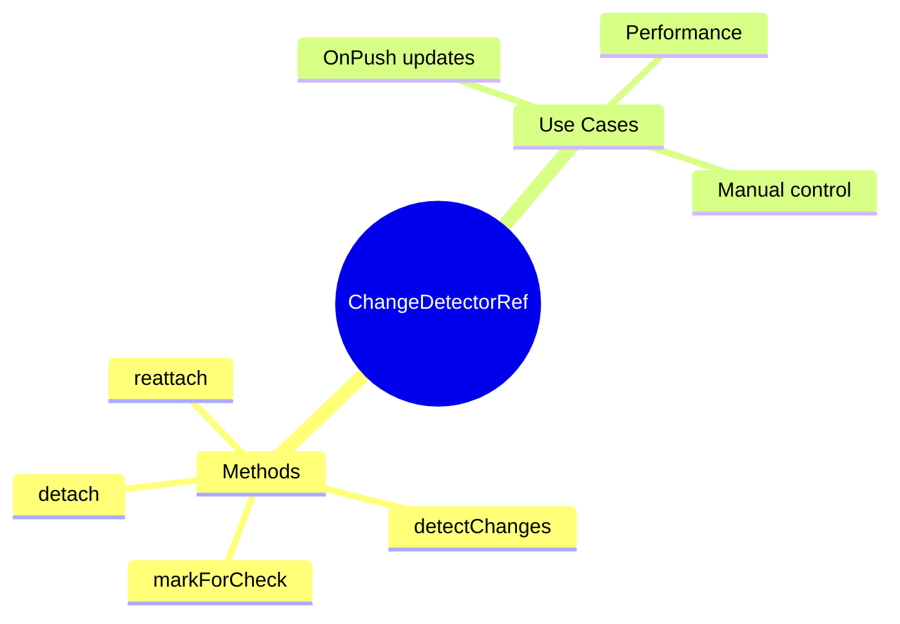

# 🎛️ Use Case 4: Manual Change Detection

> **💡 Lightbulb Moment**: Use ChangeDetectorRef to manually control when Angular checks your component!

---

## 1. 🔍 ChangeDetectorRef Methods

```typescript
constructor(private cdr: ChangeDetectorRef) {}

// Mark for check in next cycle
this.cdr.markForCheck();

// Check this component now
this.cdr.detectChanges();

// Detach from CD tree
this.cdr.detach();

// Reattach to CD tree
this.cdr.reattach();
```

---

## 2. 🚀 Common Patterns

### After async operation (OnPush)
```typescript
loadData() {
    this.service.getData().subscribe(data => {
        this.data = data;
        this.cdr.markForCheck();  // Signal CD needed
    });
}
```

### Force immediate update
```typescript
updateView() {
    this.value = newValue;
    this.cdr.detectChanges();  // Update now!
}
```

### 📊 Data Flow Diagram



### 📦 Data Flow Summary (Visual Box Diagram)

```
┌─────────────────────────────────────────────────────────────┐
│  CHANGEDETECTORREF METHODS                                  │
│                                                             │
│   constructor(private cdr: ChangeDetectorRef) {}            │
│                                                             │
│   ┌───────────────────────────────────────────────────────┐ │
│   │  ① markForCheck()  (PREFERRED for OnPush)             │ │
│   │  ━━━━━━━━━━━━━━━━━━━━━━━━━━━━━━━━━━━━━━━━━━━━━━━━━━━━ │ │
│   │                                                       │ │
│   │  this.data = newData;                                 │ │
│   │  this.cdr.markForCheck();  // "Check me on next CD"   │ │
│   │                                                       │ │
│   │  • Safe to call from async callbacks                  │ │
│   │  • Won't run immediately - waits for CD cycle         │ │
│   │  • Marks component + ancestors for check              │ │
│   └───────────────────────────────────────────────────────┘ │
│                                                             │
│   ┌───────────────────────────────────────────────────────┐ │
│   │  ② detectChanges()  (USE WITH CAUTION)                │ │
│   │  ━━━━━━━━━━━━━━━━━━━━━━━━━━━━━━━━━━━━━━━━━━━━━━━━━━━━ │ │
│   │                                                       │ │
│   │  this.data = newData;                                 │ │
│   │  this.cdr.detectChanges();  // "Update view NOW!"     │ │
│   │                                                       │ │
│   │  ⚠️ Can cause ExpressionChangedAfterChecked error     │ │
│   │  ⚠️ Don't call during lifecycle hooks                 │ │
│   └───────────────────────────────────────────────────────┘ │
│                                                             │
│   ┌───────────────────────────────────────────────────────┐ │
│   │  ③ detach() / reattach()  (ADVANCED)                  │ │
│   │  ━━━━━━━━━━━━━━━━━━━━━━━━━━━━━━━━━━━━━━━━━━━━━━━━━━━━ │ │
│   │                                                       │ │
│   │  ngOnInit() {                                         │ │
│   │    this.cdr.detach();  // Stop checking this tree     │ │
│   │  }                                                    │ │
│   │                                                       │ │
│   │  onRefresh() {                                        │ │
│   │    this.cdr.detectChanges();  // Manual refresh       │ │
│   │  }                                                    │ │
│   │                                                       │ │
│   │  • Component completely "unplugged" from CD           │ │
│   │  • Use for performance-critical scenarios             │ │
│   └───────────────────────────────────────────────────────┘ │
└─────────────────────────────────────────────────────────────┘
```

**Method Comparison:**
| Method | When to Use | Timing |
|--------|-------------|--------|
| `markForCheck()` | OnPush + async data | Next CD cycle |
| `detectChanges()` | Need immediate update | Now |
| `detach()` | Stop all automatic CD | Until reattach |
| `reattach()` | Resume automatic CD | Immediate |

> **Key Takeaway**: Prefer `markForCheck()` - it's safer. Use `detectChanges()` sparingly. Use `detach()`/`reattach()` only for performance-critical components!

---

---

## 🎯 What Problem Does This Solve?

### The Problem: Angular is too Automatic (or too slow)
**Scenario:**
You have a data stream updating 100 times a second. Angular tries to re-render the view 100 times a second.
OR
You updated a variable in a weird way (outside zone), and Angular *didn't* notice.

**Problems:**
1.  **Over-checking**: Checking the view for every single micro-change causes UI jank.
2.  **Under-checking**: "I updated `this.data` but the screen is empty!" (common in `OnPush` or outside zone).

### How Manual CD Solves This
**With ChangeDetectorRef:**
```typescript
// You take the wheel
this.cdr.detectChanges(); // Force update NOW
this.cdr.markForCheck();  // Update NEXT frame
```

| Problem | Solution |
|---------|----------|
| Missing Updates | **markForCheck()**: Tells Angular "I'm dirty, please check me even if you thought I was clean". |
| Immediate Sync | **detectChanges()**: Forces Angular to synchronize the DOM with the model *synchronously* right now. |
| Performance | **detach()**: Tells Angular "Ignore me completely until I say so". |

---

## 📚 Key Classes & Types Explained

### 1. `ChangeDetectorRef`
*   **What is it?**: A reference to the specific View's change detector. Every component has its own CD ref.
*   **Key Methods**:
    *   `markForCheck()`: Marks ancestors as dirty. Safe for OnPush.
    *   `detectChanges()`: Checks this view and its children. Synchronous.
    *   `detach()`: Disconnects from the CD tree.
    *   `reattach()`: Reconnects to the CD tree.

### 2. `ApplicationRef.tick()`
*   **Scope**: Global.
*   **Action**: Checks the *entire* application from Root down.
*   **Use Case**: Very rare. Usually when running completely Zone-less without Signals.

---

## 🌍 Real-World Use Cases

### 1. Complex Forms with OnPush
A parent form has many child components. When one child updates internal state that affects validity, it calls `markForCheck()` to ensure the parent sees the valid status update.

### 2. Virtual Scrolling
In a list of 10,000 items, only render the 10 visible ones. When the user scrolls, manually `detectChanges()` on just the row content to update it quickly without checking the whole app.

### 3. Modal / Pop-ups initiated completely outside Angular
Opening a modal from a legacy jQuery button. You need `detectChanges()` to render the modal content immediately because no Zone happened.

### 4. Countdown Timer
A timer updating every 10ms (100fps). Instead of letting Zone.js trigger 100 app-wide checks, detach the timer component and use `detectChanges()` local to that component only.

---

## ❓ Complete Interview Questions (20+)

### Basic Questions

**Q1: What is the difference between `markForCheck` and `detectChanges`?**
> A: `markForCheck` marks the path to root as dirty for the *next* cycle. `detectChanges` runs the check *immediately* for this component and its children.

**Q2: Should I use `ApplicationRef.tick()`?**
> A: Almost never. It checks the whole app. `detectChanges` is localized and cheaper.

**Q3: Does `detectChanges` check the parents?**
> A: No. It checks the current component and its children (downwards).

**Q4: When do I need `markForCheck`?**
> A: Primarily with `OnPush` strategy when data changes internally or via an async source that isn't an `@Input`.

**Q5: What happens if I call `detectChanges` inside `ngAfterViewChecked`?**
> A: Infinite loop or "ExpressionChangedAfterItHasBeenCheckedError".

---

### Scenario-Based Questions

**Q6: Scenario: Updating a progress bar from a non-zone WebSocket.**
> A: Receiving data outside zone -> update local variable -> `cdr.detectChanges()` to update just the bar.

**Q7: Scenario: "ExpressionChanged" error in `ngAfterViewInit`.**
> A: Use `cdr.detectChanges()` carefully to force a second check (hacky), or preferably use `setTimeout` or `Promise.resolve` to push update to next tick.

**Q8: Scenario: OnPush component not updating with Observable.**
> A: If not using `async` pipe, you must subscribe manually and call `markForCheck()` in the subscription.

**Q9: Scenario: Testing dynamic components.**
> A: When creating components dynamically in tests or code, angular might not run CD automatically initially. `detectChanges()` is often required.

**Q10: Scenario: Detached component needs to wait for data.**
> A: Detach in `ngOnInit`, fetch data, then `reattach` OR `detectChanges`.

---

### Advanced Questions

**Q11: Can I inject `ChangeDetectorRef` in a Service?**
> A: No, it bounds to a View (Component).

**Q12: Is `checkNoChanges()` useful?**
> A: Yes, primarily for debugging or libraries to ensure no side-effects happened during a CD pass.

**Q13: How does Signals affect this?**
> A: Signals largely automate `markForCheck`. Setting a signal marks the consumer for check. `detectChanges` might become less relevant.

**Q14: Cost of `detectChanges`?**
> A: Proportional to the template complexity of the component and its children.

**Q15: Can `markForCheck` be coalesced?**
> A: Yes, calling it 100 times in one tick results in only 1 actual CD cycle.

**Q16: Does `detach` verify inputs?**
> A: No. Inputs can change, but the view won't update to reflect them until reattached/checked.

**Q17: Is `cdr` unique per instance?**
> A: Yes, each component instance has its own `ChangeDetectorRef`.

**Q18: How to trigger CD from a Directive?**
> A: Inject `ChangeDetectorRef` (it gets the host component's CDR) and call `markForCheck`.

**Q19: What is `local detection` (Zoneless)?**
> A: New experimental feature where changes are detected locally without traversing from root.

**Q20: Why inject `ChangeDetectorRef` as `cdr` (convention)?**
> A: Just a convention for brevity. `ref` or `detector` is fine too.

## 🧠 Mind Map


