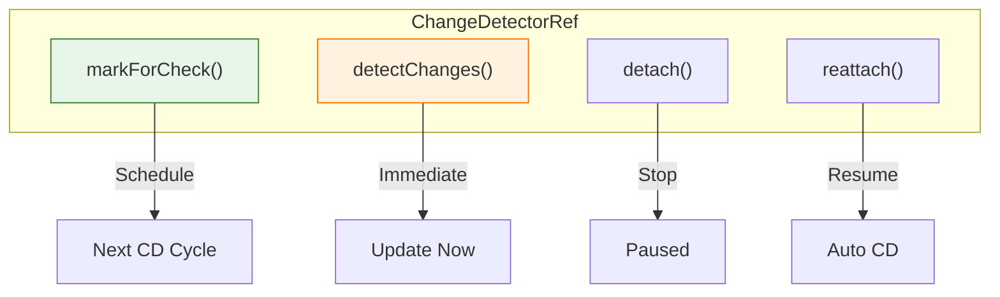
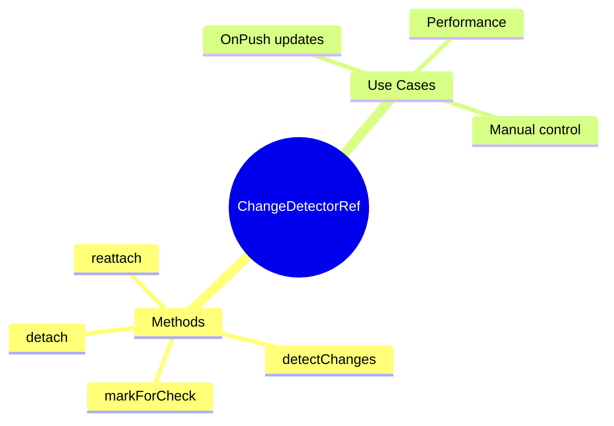

# 🎛️ Use Case 4: Manual Change Detection

> **💡 Lightbulb Moment**: Use ChangeDetectorRef to manually control when Angular checks your component!

---

## 1. 🔍 ChangeDetectorRef Methods

```typescript
constructor(private cdr: ChangeDetectorRef) {}

// Mark for check in next cycle
this.cdr.markForCheck();

// Check this component now
this.cdr.detectChanges();

// Detach from CD tree
this.cdr.detach();

// Reattach to CD tree
this.cdr.reattach();
```

---

## 2. 🚀 Common Patterns

### After async operation (OnPush)
```typescript
loadData() {
    this.service.getData().subscribe(data => {
        this.data = data;
        this.cdr.markForCheck();  // Signal CD needed
    });
}
```

### Force immediate update
```typescript
updateView() {
    this.value = newValue;
    this.cdr.detectChanges();  // Update now!
}
```

### 📊 Data Flow Diagram



### 📦 Data Flow Summary (Visual Box Diagram)

```
┌─────────────────────────────────────────────────────────────┐
│  CHANGEDETECTORREF METHODS                                  │
│                                                             │
│   constructor(private cdr: ChangeDetectorRef) {}            │
│                                                             │
│   ┌───────────────────────────────────────────────────────┐ │
│   │  ① markForCheck()  (PREFERRED for OnPush)             │ │
│   │  ━━━━━━━━━━━━━━━━━━━━━━━━━━━━━━━━━━━━━━━━━━━━━━━━━━━━ │ │
│   │                                                       │ │
│   │  this.data = newData;                                 │ │
│   │  this.cdr.markForCheck();  // "Check me on next CD"   │ │
│   │                                                       │ │
│   │  • Safe to call from async callbacks                  │ │
│   │  • Won't run immediately - waits for CD cycle         │ │
│   │  • Marks component + ancestors for check              │ │
│   └───────────────────────────────────────────────────────┘ │
│                                                             │
│   ┌───────────────────────────────────────────────────────┐ │
│   │  ② detectChanges()  (USE WITH CAUTION)                │ │
│   │  ━━━━━━━━━━━━━━━━━━━━━━━━━━━━━━━━━━━━━━━━━━━━━━━━━━━━ │ │
│   │                                                       │ │
│   │  this.data = newData;                                 │ │
│   │  this.cdr.detectChanges();  // "Update view NOW!"     │ │
│   │                                                       │ │
│   │  ⚠️ Can cause ExpressionChangedAfterChecked error     │ │
│   │  ⚠️ Don't call during lifecycle hooks                 │ │
│   └───────────────────────────────────────────────────────┘ │
│                                                             │
│   ┌───────────────────────────────────────────────────────┐ │
│   │  ③ detach() / reattach()  (ADVANCED)                  │ │
│   │  ━━━━━━━━━━━━━━━━━━━━━━━━━━━━━━━━━━━━━━━━━━━━━━━━━━━━ │ │
│   │                                                       │ │
│   │  ngOnInit() {                                         │ │
│   │    this.cdr.detach();  // Stop checking this tree     │ │
│   │  }                                                    │ │
│   │                                                       │ │
│   │  onRefresh() {                                        │ │
│   │    this.cdr.detectChanges();  // Manual refresh       │ │
│   │  }                                                    │ │
│   │                                                       │ │
│   │  • Component completely "unplugged" from CD           │ │
│   │  • Use for performance-critical scenarios             │ │
│   └───────────────────────────────────────────────────────┘ │
└─────────────────────────────────────────────────────────────┘
```

**Method Comparison:**
| Method | When to Use | Timing |
|--------|-------------|--------|
| `markForCheck()` | OnPush + async data | Next CD cycle |
| `detectChanges()` | Need immediate update | Now |
| `detach()` | Stop all automatic CD | Until reattach |
| `reattach()` | Resume automatic CD | Immediate |

> **Key Takeaway**: Prefer `markForCheck()` - it's safer. Use `detectChanges()` sparingly. Use `detach()`/`reattach()` only for performance-critical components!

---

## 3. ❓ Interview Questions

### Basic Questions

#### Q1: markForCheck vs detectChanges?
**Answer:**
| markForCheck | detectChanges |
|--------------|---------------|
| Schedules check | Runs check now |
| Async-safe | May cause issues in lifecycle |
| Preferred | Use carefully |

#### Q2: When use detach()?
**Answer:** For performance - completely stop CD for a component:
```typescript
ngOnInit() {
    this.cdr.detach();  // No automatic updates
}

onRefresh() {
    this.cdr.detectChanges();  // Manual update only
}
```

---

## 🧠 Mind Map


